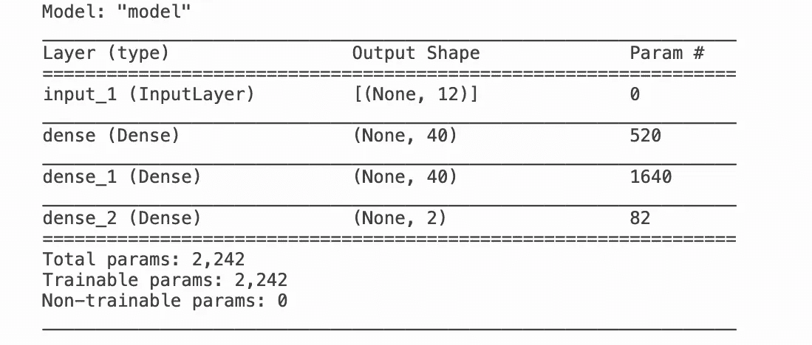

# 分类模型反事实解释终极指南

> 原文：<https://towardsdatascience.com/the-ultimate-guide-to-counterfactual-explanations-for-classification-models-e9ee8ed90cfd?source=collection_archive---------26----------------------->


作者图片

## 最人性化的模型解释方法

假设保罗在 ABC 银行申请贷款。他收到一封来自银行的邮件，表示非常遗憾地通知他，他的贷款申请已被拒绝。被拒！

在被击得粉碎了一段时间后，保罗可能很好奇到底发生了什么。所以他去银行询问贷款申请的决策人。他被介绍给简，简负责贷款申请的决策。保罗问简为什么他的申请被拒绝了。她告诉他，他的要价太高，他的工资低于最低工资，等等。

但是，他问她，他能做些什么让他的贷款申请获得批准。她告诉他，他的要求金额需要减少这么多，增加他的工资这么多，一定年后回来，等等。

但是加油！保罗不能突然改变他的工资！他也不能为贷款等上几年。因此，他问 Jane，要使他的贷款获得批准，他的申请中最小的改动是什么。

如果简被一个人工智能模型取代，这个模型会给保罗一个叫做**的反事实解释**。

> 反事实解释提供了将实例的输出改变为预定/期望输出所需的输入特征值的最小变化

然而，就像 Paul 的情况一样，并不是所有的特性都可以改变。因此，对反事实解释的要求或约束是，它们尽可能少地干扰特征，以获得想要的输出。

# 直觉

有多种方法来确定由多名研究人员提出的反事实解释。如果你有兴趣了解它们之间的区别，你可以看看克里斯托弗·莫尔纳尔的这本[书](https://christophm.github.io/interpretable-ml-book/counterfactual.html)。

然而，实现这一点的简单方法如下:

1.  考虑你需要反事实解释的例子和期望的结果
2.  确定期望结果和当前结果之间的决策界限
3.  找出实例和决策边界之间的最小距离，约束条件是需要更改的坐标(特征值)的最小数量

**警告:**反事实解释只适用于监督分类任务。它不适合回归或无人监督的任务。知道这一点很重要

# 说明

为了说明反事实解释的使用，我将使用一个来自 [**alibi**](https://docs.seldon.io/projects/alibi/en/stable/examples/cfproto_housing.html) 库的示例。该示例解释了在[波士顿房价](http://lib.stat.cmu.edu/datasets/boston)数据集上的浅层神经网络模型。插图的代码可以在 alibi 文档页面上找到。

因为波士顿房屋数据集存在于 sklearn 库中，所以数据集直接从 sklearn 加载。

住房数据集是一个回归数据集，反事实对其无效。因此，我们需要将其转换为分类类型的数据集。我们选择目标值的中位数，也就是房价。价格低于中值的任何数据点(房屋集合中的房屋)被标记为 0，高于中值的被标记为 1。

这里使用的反事实解释的变体是由原型引导的。在这里，原型是反事实的例子(数据点)。它们是通过构建 k-d 树或编码器来构建的，因此可以快速构建反事实的解释。它是基于[这篇](https://arxiv.org/pdf/1907.02584.pdf)论文构建的，你可以参考这篇论文来了解算法如何工作的更多细节。

```
**import** **tensorflow** **as** **tf**
**from** **tensorflow.keras.layers** **import** Dense, Input
**from** **tensorflow.keras.models** **import** Model, load_model
**from** **tensorflow.keras.utils** **import** to_categorical
**import** **matplotlib**
%**matplotlib** inline
**import** **matplotlib.pyplot** **as** **plt**
**import** **numpy** **as** **np**
**import** **os**
**from** **sklearn.datasets** **import** load_boston
**from** **alibi.explainers** **import** CounterFactualProto
```

## 模型

为此图构建了一个自定义神经网络模型:

```
np.random.seed(42)
tf.random.set_seed(42)**def** nn_model():
    x_in = Input(shape=(12,))
    x = Dense(40, activation='relu')(x_in)
    x = Dense(40, activation='relu')(x)
    x_out = Dense(2, activation='softmax')(x)
    nn = Model(inputs=x_in, outputs=x_out)
    nn.compile(loss='categorical_crossentropy', optimizer='sgd', metrics=['accuracy'])
    **return** nnnn = nn_model()
nn.summary()
nn.fit(x_train, y_train, batch_size=64, epochs=500, verbose=0)
```



模型摘要

## 说明

现在我们有了模型，我们想了解一个特定的结果。选择一个特定的测试实例:

```
X = x_test[1].reshape((1,) + x_test[1].shape)
shape = X.shape
```

这个数据点的原始标签是 0，表示这个房子的价格低于中间价。现在让我们在它上面运行反事实(反事实原型称之为原型反事实解释)。

```
*# initialize explainer, fit and generate counterfactual*
cf = CounterFactualProto(nn, shape, use_kdtree=**True**, theta=10., max_iterations=1000,
                         feature_range=(x_train.min(axis=0), x_train.max(axis=0)),
                         c_init=1., c_steps=10)

cf.fit(x_train)
explanation = cf.explain(X)
```

让我们打印出原始的和解释的结果(两者应该是不同的或相互对比的)。

```
print(f'Original prediction: **{**explanation.orig_class**}**')
print('Counterfactual prediction:     **{}**'.format(explanation.cf['class']))
```

我们可以确定在原始特性集和解释之间有多少值发生了变化:

```
orig = X * sigma + mu
counterfactual = explanation.cf['X'] * sigma + mu
delta = counterfactual - orig
**for** i, f **in** enumerate(feature_names):
    **if** np.abs(delta[0][i]) > 1e-4:
        print('**{}**: **{}**'.format(f, delta[0][i])) **Output:** AGE: -6.526239960695747
LSTAT: -4.799340540220259
```

所以这里说，要想价格高于中值，这栋房子的房龄需要比现在少 6.5 年，LSTAT 值要比现在少 4.8 个单位。

# 结论

反事实是向人类解释模型行为的最自然的方式。但它有一定的局限性，其中最重要的一点是它只适用于分类问题。

另一个问题是，有时它提供的解释实际上不能用来推翻决定。比如年龄是不能逆转的。所以我们试图通过强加年龄不可改变来对抗事实。

请注意，对于一个数据点，可能有多种反事实的解释，因为可以有多种方式达到决策边界。我们可以选择一个考虑到我们的业务约束或任何其他实际约束的方法。

话虽如此，它却是你 XAI 箭囊中的一支强有力的箭！