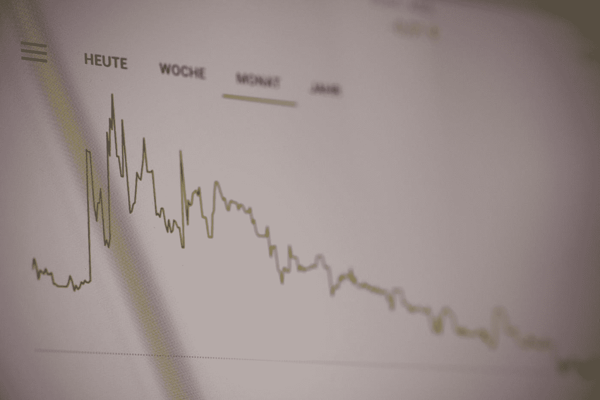

# 数据科学家破解产品案例访谈的终极指南(第二部分)

> 原文：<https://towardsdatascience.com/the-ultimate-guide-to-cracking-business-case-interviews-for-data-scientists-part-2-7bc38fbe635f?source=collection_archive---------1----------------------->

## [数据科学面试](https://towardsdatascience.com/tagged/data-science-interview)

## 4 种产品感问题和框架

由[艾玛丁](https://medium.com/u/1b25d5393c4f?source=post_page-----d45c99d6bddc--------------------------------)和[罗布王](https://www.linkedin.com/in/robjwang/)

*这是数据科学家破解商业案例访谈的第 2 部分！参见本文的第 1 部分:*

</the-ultimate-guide-to-cracking-business-case-interviews-for-data-scientists-part-1-cb768c37edf4>  

如果你更喜欢视频，可以看看这个 YouTube 视频[和](https://www.youtube.com/watch?v=nPJKFWMiIC8)[这个播放列表](https://www.youtube.com/playlist?list=PLY1Fi4XflWSvtu963rZpfH6WeX54vSrDW)，前者是这篇文章的缩略版本，后者是来自脸书、LinkedIn 和 Lyft 的真实商业案例面试问题的样本答案。

# 目录

1.  [4 类商业案例问题](#158a)

*   [诊断问题](#ed37)
*   [测量成功](#9290)
*   [发射与否](#4572)
*   [改进产品](#09bd)

2.[如何准备商业案例面试？](#afc8)
3。[赢得商业案例面试的秘诀](#0f10)

# 4 种商业案例问题

在本节中，我们将总结 4 个最常被问到的业务案例问题类别:

*   诊断问题；
*   衡量成功；
*   发射与否；
*   改进产品。

我们还将提供处理这些类别的框架。大多数度量问题本质上都是开放式的，并且有许多解决策略。这些框架的目标是作为一个完整反应的心理清单。这些框架足够通用，你永远不需要逐字逐句地背诵它们，或者在没有额外创造性思维的情况下盲目地跟随它们。

不管商业案例面试的重点是什么，我们总是建议**从澄清问题**开始**以总结你的方法**结束。澄清问题对于确认潜在产品的功能和目标尤为重要。没有他们的参与对面试官来说可能是一个危险信号；想象一下，如果你花了 5 分钟来回答这个问题，然后意识到你对产品的理解是错误的，那该有多尴尬。值得询问的问题可能包括但不限于:

*   一个特性/产品有什么作用？
*   特性/产品是如何使用的？
*   特性/产品是为谁打造的？

# 诊断问题

照片由[马库斯·斯皮斯克](https://unsplash.com/@markusspiske?utm_source=medium&utm_medium=referral)在 [Unsplash](https://unsplash.com?utm_source=medium&utm_medium=referral) 拍摄

第一个问题类别是**诊断问题**。事实上，假设一个重要的业务指标正在走向负面，利益相关者要求您找出根本原因。以下是一些问题示例:

*   脸书用户群的创建量下降了 20%。这是怎么回事？
*   如何调查产品使用量下降 10%？
*   我们有一个仪表板跟踪我们的指标，平均预计到达时间(ETA)增加了 3 分钟。你会如何调查这个问题？

要成功通过面试，最关键的因素是让面试官相信你可以勾勒出一个系统化的方法。的确，有很多方面可以谈论，但是向面试官抛出随意的想法是不被鼓励的。这里有 6 个有用的步骤可以采取，但不是每个问题都需要全部 6 个步骤。

1.  **阐明指标的定义。**例如，对于上述 ETA 问题，您可以澄清开始时间和结束时间是如何定义的。对于与参与度相关的问题，您可以澄清并提出衡量参与度的方法:是通过创建帖子的数量、对帖子的回复或对帖子的反应，还是通过共享帖子？或者，也许是人们花在帖子上的时间？
2.  **时间方面的变化。**指标是突然变化还是逐渐变化？一旦回答了这个问题，您就可以讨论这是由于内部因素，如损坏的数据源或生产代码中的错误，还是由于外部因素，如季节性、行业趋势、竞争对手的营销活动，或者在指标发生变化的同时发生的特殊事件，如自然灾害或政治不稳定。
3.  **其他产品或功能是否有同样的变化。**您可以调查其他相关产品的指标是否经历了同样的变化。此外，你可以问面试官是否对整个产品线进行了调整。
4.  **根据人口统计和行为特征**(如用户年龄组、地区、语言和平台)**对用户进行细分。**例如，这种下降是发生在一个孤立的地理区域吗？这种变化是否只涉及一个平台，即 iOS、Android 或 web 用户？
5.  **分解指标以进行更深入的分析。**你可以讨论哪个特定的用户组最先经历了这种变化。例如，DAU =现有用户+新用户+复活用户-搅动用户。调查哪个用户群影响最大有助于缩小问题范围。
6.  **总结你的方法**向面试官展示你有一个清晰而有条理的方法来分析问题**。**根据面试官的反馈，你可以进一步集思广益，找出你所发现的根本原因的潜在解决方法。

# 衡量成功

第二个问题类别是**衡量成功**。特别是，您需要衡量产品或功能的成功或健康程度。以下是属于这一类的一些问题。

*   你如何衡量脸书名人应用“提及”的健康程度？脸书如何确定是否值得保留这一特征？
*   Instagram 正在推出一项新功能。你怎么知道它做得好不好？

此问题类别的更抽象版本可能包括:

*   如何衡量一个在线论坛的成功对话？
*   如何衡量一个拼车应用的司机的幸福感？

本质上，这些问题旨在评估候选人定义成功指标的能力。要回答这类问题，我们建议提供不超过 3 个指标**，包括 2 个成功指标(衡量或表明产品的有效性和成功)和一个护栏指标(不应因追求新产品或新功能而降低)。**

**在本帖的第 1 部分中，我们总结了好的度量标准的一些特征。这里，我们强调一个额外的关键特征:好的度量标准还应该**适合环境**。事实上，一个看似合理的指标在不同的环境中可能没有意义。例如，考虑测量新的工作推荐算法的成功的设置。潜在的目标是提高用户对推荐结果的满意度。在这种情况下，DAU 将不是一个合适的成功指标。更有意义的是使用对上下文自然的度量，比如结果的点击率或者申请工作的用户的百分比。护栏度量可以是返回结果所用的平均时间，因为好的算法不仅应该返回好的结果，还应该足够快地生成这些结果。**

# **发射与否**

****

**照片由 [NASA](https://unsplash.com/@nasa?utm_source=medium&utm_medium=referral) 在 [Unsplash](https://unsplash.com?utm_source=medium&utm_medium=referral) 拍摄**

**第三个问题类别是**发射与否**。你会被问到如何测试一个产品创意，或者是否要推出一个产品/功能。一些示例问题包括:**

*   **你会如何设置一个实验来理解 Instagram 故事中的一个特征变化？**
*   **如果某个特定人群的参与度下降，而其他人的参与度上升，你会如何决定推出一个功能或不推出？**
*   **如果一个产品经理说他想让新闻提要中的广告数量翻倍，你如何判断这是不是一个好主意？**

**一般来说，这个问题类别比前两个类型更具挑战性，因为它需要关于 **A/B 测试**的深入知识。作为补充阅读，这里有一篇[很棒的博文](/7-a-b-testing-questions-and-answers-in-data-science-interviews-eee6428a8b63)，涵盖了关于 A/B 测试的几个常见问题和答案。**

**类似于**衡量成功**类别，您应该首先阐明产品的目标，并提出衡量成功的标准。然后，你应该提出一个推断因果影响的实验设计，确保包括以下讨论点:**

*   **对照组和治疗组的定义(有时，多个治疗组可能有意义)。**
*   **随机化单元(例如用户？访客？如果是用户级实验，什么类型的用户？回想一下，用户可以扮演多个角色，尤其是在多方在线平台中。)，以及实验作业的时间。有时，应考虑触发条件以最小化稀释(例如，仅当用户到达网站的特定页面时分配用户)。**
*   **实验运行时间:通常由历史数据的功效计算决定。特定的计算将取决于历史基线、您想要测量的效果大小、潜在目标指标的功效和可变性。如果基础目标度量特别嘈杂，则可能需要更长的运行时间。如果潜在的目标指标滞后，可能需要在初始启动后几周重新检查实验结果，特别是对于后来分配的群组。**
*   **常见的陷阱和潜在的修正，比如新奇的效果、窥视(特别是当涉众对尽早发布产品过于兴奋的时候)、多重测试(特别是当有许多度量标准或许多感兴趣的部分的时候)、不同组之间的潜在交互(什么是可选择的实验设计？)，等等。**
*   **长期监控:可以考虑抵制小组，它既可以测量单个实验的长期效果，也可以测量几个实验的组合产品变化的影响。**

**为了提供一个完整的答案，我们总是鼓励您**根据实验结果提出一个发射建议**，尽管该建议可能是双向的(是或否)。将结果与初始目标和业务影响联系起来。推荐发布的最佳场景是:**

*   **一个或多个成功指标在统计上和实际上都有显著增加；**
*   **护栏指标没有变化。**

**然而，这在实践中并不经常发生。当看到相互矛盾的结果时，面试官可能会询问你的方法。例如，考虑增加 DAU 和增加跳出率的设置。如果可能的话，尝试将这些变化与一个单一的业务指标联系起来，比如收入(DAU 0.1%的增长如何转化为收入？考虑到各种成本的潜在增加，推出这种产品是否值得？).此外，评论短期和长期影响之间的权衡。事实上，即使跳出率有所增加，产品发布也可能为平台带来更多用户，从长远来看，利大于弊。**

# **改进产品**

**最后一个问题类别是**改进一个产品**。特别是，你会被问到如何改进一个产品/功能，或者如何将一个业务指标转向积极的方向。这类问题比前几类问题更开放，通常需要更高级的产品知识。识别产品机会的能力通常是提供一个好答案所必需的。一些示例问题包括:**

*   **你会在 Twitter 应用程序中改变什么？你如何测试提议的改变是否有效？**
*   **如何改进脸书上的“你在想什么”功能？**
*   **如何在在线平台上创建一个减少欺诈的业务规则？**

**如果你对这类问题感到茫然，[这段视频](https://youtu.be/JCNsI0TtNGw)包含了对一个样本问题的详细回答。总的来说，为了提供一个信息丰富且有条理的答案，我们推荐 5 个关键步骤:**

****第一步**:明确目标，缩小改进范围。如果这个问题要求你改进一个具有多种功能的产品，那么你就有必要澄清应该关注哪个功能。**

****第二步** : 解释你识别产品机会的方法，并集体讨论一些想法。提出改进想法的方法有很多，这里我们总结了 3 种常用的方法:**

*   **减少当前用户体验中的摩擦:分析“用户旅程”,关注用户已经在执行但可以进一步简化的操作。例如，如果他们需要几个步骤来完成结账过程，那么简化流程可能会导致更多的客户在网站上购物。**
*   **根据用户的行为对其进行细分，并确定不同群体的关键需求。显然，临时用户的需求可能与频繁用户的需求不同。基于不活跃用户的需求，想办法把他们变成活跃用户。**
*   **确定与目标指标相关的变量。建立一个机器学习模型来预测目标指标，并提出一个可以移动该指标的后续行动。例如，假设目标是设计一个规则来减少在线平台上的欺诈损失。对于被标记为欺诈者的用户，后续措施可能是限制他们或提示他们进行额外验证。一些关键步骤可以包括:定义对于用户或行为来说欺诈意味着什么(例如，定义正面标签)，提出预测欺诈行为的特征，离线评估规则或模型(使用历史数据和关键指标，例如精度和召回)，以及设计用于测量实时性能的 A/B 测试(通常针对另一个基线规则/模型)。对于这种类型的商业案例，还需要全面评估减少欺诈和对合法用户的影响之间的权衡。**

****第三步** : 优先排序。根据你提出的想法，你会优先考虑哪一个，为什么？**

****第四步**:定义 1 到 2 个成功标准来评估创意的成功。**

****第五步**:总结整体方法。**

# **如何准备商业案例面试？**

****

**[绿色变色龙](https://unsplash.com/@craftedbygc?utm_source=medium&utm_medium=referral)在 [Unsplash](https://unsplash.com?utm_source=medium&utm_medium=referral) 上的照片**

**通过阅读和吸收这篇文章中的内容，你已经做好了面试准备！除此之外，我们还推荐了 4 个额外的行动项目:**

****行动项目 1** :收集一大堆样题，将它们分成不同的主题。你很快就会发现，绝大多数问题都属于上述 4 个类别！**

****行动事项 2** : 制定自己的框架和答案。这可以通过阅读、思考和与其他数据科学家交流来实现。此外，我们推荐一些常规资源:**

*   **脸书、Lyft、LinkedIn 的真实面试问答([播放列表](https://www.youtube.com/playlist?list=PLY1Fi4XflWSvtu963rZpfH6WeX54vSrDW))。**
*   **StellarPeers 包括对许多案例问题的深入回答。**
*   **[值得信赖的在线控制实验](https://www.amazon.com/Trustworthy-Online-Controlled-Experiments-Practical/dp/1108724264)是一本关于 A/B 测试的基础知识以及在现实中运行 A/B 测试的陷阱和解决方案的书。**
*   **[解码并征服](https://www.amazon.com/Decode-Conquer-Answers-Management-Interviews-ebook/dp/B07ZV8BM2S/ref=sr_1_1?dchild=1&keywords=Decode+and+Conquer&qid=1618181783&s=books&sr=1-1)包含产品管理面试问题的示例答案。**

****行动 3** :大声说出解决方案。准备样题答案时，生成两组答案可能会有所帮助:分别是长答案和短答案。在电话屏幕上，简短的版本可能更适合传递简单而快速的见解。在现场面试中，更多的时间可以花在冗长的回答上。**

**行动项目 4 :研究公司并了解其产品。尽管大多数公司并不要求应聘者非常熟悉他们的产品，但了解产品会导致面试中更深入、最终更好的对话。**

# **赢得商业案例面试的秘诀**

**最后，我们想分享一些让你在商业案例面试中胜出的技巧:**

*   ****(第二次！)在开始回答之前，始终要澄清问题**以确保您完全理解了高层次目标。如果面试官拒绝回答你的澄清性问题，你可以阅读这篇博客，学习如何应对 5 种不同类型的面试官。**
*   ****与面试官互动。在真正的面试中，最重要的是倾听反馈，并相应地扩展或缩短你的答案。有些面试官可能不会给你任何建议或反馈。在这些场景中，你要确保他们完全理解你的方法。如果他们真的说话了，做一个好的倾听者，认真及时地对待他们的反馈。****
*   ****防止面试官注意力不集中。面试官可能会在谈话过程中分散注意力。当你解释你的思维过程时，最好说出简明扼要的要点(并经常用过渡句停顿，如“你想让我进一步澄清吗？”或者“你想让我补充更多细节吗？”)而不是进行冗长的、无组织的讨论。****
*   ****不盲从任何框架。**如果你选择使用我们提出的框架，一定要灵活和创造性地适应它们。面试官在寻找真正有解决问题能力的人，而不是那些只遵循结构化模板的人(通常，他们可以立即看出)。**

# **感谢阅读！**

**如果你喜欢这个帖子，想支持我…**

*   ***订阅我的* [*YouTube 频道*](https://www.youtube.com/channel/UCAWsBMQY4KSuOuGODki-l7A) *！***
*   ***跟我上* [*中*](https://medium.com/@emmading) *！***
*   ***连接上*[*Linkedin*](https://www.linkedin.com/in/emmading001/)*！***
*   **前往[emmading.com/resources](https://www.emmading.com/resources)获取更多关于数据科学面试技巧和策略的免费资源！**

**要继续阅读，我们建议如下:**

**</7-a-b-testing-questions-and-answers-in-data-science-interviews-eee6428a8b63> **