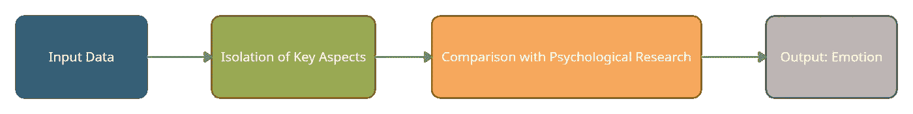
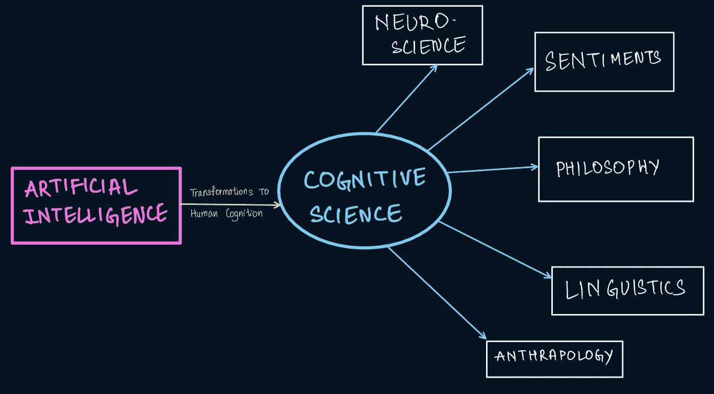
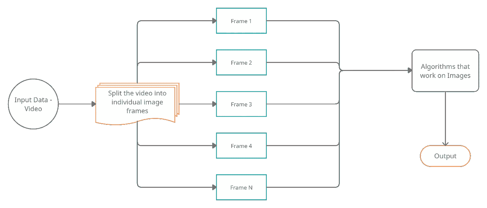
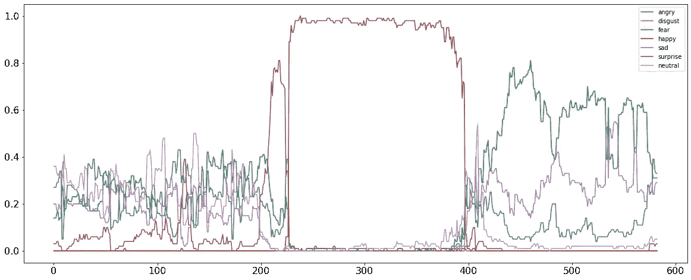
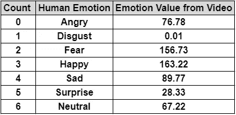
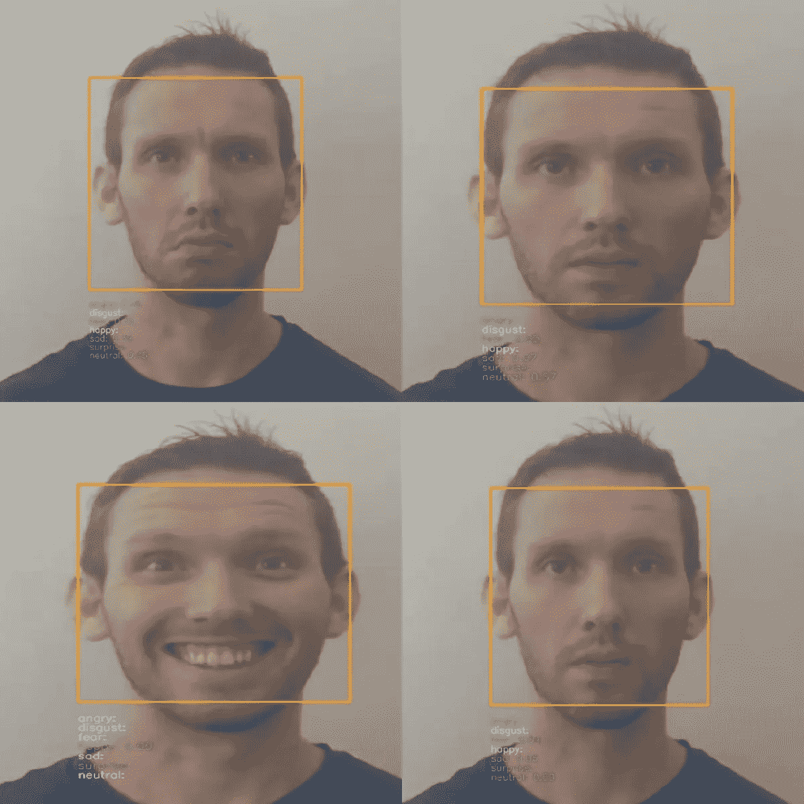

# 使用 Python 从面部表情识别情感的终极指南

> 原文：<https://towardsdatascience.com/the-ultimate-guide-to-emotion-recognition-from-facial-expressions-using-python-64e58d4324ff?source=collection_archive---------0----------------------->

## 建立一个对图像和视频都有效的人脸情感识别(FER)算法

人类情感的浪潮|图片来自 [Pexels](https://www.pexels.com/photo/collage-of-portraits-of-cheerful-woman-3807758/?utm_content=attributionCopyText&utm_medium=referral&utm_source=pexels) 的 Andrea Piacquadio

情感是英语中极少数没有具体定义的词之一，这是可以理解的。它是抽象的。然而，我们一生中所做的几乎每一个决定都是由情感驱动的。市场研究已经证明，正确预测情绪可以成为企业增长的巨大源泉，这就是我们今天要做的——解读情绪。在数据和机器学习的世界中，这个概念属于认知系统的范畴。让我们尝试解码情感识别算法背后的科学，并为我们自己建立一个。

一个认知情感检测算法到底想完成什么？这个想法是基于训练数据(以人类的图像和视频的形式)复制人类的思维过程，并尝试分割这些数据中存在的情绪。为了执行本章的分析，我们将专注于展示情绪的预先录制的图像和视频，但同样也可以在实时视频流中实现实时分析。

## **对世界的视觉理解**

计算机视觉是处理视觉数据的人工智能的一部分。随着机器学习和深度学习模型的使用，今天的计算机系统可以处理数字图像和视频，以理解和情感识别视频内容的特征。

> 计算机视觉作为一个计算概念最初出现在 20 世纪 50 年代，当时一些神经网络用于检测对象的边缘，后来发展到手写文本、语音和语言。

几个复杂的用例证明了计算机视觉在当今工业中的应用。一些非常基本的用途是，在网上进行的考试。网络摄像头可以读取用户的表情来解释他们的精神状态。这也有助于在飞行员和赛车手进入驾驶舱进行最后一次驾驶前测试他们的情绪强度。今天的许多机器人，包括像 Alexa 和 Siri 这样的语音助手，都能够成功地模仿人类的行为，并动情地说话。这也可以追溯到认知疗法，这种疗法治疗退伍军人和股票交易者的压力和焦虑障碍，他们经常处于情绪紧张状态。

# 认知科学和情感分析

今天的人工智能已经达到了几年前无法想象的高度和长度。程序和计算机系统现在可以高度精确地模仿人类的行为、反应和反应。

## **情感分析**

对人类情感的分析，也称为在环境中对观点或情感的挖掘，是对人类大脑不同状态的研究。使情感分析成为可能的因素是自然语言处理、计算语言学、文本挖掘和生物统计学分析。

> 任何情感分析程序的基本任务都是分离输入的极性(文本、语音、面部表情等)。)来理解所呈现的主要情绪是积极的、消极的还是中性的。基于这种初步分析，程序通常会更深入地挖掘，以识别快乐、幸福、厌恶、愤怒、恐惧和惊讶等情绪。

> 这一分析有两个前提。一是量化输入数据，以便算法读取和处理，其次，心理学研究有助于识别哪种表情代表哪种情绪。

情感的程序化分析|作者图片

## **认知科学**

就计算系统而言，认知科学是对发生在人脑中的科学过程的研究。它负责检查认知的功能，即思想的感知、语言、大脑的记忆、推理和处理接收到的信息。在更广泛的层面上，它是对智力和行为的研究。

> 认知科学的目标是研究人脑并理解其智能原理。这样做是希望通过从人类智能的知识中构建计算机系统，机器将能够模仿学习并像人类一样发展智能行为模式。

认知科学在三个不同层次的分析中运作:

1.  计算理论:在这一层，分析的目标被指定并输入到计算机系统。这可能是对语言的模仿，也可能是对情感的理解。
2.  表示和算法:用一般的机器学习术语来说，这是训练阶段。在这里，理想的输入和输出场景被呈现给机器，算法被放置在适当的位置，最终负责将输入转换为输出。
3.  硬件实现:这是最终的认知阶段。它是在现实世界中制定算法，并对照人脑分析其工作轨迹。

人类认知及其在人工智能图像中的潜在应用

# 图像中的人脸情感识别

> 人们常说，我们内心的感受反映在脸上。

面部表情是人类和动物交流的重要方式。人类的行为，心理特征，都很容易通过面部表情来研究。它也广泛用于医学治疗和疗法。在这一部分，我们将研究面部表情和面部肖像的图像，以解码图像中呈现的情感。在后面的部分中，我们将对基于视频的输入执行相同的步骤。

## **人脸情感识别器**

人脸情感识别器(通常称为 FER)是由[贾斯汀·申克](https://www.linkedin.com/in/justinshenk/?originalSubdomain=de)构建和维护的开源 Python 库，用于图像和视频的情感分析。该项目建立在一个版本上，该版本使用卷积神经网络，其权重在该系统创建模型的[源代码](https://github.com/justinshenk/fer/tree/master/src/fer/data)(FER 的执行可以在此找到)中的 HDF5 数据文件中提到。当模型被调用和初始化时，这可以通过使用 FER 构造函数来重写。

1.  MTCNN(多级联卷积网络)是构造函数的一个参数。这是一种检测人脸的技术。当设置为“真”时，MTCNN 模型用于检测人脸，当设置为“假”时，该函数使用默认的 OpenCV Haarcascade 分类器。
2.  detect_emotions():这个函数用于对情绪的检测进行分类，它将输出注册为六个类别，即“恐惧”、“中性”、“快乐”、“悲伤”、“愤怒”和“厌恶”。每一种情绪都经过计算，输出放在 0 到 1 的范围内。

**逻辑流程:**程序首先输入需要分析的图像或视频。FER()构造函数通过给它一个人脸检测分类器(Open CV Haarcascade 或 MTCNN)来初始化。然后，我们调用这个构造函数的 detect emotions 函数，将输入对象(图像或视频)传递给它。得到的结果是一系列情绪，每种情绪都有一个值。最后，*‘top _ emotion’*函数可以将对象的最高值情感屏蔽掉并返回。

*安装 FER 依赖于 OpenCV 版或更高版本、TensorFlow 版或更高版本以及 Python 3.6。现在让我们看看这个算法对图像的实现。*

## 输出

该代码单独以图像作为输入，并在输出中详细描述各种情绪及其单独的强度水平。然后，我们使用 top_emotion()提取图像中最主要的情感。

图片分析代码的输出|图片作者

我们现在已经观察了如何分析图像来检索那些图像中出现的人的表情和情绪状态。在下一部分中，我们将使用视频执行相同的分析。

## 完整的代码库(图像输入)

<https://github.com/rjrahul24/ai-with-python-series/tree/main/06.%20Emotion%20Recognition%20using%20Facial%20Images>  

尽管上面的代码片段实现了程序的核心逻辑，但我还是建议仔细阅读上面链接的资源库中的完整 Colab 笔记本，以获得对整个工作代码的详细理解。

# 从实时视频中识别面部情绪

与我们处理图像以提取情感相似，在这一部分，我们将处理视频。

> 理论上，视频是运动中连续图像帧的组合。

所以本质上，任何算法对视频和图像的作用都是一样的。处理视频的唯一附加步骤是将视频分割成所有单独的帧，然后对其应用图像处理算法。

**逻辑流程:**虽然图像和视频的底层算法是相似的，但对于视频，我们将遵循一些关键的变化。

1.  Video_analyze():这个函数负责从视频中提取单个图像帧，然后独立地分析它们。
2.  该函数分析的每一帧都由算法作为单独的图像存储在代码运行的根目录文件夹中。此外，该功能稍后会通过在脸部周围放置一个框来创建原始视频的副本，并显示视频中的实时情绪。
3.  然后，我们根据这些分析值创建一个 Pandas 数据帧，并使用 matplotlib 绘制该数据帧。在这个情节中，我们可以看到每一种情绪对时间的策划。
4.  我们可以进一步分析这个数据帧，方法是获取模型识别的个人情绪值，并找出在整个视频中占主导地位的情绪。

这样，我们可以通过提取单个图像帧并分析它们来处理视频。下图显示了这个过程，显示了如何添加一个额外的步骤来处理视频。我们将在下一节看到这个实现。

将一个额外的步骤集成到图像处理算法中，并将其扩展到视频|作者图片

## 输出

整个视频长度中的情绪序列被绘制在图形上|代码输出的一部分，图片由作者提供

最终情感强度|作者图片

视频处理代码生成的实时输出|图片由作者提供

由此，我们总结了图像和视频的分析以执行情感识别。我们能够成功地处理人脸，并理解面部表情所表达的情感。

## 完整的代码库(视频输入)

<https://github.com/rjrahul24/ai-with-python-series/tree/main/07.%20Emotion%20Recognition%20using%20Live%20Video>  

与处理图像的示例类似，上面的代码片段显示了一个工作逻辑。然而，我鼓励你仔细阅读 Colab 笔记本中的完整工作代码以及上面链接的库。

# 结论

面部表情|图片由 [Unsplash](https://unsplash.com?utm_source=medium&utm_medium=referral) 上的 [Tengyart](https://unsplash.com/@tengyart?utm_source=medium&utm_medium=referral) 拍摄

在当今世界，情感分析和人脸检测各自都有大量的使用案例。我们在公共停车场、交通监控系统、等地方看到**物体检测算法。拍摄人们驾驶车辆的图像来保存记录。此外，在治疗师和他们的病人不可能进行身体接触的治疗中，还使用情感分析。对人类认知的研究也促进了医学的发展。**在技术前沿，虚拟助理、档案评估助理和自动化机器人被构建来模仿人类的行为，并以增加准确性和减少错误的希望取代它们。因此，它是我们今天生活的人工智能启发的世界中非常重要的一部分。一种更引人入胜、更复杂的计算机视觉方法是使用基于云的算法，如 Azure 认知服务或深度学习机制，我们在本文中没有涉及，但在复杂的场景中可能会派上用场。通过这个故事，我们了解了以下情况:

*   认知科学是对人类思维过程的研究，旨在通过算法将人类的反应和情绪传递给机器。
*   计算机视觉是人工智能的一个分支，专注于通过处理图像形式的人类数据，在现实世界中实现认知科学。
*   图像处理是所有计算机视觉算法的一部分，它帮助算法理解图像，处理图像，将图像作为数字向量进行处理，并执行必要的操作。

我们使用人工智能的力量来研究认知科学和处理人脸，这个空间通常被称为 ***计算机视觉。*** 我们能够从人脸的照片和视频中提取情感。

## 阅读大量关于机器学习的循序渐进教程

</implementing-an-end-to-end-machine-learning-workflow-with-azure-data-factory-f16cbeeffd94>  </a-step-by-step-guide-to-speech-recognition-and-audio-signal-processing-in-python-136e37236c24>  </logic-programming-and-the-design-of-humanistic-ai-using-python-6ddb7019caa2>  

## 关于我

我是 Rahul，目前在研究人工智能，在 Xbox 游戏上实现大数据分析。我在微软工作。除了专业工作之外，我还试图制定一个程序，来理解如何通过使用人工智能来改善世界上发展中国家的经济状况。

我在纽约的哥伦比亚大学，你可以在 [LinkedIn](https://www.linkedin.com/in/rjrahul24/) 和 [Twitter](https://twitter.com/rjrahul24) 上与我联系。

## 参考

1.  [https://en.wikipedia.org/wiki/Digital_image_processing](https://en.wikipedia.org/wiki/Digital_image_processing)
2.  [https://sisu.ut.ee/imageprocessing/book/1](https://sisu.ut.ee/imageprocessing/book/1)
3.  [https://en.wikipedia.org/wiki/Video_processing](https://en.wikipedia.org/wiki/Video_processing)
4.  [https://www . science direct . com/topics/computer-science/video-processing](https://www.sciencedirect.com/topics/computer-science/video-processing)
5.  [https://cognitiveclass.ai/courses/python-for-data-science](https://cognitiveclass.ai/courses/python-for-data-science)
6.  [https://www . geeks forgeeks . org/python-process-images-of-a-video-using-opencv/](https://www.geeksforgeeks.org/python-process-images-of-a-video-using-opencv/)
7.  https://towards data science . com/face-detection-recognition-and-emotion-detection-in-8-line of-code-b2ce 32d 4d de
8.  [https://www . frontier sin . org/articles/10.3389/fnhum . 2021.621493/full](https://www.frontiersin.org/articles/10.3389/fnhum.2021.621493/full)
9.  [https://analyticsindiamag . com/face-emotion-recognizer-in-6-line-of-code/](https://analyticsindiamag.com/face-emotion-recognizer-in-6-lines-of-code/)