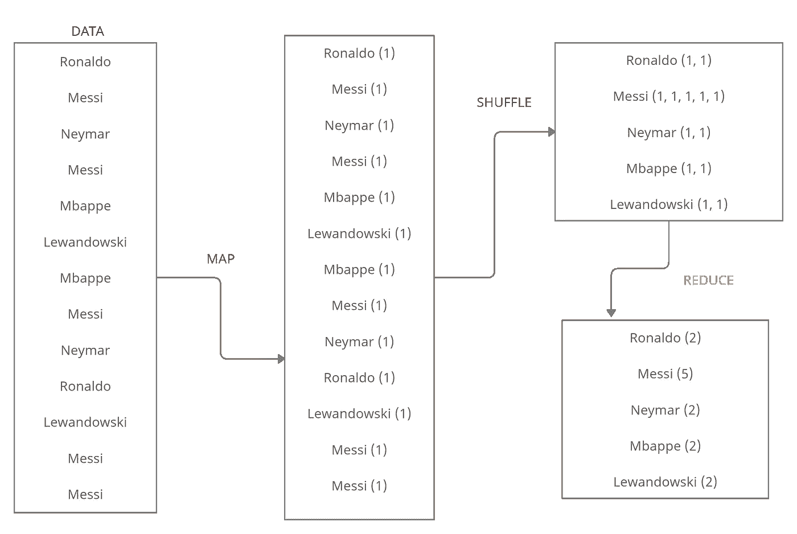
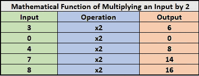
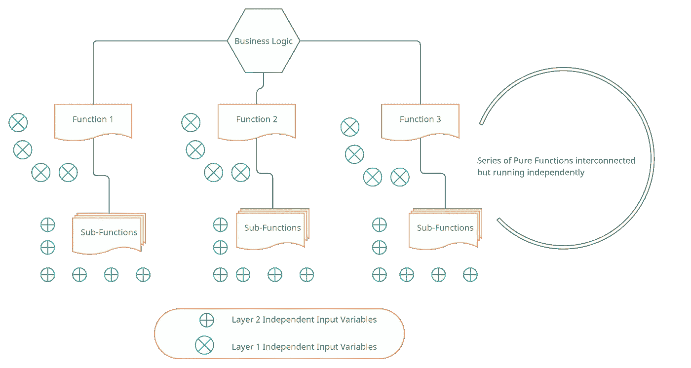
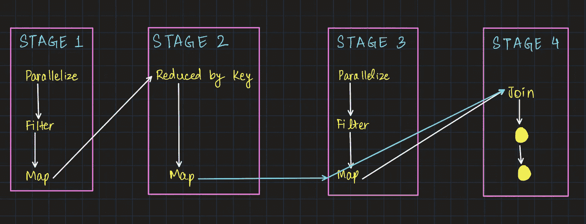

# 大数据函数式编程终极指南

> 原文：<https://towardsdatascience.com/the-ultimate-guide-to-functional-programming-for-big-data-1e57b0d225a3?source=collection_archive---------12----------------------->

## 纯函数和惰性求值——分布式数据计算的症结


纳斯蒂亚·杜尔希尔在 [Unsplash](https://unsplash.com?utm_source=medium&utm_medium=referral) 上的照片

Apache Spark 已经成为当今大数据领域最常用的工具。它能够单独运行代码，将 API 扩展到 Python、Scala、Java 和更多工具。它可以用来查询数据集，其架构中最令人振奋的部分是能够对实时流数据进行分析，而无需显式地将其存储在任何地方。Spark 源于 Scala，被设计为一个分布式集群计算软件框架。从资源管理、多线程、任务分配到逻辑的实际运行，Spark 无所不包。从最终用户的角度来看，它是一个分析工具，可以在几分钟内输入大量数据并得出所需的分析。但是，Spark 是如何实现的呢？使用 Spark 处理大型数据集的一些核心原则是什么？

要了解 Spark 的基础知识、其架构以及在大数据和云世界中的实施，请参考下面链接的故事。

[](https://medium.com/geekculture/unleash-the-spark-from-your-data-ba3227755e) [## 释放数据的火花

### Apache Spark 如何改变大数据游戏？

medium.com](https://medium.com/geekculture/unleash-the-spark-from-your-data-ba3227755e) 

# 为什么是函数式编程？

Spark 是一种使用 Scala 开发的语言，Scala 确实是一种函数式编程语言。函数式编程(通常缩写为 FP)是通过积累纯函数、避免共享状态、可变数据和副作用来编写代码的过程。函数式编程是声明性的而不是命令性的，完整的应用程序流过不存储或修改输入的函数。另一方面，Python 是一种过程编程语言。

让我们看一个例子来理解什么是过程化编程，以及为什么函数式编程对于在分布式系统上运行更有意义。

```
# Declare a list of Soccer Players
players_log = ["Messi",
"Ronaldo",
"Maradona",
"Messi",
"Lewandowski",
"Mbappe",
"Ronaldo",
"Messi",
"Neymar"]# Variable to hold the count
player_count = 0# Function to count number of times a player's name occurred
def count_occurences(player_name):
  global player_count
  for player in players_log:
    if player == player_name:
      player_count = player_count + 1
  return player_count# First Run
count_occurences("Messi")
>>> 3# Second Run
count_occurences("Messi")
>>> 6
```

在上面的例子中我们观察到了什么？我们看到，当程序运行多次时，样本变量的计数不断变化。这个答案是不正确的，因为“梅西”在列表中出现的次数只有 3 次。

> **—为什么会这样？发生这种情况是因为我们调用了一个 gloabl 变量来存储玩家数量，而程序继续修改这个变量的值。
> **—** **可能的解决方案是什么？**为了摆脱这一点，我们可以使用一个不实现全局变量的函数。下面我们来看一个实现。**

```
def count_occurences(player_name, player_count):
    for player in players_log:
        if player == player_name:
            player_count = player_count + 1
    return player_count
```

现在，每次这个函数被调用时， *`player_count`* 变量将被重置，它将总是给出准确的结果。

在并行系统上运行这段代码会发生什么？
在并行计算环境中，Spark 将数据拆分到多台机器上。让我们想象一下，这个例子中玩家的输入是 10，000，这个列表被拆分成 15 个系统。如果在上面的场景中实现这个逻辑，那么第一个系统必须在第二个系统启动之前完成它的执行，否则输出将被错误地组合。但是，如果机器不能同时工作，那么并行计算范例就失败了。

为了解决程序代码的这个问题，我们在 Spark 中使用函数式编程。但是，在开始使用函数式代码之前，我们首先需要了解一些先决条件，即**纯函数和惰性求值。**

那么，函数式编程将如何解决这个问题呢？看下面。



使用函数式编程方法运行相同程序的伪逻辑[Map — Shuffle — Reduce] |作者图片

# 纯函数及其在分布式系统中的应用

编程术语中的纯函数，顾名思义，就是一类不改变给它们的输入的函数。在编程范例中，有三个关键特性定义了什么是纯函数。但是，首先让我们了解一下纯函数的起源。

> 每个数学函数都是纯函数

起源就是这么简单。所有的数学函数都是纯函数。它们接受输入，执行给定的操作并生成输出。没有中间步骤，没有对函数体中的任何变量进行修改或更改。请看下面一个乘以 2 的数学函数的例子。



乘法运算|作者图片

在同样的意义上，对于编程语言来说，纯功能的理论仍然是一样的。我们可以在下面的 Scala 代码中操作上面提到的相同逻辑。

```
# Scala code to multiply by 2.
def multiplyByTwo(i: Int): Int = {i*2}
```

> 因为分布式系统同时运行许多函数，所以确保一个函数的执行不会对其作用域之外的变量产生副作用是很重要的。

*   输入要决定输出，输入的来源只有一个。不需要外部文件引用或额外的库。输入被实例化为函数，并产生输出。**只要传递的输入参数的值相同，输出就永远不会改变。**
*   该函数不会更改其输入，这意味着原始输入的值永远不会被修改。所有代码都在原始输入值的**副本上运行。**
*   该函数除了计算输出之外不做任何事情。不需要读取任何文件，绝对不需要依赖函数范围之外的任何东西。**接受输入，计算它，并返回输出。如果这个函数做了其他的事情，这就叫做副作用。**而且纯函数应该是永远不会产生副作用的。

**纯函数法则:**

> 1.函数的输入单独决定了它的输出。
> 
> 2.在函数的整个生命周期中，它不会改变输入。
> 
> 3.该函数不会产生意外的副作用。

现在让我们转向理解函数式编程的下一个重要概念——惰性求值。

# 懒惰评估的概念

想象一下在数百个系统上同时运行的纯函数。请记住，所有这些纯函数的执行或输出都不能依赖于外部变量。如果一个业务逻辑需要在一个程序中完成 10 个任务，Spark 将为这个任务创建 10 个纯函数。这也意味着所有 10 个输入的内存分配将是额外的，并且对于程序来说将变得昂贵，因为所有的纯函数都需要输入的副本。

> Spark 将单个任务划分到几个子功能中，这些子功能都是纯功能。



Spark 把主逻辑分成几个面向小运算的纯函数。每个纯函数都包含其输入参数| Image by Author 的副本

但是，这些单独的纯函数必然会占用大量内存来存储它们的输入参数。这可能会导致“内存不足”的错误。需要惰性求值来将程序从这些内存不足的错误中拯救出来。

> 在 Spark 对该程序做任何事情之前，它会一步一步地指出需要什么功能和数据。这形成了懒惰评估的基础，并被称为**有向无环图(DAG)**

# Spark 中的有向无环图

与现代世界的大多数其他编程范例类似，DAG 是一个图。它是一个图表，包含最终将应用于输入数据的轨迹或一系列操作。

*   **Directed:** 每个操作都直接从一个节点连接到另一个节点。这些串联连接创建了一系列操作，其中旧节点在执行上顺序领先于新节点。
*   **非循环的:**在整个函数过程中发生的操作不是在一个循环中，这意味着，它离开后的一个状态永远不能恢复。
*   **Graph:** 从图论来说，它声明了一个顺序连接的*顶点*和*边*的组合。

## Spark 如何构建 DAG？

基于所请求的根功能的性质，Spark 通常按照以下步骤为任何给定的任务创建 DAG:

1.  用户提交一个 Spark 应用程序，驱动程序模块从 Spark 会话中接收这个请求。
2.  然后，驱动程序根据请求执行几项任务，帮助识别应用程序所需的转换和操作。
3.  这些被识别的操作然后被安排在小的纯函数的逻辑流中，这种安排是 DAG。

然后，DAG 计划被转换为包含几个阶段的物理执行(下面显示了一个示例)。Spark 完成的转换可以分为两大类:

*   **窄变换** —像 map()和 filter()这样的过程是窄变换。这些不需要跨分区的数据洗牌。
*   **大范围转换**—reduce by key 之类的过程是大范围转换，因为它们需要通过分区进行数据洗牌。由于数据被混洗，结果显示在阶段边界上，不会干扰下一个纯函数的输入。

DAG 调度程序创建的所有任务都被连接起来，并通过捆绑包发送到运行该程序的集群。这标志着物理执行计划的完成。



Dag 是给 Spark 功能代码的一系列指令，这些代码在惰性评估|作者图片期间运行

DAG 旨在改进经典的 Hadoop MapReduce 操作，并为开发人员提供更大的灵活性。它允许一次执行多个查询，而 Hadoop 只支持两个查询(map 和 reduce)。DAG 还允许运行 SQL 查询，具有高度容错性，并且比 MapReduce 更优化。

# 在 Spark 中使用惰性评估的优势

1.  **增加可管理性:**当开发人员可以创建小的操作时，组织大的逻辑变得容易。它还通过分组操作减少了数据的传递次数。
2.  **降低复杂度:**编程中两个主要的运算复杂度是 ***时间*** 和 ***空间***Spark 可以克服这两个。因为所有的执行不会同时发生，所以节省了时间。该操作仅在需要数据时触发，因此空间仅在必要时使用，这样可以节省空间。
3.  **节省计算能力，提高速度:** Spark 函数通过驱动程序触发，在集群上运行。由于惰性求值仅在绝对必要时触发计算，它节省了驱动程序和集群之间不必要的行程，因此节省了功率并加快了执行过程，因为单个操作总是很小的。
4.  **优化:**在给定的时间内，运行的查询数量非常少，因此查询会得到优化。

# 惰性求值和函数式编程的应用

让我们在相同的玩家名字列表上工作，通过下面的代码在 Spark 任务中练习 PySpark 和 Lazy Evaluation。

```
# Import PySpark and create a sample App
import pyspark
sc = pyspark.SparkContext(appName="maps_and_lazy_evaluation_sample")players_log = ["Messi",
"Ronaldo",
"Maradona",
"Messi",
"Lewandowski",
"Mbappe",
"Ronaldo",
"Messi",
"Neymar"]# parallelize the log_of_players to use with Spark. The parallelize function distributes the input to multiple Spark clusters
distributed_player_log = sc.parallelize(players_log)# Use the Map() Function to convert all names to lowercase
distributed_player_log.map(convert_to_lowercase)
**>>> PythonRDD[1] at RDD at PythonRDD.scala:53**
```

上面的 map()函数几乎立即运行。这就是**懒评的魔力。** Spark 实际上还没有执行这个映射。它会等到最后一刻才执行映射，如果不必要的话就不会执行。上面输出中的“RDD”指的是弹性分布式数据集(RDD)。这些是分布在运行集群中的容错数据集。这就是 Spark 存储数据的方式。为了让 Spark 实际运行 map 步骤，我们需要调用一个**“动作”。**一个可用的操作是 collect 方法。 **collect()方法**从所有正在运行的集群中获取结果，并将它们合并到主节点上的一个列表中。

```
distributed_player_log.map(convert_to_lowercase).collect()
**>>> ['messi',  'ronaldo',  'maradona',  'messi',  'lewandowski',  'mbappe',  'ronaldo',  'messi',  'neymar']**# Running collect with a traditional Python Functional Programming technique [ Lambda Functions ]distributed_player_log.map(lambda x: x.lower()).collect()
**>>> ['messi',  'ronaldo',  'maradona',  'messi',  'lewandowski',  'mbappe',  'ronaldo',  'messi',  'neymar']**
```

要参考本文中提到的完整代码，请访问下面提到的链接:

[](https://github.com/rjrahul24/spark-ud-2002/blob/master/Functional_V_S_Procedural_Programming.ipynb) [## rjrahul24/spark-ud-2002

### 项目内容是 MapReduce 和 Spark 上的应用。该存储库包含基于 Udacity 的 Spark 的项目…

github.com](https://github.com/rjrahul24/spark-ud-2002/blob/master/Functional_V_S_Procedural_Programming.ipynb) 

# 结论

Spark 是处理海量数据的健壮框架。它现在也能够执行机器学习任务，可以托管在所有云平台上。本文旨在介绍函数式编程的概念，以及它如何以积极的方式影响大数据系统，比过程化代码更好。Spark 比我们在本教程中看到的要复杂得多。请务必参考链接的代码库，查看实现这些概念的笔记本。有关 Spark 和函数式编程的更多信息，请参考“参考”一节中的链接。


Joel Filipe 在 [Unsplash](https://unsplash.com?utm_source=medium&utm_medium=referral) 上拍摄的照片

## 关于我

我是 Rahul，目前在研究人工智能，在 Xbox 游戏上实现大数据分析。我在微软工作。除了专业工作之外，我还试图制定一个程序，来理解如何通过使用人工智能来改善世界上发展中国家的经济状况。

我现在在纽约的哥伦比亚大学，你可以通过 LinkedIn 和 Twitter 与我联系。

## [参考文献]

1.  [https://www.udacity.com/course/learn-spark-at-udacity-ud 2002](https://www.udacity.com/course/learn-spark-at-udacity--ud2002)
2.  [https://stack overflow . com/questions/57050728/count-occurrences-of-a-list-of-substrings-in-a-py spark-df-column](https://stackoverflow.com/questions/57050728/count-occurrences-of-a-list-of-substrings-in-a-pyspark-df-column)
3.  https://en.wikipedia.org/wiki/Functional_programming
4.  [https://www . geeks forgeeks . org/functional-programming-paradigm/](https://www.geeksforgeeks.org/functional-programming-paradigm/)
5.  [https://spark.apache.org/](https://spark.apache.org/)
6.  [https://spark . Apache . org/docs/latest/API/python/_ modules/py spark/SQL/functions . html](https://spark.apache.org/docs/latest/api/python/_modules/pyspark/sql/functions.html)