# 不同情况下假设检验和置信区间的最终指南

> 原文：<https://towardsdatascience.com/the-ultimate-guide-to-hypothesis-testing-and-confidence-intervals-in-different-scenarios-70bcc0d846b2?source=collection_archive---------8----------------------->

马库斯·温克勒在 [Unsplash](https://unsplash.com/s/photos/tutorial?utm_source=unsplash&utm_medium=referral&utm_content=creditCopyText) 上的照片

## [入门](https://towardsdatascience.com/tagged/getting-started)

## 单样本和双样本均值、比例统计推断的循序渐进教程

统计推断是根据观察到的数据对总体分布和参数做出合理猜测的过程。进行假设检验和构造置信区间是统计推断的两个例子。假设检验是在假设零假设为真的情况下，计算观察样本统计数据的概率的过程。通过比较概率(P 值)和显著性水平(1-ɑ),我们对从中抽取样本的总体参数做出合理的猜测。用类似的过程，我们可以计算出一定置信水平下的置信区间。置信区间是总体参数的区间估计，即点估计加上和减去临界值乘以样本标准误差。本文将讨论在以下不同场景中进行假设检验和估计置信区间的标准过程:

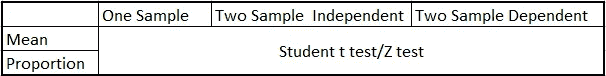

不同的场景

这篇文章既是统计推断的教程，也是供你参考的备忘单。下面的小节将详细讨论这些过程，为了方便起见，在文章的最后，我将在两个表格中总结讨论。

## 1、均值的统计推断

## **1.1 分布假设**

当使用统计推断技术时，我们需要对下面的分布进行假设。根据[中心极限理论](https://en.wikipedia.org/wiki/Central_limit_theorem)，随着样本量的增加，样本均值的分布趋近于正态分布，无论总体分布如何。因此，如果样本量足够大，样本的均值服从正态分布。

我们这里通常使用的检验要么是学生 t 检验，要么是 Z 检验。z 检验基于正态分布，而学生 t 检验基于类似于正态分布的分布，但具有较厚的尾部。当样本量低于 30(标准截止值)或总体标准差未知时，我们使用学生 t 检验。否则，我们使用 Z 检验。

## 1.2 单样本平均值

对于具有 n 个观察值的样本:

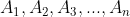

我们观察ᾱ作为样本的平均值。我们可以通过检查ᾱ是否与μ显著不同来检验这个样本是否来自均值等于μ的总体。我们还可以估计出抽样总体均值的 95%置信区间。

**假设检验**

下面是进行假设检验的步骤:

*   **第一步:设置原假设:**

**两条尾巴:**

h0:ᾱ=μ

h1:ᾱ！= μ

**一条尾巴:**

h0:ᾱ≥μ

h1:ᾱ< μ

or:

H0: Ᾱ ≤ μ

H1: Ᾱ >μ

另一个假设 H1 是我们想要检验的假设。例如，如果我们想测试ᾱ是否大于μ，我们设置 H1 为ᾱ>μ。

*   **第二步:计算检验统计量:**

对于学生 t 检验，我们需要使用样本标准差 s 来估计总体标准差σ:

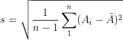

样本标准偏差

t 统计量是:

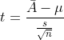

t 检验统计量

请记住，对于学生 t 检验，由于样本中的观察值相对较小，我们需要指定自由度来找到正确的值。自由度定义为 n-1，其中 n 是样本大小。

如果我们知道总体标准差σ，并且样本大小 n 大于 30，我们可以使用 z 检验并计算 z 统计量:

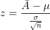

z 检验统计量

*   **步骤 3:将临界值与测试统计值进行比较**

要获得临界值，我们需要指定显著性水平 1-并参考 t 或 z 表。例如，对于样本大小等于 10 且显著性水平为 95%的双尾 t 检验，临界值为 2.262，如下所示:

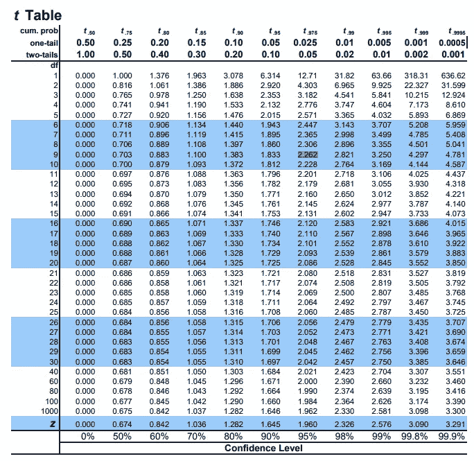

来自[https://www . sjsu . edu/faculty/gerst man/stat primer/t-table . pdf 的 t 表](https://www.sjsu.edu/faculty/gerstman/StatPrimer/t-table.pdf)

对于显著性水平为 95%的双尾 z 检验，临界值为 1.96，如下所示:

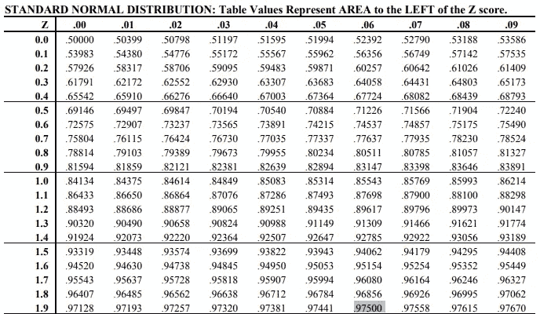

z 表来自[https://www . math . Arizona . edu/~ RS IMS/ma 464/standardnormaltable . pdf](https://www.math.arizona.edu/~rsims/ma464/standardnormaltable.pdf)

下图显示了临界值的含义。z 检验基于标准正态分布(N(0，1))。分布的性质表明，对于 N(0，1)之后的随机变量 x，只有 5%的机会|x| ≥ 1.96。临界值 1.96 与 95%(1-5%)的显著性水平相关。如果上面计算的 z 检验统计量大于 95%，则意味着观察到该样本统计量(p 值)的概率小于 5%。因此，我们可以在 95%的显著性水平上拒绝零假设。

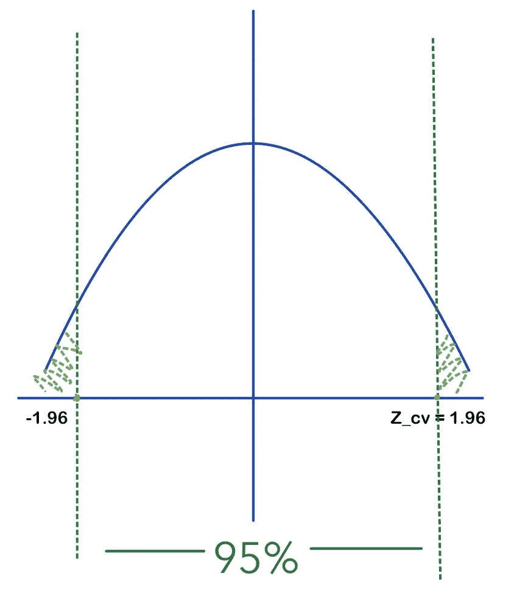

双尾检验的临界值和显著水平

请注意，在相同的显著性水平(95%)下，t 检验的临界值大于 z 检验的临界值，这与 t 分布具有较厚尾部的事实相符。

**置信区间**

置信区间是参数在一定置信水平下的区间估计。它通过点估计加上或减去误差幅度(ME)来计算:

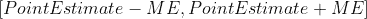

置信区间

点估计值只是样本的平均值，ME 的计算公式如下:

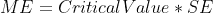

误差幅度

分布和置信水平定义临界值，标准误差(SE)通过样本或总体标准偏差计算。对于一个样本均值的置信区间，如果我们不知道总体方差，或者当样本量太小时，我们可以通过下式计算:

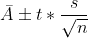

单样本平均置信区间

其中，ᾱ是样本的平均值，t 可以根据置信水平和自由度在上面的 t 表中找到。例如，对于一个有 10 次观察的样本，95%置信区间的 t 值是 2.262。

否则，我们需要使用 z 表来计算置信区间:

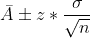

单样本平均置信区间

z 值可在 z 表中找到。95%置信区间的 z 值为 1.96。

## 1.3 两个样本意味着:独立样本

当我们观察两个样本时，我们可能想知道这两个样本的平均值是否有显著差异。如果我们有理由相信这两个样本彼此不相关，我们可以使用假设检验来测试它，假设检验的零假设状态均值彼此相等，或者对均值的差异进行置信区间，并检查零是否在区间内。该过程与单样本情况非常相似，只是在计算测试统计数据和标准误差时略有不同。

**假设检验**

对于具有均值ᾱ1 和ᾱ2 的两个样本，我们可以为双尾检验设置零假设和替代假设，如下所示:

h0:ᾱ1 = ᾱ2

h1:ᾱ1！= Ᾱ2

如果我们想检查任何一个均值是否明显大于另一个均值，我们也可以设置单尾检验(h0:ᾱ1 > ᾱ2)。如果两个样本都不够大，我们可以使用假设 t 分布的 t 表，并按如下方式计算 t 分布:

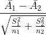

两个独立样本均值的 t 统计量

其中，S1 和 S2 是两个样本的方差，计算公式如下:

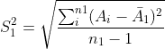

样本 1 的标准偏差

样本 2 的标准偏差

根据实际情况，我们也可以设置零假设来检验两个均值之间的差值是否大于某个大于 0 的数，这个数有时称为效应大小。更大的效应大小使得更容易拒绝零假设，因为差异更大，因此增加了统计功效。要了解更多细节，你可以在这里查看我的文章:

</how-is-sample-size-related-to-standard-error-power-confidence-level-and-effect-size-c8ee8d904d9c>  

注意，当我们如上计算集体标准误差时，我们假设两个样本来自具有不同方差(σ1！= σ2 ) .当我们相信σ1 = σ2 时，我们可以计算合并的标准误差:

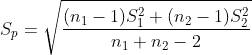

合并标准差

并计算测试统计的标准误差，如下所示:

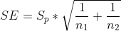

标准误差

零假设的检验统计变为:

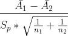

双样本均值的检验统计量

**置信区间**

两个样本均值的置信区间用来描述两个均值的差异。使用 t 临界值，我们可以如下计算置信区间:

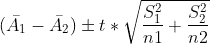

两个样本均值的置信区间

请注意，与上面的讨论类似，通过对总体方差的不同假设，我们可以不同地计算误差项的标准差。

## 1.4 两个样本意味着:成对样本

在上一节中，我们已经讨论了两个样本相互独立的情况。两个样本以某种方式相互关联的情况呢？例如，两个样本在治疗前后来自相同的受试者，或者样本取自同一家庭的不同人，等等。在这些情况下我们通常有 n1 = n2。例如，如果我们想检验在治疗组中是否有治疗效果，我们可以在治疗前后收集样本:

处理前的样本

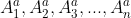

处理后的样品

我们需要计算每个个体治疗前后的差异，并得到观察差异的样本:

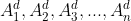

差异样本

在哪里

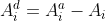

这样，我们就把两个样本的情况转化为一个样本的情况。按照上面讨论的程序，首先我们需要计算差异样本的平均值和标准偏差:

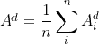

差异样本的均值

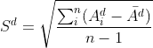

差异样本的标准偏差

**假设检验**

我们可以根据实际情况建立零假设。双尾检验的典型零假设和替代假设是:

h0:ᾱ^d =μ

h1:ᾱ^d！= μ

μ可以是任何数字。测试统计数据的计算如下:

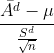

差异样本的统计量

根据样本的不同，我们可以选择进行 t 检验或 z 检验。

**置信区间**

我们还可以构建样本差异的置信区间。我们只需要差均值和差标准差来构造区间。基于学生 t 分布的置信区间为:

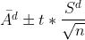

差异样本的置信区间

## 2、比例的统计推断

## 2.1 分布假设

均值衡量连续变量的集中趋势，但不能用于分类变量。对于分类变量，我们可以在统计分析中使用每个类别的计数比例。具有 n 个类别的样本中类别 I 的比例计算如下:

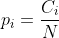

计算比例

C_i 为第一类的观测值个数，N 为样本量(所有 N 类的总观测值)。

这里我将用一个简单的例子来说明这个过程。掷硬币时，我们要么得到“正面”，要么得到“反面”。我们使用二项式分布来表示二元分类比例，而不是遵循正态分布来进行平均统计推断。根据二项式分布的性质，随着样本量变大，二项式分布越来越接近正态分布。统计推断中“大样本”的标准定义是当 n*p 和 n*(1-p)都大于 10 时。如果不是，我们将使用学生 t 分布进行推断。

## 2.1 一个样本比例

一个样本比例计算一个类别在样本中所占的比例。如上所述，单样本比例的一个用例是测试一个硬币是否无偏。在足够的投掷次数下，如果硬币是无偏的(大数定律)，那么“头”的比例应该等于“尾”的比例为 0.5。

**假设检验**

单样本比例的假设检验遵循类似的设置程序。使用上面掷硬币的例子，如果我们想测试一个硬币是否无偏，给出一个掷硬币结果的例子:

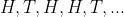

这与测试是一样的:

H0:P H = P 0

H1: P_H！= P_0

为了检验硬币是否无偏，我们可以设 P_0=0.5。注意这是双尾测试。我们可以把零假设改写为 P_H > 0.5，看看这个硬币是否偏向头部。

我们需要首先计算样本中有多少个“头”来计算 P_H。然后，假设样本大小足够大，我们就可以计算 z 统计量:

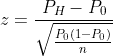

单样本比例的 z 统计量

P_H 由样本计算得出。在这个例子中，P_0 被设置为 0.5。分母用于计算该样本的标准误差(源自二项式分布)。按照上述相同的步骤，我们可以使用 z 表或 t 表来查找临界值。通过比较这里计算的统计数据，我们可以决定是否拒绝零假设。

**置信区间**

比例的置信区间与均值的统计推断遵循相同的模式，即使用点估计值和误差容限，只是标准误差的计算方式不同:

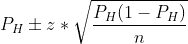

单样本比例的置信区间

请注意，假设检验的标准误差不同于置信区间。前者用 P_0，后者用 P_H。

## 2.2 两个样本的比例

双样本比例检验比较两个样本的比例，广泛应用于 AB 检验。例如，当我们比较治疗组和对照组之间的转化率以查看是否存在显著的治疗效果时，我们需要测试转化率的差异是否足够显著。我们可以用假设检验来检验这两个比例是否有差异，或者为差异构造一个置信区间。

**假设检验**

根据我们现有的两个样本，我们可以计算出 P1 和 P2 的两个比例。为了检验这两个比例是否没有显著差异，也就是说这两个样本可能来自同一人群，零假设和替代假设为:

H0: P1 = P2

H0: P1！= P2

请注意，这是一个双尾测试。对于单尾检验，我们可以检查在零假设下 P1 是大于还是小于 P2。

我们需要计算两个样本比例的一个重要变量叫做 P_pool:

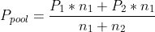

混合比例

你可以这样理解，当我们将两个样本合并在一起时，类别 I 在合并样本中的比例是多少。

类似地，如果 n1*P1 和 n2*P2 都大于 10，我们可以使用 z 统计，因为分布遵循正态分布。如果不是，我们需要计算 t 统计量。统计数据的计算方法如下:

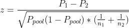

两个样本比例的 z 统计量

注意，我们使用 P_pool 来计算标准误差。

**置信区间**

像两个样本均值的置信区间一样，两个样本比例的置信区间也用于推断两个比例之间的差异。如果两个样本量都足够大，我们可以使用 z 表中的临界值 z，并计算置信区间为:

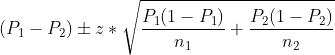

置信区间和假设检验之间的唯一区别是标准误差的计算。置信区间不使用混合比例，而是单独使用每个样本的标准误差。

这需要消化很多信息。这里我用两个表格来总结这篇文章的要点:

*   对于一个样本均值和比例:

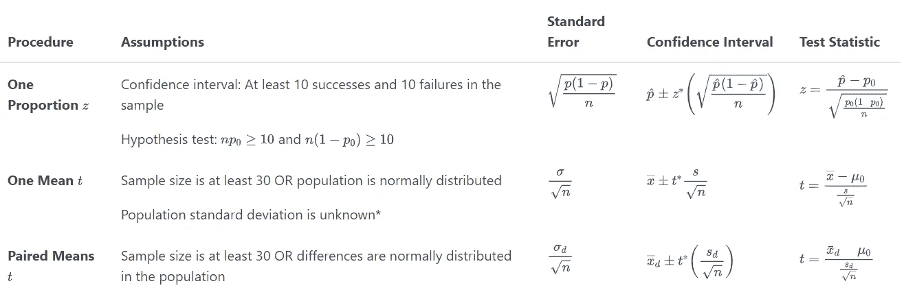

资料来源:[宾州州立大学统计 200](https://online.stat.psu.edu/stat200/lesson/8/8.4)

*   对于两个样本的平均值和比例:

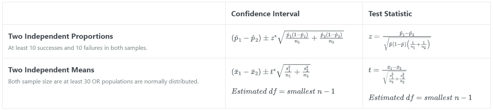

来源:[宾州州立大学统计 200](https://online.stat.psu.edu/stat200/lesson/9/9.3)

感谢您的阅读。这是我所有博客帖子的列表。如果你感兴趣的话，可以去看看！

<https://zzhu17.medium.com/my-blog-posts-gallery-ac6e01fe5cc3>  <https://zzhu17.medium.com/membership> 