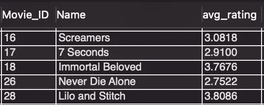
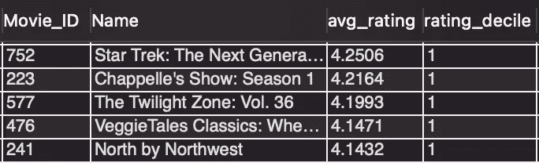
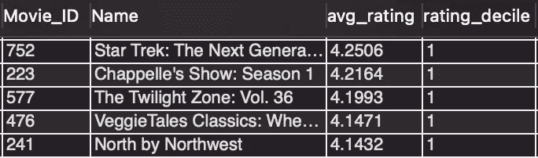

# SQL CTEs 的终极指南

> 原文：<https://towardsdatascience.com/the-ultimate-guide-to-sql-ctes-12a065187a15?source=collection_archive---------24----------------------->


迪米特拉·佩帕在 [Unsplash](https://unsplash.com/s/photos/tables?utm_source=unsplash&utm_medium=referral&utm_content=creditCopyText) 上的照片

## 在 5 分钟内掌握常用的表格表达

通用表表达式(cte)是一种 SQL 功能，允许您在一个简单易读的查询中执行复杂的多步转换。由于其强大的功能、可读性和灵活性，它们对于初学者和专家都是有用的工具。

# 它们是如何工作的？

最简单地说，cte 允许您创建临时数据集，以便稍后在查询中引用。

这些临时数据集在查询期间“可用”,但它们并不存储在数据库中，所以一旦执行了查询，它们就消失了。

# 我们为什么需要它们？

cte 的核心是做两件事:

1.  它们解决了我喜欢称之为“逻辑之上的逻辑”的问题。当您必须执行数据操作，然后使用生成的数据集执行更多操作时，就会出现这种情况。
2.  它们使您的代码更具可读性，也更容易使用

# 语法看起来像什么？

幸运的是，cte 的语法非常简单:

1.  首先键入关键字“with”+任何您想要用来引用您创建的数据集的名称+“as”
2.  在括号中写下您想要执行的查询
3.  编写引用 CTE 的其他查询

```
with my_cte as (select * from my_table)select * from my_cte;
```

唯一不同的是，我们可以在同一个查询中使用多个 cte(用逗号分隔):

```
with cte1 as(select * from my_table1), cte2 as (select * from my_table2)select cte1 
union all
select cte2;
```

# 感觉还是很理论，能给我举个例子吗？

好的，让我们用一个 Kaggle 数据集快速地看一个例子，它包含了[网飞电影评分](https://www.kaggle.com/rishitjavia/netflix-movie-rating-dataset)。每条记录都是用户对电影的评价:


作者图片

现在，假设我们想要选择平均收视率最高的 10%的所有电影。

这是 cte 的一个很好的用例，因为它涉及多层次的聚合。

处理这个查询的最好方法是一步一步地构建它。

首先，我们需要计算每部电影的平均评分:

```
select movie_ID, Name, avg(Rating) as avg_rating
from netflix.ratings
group by 1,2;
```



作者图片

然后我们需要得到平均评分的十分位数。让我们用一个 CTE 吧！

```
with avg_ratings as(select Movie_ID, Name, avg(Rating) as avg_rating
from netflix.ratings
group by 1, 2)select *, ntile(10) over (order by avg_rating desc) as rating_decile 
from avg_ratings;
```



作者图片

请注意，我们首先在 CTE 中获得电影的平均评级，然后在后续查询中引用该表。

我们的最后一步是过滤，只包括 rating_decile = 1 的电影。我们可以通过使用第二个 CTE 来解决这个问题！

```
with avg_ratings as(select Movie_ID, Name, avg(Rating) avg_rating
from netflix.ratings
group by 1, 2),avg_ratings_decile as(select *, ntile(10) over (order by avg_rating desc) as rating_decile 
from avg_ratings)select *
from avg_ratings_decile
where rating_decile = 1;
```



作者图片

最终，CTEs 帮助我们在一个查询中执行了三个后续的数据操作:

1.  计算每部电影的平均评分
2.  计算平均分之上的十分位数
3.  十分位数= 1 的过滤器

# 但是等等，我们可以用子查询来做！

是的。是的，我们可以。

但是子查询读起来绝对是一团糟，因为当试图理解逻辑时，它们需要你从里到外地工作。例如，我们上面的查询使用子查询如下所示:

```
select *from(select *, ntile(10) over (order by avg_rating desc) as rating_decilefrom(select Movie_ID, Name, avg(Rating) avg_rating
from netflix.ratings
group by 1, 2) as avg_ratings) avg_ratings_decilewhere rating_decile = 1;
```

像这样剖析代码——使用所有不同的括号和别名——可能是一场噩梦。cte 干净多了。

# 我想我明白了，但是我怎样才能得到更多的练习呢？

获得更多实践的一个简单方法是自己完成上面的例子。

为此，我建议:

1.  点击从 Kaggle [下载免费数据集](https://www.kaggle.com/rishitjavia/netflix-movie-rating-dataset)
2.  上传到 SQL 数据库。如果您还没有设置，您可以在下面找到我的指南，了解如何快速有效地设置:

</4-steps-to-start-practicing-sql-at-home-cb771beeca20>  

3.尝试自己重新创建我在上面写的 cte(注意，我首先将收视率数据与电影数据结合起来，以添加电影名称)

4.自己写问题给自己回答！没有什么比提出你自己的研究问题更好的了，因为它可以帮助你内化“何时”和“为什么”你可能想要使用某些功能

**如果您认为本文有帮助，请:**

1.  对您希望我接下来撰写的 SQL 或数据科学主题发表评论，然后
2.  ***订阅我的*** [***免费邮箱列表***](https://subscribe.to/everythingdata)

您还可以在下面找到我的其他 SQL 指南:

</6-hidden-sql-mistakes-to-avoid-2e771bed085b>  </you-know-excel-time-to-learn-sql-e77a2b5c8fbb> 