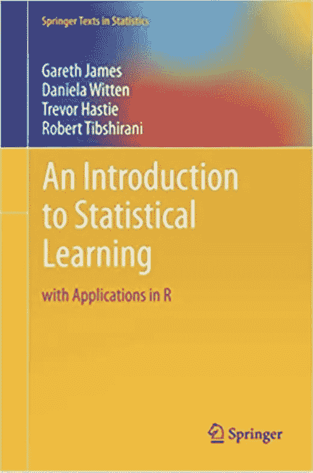
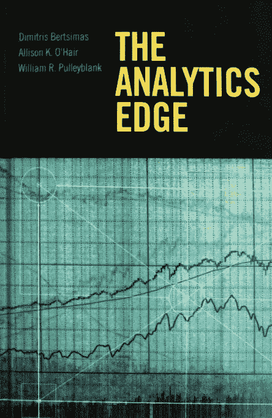

# 数据科学家和数据分析师的终极面试准备指南

> 原文：<https://towardsdatascience.com/the-ultimate-interview-prep-guide-for-data-scientists-and-data-analysts-18621db1da47?source=collection_archive---------0----------------------->

兰迪·塔兰皮在 [Unsplash](https://unsplash.com?utm_source=medium&utm_medium=referral) 上的照片

## 是什么帮助我成功采访到方和独角兽

准备数据科学家/数据分析师面试是一项耗时的活动，但如果您有该领域的经验和/或拥有可能会在面试中出现的每个主题的合适资源列表，以便您可以集中精力，则可以大大减少准备时间。尽管数据科学家和数据分析师在数据世界中是不同的职业道路(如果你还不知道区别，请查看我在[发表的关于这个主题的帖子](/how-to-pick-the-right-career-in-the-data-world-1cec8a084767)，但当谈到采访中涉及的话题时，有很多重叠。

在我之前的帖子中，我的面试准备指南的第一部分，我概述了大多数数据相关工作面试中出现的[常见测试领域](/the-ultimate-interview-prep-guide-for-your-next-dream-data-job-be4b2c7f73a8)(这些问题在数据科学家、数据分析师、数据工程师以及技术产品经理的面试中经常被问到)。在这篇文章中，我将聚焦于对数据科学家和数据分析师的采访；我已经在硅谷的几十家公司面试过这些职位，并收集了一系列有用的资源。如果你在面试一个数据科学家/数据分析师的职位，请确保除了我在之前的帖子中概述的那些主题之外，你还复习了这些主题。

## 首先，确定关注什么话题

正如我在之前的文章[中提到的，如果你准备面试的时间有限，分清主次是很重要的。面试中出现的一系列话题(以及它们在最终决定中的权重)很大程度上取决于职位描述。如果你应聘的工作大多是搭建 ML 模型，建模技能肯定会是面试官重点关注的；如果工作描述提到了 A/B 测试和度量分析，那么当统计知识和 A/B 测试设计在评判标准中占很大比重时，这就不足为奇了。](https://medium.com/r?url=https%3A%2F%2Ftowardsdatascience.com%2Fthe-ultimate-interview-prep-guide-for-your-next-dream-data-job-be4b2c7f73a8)

## 统计/数学面试

常见职位:数据科学家、数据分析师

不要因为提到“数学”而气馁，没有人会在数据科学面试中问你导数、积分或矩阵乘法，因为这些很可能不适用于你的日常工作。我说的“数学”，主要是指关于基本统计概念和基本概率论的知识。

GIF by [GIPHY](https://media.giphy.com/media/3owzW5c1tPq63MPmWk/giphy.gif)

不幸的是，知道平均值和中间值的区别对面试的这一部分来说是不够的。大多数面试官会测试你对诸如 T2 大数定律、T4 中心极限定理以及贝叶斯概率和计算的熟悉程度。

*   [辉煌](https://brilliant.org/) (Freemium 模式):方招聘人员统计面试准备推荐网站。有各种水平的课程，所以要确保你不会陷入统计概念的陷阱。对于大多数面试来说，知道基本原理就足够了。
*   [麻省理工学院开放式课程](https://ocw.mit.edu/courses/mathematics/18-05-introduction-to-probability-and-statistics-spring-2014/class-slides/)(免费):用课堂幻灯片详细概述最基本的统计概念。它从最基本的概念开始，如均值和方差，然后慢慢积累。然而，如果你在学校主修数学或统计学，这些幻灯片对你来说可能太基础了。
*   [可汗学院](https://www.khanacademy.org/math/statistics-probability)(免费):*统计和概率*课程提供了统计和概率中基本概念的详细分类；它也有练习题来测试你对题目的理解。

## 编码访谈(Python、R 等)

常见职位:数据科学家，一些小公司的数据分析师

在我的[上一篇文章](/the-ultimate-interview-prep-guide-for-your-next-dream-data-job-be4b2c7f73a8)中，我介绍了 SQL 编码面试的准备材料。除了 SQL 之外，大多数数据科学家角色都需要对至少一种脚本语言有基本的了解；最常见的有 Python 和 r。

与大多数 SQL 面试相反，一些面试官会要求你运行你的 Python/R 代码。然而，面试官的目的不是测试你对某个特定的包或函数语法的熟悉程度；他们通常更关心你是否懂编程基础(对于循环，while 循环等。)以及当代码抛出错误时是否可以调试代码。所以，如果你不记得 *random()* 函数是在 *random* 包中还是在 *NumPy* 包中，一定要问你的面试官他们是否能给你一个提示(这是一个棘手的问题，两个包都有一个 *random()* 函数)。

GIF 来自 [GIPHY](https://media.giphy.com/media/3o7bubqwu4GF75lmrm/giphy.gif)

*   [Udemy](https://www.udemy.com/) :平台上有很多 Python 和 R 课程可供选择，所以很容易找到符合你的经验和对所选语言熟悉程度的课程。
*   [Hackr.io](https://hackr.io/blog/best-python-courses) 有一篇文章对你能在网上找到的顶级 Python 课程/资源进行了排名；如果您正在寻找学习 Python 的免费资源，这是一个很好的起点。

## 理论/建模/ML 知识面试

常见职位:数据科学家、应用科学家

面试的这一部分不是你看几个视频就能轻松学会的，所以如果你申请的工作有建模的成分，你肯定应该预算更多的时间来准备。除非你面试的是 R&D 团队的核心数据科学家角色，否则通常你不会被问到 NLP(自然语言处理)或深度学习之类的问题。但是，您应该知道基本的建模概念，例如回归、分类、聚类等等。如果你没有深厚的背景或丰富的建模经验，有两本书对你学习这些概念很有帮助。

凯文·Ku 在 [Unsplash](https://unsplash.com?utm_source=medium&utm_medium=referral) 上拍摄的照片

免责声明:本部分包含附属链接，这意味着如果您决定通过下面的链接进行购买，我将免费获得佣金。这里推荐的书都是我自己面试备考的时候用过的，喜欢的书。(附属链接标有“*”，你可以直接从谷歌搜索书名来绕过它)。

*   [统计学习简介](https://amzn.to/31cczhF) *:本书涵盖了最常见的建模主题，并假设读者已经具备了一些统计学背景和知识。

*   [分析边缘](https://amzn.to/3tRzmMi) *:这本书是由麻省理工学院运筹学系的超级明星教授 Dimitris Bertsimas 撰写的，它被用作麻省理工学院商业分析项目的教科书。麦肯锡还将其用作数据科学家分析训练营的培训材料。这本书展示了 ML 世界中不同模型的细节并进行比较，从最基本的线性回归到更高级的机器学习模型。你肯定无法在一周内从头到尾读完这本书，所以我不会把它作为最后一分钟的速成课程，而是会在更长的时间跨度内详细通读这本书，并在面试前浏览重要章节作为复习。

## A/B 测试知识

常见于:数据科学家

许多数据科学工作描述都会提到 A/B 测试，因为这是数据科学家需要做的最常见的分析之一。对 A/B 测试设计和分析的理解依赖于对基本统计数据的理解；所以，如果你需要统计概念的复习，一定要在浏览完统计/数学面试的资源后再做这部分准备。

*   [uda city 上的 A/B 测试课程](https://www.udacity.com/course/ab-testing--ud257)(免费):我在面试前用这个课程来温习我对 A/B 测试的理解，它超级有效。本课程详细介绍了 A/B 测试的设计、分析和注意事项。最棒的是，它是由谷歌工程副总裁领导的，他们有丰富的 A/B 测试经验，可以用现实生活中的例子来阐明这个主题。

## 其他需要复习的技能

*   **沟通技能**:除了上面提到的“硬”技能，对数据科学家/数据分析师或任何人来说，最重要的技能就是沟通。大多数面试官认为，只要你有一定的技术背景/理解基础，就可以在工作中获得技术技能，但很难向那些在技术方面超级强大但不能很好地表达自己想法的人传授沟通技能。为了在面试中展示你的沟通技巧，让面试官了解你的思考过程是很重要的，尤其是在现场编码和案例面试部分。需要注意的是，让人们了解你的思考过程并不意味着你应该东拉西扯；确保你花一点时间来组织你的想法或代码，并且总是尝试采用自上而下和结构化的交流方式。实践这一点的最佳方式是与一位朋友进行模拟面试，并通过解释您在代码中做了什么来引导他们完成一个编码问题。

GIF 由 [GIPHY](https://gph.is/g/ZYA98rp)

*   **熟悉云平台/数据仓库:**熟悉谷歌云平台、Azure 或其他云平台通常会更好，因为现在大多数公司都在使用某种云平台来存储数据。如果你不知道从哪里获得这些平台的实践经验，你可以在空闲时间获得无数的证书。

图片由 [C Dustin](https://unsplash.com/@dianamia?utm_source=medium&utm_medium=referral) 在 [Unsplash](https://unsplash.com?utm_source=medium&utm_medium=referral) 上拍摄

*   **熟悉数据可视化工具**:大多数公司使用 Looker、Tableau 或类似工具来可视化数据。因此，熟悉他们意味着当你被录用时，你会花更少的时间提升，这对雇主来说是有价值的。同样，即使你找不到机会用这些工具积累实际工作经验，你也可以找到证明你能力的证书。

我想在最后补充一点，面试准备需要时间和工作；虽然你可能偶尔会觉得自己带着准备材料掉进了兔子洞，但重要的是不要在这些时候感到沮丧，并确保在花所有时间填补一个主题的知识空白之前，留出足够的时间来浏览所有可能主题的基础知识。

毕竟，面试准备就像你一直在为学校做的考试准备一样，你永远无法预测和准备面试中的每一个问题(如果你可以，那会破坏面试的目的，不是吗？);当你遇到一个你没有准备好的问题时，相信你的思考能力，用你准备好的所有材料解决这个问题。

希望这一系列文章对你的面试准备有所帮助；欢迎发表评论，如果你想了解更多关于 DS 世界的话题，请告诉我。