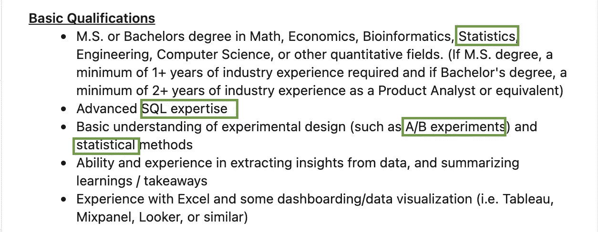
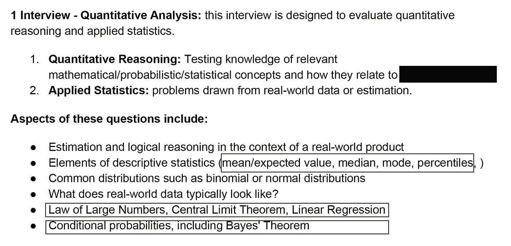
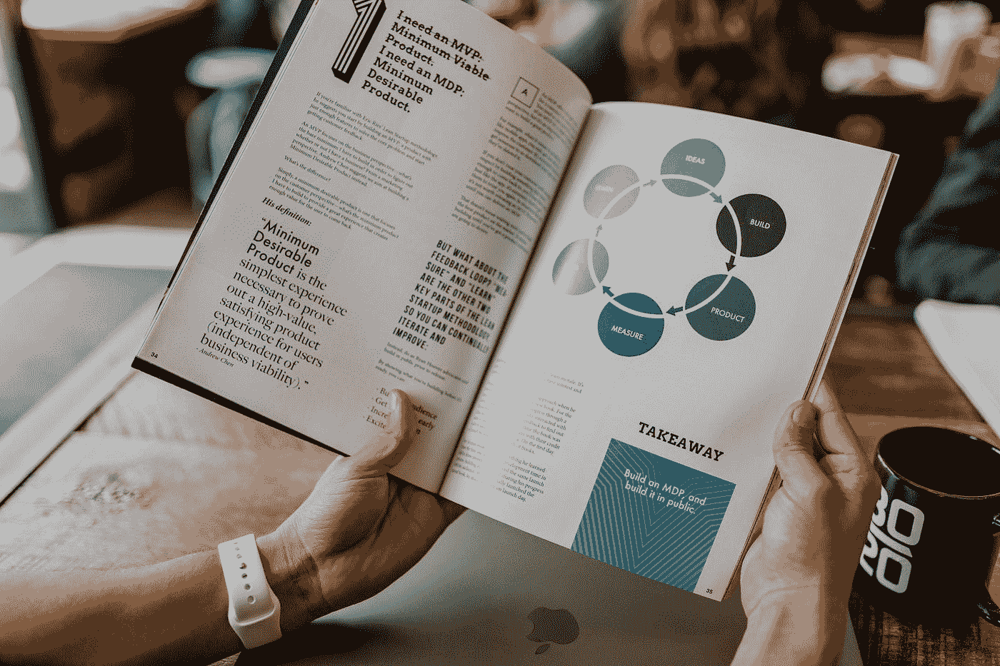
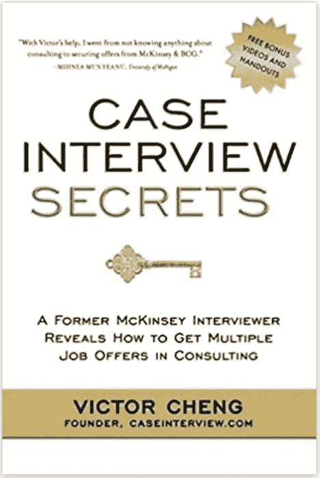
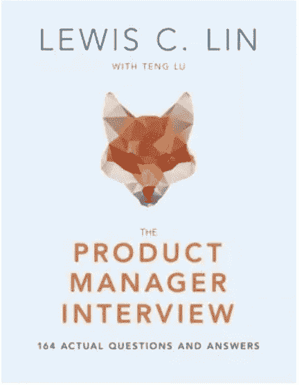
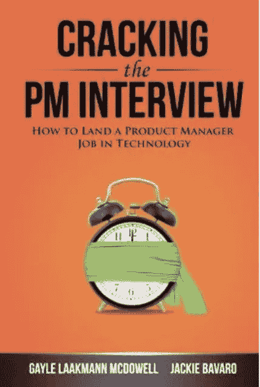
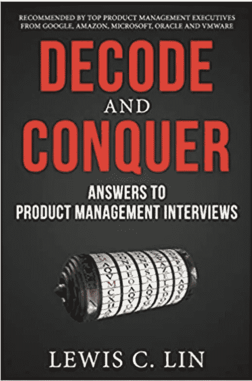

# 你下一份理想数据工作的终极面试准备指南

> 原文：<https://towardsdatascience.com/the-ultimate-interview-prep-guide-for-your-next-dream-data-job-be4b2c7f73a8?source=collection_archive---------11----------------------->

由 [Unsplash](https://unsplash.com?utm_source=medium&utm_medium=referral) 上 [Greg Rakozy](https://unsplash.com/@grakozy?utm_source=medium&utm_medium=referral) 拍摄的照片

## 是什么帮助我成功地面试了方和独角兽公司从产品经理到数据科学家的职位

经过一轮又一轮的简历编辑和数百份申请，你终于收到了你梦想中的公司的回音；但你没有庆祝，而是进入了另一轮恐慌:面试过程会是怎样的？你如何准备，从哪里开始？

每个经历过招聘过程的人都知道我在说什么。更令人恐慌的是，如果你像我一样，对数据世界中的不同角色感到好奇和感兴趣，你可能会去不同的公司面试不同的职位(尽管都与数据相关)。你怎么可能有足够的时间和精力来准备这些看起来要求天壤之别的工作的面试呢？

GIF 来自 [GIPHY](https://media.giphy.com/media/W6WNKaro33l1QdvIjV/giphy.gif\)

不要绝望；在经历了从**产品经理**(最不注重技术，最注重商业)到**应用科学家**(高度重视商业，很少注重商业)的几轮数据相关工作的招聘和面试后，我意识到这些面试中有很多共同点(有点跑题:这强化了我的信念，即数据世界中的技能组合大多是可以转移的，所以不要害怕在职业生涯早期做出“错误”的决定，你可以随时改变)。我将分享我在准备这些面试的过程中收集的资源，以帮助你更有效地准备面试。

## 首先，决定优先考虑什么

谈到面试准备，有很多内容要讲；为了便于管理，我把内容分成了两篇文章。在本文中，我们将首先讨论所有角色中最常见的面试话题。在我发表的下一篇文章中，我将为每个特定的角色讲述更专业的面试主题。

因为大多数人没有几年(甚至几个月)的时间来准备这些面试，所以有一个优先排序的计划是很重要的。决定关注什么以及如何在不同的主题上分配时间实际上可以归结为三个因素:1)你的目标职位描述的重点是什么？2)你申请的公司规模如何？，以及 3)你的弱项是什么？

角色的重点是什么？了解你申请的职位是侧重于指标的数据科学家还是侧重于 ML 模型的应用科学家很重要，这样你就知道在面试准备的哪个领域投入的时间最多。在我关于[在数据世界的不同职业道路](/how-to-pick-the-right-career-in-the-data-world-1cec8a084767)的文章中，我对不同的数据相关工作概况及其要求进行了非常详细的细分，这应该会让你对数据分析师、数据科学家和数据工程师之间的区别有一个坚实的概念。对于其他角色，有几种方法可以了解这些信息:

*   最好的方法是详细研究职位描述。一份写得很好的职位描述通常会让你很好地了解你在这个职位上将关注什么。

图片来自 LinkedIn(数据科学家的示例职位)

*   另一种方法是查看 LinkedIn 上你申请的公司中从事相同或相关工作的人的简介。如果他们中的大多数人在他们的角色描述或技能部分提到 SQL，当 SQL 出现在面试中时，不要感到惊讶。
*   最后，不要犹豫利用你的招聘人员。招聘人员希望为你的成功做好准备，所以他们通常很乐意告诉你面试的内容(或者代表你联系团队/面试官以获得更多信息)。

**公司规模有多大？**公司越小，就越需要聘用能够身兼数职的全面数据人才。在像方这样的大公司，大多数工作都已经有了明确的定义，招聘是一个标准化的过程。面试官可能会主动分享详细的面试指导，或根据要求提供更多信息。

方招聘人员发送的面试准备邮件样本，非常详细。

然而，如果你对创业感兴趣，那么你的面试准备应该是广泛的。即使你申请了一个数据分析师的职位，你可能会被要求在白板上写一轮代码，然后在下一轮讨论 ML 模型。

**你的弱项是什么？希望你已经对自己需要改进的地方有了大致的了解(尽管我是数学专业的，但我每次都会被概率问题绊倒)；但如果没有，浏览本 [**文档**](https://docs.google.com/document/d/1J9rjTzv3VKB2Qq10P3Oq2mV_K8pJOSdaeJ3IImPszBA/edit#heading=h.ph2s2onukvf) 中的一些样题是评估你对每个主题的流利程度的好方法。也有一些好的各个领域的备考资源。**

接下来，让我们深入到你在数据相关职位的面试中可能遇到的常见部分。

## 第 1 部分:编码(数据查询)访谈(SQL)

常见职位:数据分析师、数据科学家、数据工程师、应用科学家

在应聘数据相关的角色时，很有可能会遇到 SQL 测试，要么是实时编码面试，要么是离线/带回家测试。我采访过的大多数公司都是通过 [coderpad.io](https://coderpad.io/) 进行编码面试的，但是如果你知道大多数面试官不会编译和运行你的代码，并且对语法错误非常宽容，这可能会让你放松神经，因为 SQL 有很多不同的说法。所以要做好准备，不用担心知道 **week()** 和 **extract(从时间戳开始的星期)**的区别，但是一定要知道**内连接**和**外连接**的区别。

马库斯·斯皮斯克在 [Unsplash](https://unsplash.com?utm_source=medium&utm_medium=referral) 上拍摄的照片

*   W3Schools (免费)——一个练习语法的好地方，你可以很容易地在主题间导航。
*   SQLZOO (免费)——既有自定进度的教程，也有实践，尽管值得注意的是这些概念是相对基础的。
*   [Datacamp](https://learn.datacamp.com/) (访问大多数资源需要订阅)——有针对不同级别 SQL 能力的课程；对于大多数面试来说，入门和中级水平就足够了。
*   [Udemy](https://www.udemy.com/course/the-complete-sql-bootcamp/) (按课程定价)——Udemy 上有很多不错的 SQL 课程；只要记得以折扣价购买它们(几乎总是有打折的课程)。
*   [Udacity](https://www.udacity.com/) (基于订阅)——这是一个更昂贵的选择，但有更多的结构化学习，需要更长的时间来完成。Udacity 偶尔会提供由公司赞助的奖学金，一定要留意那些令人敬畏的机会。

## 第二部分:商业意识(基于案例)面试

常见职位:数据分析师、数据科学家、产品经理

许多数据角色需要商业意识和与商业利益相关者的定期交流。商业意识面试有多种形式，从咨询面试中常见的“传统”开放式案例问题到更注重指标的问题。然而，在任何情况下，面试官都希望测试你如何以系统和结构化的方式分解和处理问题，并交流你的方法和发现。

这些问题通常没有正确或错误的答案；你如何得出一个解决方案比你的确切答案更重要。能够以 MECE(互斥和集体穷举)的方式分解问题，并熟悉解决问题的自上而下和/或自下而上的方法是很重要的。

由 [Austin Distel](https://unsplash.com/@austindistel?utm_source=medium&utm_medium=referral) 在 [Unsplash](https://unsplash.com?utm_source=medium&utm_medium=referral) 上拍摄

披露:这一部分包含附属链接，意味着如果你决定通过这里的链接购买，我可以免费获得佣金。这里推荐的书都是我自己面试备考的时候用过的，喜欢的书。(附属链接标有“*”，你可以直接从谷歌搜索书名来绕过它)。

*   [典型案例](https://amzn.to/3uhZC3f) *:这是 OG 案例研究指南，被《华尔街日报》称为***MBA 圣经*** *。*如果你从未见过案例研究，也从未听说过“MECE”框架，这可能是一个很好的起点，因为它将有助于训练结构化的思维方式。
*   [案例面试秘诀](https://amzn.to/2NvuD30) *:这本书由一位前麦肯锡顾问撰写，不仅展示了案例面试的最佳框架，还阐释了最佳沟通风格(大多数分析型受访者都很难进行自上而下的沟通，因为分析需要你在大部分时间里保持清醒，但缺乏结构的沟通风格很容易让你的面试官困惑，让你在面试中迷失方向)。

*   [产品经理面试](https://amzn.to/2ZzZLAP) *:这本书列出了大公司 PM 面试中的数百个真实问题和答案，并为每个样本答案提供了详细的分析。注意，这本书没有详细列出框架，所以最好在你学习了框架之后用来练习框架。

*   [破解 PM 面试*](https://amzn.to/3sjKTTN) :这本书为 PM 面试的每个环节提供了详细的指导。如果你面试的是 DS 或数据分析师的工作，你只需要关注指标问题和案例问题。

图片来自谷歌

*   [解码并征服](https://amzn.to/37A2BtY) *:这本书补充了*产品经理访谈*一书，提供了用于解决这些样本问题的框架和技术。

*   Lewis C. Lin 是产品管理界的一个大偶像，他有很多好的技巧和建议，不仅适用于 PM 访谈，也适用于培训你的业务和产品敏锐度。他有自己的网站,你可以在那里阅读与产品管理相关的博客文章，并注册订阅他的时事通讯。

## 第三部分:行为面试

通用于:所有角色

行为面试侧重于你过去的经历和假设性问题，以评估你的经历和工作方式是否适合这个角色、团队和公司文化。准备这部分面试的最好方法是和一个朋友进行模拟面试，确保你对简历上的所有内容都非常熟悉。如果你被问到简历上的一个项目，而你又想不起来具体做了什么，那就不太好了。

用于行为面试的典型框架被称为 STAR(情境、任务、行动、结果)方法。根据我作为面试官的经验，很多技术人才倾向于过于关注“任务”和“行动”部分，而对“情况”和“结果”关注不够。请记住，你的面试官通常既没有时间也没有足够的背景来了解你项目的深层技术细节。确保给面试官足够的背景故事(情况)，确保强调最终结果，以展示你自上而下的沟通风格和你推动结果和影响的能力。而且不要担心，如果面试官对技术细节感兴趣，他们会问的，会给你时间多讲一些。

*   的确如此——这是一个很好的常见问题列表
*   谷歌“行为问题”会给你更多的资源来准备面试的这一部分

无论你决定先关注哪一个面试话题，记住:熟能生巧。**记住框架(或编码部分的语法)永远不够；知道如何应用它们是关键。**

GIPHY 的 GIF 图