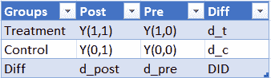
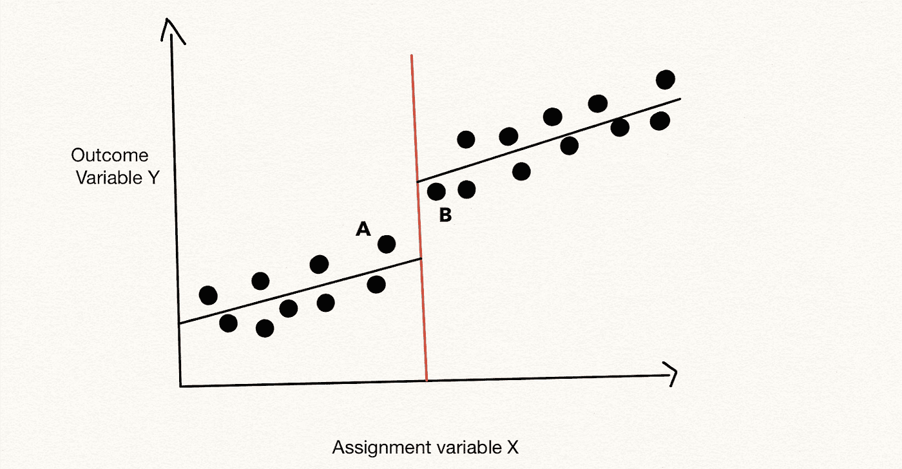
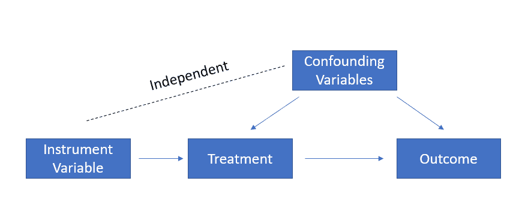

# 因果推理的终极文献综述

> 原文：<https://towardsdatascience.com/the-ultimate-literature-review-for-causal-inference-1b3109a33162?source=collection_archive---------11----------------------->

在 [Unsplash](https://unsplash.com/s/photos/literature-review?utm_source=unsplash&utm_medium=referral&utm_content=creditCopyText) 上由 [Jaredd Craig](https://unsplash.com/@jaredd_craig?utm_source=unsplash&utm_medium=referral&utm_content=creditCopyText) 拍照

## 拥抱因果关系

随着[最近宣布](https://www.nobelprize.org/prizes/economic-sciences/2021/press-release/)2021 年诺贝尔经济学奖，因果推理技术和基于观察数据的实证研究重新引起了研究人员的注意。公告说:

> 今年的获奖者——大卫·卡德、约书亚·安格里斯特和圭多·伊本斯——为我们提供了关于劳动力市场的新见解，并展示了从自然实验中可以得出什么样的因果结论。他们的方法已经扩展到其他领域，彻底改变了实证研究。

在我之前的文章中，我已经讨论了什么是因果推理，为什么我们需要因果推理，以及用于进行因果推理的方法论是什么:

 [## 因果推理:什么、为什么和如何

### 验证决策过程

towardsdatascience.com](/causal-inference-what-why-and-how-d7336b0081ec) 

受诺贝尔奖公告和研究人员开展的学术工作的激励，在本文中，我想重点介绍使用不同因果推理技术的学术背景和行业应用。因果推理在科技公司中被广泛用于支持数据驱动的决策。本文是对结合因果推理和机器学习算法的潜力的探索，将它的用例边界扩展到学术界之外。本文没有深入到技术细节，而是作为一篇高水平的文献综述，提供了更多细节的博客文章和研究论文的链接。我建议你把这篇文章加入到你的阅读清单中，并不时阅读你感兴趣的链接文章。

一般来说，我们可以将与因果推理相关的方法分为三类:

*   **实验/现场研究/随机对照试验**:主动将受试者随机分为对照组和治疗组，以评估治疗和目标结果之间的因果关系。随机性是确保结果可信的关键。
*   **准实验**:基于观察数据的因果推断。由于数据中存在有意或无意的随机性，研究人员需要在特定假设下谨慎选择方法。我将在本文中讨论不同的方法及其用例。
*   **自然实验**:利用自然事件，如[抽奖](https://www.jstor.org/stable/2006669)、[当月出生](https://www.jstor.org/stable/2937954)、[移民法](https://davidcard.berkeley.edu/papers/mariel-impact.pdf)等，将受试者暴露给治疗组和对照组的实证研究。由于随机性主要来源于已经发生的自然事件，研究人员可以用观测数据分析因果联系。

在下面的部分中，我将详细讨论这三个类别。

## 第一部分:实验

**1。A/B 测试**

科技公司最常用的因果推断是 A/B 测试。没有什么比在用户中进行 A/B 测试更有助于营销决策。大量的资源都在辅导 A/B 测试。具体来说，请查看:

*   Udacity 免费课程:[谷歌 A/B 测试](https://www.udacity.com/course/ab-testing--ud257)
*   [Elea MC donnell Feit 的高级 A/B 测试车间](https://eleafeit.github.io/ab_test/)带 R 代码
*   教材:[值得信赖的在线控制实验:A/B 测试实用指南](https://www.amazon.com/Trustworthy-Online-Controlled-Experiments-Practical-ebook/dp/B0845Y3DJV)

了解 A/B 测试的基本知识不足以进行实验。知道你通过实验得到的结果是否有意义和可信是很重要的。俗话说:

> **“糟糕的测试设计比没有设计更糟糕”**

在宣布可靠的结果之前，需要关注某些方面:

*   **总之**，看看[雷华叶博士研究员](https://medium.com/u/4e1d06dd743?source=post_page-----1b3109a33162--------------------------------)关于 A/B 测试的常见陷阱(他写了很多关于 A/B 测试的文章，在下面的章节中会有更多引用):

 [## 运行 A/B 测试的 8 个常见陷阱

### 如何不让你的在线控制实验失败

towardsdatascience.com](/online-controlled-experiment-8-common-pitfalls-and-solutions-ea4488e5a82e) 

*   **如何选择合适的样本量？**这包括在运行实验之前，根据期望的置信水平、功效、效应大小和样本/总体方差，设置正确的样本大小。计算可以通过[在线计算器](https://www.evanmiller.org/ab-testing/sample-size.html#!20;80;5;20;1)完成。要了解更多关于样本大小如何与不同元素和背后的统计数据相关联的细节，请查看我以前的博客帖子:

 [## 样本大小与标准误差、功效、置信水平和效应大小有什么关系？

### 使用图表来展示相关性

towardsdatascience.com](/how-is-sample-size-related-to-standard-error-power-confidence-level-and-effect-size-c8ee8d904d9c) 

*   另一个与样本量相关的问题是**你应该什么时候停止实验**？如果你的回答是每当我看到一个版本很重要时就停止，那么你就面临着常见的统计学错误:P-hacking。在 A/B 测试场景中，它是调用窥视:

 [## 在 AB 测试中解锁偷看

### 像 Optimizely 这样的实验平台是如何忽略 AB 测试中最基本的原则之一的

towardsdatascience.com](/unlocking-peeking-in-ab-tests-7847b9c2f6bb) 

然而，在某些情况下，提前结束实验是有可能的，请看网飞的这篇博文:

 [## 用元分析和最优停止提高网飞的实验效率

### 作者:苏刚和伊恩·约海

netflixtechblog.com](https://netflixtechblog.com/improving-experimentation-efficiency-at-netflix-with-meta-analysis-and-optimal-stopping-d8ec290ae5be) 

*   **运行随机性检查**:重要的是要知道样本是否真正随机分配，以确保我们观察到的结果差异纯粹是由治疗决定的。进行 A/A 测试是非常有用的，通过这种测试，我们给予两组相同的治疗，并期望两组的结果保持相同。查看这些博客文章，了解更多详情:

 [## 什么是 A/A 测试？你为什么要在乎？VWO

### 是否参加考试是一个会引起不同意见的问题。企业在面临决策时…

vwo.com](https://vwo.com/blog/aa-test-before-ab-testing/)  [## 如果 A/A 测试失败，A/B 测试就失去了光彩

### A/A 测试的统计方法

towardsdatascience.com](/an-a-b-test-loses-its-luster-if-a-a-tests-fail-2dd11fa6d241) 

*   **网络效应**:违反 SUVTA(稳定单位治疗值假设)。在进行实验时，我们假设每个用户被随机分配到不同的组，并且一个用户接受治疗不会影响其他用户的结果。这种假设使得动态定价的 A/B 测试，在收盘市场提供促销，社交媒体相关的测试没有吸引力。看看 Lyft 和 LinkedIn 是如何解决这个问题的:

 [## 拼车市场的实验

### 第 1 部分，共 3 部分:网络间的干扰

eng.lyft.com](https://eng.lyft.com/experimentation-in-a-ridesharing-marketplace-b39db027a66e)  [## 社交网络中的 AB 测试挑战

### 脸书和他的同事如何在 AB 测试中克服互联用户的挑战。

towardsdatascience.com](/ab-testing-challenges-in-social-networks-e67611c92916) 

*   **样本比例不匹配(SRM)** ，当治疗组和对照组的样本比例与您的预期不符时，就会发生这种情况，通常为 50/50 的比例。这种不匹配可能是有问题的，因为它会使治疗效果产生偏差。查看这篇博文了解更多详情:

 [## A/B 测试样品比率不匹配的基本指南

### 如果你不能相信一个实验的结果，你就不能相信你基于它做出的决定；你会是…

towardsdatascience.com](/the-essential-guide-to-sample-ratio-mismatch-for-your-a-b-tests-96a4db81d7a4) 

*   处理**多重比较**:在相同时间内进行多重比较时，出现更高**假阳性率**的几率要高得多。建议进行某些调整，以纠正可能导致的偏差:

 [## 多臂实验的陷阱

### 处理多个测试组的显著性

blog.statsig.com](https://blog.statsig.com/pitfalls-of-multi-arm-experiments-445c81ae75d) 

**2。其他实验**

A/B 测试，由于其假设，仅限于某些用例，如网页设计，用户参与度研究等。通过采用后面的类似概念，我们可以将实验扩展到许多其他应用。例如，来自 [Dube 和 Misra (2017)](https://www.nber.org/system/files/working_papers/w23775/w23775.pdf) 的论文对 ZipRecruiter 的客户进行了实验，通过向不同的客户显示不同的价格来估计他们客户的价格弹性。与使用历史数据来估计客户支付意愿的传统机器学习算法相比，现场实验给出了更可靠的结果，因为我们的目标是测量价格和数量之间的因果关系。然而，进行实地试验更费时费钱，尤其是在定价方面。当运行标准实验不可行时，我们寻求其他方法来获得可靠的结果。

## 第 2 部分:当实验不可能时:准实验

**1。差异中的差异(DID)**

当对照组和治疗组之间存在预先存在的差异时，通常使用 DID。在没有任何干预的情况下，我们利用实验前数据来控制这些基线差异。下表总结了 DID:

按作者

虽然它在经济研究论文中被广泛使用，但它在行业中越来越被认可。看看 Airbnb 的这个用例:

 [## 搜索引擎优化的实验与测量

### 利用市场水平的方法来衡量 Airbnb 登陆页面的有效性。

medium.com](https://medium.com/airbnb-engineering/experimentation-measurement-for-search-engine-optimization-b64136629760) 

**2。隆起建模**

隆起建模是因果推理和机器学习的结合。面对防止客户流失的问题，传统的机器学习模型使用一系列特征来预测客户流失的可能性。对于相同的客户群体，在给定相同特征的情况下，提升建模衡量市场活动(待遇)对客户流失可能性的影响。具体来说，它将客户分为四类:

*   确定的事情:永远不会流失的客户
*   **流失原因**:一定会流失的客户
*   **沉睡的狗**:给予治疗(促销、广告等)的客户
*   **:不会流失的客户给予的待遇**

**提升建模有助于预测客户将属于哪个类别，以便他们可以只瞄准**可说服的客户**来充分利用资源。隆起建模中的资源包括:**

*   **快速介绍**

** [## 快速提升建模简介

### 了解提升建模如何改善经典数据科学应用。

towardsdatascience.com](/a-quick-uplift-modeling-introduction-6e14de32bfe0) 

*   防止流失

 [## 企业因果推理:超越流失建模

### 为了更好地策划个性化营销活动，我们将看看因果推断如何帮助解决客户流失问题。

medium.com](https://medium.com/data-from-the-trenches/enterprise-causal-inference-beyond-churn-modeling-78a13a431501) 

*   使用 python 代码

 [## 隆起建模

### 最大化营销活动的增量回报

towardsdatascience.com](/uplift-modeling-e38f96b1ef60) 

*   政治运动

 [## 提升建模如何帮助奥巴马的竞选活动-并能帮助营销人员

### 奥巴马竞选团队的丹尼尔·波特将在旧金山 PAW 展示他的隆起建模作品(3 月…

www.predictiveanalyticsworld.com](https://www.predictiveanalyticsworld.com/machinelearningtimes/how-uplift-modeling-helped-obamas-campaign-and-can-aid-marketers/2613/) 

*   其他更全面的资源:

[因果推理和隆起建模文献综述](http://proceedings.mlr.press/v67/gutierrez17a/gutierrez17a.pdf)

 [## 因果机器学习:个体化治疗效果和提升模型

### 假设我们想要改变世界。不要太浮夸，假设我们想采取一项行动，将影响一个…

johaupt.github.io](https://johaupt.github.io/causal%20machine%20learning/Uplift_ITE_summary) 

**3。回归不连续性(RDD):**

回归不连续性是在**截止点**测量治疗效果，假设位于截止点附近的受试者非常相似，但被随机分配到不同的组:

作者绘制

这种方法源于一篇分析奖学金项目效果的经济研究论文。诺奖得主大卫·卡德利用 RDD，通过对比相邻的两个州:新泽西和宾夕法尼亚，分析了实施[最低工资对就业的影响](https://davidcard.berkeley.edu/papers/njmin-aer.pdf)。在工业领域，Cohen 等人(2016 年)利用历史数据，利用 RDD 估算了优步客户的[价格弹性。更多细节，请点击我的博客:](https://www.nber.org/system/files/working_papers/w22627/w22627.pdf)

 [## 回归不连续设计导论

### 用历史数据进行可靠的因果推断

towardsdatascience.com](/an-introduction-to-regression-discontinuity-design-f55075079def) 

**4。仪器变量**

工具变量是与自变量 X 高度相关，但与因变量 y 不直接相关的变量。

作者绘制

通过测量仪器变量 Z 对结果变量 Y (Z~Y)的影响，并测量治疗 X 与 Z (Z~X)的相关程度，我们可以确定(X~Y)之间的因果联系，而不用担心其他混淆变量。关于这种方法在科技公司的应用和更多细节，请查看 Roblox 的这篇精彩文章:

 [## 使用工具变量的因果推断

### 数据科学家经常发现自己在重复“相关性不是因果关系”这句话。提醒一下是好事…

blog.roblox.com](https://blog.roblox.com/2021/09/causal-inference-using-instrumental-variables/) 

这个教程:

 [## 机器学习遇到工具变量

### 两全其美，第 3 部分:用于仪器选择的 ML

medium.com](https://medium.com/teconomics-blog/machine-learning-meets-instrumental-variables-c8eecf5cec95) 

**5。合成控制:**

当治疗发生在聚集水平(而不是个体水平)并且只有一个治疗病例和几个对照病例时，综合控制非常有用。这篇博文有更多的细节:

 [## 使用综合控制的因果推理:最终指南

### 我们可以只用一个治疗病例和少数对照病例进行因果推断吗？

towardsdatascience.com](/causal-inference-using-synthetic-control-the-ultimate-guide-a622ad5cf827) 

**6。转回:**

如上所述，当有网络效应时，我们不能在个人层面上进行实验，因为用户之间是相互影响的。在这种情况下，我们可以在更集中的级别上运行实验并在集中的级别上进行比较，或者在不同的时间在相同的市场上运行实验，或者两者兼而有之。请查看 DoorDash 的这个示例，了解更多详细信息:

 [## DoorDash 网络效应下的转回测试和随机实验

### 数据科学家 David Kastelman 和机器学习工程师 Raghav Ramesh

medium.com](https://medium.com/@DoorDash/switchback-tests-and-randomized-experimentation-under-network-effects-at-doordash-f1d938ab7c2a) 

**7。局部平均治疗效果(后期):**

局部平均处理效应是由诺贝尔奖获得者 Guido Imbens 和 Joshua Angrist 于 1994 年首先提出的。这在你无法对受试者实施治疗的情况下特别有用。例如，您可以向某些客户发送电子邮件促销，并将他们放入治疗组，但您永远无法确定他们是否打开了电子邮件并看到了促销，除非他们进行了购买。受试者可分为四组:

*   **总是服用者**:无论是治疗组还是对照组，总是得到治疗
*   **从来不接受治疗**:无论是治疗组还是对照组，总是拒绝治疗
*   **编者**:分配到治疗组就接受治疗，反之亦然。
*   **脱网器**:分配到对照组进行处理，反之亦然。

通常我们假设没有挑战者，总是接受者和从不接受者只是对称的。在我们随机分配治疗的实验中，当比较治疗组和对照组之间的结果差异时，我们只能测量意向治疗(ITT)效果，而不能测量平均治疗效果(ATE ),因为总是接受者和从不接受者的存在。在这种情况下，我们可以计算局部平均处理效果，即对编译者的处理效果:

**后期= ITT/编者份额**

正如经济学笑话所说:

> “迟到总比没有好！”

## 第三部分:当实验不可能时:自然实验

自然实验是实证经济学家用来确定因果关系的技术。与临床试验或 A/B 测试不同，自然实验不将受试者分配到治疗组和对照组，并在之后收集他们的结果，它使用自然事件或研究者控制之外的其他因素。自然实验在学术界被广泛使用:

*   *大卫·卡德 1990:* [*马里埃尔升船机对迈阿密劳动力市场的影响*](https://davidcard.berkeley.edu/papers/mariel-impact.pdf)
*   *约书亚·安格里斯特 1990:* [*终生收入与越战时期的征兵彩票:来自社会保障行政记录*](https://www.jstor.org/stable/2006669) 的证据
*   *安格里斯特和克鲁格 1991:* [*义务教育会影响上学和收入吗？*](https://www.jstor.org/stable/2937954)

希望随着最近诺贝尔奖的公布，我们能在行业中看到更多的应用。

## **第四部分:关于因果推理还有什么？**

将因果推理与机器学习和深度学习相结合来改进算法、估计异构治疗效果等的文献更多。，绝对在我的阅读清单上:

*   因果树和因果森林:

 [## 用于异质治疗效果估计的因果树学习

### 分析师通常感兴趣的是一个特定的干预如何在一个观察到的…

www.causalflows.com](https://www.causalflows.com/causal-tree-learning/) 

*   异质处理效果:[SEK hon 教授的工作](http://sekhon.berkeley.edu/)

 [## 不仅仅是平均值:使用机器学习评估异质性治疗效果

### 政策或计划的因果影响如何因人而异？

towardsdatascience.com](/not-merely-averages-using-machine-learning-to-estimate-heterogeneous-treatment-effects-573bf7376a73) 

*   深度学习的因果推理:

 [## 数据科学的因果 ML:使用工具变量的深度学习

towardsdatascience.com](/causal-ml-for-data-science-deep-learning-with-instrumental-variables-96e5b7cc0482) 

[用转移熵和图形神经网络进行因果推理](https://www.researchgate.net/publication/341148262_Multivariate_Time_Series_Forecasting_Based_on_Causal_Inference_with_Transfer_Entropy_and_Graph_Neural_Network)

未完待续…

仅此而已。你的阅读清单中有哪些关于因果推理的文章？下面留言评论！

感谢您阅读本文！这是我所有博客帖子的列表。如果你感兴趣的话，可以去看看！

 [## 我的博客文章库

### 我快乐的地方

zzhu17.medium.com](https://zzhu17.medium.com/my-blog-posts-gallery-ac6e01fe5cc3)  [## 用我的引荐链接加入媒介——朱

### 作为一个媒体会员，你的会员费的一部分会给你阅读的作家，你可以完全接触到每一个故事…

zzhu17.medium.com](https://zzhu17.medium.com/membership) 

或者在 YouTube 上关注我:

 [## 朱

### 你好。欢迎来到我的 Youtube 频道！！！我想用这个空间来分享我的生活、观点、建议和有趣的东西…

youtube.com](https://youtube.com/channel/UCMs6go1pvY5OOy1DXVtMo5A)**