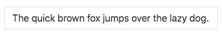
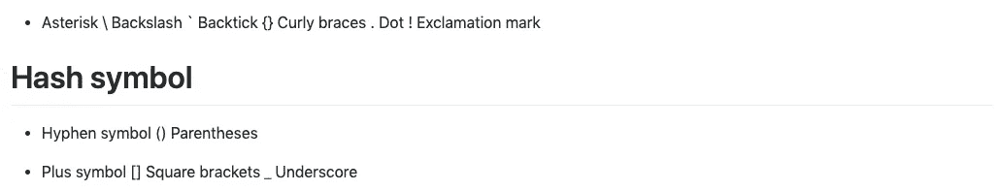
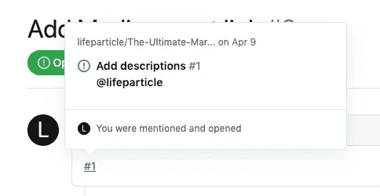

# 终极降价备忘单

> 原文：<https://towardsdatascience.com/the-ultimate-markdown-cheat-sheet-3d3976b31a0?source=collection_archive---------0----------------------->

## 写一篇精彩的自述


克里斯托夫·高尔在 [Unsplash](/s/photos/technology?utm_source=unsplash&utm_medium=referral&utm_content=creditCopyText) 上拍摄的照片

W 帽子降价了？Markdown 是一种使用纯文本格式语法编写富文本(格式化文本)内容的方式。从这篇文章中，你将了解到 Markdown 的所有主要命令，这些命令将帮助你创建一个令人敬畏的 GitHub 自述文件。我将谈论 11 个最常用的降价话题。我还提到了不同的方法，比如使用 HTML 标记来设计自述文件的样式。如果你有兴趣，可以看看 [GitHub](https://github.com/github/html-pipeline/blob/master/lib/html/pipeline/sanitization_filter.rb) 上的 HTML 白名单。

你可以从我的 [GitHub](https://github.com/lifeparticle/Markdown-Cheatsheet) 库下载我在这篇文章中讨论的所有内容。下面我有一个目录，这样你可以很容易地浏览这篇文章。

[标题](#07ed)
[文本样式](#fd13)
[语法高亮显示](#c107)
[对齐方式](#6808)
[表格](#3ac5)
[链接](#6d8e)
[图片](#f407)
[列表](#2c6e)
[按钮(2023 年 1 月 6 日)](#3888)
[横线](#2d4d)
[图表(图](#0155)

# 标题

创建标题有几个选项。我们可以使用 Markdown、HTML 或其他语法来创建我们想要的标题。

首先，我们来谈谈 markdown 语法。

```
# Heading 1
## Heading 2
### Heading 3
#### Heading 4
##### Heading 5
```

第二个选项使用 HTML 语法。

```
<h1>Heading 1</h1>
<h2>Heading 2</h2>
<h3>Heading 3</h3>
<h4>Heading 4</h4>
<h5>Heading 5</h5>
```

最后，我们可以使用另一种语法。此方法仅适用于标题 1 和标题 2。在标题 1 或标题 2 的文本下方添加任意数量的`=`或`-`。

```
Heading 1
=
Heading 2
-
```

现在，让我们看看它在 GitHub 上是什么样子的。


标题

# 文本样式

使用 markdown 语法，我们可以改变文本的样式，包括粗体、斜体、块引号、等宽、下划线、删除线、方框、下标和上标。

我们可以使用两个星号(`**`)、下划线(`__`)或一个 HTML 标签`<strong>`来使文本加粗。为了使文本倾斜，我们可以使用一个星号(`*`)、下划线(`_`)或一个 HTML 标签`<em>`。此外，我们可以使文本同时加粗和倾斜。

```
Bold
**The quick brown fox jumps over the lazy dog.**
__The quick brown fox jumps over the lazy dog.__
<strong>The quick brown fox jumps over the lazy dog.</strong>
Italic
*The quick brown fox jumps over the lazy dog.*
_The quick brown fox jumps over the lazy dog._
<em>The quick brown fox jumps over the lazy dog.</em>
Bold and Italic
**_The quick brown fox jumps over the lazy dog._**
<strong><em>The quick brown fox jumps over the lazy dog.</em></strong>
```

现在，让我们看看它在 GitHub 上是什么样子的。


粗体和斜体文本样式

要创建块引用，我们可以使用大于号`>`。我们可以创建单行或多行批量报价。此外，块引号内的块引号。我们可以在块引用中添加其他文本样式，例如粗体或斜体文本样式。

```
Blockquotes
> The quick brown fox jumps over the lazy dog.

> The quick brown fox jumps over the lazy dog.
> 
> The quick brown fox jumps over the lazy dog.
> 
> The quick brown fox jumps over the lazy dog.

> The quick brown fox jumps over the lazy dog.
>> The quick brown fox jumps over the lazy dog.
>>> The quick brown fox jumps over the lazy dog.

> **The quick brown fox** *jumps over the lazy dog.*
```

现在，让我们看看它在 GitHub 上是什么样子的。


块引号文本样式

我们可以使用 HTML 标签`<samp>`和`<ins>`实现等宽和带下划线的样式。对于删除线样式，我们可以使用两个蒂尔达符号`~~`。

```
Monospaced
<samp>The quick brown fox jumps over the lazy dog.</samp>

Underlined
<ins>The quick brown fox jumps over the lazy dog.</ins>

Strike-through
~~The quick brown fox jumps over the lazy dog.~~
```

现在，让我们看看它在 GitHub 上是什么样子的。


等宽、下划线和删除线文本样式

我们可以使用一个 HTML `<table>`标签来创建一个盒子。

```
Boxed
<table><tr><td>The quick brown fox jumps over the lazy dog.</td></tr></table>
```

现在，让我们看看它在 GitHub 上是什么样子的。



方框文本样式

我们可以使用 HTML 标签`<sub>`和`<sup>`实现下标和上标样式。当你写一个数学公式时，它是有用的。

```
2 <sup>53-1</sup> and -2 <sup>53-1</sup>
```

现在，让我们看看它在 GitHub 上是什么样子的。


下标和上标文本样式

```
Subscript <sub>The quick brown fox jumps over the lazy dog.</sub>
Superscript <sup>The quick brown fox jumps over the lazy dog.</sup>
```

现在，让我们看看它在 GitHub 上是什么样子的。


下标和上标文本样式

# 语法突出显示

我们可以在代码块前后使用一个反勾```来创建下面的视图。

```
A class method is an instance method of the class object. When a new class is created, an object of type `Class` is initialized and assigned to a global constant (Mobile in this case).
```

如你所见，单词 **Class** 被高亮显示。


代码突出显示

我们也可以在代码块前后使用三个反斜线`````来创建下面的视图。

```
```
public static String monthNames[] = {"January", "February", "March", "April", "May", "June", "July", "August", "September", "October", "November", "December"};
```
```


代码突出显示

我们可以添加一个可选的语言标识符来突出显示语法。参考[这个](https://github.com/github/linguist/blob/master/lib/linguist/languages.yml)和[这个](https://github.com/github/linguist/tree/master/vendor) GitHub 文档找到所有有效的关键字。

```
```java
public static String monthNames[] = {"January", "February", "March", "April", "May", "June", "July", "August", "September", "October", "November", "December"};
```
```

现在，让我们看看它在 GitHub 上是什么样子的。


语法突出显示

# 联盟

通过使用 HTML 标签，我们可以调整自述文件的内容。

```
<p align="left">

</p>
```


左对齐

```
<p align="center">

</p>
```


居中对齐

```
<p align="right">

</p>
```


右对齐

现在，让我们对齐文本。

```
<h3 align="center"> My latest Medium posts </h3>
```


居中对齐

# 桌子

让我们创建一个没有标题的表格。

```
<table>
<tr>
<td width="33%">
The quick brown fox jumps over the lazy dog.
</td>
<td width="33%">
The quick brown fox jumps over the lazy dog.
</td>
<td width="33%">
The quick brown fox jumps over the lazy dog.
</td>
</tr>
</table>
```


没有标题的表格

要创建带有标题的表格，我们需要使用破折号来分隔每个标题单元格，并使用管道来分隔列。外部管道是可选的。我们可以使用任意数量的破折号和空格来增加可读性。我们可以用冒号来对齐列。对于左对齐文本，在破折号的左侧使用冒号。对于居中对齐的文本，在破折号的两侧使用冒号。对于右对齐文本，在破折号右侧使用冒号。默认情况下，使用左对齐。

```
| Default | Left align | Center align | Right align |
| - | :- | :-: | -: |
| 9999999999 | 9999999999 | 9999999999 | 9999999999 |
| 999999999 | 999999999 | 999999999 | 999999999 |
| 99999999 | 99999999 | 99999999 | 99999999 |
| 9999999 | 9999999 | 9999999 | 9999999 |
| Default    | Left align | Center align | Right align |
| ---------- | :--------- | :----------: | ----------: |
| 9999999999 | 9999999999 | 9999999999   | 9999999999  |
| 999999999  | 999999999  | 999999999    | 999999999   |
| 99999999   | 99999999   | 99999999     | 99999999    |
| 9999999    | 9999999    | 9999999      | 9999999     |
Default    | Left align | Center align | Right align
---------- | :--------- | :----------: | ----------:
9999999999 | 9999999999 | 9999999999   | 9999999999 
999999999  | 999999999  | 999999999    | 999999999  
99999999   | 99999999   | 99999999     | 99999999   
9999999    | 9999999    | 9999999      | 9999999
```


不同对齐方式的表格

现在并排显示两个表格。

```
<table>
<tr>
<th>Heading 1</th>
<th>Heading 2</th>
</tr>
<tr>

<td>

| A | B | C |
|--|--|--|
| 1 | 2 | 3 |

</td><td>

| A | B | C |
|--|--|--|
| 1 | 2 | 3 |

</td></tr> </table>
```


并排显示两个表格

让我们使用 HTML `<br/>`标签创建一个包含多行的表格。

```
| A | B | C |
|---|---|---|
| 1 | 2 | 3 <br/> 4 <br/> 5 |
```


多行表格

两张桌子并排的另一个例子。

```
<table>
<tr>
<th>Before Hoisting</th>
<th>After Hoisting</th>
</tr>
<tr>
<td>
<pre lang="js">
console.log(fullName); // undefined
fullName = "Dariana Trahan";
console.log(fullName); // Dariana Trahan
var fullName;
</pre>
</td>
<td>
<pre lang="js">
var fullName;
console.log(fullName); // undefined
fullName = "Dariana Trahan";
console.log(fullName); // Dariana Trahan
</pre>
</td>
</tr>
</table>
```


并排显示两个表格

# 链接

我们可以用四种方法创建链接。第一种是使用内嵌样式。第二个使用引用样式，第三个使用相对链接，最后是自动链接。

```
[The-Ultimate-Markdown-Cheat-Sheet](https://github.com/lifeparticle/Markdown-Cheatsheet)
```


内嵌样式

如果你不止一次地使用同一个链接，那么使用引用风格将是有益的，因为你不必每次都写链接，而且更新链接也很容易。此外，您可以使用数字作为参考文本。此外，您可以使用参考文本作为链接文本。

```
[The-Ultimate-Markdown-Cheat-Sheet][reference text]
[The-Ultimate-Markdown-Cheat-Sheet][1]
[Markdown-Cheat-Sheet]

[reference text]: https://github.com/lifeparticle/Markdown-Cheatsheet
[1]: https://github.com/lifeparticle/Markdown-Cheatsheet
[Markdown-Cheat-Sheet]: https://github.com/lifeparticle/Markdown-Cheatsheet
```


参考文体的三种变体

我们也可以用所有相对链接操作数创建相对链接，比如`./`和`../`。

```
[Example of a relative link](rl.md)
```


相对链接的示例

GitHub 可以自动从标准 URL 创建链接。

```
Visit https://github.com/
```


自动链接

# 形象

我们可以使用与链接类似的技术来添加图像。

```

```


内嵌样式

```
![alt text][image]
[image]: https://images.unsplash.com/photo-1415604934674-561df9abf539?ixlib=rb-1.2.1&ixid=eyJhcHBfaWQiOjEyMDd9&auto=format&fit=crop&w=100&q=80
```


参考风格

此外，我们可以使用 HTML `img`标签来添加图像。

```

```


img 标签

我们也可以嵌入 gif 和 SVG。

```

```


GIF 格式

```

```


挽救（saving 的简写）

# 列表

对于列表，我们可以有有序列表和无序列表。

```
1\. One
2\. Two
3\. Three
```


有序列表

现在让我们创建一个包含子项的有序列表。

```
1\. First level
    1\. Second level
        - Third level
            - Fourth level
2\. First level
    1\. Second level
3\. First level
    1\. Second level
```


带有子项的有序列表

要创建一个无序列表，我们可以用星号、加号或减号。

```
* 1
* 2
* 3

+ 1
+ 2
+ 3

- 1
- 2
- 3
```


无序列表

现在让我们创建一个带有子项的无序列表。

```
- First level
    - Second level
        - Third level
            - Fourth level
- First level
    - Second level
- First level
    - Second level
```


带有子项的无序列表

我们也可以使用 HTML 来创建一个列表。

```
<ul>
<li>First item</li>
<li>Second item</li>
<li>Third item</li>
<li>Fourth item</li>
</ul>
```


使用 HTML 的列表

现在让我们创建一个任务列表。我们可以使用连字符后跟`[ ]`来创建一个任务列表，为了标记任务完成，在括号内放一个`x`。

```
- [x] Fix Bug 223
- [ ] Add Feature 33
- [ ] Add unit tests
```


任务列表

# 按钮(2023 年 1 月 6 日)

我们可以添加按钮来描述键盘快捷键。

```
<kbd>cmd + shift + p</kbd>
```


纽扣

```
<kbd> <br> cmd + shift + p <br> </kbd>
```


带空格的按钮

```
<kbd>[Markdown-Cheatsheet](https://github.com/lifeparticle/Markdown-Cheatsheet)</kbd>
```


带链接的按钮

```
[<kbd>Markdown-Cheatsheet</kbd>](https://github.com/lifeparticle/Markdown-Cheatsheet)
```


带链接的按钮

# 水平标尺

我们可以使用三个连字符、星号或下划线来创建一条水平线。

```
---
***
___
```


水平标尺

# 图表(2022 年 7 月 19 日)

您现在可以使用 [Mermaid](https://github.com/mermaid-js/mermaid) 来包含图表。它支持流程图、序列图、甘特图、类图、状态图、饼图、用户旅程图等图表。这是一个饼图的例子。阅读更多关于 GitHub 的信息。

```

```


圆形分格统计图表

# 数学表达式(2022 年 7 月 19 日)

您现在可以使用 [mathjax](https://www.mathjax.org/) 来包含图。你可以在 [GitHub](https://docs.github.com/en/get-started/writing-on-github/working-with-advanced-formatting/writing-mathematical-expressions) 上了解更多。我们可以使用`$`符号显示内联，使用`$$`符号显示数学表达式。下面是一个内联数学表达式的示例:

```
This is an inline math expression $x = {-b \pm \sqrt{b^2-4ac} \over 2a}$
```


内嵌数学表达式

下面是一个数学表达式块的例子:

```
$$
x = {-b \pm \sqrt{b^2-4ac} \over 2a}
$$
```


作为块的数学表达式

# 多方面的

我们可以在一个`.md`文件中包含注释。

```
<!--
Lorem ipsum dolor sit amet
-->
```

我们可以使用反斜杠来转义文字字符。在逃跑之前。

```
*   Asterisk
\   Backslash
`   Backtick
{}  Curly braces
.   Dot
!   Exclamation mark
#   Hash symbol
-   Hyphen symbol
()  Parentheses
+   Plus symbol
[]  Square brackets
_   Underscore
```



逃跑前

逃脱后。

```
\*   Asterisk
\\   Backslash
\`   Backtick
\{}  Curly braces
\.   Dot
\!   Exclamation mark
\#   Hash symbol
\-   Hyphen symbol
\()  Parentheses
\+   Plus symbol
\[]  Square brackets
\_   Underscore
```


逃跑后

我们还可以在我们的`.md`文件中包含[表情符号](https://gist.github.com/rxaviers/7360908)。

```
:octocat:
```


章鱼表情符号

我们可以通过键入`@`和他们的用户名或团队名称来提及一个人或团队。

```
@lifeparticle
```


提及某人

我们还可以通过键入`#`在存储库中调出一个建议问题和拉请求的列表。

```
#
```



参考问题和拉式请求

# 比特桶

Bitbucket 支持 [READMEs](https://bitbucket.org/tutorials/markdowndemo/src/master/) 的降价。另外，[创建一个目录](https://support.atlassian.com/bitbucket-cloud/docs/add-a-table-of-contents-to-a-wiki/)。

# Azure DevOps 项目 wiki

Azure DevOps 支持对[项目 wiki](https://learn.microsoft.com/en-us/azure/devops/project/wiki/markdown-guidance?view=azure-devops) 的降价。

# 工具

有各种各样的 Markdown 工具可以帮助你更快地构建一个漂亮的 GitHub 自述文件。

1.  创建一个内容减价表— [GitHub](https://github.com/ekalinin/github-markdown-toc)
2.  创建一个空的减价表— [表生成器](https://www.tablesgenerator.com/markdown_tables)
3.  将 Excel 转换为降价表— [表转换](https://tableconvert.com/)
4.  Sublime Text 3 的降价预览— [Packagecontrol](https://packagecontrol.io/packages/MarkdownPreview)
5.  降价预览 Visual Studio 代码— [Marketplace](https://marketplace.visualstudio.com/items?itemName=shd101wyy.markdown-preview-enhanced)

恭喜你！现在你知道如何为你的下一个项目创建一个精彩的自述文件了。我希望你学到了新东西。现在来看看 GitHub 的官方文档。编码快乐！