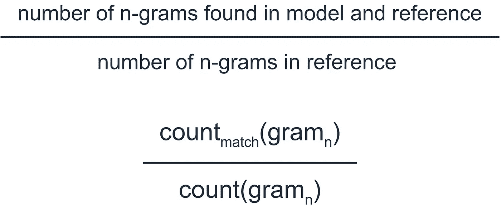
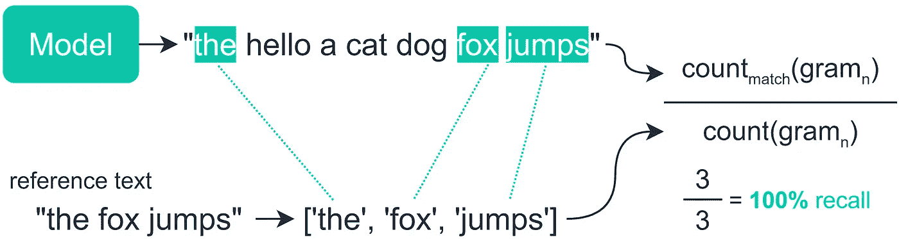
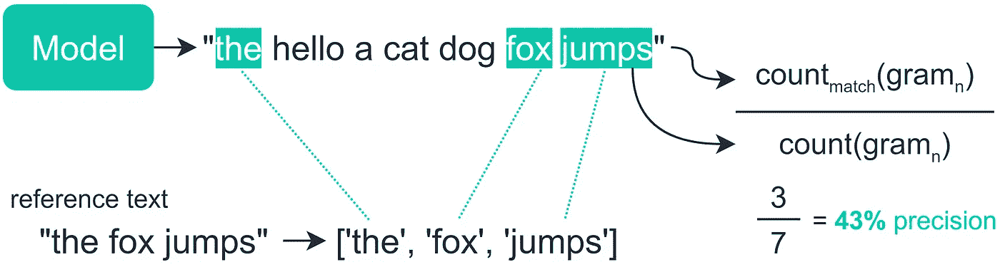
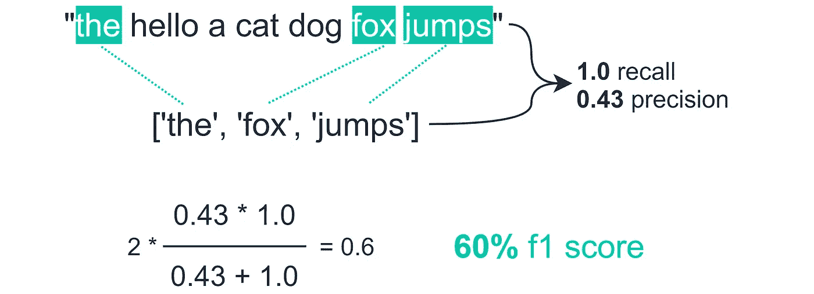
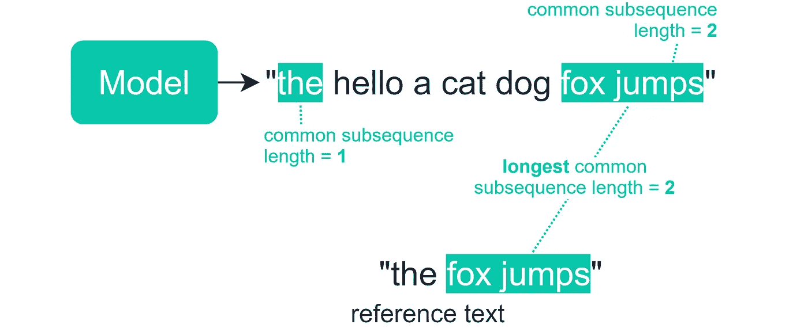
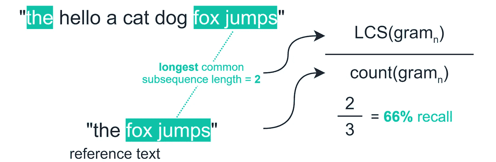
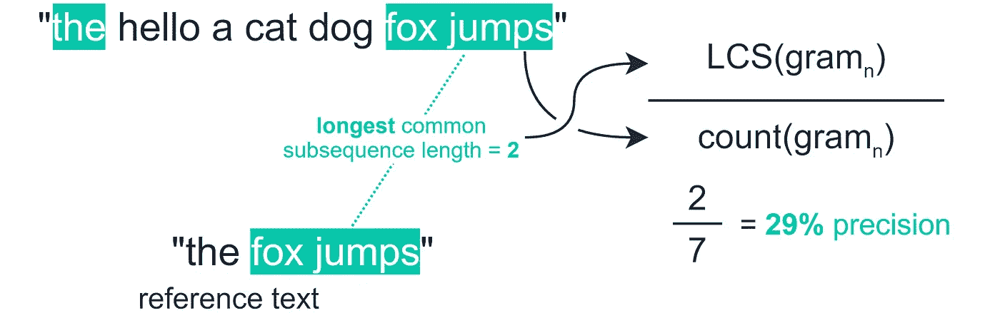
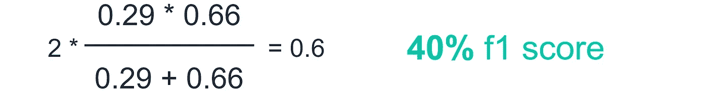
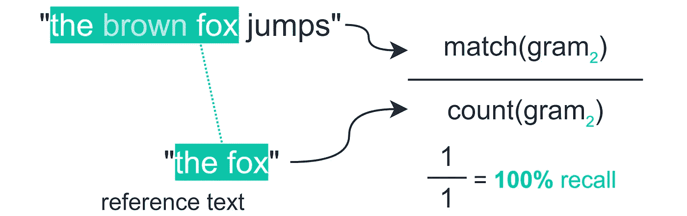
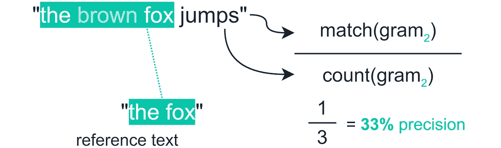

# NLP 中的终极性能指标

> 原文：<https://towardsdatascience.com/the-ultimate-performance-metric-in-nlp-111df6c64460?source=collection_archive---------0----------------------->

## 再也不用担心语言模型的准确性了


Wynand van Poortvliet 在 [Unsplash](https://unsplash.com?utm_source=medium&utm_medium=referral) 上拍摄的照片

M 当我们处理语言的时候，衡量我们模型输出的结果变得更加复杂。

对于许多基于自然语言处理的问题来说，这一点很快就变得非常清楚——在处理语言摘要或翻译时，我们如何测量基于语言的序列的准确性？

为此，我们可以使用面向回忆的替角进行 Gisting 评估(ROUGE)。幸运的是，这个名字看起来很复杂——非常容易理解，甚至更容易实现。

让我们直入主题吧。

```
**Contents****> What is ROUGE**
  - ROUGE-N
  - Recall
  - Precision
  - F1 Score
  - ROUGE-L
  - ROUGE-S
  - Cons**> In Python** - For Datasets
```

# 胭脂是什么

ROUGE 实际上是一组指标，而不仅仅是一个指标。我们将从 ROUGE-N 开始，介绍最有可能使用的主要产品。

## 胭脂

ROUGE-N 测量我们的模型生成的文本和“参考”之间匹配的“n-grams”的数量。

n 元语法只是一组标记/单词。一元语法(1-gram)由一个单词组成。二元模型(2-gram)由两个连续的单词组成:

该引用是一个人为的最佳输出——因此对于自动摘要来说，它将是我们输入文本的一个人为的摘要。对于机器翻译，它将是我们输入文本的专业翻译。

对于 ROUGE-N，N 表示我们正在使用的 N 元语法。对于 ROUGE-1，我们将测量模型输出和参考之间的单字匹配率。

ROUGE-2 和 ROUGE-3 将分别使用二元模型和三元模型。

一旦我们决定使用哪一个 N——我们现在决定是否要计算 ROUGE 召回率、精确度或 F1 分数。

## 回忆

**recall** 统计在模型输出和引用中发现的重叠 n 元语法的数量——然后将这个数量除以引用中 n 元语法的总数。看起来是这样的:



用简单英语(上图)和简化符号(下图)计算单个样本的 ROUGE-N 召回指标

这对于确保我们的模型能够**捕获引用中包含的所有信息**很有帮助，但对于确保我们的模型不仅仅是推出大量的单词来匹配召回分数来说，这就没那么好了:



我们的模型可以输出我们词汇表中的每一个单词，并且每次都能得到一个完美的回忆分数

## 精确

为了避免这种情况，我们使用**精度**指标，其计算方法几乎完全相同，但我们不是除以**参考** n 克数，而是除以**模型** n 克数。


因此，如果我们将它应用到前面的例子中，我们得到的精度分数仅为 **43%** :



## f1-分数

现在我们既有了召回值又有了精度值，我们可以用它们来计算我们的 ROUGE F1 分数，如下所示:


让我们再次将它应用到我们之前的例子中:



这为我们提供了模型性能的可靠度量，它不仅依赖于模型捕获尽可能多的单词(回忆)，还依赖于不输出不相关的单词(精度)。

## 胭脂-L

ROUGE-L 测量我们的模型输出和参考之间的最长公共子序列(LCS)。这意味着我们计算两者之间共享的最长令牌序列:



这里的想法是，共享序列越长，表明两个序列之间越相似。我们可以像以前一样应用我们的召回和精度计算——但是这次我们用 **LCS** 替换**匹配**:



我们的 LCS 召回计算



精度基本相同，但是我们将总的 n-gram 计数从引用切换到模型



最后，我们像之前一样计算 F1 分数

## 胭脂-S

我们要看的最后一个 ROUGE 度量是 ROUGE-S——或 skip-gram 并发度量。

现在，这个指标似乎比 ROUGE-N 和 ROUGE-L 已经介绍过的要少得多——但是了解它的作用是值得的。

使用 skip-gram 度量允许我们从参考文本中搜索连续的单词，这些单词出现在模型输出中，但是被一个或多个其他单词分隔开。

因此，如果我们采用二元模型“the fox ”,我们最初的 ROUGE-2 度量只有在模型输出中找到这个确切的序列时才会与之匹配。如果模型输出的是“棕色狐狸”，那么就找不到匹配。

ROUGE-S 允许我们在 n-gram 匹配中增加一定程度的宽大。对于我们的二元模型示例，我们可以使用 skip- **bi** gram 度量进行匹配:



我们计算召回率就像我们对 ROUGE-N 做的一样——但是我们对匹配之间出现的任何单词进行了宽大处理



这同样适用于我们的精度指标

在计算了召回率和精确度之后，我们也可以像之前一样计算 F1 的分数。

## 骗局

ROUGE 是一个很好的评估指标，但是也有一些缺点。特别是，ROUGE 并不迎合具有相同意思的不同单词——因为它测量的是句法匹配而不是语义。

因此，如果我们有两个意思相同的序列，但使用不同的词来表达这个意思，它们可以被分配一个低的胭脂分数。

这可以通过使用几个参考文献并取平均分数来稍微抵消，但这不会完全解决问题。

尽管如此，对于评估机器翻译和自动摘要任务来说，这是一个很好的指标，并且在两者中都很受欢迎。

# 在 Python 中

幸运的是，由于有了 [Python rouge 库](https://github.com/pltrdy/rouge)，用 Python 实现这些指标非常容易。

我们可以通过 pip 安装库:

```
pip install rouge
```

根据参考对我们的模型输出进行评分就像这样简单:

`get_scores`方法返回三个指标，使用一个词元(ROUGE-1)和一个词元(ROUGE-2)的 ROUGE-N 和 ROUGE-L。

对于其中的每一个，我们接收 F1 分数`f`、精度`p`和召回`r`。

## 对于数据集

通常，我们会为一组预测和引用计算这些指标——为此，我们将预测和引用分别格式化为预测和引用列表——然后我们将`avg=True`参数添加到`get_scores`,如下所示:

这就是本文关于理解和实现用于测量自动摘要和机器翻译任务性能的 ROUGE 指标的全部内容。

我希望你喜欢这篇文章，如果你有任何问题或建议，请通过 [Twitter](https://twitter.com/jamescalam) 或在下面的评论中告诉我！如果你对更多类似的内容感兴趣，我也会在 YouTube 上发布。

感谢阅读！

# 参考

C.林， [ROUGE:一个自动评估摘要的软件包](https://www.aclweb.org/anthology/W04-1013.pdf) (2004)，ACL

[🤖带变压器的 NLP 课程](https://bit.ly/nlp-transformers)

**除另有说明外，所有图片均出自作者之手*