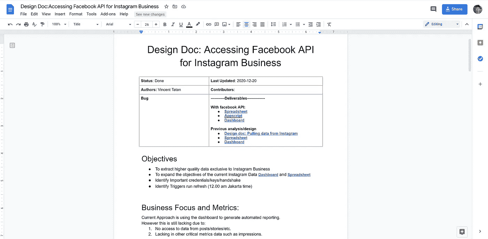
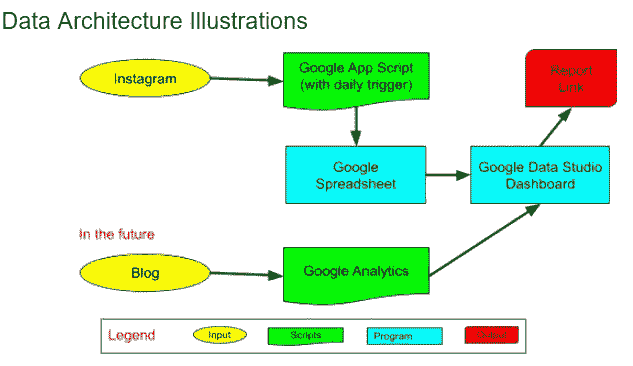

# 设计文档对数据科学家不可否认的重要性

> 原文：<https://towardsdatascience.com/the-undeniable-importance-of-design-docs-to-data-scientists-421132561f3c?source=collection_archive---------6----------------------->

## [办公时间](https://towardsdatascience.com/tagged/office-hours)，给有抱负的数据科学家的建议

## 用清晰的目标和沟通建立概念灯塔

来源: [Unsplash](https://unsplash.com/photos/SHA85I0G8K4)

# 问题陈述

> 我如何确保我的数据项目成功？
> 
> 我如何与利益相关者沟通并实现对他们的影响？

我看到许多崭露头角的数据科学家和人工智能初创公司着手他们的新项目，专注于[创新的深度学习算法，而没有考虑](/the-cold-start-problem-with-artificial-intelligence-49938ed3f612)适当的单元测试和基本的代码健康实践。

虽然快速投入到你的项目中有时是值得的。大多数时候，它会导致没有人使用的代码。一夜成名但经不起时间考验的应用。

## 我最大的错误

> 让我们假设你收到了一个新项目。理解了问题之后，您开始编写代码，希望能够快速解决您的项目。
> 
> 但是后来你意识到你引入了很多 bugs 开源软件包被破坏，由于大小而中断，由于缺乏技术文档而重复实验。绝望中，你花了几个星期排除故障。
> 
> 一旦你完成了，你意识到你新建立的模型对于工程团队来说太复杂了。心怀不满，你花了一整夜来实现一个简单的模型，这个模型对团队来说已经足够了
> 
> —从作者的经历来说—

如果我能更早地与我的项目领导分享我的目标，我本可以节省很多时间。

交流对问题的共同理解比解决问题本身更重要。理解什么是重要的将会是经营成功项目的决定性因素。

否则，后果可能是可怕的。

## 网飞的故事价值 100 万美元的闪亮宝石

网飞向将网飞建议均方根误差(RMSE)提高约 10%的获胜团队奖励 100 万美元。但是网飞没有采纳，因为算法太复杂，无法支持！

[结果，网飞浪费了 100 万美元来奖励一个他们无法采用的机器学习模型。](https://www.wired.com/2012/04/netflix-prize-costs/)

如果在竞赛目标上与采用的工程团队有共同的目标和统一的沟通，这就不会发生。

> 因此，为什么设计文档很重要！

# 为什么制作设计文档很重要

> 设计文档应该是灯塔。
> 
> 灯塔是目标的信号。
> 
> 每艘登船都需要一座灯塔，以便在黑暗中航行。
> 
> 汹涌的海浪可能会分散船的注意力，使它绕道而行。但是有了灯塔，每个船长都有权力把船驶向目的地。

同样，每个数据科学项目都像是在概念的黑暗中航行。您可以构建您的分析，并在整个项目中重复您的工作。但是如果没有共同的目标和方向(例如:灯塔),你将永远不会产生真正的影响。

设计文档在以工程为中心的文化中被广泛使用，如亚马逊和谷歌。**它旨在分享所有计划的想法、进展和结果，以强调共同的目标和影响。**

**它还作为一盏指路明灯，让其他人分享知识，以了解并建立项目来满足他们的需求。**因此，这是你巩固自己对团队的巨大贡献的一项关键技能。

> 因此，创建一个设计文档就形成了一个概念性的灯塔，让你明白你应该如何克服短视，消除时间下沉，并提供共享的影响。

# 如何构建设计文档

1.  **目标:**你为什么要建这个？
2.  **最小可行产品:**对你的受众来说，什么是重要的？
3.  **研究和探索:**有哪些时间和资源可用？
4.  **里程碑和成果:**能够实现什么，已经实现了什么？
5.  **TL:DR(太久没看):**有什么总结？

作为一个例子，你可以查看这个设计文档 [**收集并分析 Yayasan Merajut Hati(YMH)* insta gram 数据**](https://docs.google.com/document/d/12ridJk1BtL-alomt3XXnLG_GZ68NzP6C82Ihy3M8fA8/edit#) **。**

> **注:**我在[Yayasan Merajut Hati](https://www.instagram.com/yayasanmerajuthati/)(YMH)做志愿者，这是一个非营利组织，旨在提高疫情期间印尼年轻人的精神健康意识。这些是我为 YMH 建造的工程。
> 
> * [建立 Instagram 业务的最快分析方法](/the-quickest-analytics-to-build-your-instagram-business-b7b3c5d68056)
> 
> * [为 Instagram 业务访问脸书 API](/accessing-facebook-api-for-instagram-business-568cfe3efb77)

[我为 Yayasan Merajut Hati](https://docs.google.com/document/d/12ridJk1BtL-alomt3XXnLG_GZ68NzP6C82Ihy3M8fA8/edit#) 创建的样本设计文档(来源于作者)

# 目标

> 你为什么要建这个？

目标是任何项目的基础。是一个公司成功而其他公司不成功的最大原因。

## 最成功的公司都有明确直接的目标。

*   谷歌:组织世界上的信息，并使其普遍可用。
*   脸书:给予人们建设社区的力量，让世界更加紧密
*   **AirBnB:** 创造一个任何人都可以属于任何地方的世界，专注于创造一个端到端的旅行平台，处理你旅行的每一部分

同样，你的目标应该是清晰和简明的。

**部分样品包括:**

*   提取 YMH 营销所需的高质量 Instagram 数据。
*   构建本科生课程推荐系统。

# 最小可行产品

> 对你的观众来说什么是重要的？

最小可行产品(MVP)定义了项目的核心价值。你依靠北极星来决定你的项目是否成功。

**MVP 显示详细描述，如:**

*   [ [YMH](https://docs.google.com/document/d/12ridJk1BtL-alomt3XXnLG_GZ68NzP6C82Ihy3M8fA8/edit#heading=h.1lqdvjwrmd5t) ]建立 Instagram 功能，能够满足以下业务重点和指标。业务重点和指标包括…
*   建立推荐系统，用户可以登录，购买和增加 XX%的销售比旧模型(AB 测试)。

MVP 应该是现实的而不是理想化的。它应该是保守的而不是雄心勃勃的。如果其他的都失败了，知道你达到了你的 MVP 是一个巨大的成就。

然后，您可以进一步迭代项目，以实现您的扩展目标。

**注意**:这需要反馈以及与将要使用和维护这个项目的利益相关者的频繁沟通。一旦您拥有了共享的 MVP，只要您的项目实现了它，您就可以安全地宣布成功了。

# 研究和探索

> 有什么时间和资源可以利用？

研究和探索定义了建立你的 MVP 的方法。

**这需要开放式头脑风暴，包括:**

*   你打算用什么工具？为什么？
*   你计划用多长时间来完成这件事？
*   【对于 ML 项目】你做什么探索性数据分析(EDA)？为什么这很重要？你应该建立什么模型？为什么？

当您的解决方案未能满足 MVP 时，快速研究和探索将使您能够快速切换解决方案。

# 里程碑和成果

> 【里程碑】能实现什么？
> 
> 【成果】取得了哪些成果？

里程碑和结果定义了您为实现 MVP 而计划或已经完成的实际工作。

里程碑为你的探索和研究设定了动态的短期目标。一旦你做了实际的工作，里程碑就会变成结果。

从建立里程碑开始，分解你的 MVP。一旦你完成了里程碑，记录结果。

[**在 YMH 样本**](https://docs.google.com/document/d/12ridJk1BtL-alomt3XXnLG_GZ68NzP6C82Ihy3M8fA8/edit#heading=h.1lqdvjwrmd5t) **中，我起草了以下插图作为我的里程碑/成果。**

数据架构示例的里程碑/结果([来源于作者](https://docs.google.com/document/d/12ridJk1BtL-alomt3XXnLG_GZ68NzP6C82Ihy3M8fA8/edit#))

# TL:DR →太久没看了

> 总结是什么？

**TL:DR 是快速总结结果和分享知识的好方法**。它给了你的利益相关者一块金块，让他们决定是否应该继续阅读。

**TL:DR 最大的好处就是尊重对方的时间。**它可以节省利益相关者的时间，同时让他们了解您的实际工作和影响。

***注:*** *按顺序来说，我会把 TL:DR 放在 objective 之后。这允许利益相关者直接查看摘要，以决定进一步投入时间阅读。*

# 结论:建立一个概念性的灯塔

你应该根据受众的需求来设计产品。这将迫使你[建立一个人们使用和维护的数据分析项目](/intro-to-mlops-ml-technical-debt-9d3d6107cd95)。

因此，创建一个设计文档形成了一个概念性的灯塔，以了解你应该如何导航的短视期，消除时间下沉，并提供共享的影响。

## 通过这篇文章，我希望你了解了设计文档:

1.  目标:你为什么要建这个？
2.  最低可行产品:对你的受众来说，什么是重要的？
3.  研究和探索:有什么时间和资源可以利用？
4.  **里程碑和成果:**能够/已经实现了什么？
5.  **TL:DR(太长不看):**有什么总结？

索利·德奥·格洛丽亚

# 来自作者的更多提示:

*   [我喜欢带在线硕士学习数据科学的 5 个原因](https://medium.com/datadriveninvestor/5-reasons-why-i-enjoy-taking-online-masters-to-learn-data-science-bba05eb5641c)
*   [如何构建您的终极数据科学投资组合](/how-to-build-your-ultimate-data-science-portfolios-ea0414d79a72)
*   [数据分析很难…以下是你如何超越的方法](/data-analytics-is-hard-here-how-you-can-excel-aa2a99d0fad0)
*   [写作分析学的隐藏宝石](/the-hidden-gems-of-writing-analytics-6db78fad5a51)

# 关于作者

我用 ML @ Google 对抗网络钓鱼。

我热爱我的工作，因为我使用先进的 ML 算法和 MLOps 来保护 Chrome、Gmail 和 Android 用户免受钓鱼攻击，窃取弱势群体的生活积蓄。

我也是《走向数据科学媒体》的撰稿人，为全球 100 多万观众的有志 ML 和数据从业者提供指导。

在我的空闲时间，我写中型文章，在 Kaggle 上编码，为铁人三项/自行车旅行训练。

最后，请通过 [LinkedIn](http://www.linkedin.com/in/vincenttatan/?source=post_page---------------------------) 、 [Medium](https://medium.com/@vincentkernn?source=post_page---------------------------) 或 [Youtube 频道](https://www.youtube.com/user/vincelance1/videos?source=post_page---------------------------)联系文森特