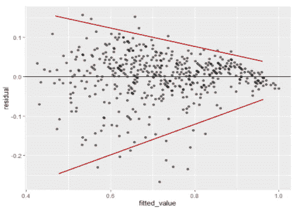

# 剩余情节的不合理丰富

> 原文：<https://towardsdatascience.com/the-unreasonable-richness-of-residual-plot-17f9104a687a?source=collection_archive---------33----------------------->


照片由 [Unsplash](https://unsplash.com/s/photos/grains?utm_source=unsplash&utm_medium=referral&utm_content=creditCopyText) 上的[实体模型图形](https://unsplash.com/@mockupgraphics?utm_source=unsplash&utm_medium=referral&utm_content=creditCopyText)拍摄

## 仅使用一个图检查除一个线性回归假设之外的所有假设

在机器学习中，残差是实际目标值和拟合值之间的“差值”。残差是回归问题中的一个重要概念。它是任何回归度量的基础:均方误差(MSE)，平均绝对误差(MAE)，平均绝对百分比误差(MAPE)，你能想到的。


重温你的记忆(作者图片)

残差在线性回归中甚至更为关键。它们包含丰富的信息，尤其是当作为残差图呈现时。通过这篇博客，我将向你展示，我们可以通过查看残差图来验证几乎所有的方法假设。

# 残差图


线性回归中的残差(图片由作者提供)

毫无疑问，残差图是显示残差的图。我们可以根据如下简单定义得出一个:

*   在简单线性回归(具有 1 个预测值的回归)的情况下，我们将**预测值**设置为 x 轴，将残差设置为 y 轴
*   在多元线性回归的情况下(预测因子> 1 的回归)，我们将**拟合值**设置为 x 轴，将残差设置为 y 轴

# 线性回归假设

回想一下，线性回归有如下四个假设:

1.  预测值和目标变量之间的线性关系，意味着模式必须是直线形式(或多元线性回归情况下的超平面)
2.  同方差，即残差的恒定方差
3.  独立观察。这实际上相当于独立残差
4.  残差的正态性，即残差服从正态分布

# 使用残差图检查 4 个假设中的 3 个

我们可以通过残差图检查上面的前三个假设！

**假设 1:线性关系**

如果残差图中没有*可识别的非线性模式，则该假设有效。让我们考虑下面的例子。*


剩余地块 1(图片由作者提供)

在上面的例子中，假设被违反了，因为 U 形模式是明显的。换句话说，真实的关系是非线性的。

**假设 2:恒定方差**

如果残差相对于零水平线在残差图的整个 x 轴上均匀分布(大约相同的距离),则该假设有效。让我们考虑下面的例子。



剩余地块 2(图片由作者提供)

在上面的例子中，假设被违反了，因为方差在更大的拟合值上变得更小。

**假设 3:独立观察**

如果在残差图中的几个连续残差之间没有*或*辨别模式，则该假设有效。让我们考虑下面的例子。


剩余地块 3(图片由作者提供)

在上述情况下，假设被违反，因为在连续残差之间存在辨别模式(两者都是负斜率的线性)。

# 额外收获:使用 ggplot2 绘制残差图

在本节中，我将分享如何在 r 中使用 ggplot2 库绘制残差图。为此，我们将使用流行的 Auto-MPG 数据集(可在此处下载)。

```
# import libraries
library(dplyr)
library(ggplot2)# read data
mpg <- read.csv('auto-mpg.csv')# drop rows with NA values
mpg <- mpg %>% drop_na.()# build and train linear regression model mpg = b0 + b1 * displacement
mpg_lm <- lm(mpg ~ displacement, mpg)# store as dataframe for plotting
res_df <- data.frame(displacement=mpg$displacement, residual=resid(mpg_lm))# plotting
ggplot(res_df, aes(x=displacement, y=residual)) +
  geom_point(alpha=0.5) +
  geom_hline(yintercept = 0, color = 'black') +
  geom_smooth(color = 'blue') +
  labs(title='Residual from Regressing MPG using Displacement',
       subtitle = 'Data: Auto-MPG dataset')
```


# 在你走之前

在这篇文章中，我们通过看残差回到基础。事实证明，残差，特别是以残差图的形式，提供了相当丰富的信息；我们可以通过查看残差图来验证 4 个线性回归假设中的 3 个。

希望在读完这篇文章后，我们能更好地理解残差的重要性。总而言之，感谢阅读，大家在 [LinkedIn](https://www.linkedin.com/in/pararawendy-indarjo/) 上和我连线吧！👋