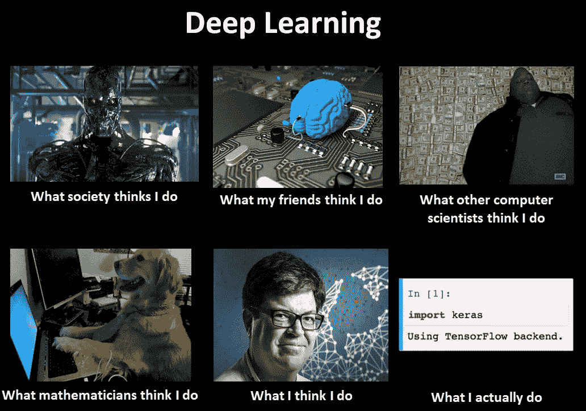

# 机器学习的无名英雄在数据操作中

> 原文：<https://towardsdatascience.com/the-unsung-heroes-of-machine-learning-are-in-data-operations-1f28fedff967?source=collection_archive---------31----------------------->

甚至迷因也认识到建模是容易的部分。[来源](https://www.kdnuggets.com/2017/08/first-steps-learning-deep-learning-image-classification-keras.html)

# 不要睡在数据操作上

当大多数人想到深度学习从业者时，他们会想到那些使用博士期间学到的特殊能力对机器学习模型耳语的数据科学家。

虽然对一些组织来说这可能是真的，但大多数实际的深度学习应用程序的现实更加平庸。现在模型性能的最大决定因素是数据，而不是模型代码。而当数据至上的时候，**数据运营**就成了你 ML 团队最重要的部分。

# 数据操作介绍

从根本上说，数据运营团队负责维护和改进模型训练所依据的数据集。他们的部分职责包括:

*   确保数据和标签干净一致。训练集中的坏数据意味着模型将在训练时被混淆，并学习错误的东西。测试集中的坏数据意味着您不能相信您的模型性能度量是准确的。
*   将 ML 系统中的错误追溯到导致这些错误的数据点(或缺少数据点)。对错误情况的良好理解使得修复它们变得更加容易。
*   基于当前的优先级来获取、标记和添加数据到数据集:修复关键的客户问题，解决模型性能中的缺陷，或者将模型功能扩展到新的任务/领域。

数据操作团队成员通常是他们领域的专家。想象一下，一个能一眼分辨出塑料和玻璃容器的回收专家，一个能把中文翻译成葡萄牙文的翻译，或者一个能导航核磁共振成像并告诉你病人是否患有癌症的放射学家。

数据运营人员也可以来自咨询或商业背景。在处理任何操作任务时，尤其是处理数据时，有条不紊会有所帮助。对业务目标和技术能力的了解也可以告知如何最好地对数据监管进行优先排序，以改进 ML 系统。

在数据运营团队中，可以根据他们负责的数据/模型类型(例如，在自动驾驶应用程序中，不同的队友拥有雷达、激光雷达和图像检测系统)或根据他们服务的客户/地理位置(例如，一名团队成员负责北美部署，另一名团队成员负责 APAC)来分配团队成员。

数据操作团队成员通常会与离岸标签团队合作，以帮助扩展数据标签的吞吐量。离岸团队处理更简单但需要更多人工的任务。例如，调整边界框标签以精确适应各种对象，或者标记苹果和橙子的图片。相比之下，内部数据操作团队成员充当专家，他们定义标记说明，检查离岸团队的工作，并决定如何处理困难或模糊的场景。数据操作团队最适合需要少量高质量工作和相对较短周转时间的工作。离岸团队适合大量简单的工作，质量不如数量重要的任务，或者标记吞吐量比等待时间更重要的情况。

# 为什么是现在？

在 90 年代末和 21 世纪初，机器学习在许多网络公司中找到了许多应用。与手动调整的算法相比，模型可以更好地完成推荐、排名和预测等任务。

然而，这些 ML 模型是精确的和可扩展的，因为它们能够从大量的数据中学习，这些数据基本上是免费生成的。推荐和排名模型可以根据用户浏览网站时实际点击的记录数据进行训练。预测模型可以使用过去的数据预测未来，然后随着时间的推移验证这些预测的准确性。

换句话说，数据本质上是无限的，并且是自动生成的。只要数据是干净的，并且保持流动，您就可以在模型上工作。改进这些模型管道的大部分工作包括缩放数据管道和确保数据一致性。模型精度的提高主要通过特征工程和超参数调整来实现。所有数据和 ML 工程师能做的事情！

深度学习的出现引入了强大的模型，这些模型在涉及图像、音频和文本等非结构化数据的任务中运行良好。虽然[一些](https://ai.googleblog.com/2017/07/revisiting-unreasonable-effectiveness.html) [大型](https://medium.com/syncedreview/facebook-model-pretrained-on-billions-of-instagram-hashtags-achieves-sota-results-on-top-1-imagenet-ae8113bb3145) [公司](https://arxiv.org/abs/2005.14165)仍然能够在这些领域免费获得大量数据，但其他人都需要人类手动标记这些数据，然后才能在其上训练机器学习模型，这需要很长时间。

因此，组织收集和记录的数据比他们能够标注的要多。确定要标注什么数据，快速标注大量数据，然后保证数据和标签的干净和准确，这些都需要很大的努力。深度学习应用看起来更像是自动化问题，而不是像以前的模型那样是一个预测/预测问题。

仍然需要努力将您的管道扩展到更大的模型和数据集。然而，在建模方面，很容易从货架上取下最先进的预训练模型，在自己的数据集上对其进行微调，并获得相当好的性能。模型性能的提高不再来自特征工程或超参数调整。大部分收益来自于修正标记错误的数据或收集更多模型有困难的挑战场景的例子。这是数据运营团队可以做得非常好的工作！吴恩达将这种范式描述为以数据为中心的人工智能，而不是以模型为中心的人工智能。**因此，数据和 ML 工程师不再是关注的中心，数据运营经理现在最有能力通过适当的数据监管来改善他们的 ML 管道。**

# 为成功设置数据操作

## 协作，而不是替代

现代深度学习应用程序用于自动化现有的工作流程。一个团队会希望使用一个 ML 模型来完成一部分已经由人工操作人员完成的工作。然而，在细致入微或高风险的任务中(如阅读 MRI 扫描以检测癌症)，建立一个你可以相信像人类专家一样准确的 ML 模型是极其困难的。

因此，许多成功的深度学习应用将数据操作团队[与 ML 模型](https://hbr.org/2018/07/collaborative-intelligence-humans-and-ai-are-joining-forces)结合起来**协同工作**。为了解释这一点，让我们想想当你带来一个新同事时你会怎么做。当一个新的人类同事开始在一个数据操作团队工作时，你给他们一些关于如何工作的基本指导，让他们在一些简单的场景中工作，然后检查他们的工作并给他们反馈如何更好地工作。随着他们的工作越来越好，可以相信他们会从事更艰巨的任务，或者在新项目上承担更多责任，并最终培训新同事。

使用人工智能模型就像带来一个“人工智能同事”当你的新人工智能同事在你的团队中开始工作时，你组装一个训练数据集来给出模型(基本指令)，在一个受限制的范围内部署一个初始模型(从一些简单的场景开始)，然后分析模型的失败案例，并向其训练集添加更多数据，以提高其性能(纠正性反馈导致改进)。

这种协作流程的优势在于，ML 模型可以比人工操作团队更快地处理简单的案例，同时将复杂的案例提交给人工专家进行审查。人类专家可以仔细检查模型的输出，以获得对其性能的信任，并纠正模型的失败案例。随着模型在某些任务上变得更好，人类专家可以减少他们在这些任务中的参与，并致力于扩展模型的功能以处理更复杂的情况。

如果团队让这种设置发挥作用，他们现在就有了一个人工智能同事，他的工作速度比人类运营团队快得多，不会放弃或疲倦，最重要的是，他可以积累比任何单个人类运营团队成员头脑中所能掌握的更多的知识(通过大规模和多样化的训练数据集)。所有这些都大大减少了数据运营团队的工作量！

## 工具间隙

为了与人类同事交流，数据操作团队可以使用培训材料，如文档、幻灯片或通过共享的人类语言进行直接对话。相比之下，与 ML 模型沟通要困难得多。人类无法用自然语言和一个模型对话！因此，数据运营团队通常不太了解模型在做什么，哪里做得好/不好，以及如何提高其性能。想象一下，如果你没有懈怠，你正试图用烟雾信号与同事交流！

我们所知的“MLOps”大部分都是围绕着建立数据管道、版本化模型和自动编排模型再培训的工具。这些非常适合以编程方式移动、处理和跟踪数据。它们在快速训练模型或大规模高效地提供模型推理方面也很有效。

但“MLOps”类别并不迎合数据运营团队。它迎合了数据工程师！数据操作团队既没有时间也没有工程能力来编写定制代码来完成他们的工作。如果没有好的工具，数据操作团队要么必须依靠工程师来完成基本的数据管理任务，要么必须使用不适合其用例且效率极低的通用工具。我见过团队使用电子表格和 Mac Preview 管理他们的数据集！

数据操作团队需要无代码工具来可视化和操作 ML 数据集。这种自省工具将帮助他们找到模型失败的模式，阐明为什么模型会犯这些错误，然后帮助他们编辑他们的数据集以修复这些错误。通过这种方式，他们可以高效地运行，而不需要工程团队的日常帮助，从而允许他们更快地迭代，更快地交付更好的模型。

## 组织中的数据操作

尽管数据操作团队非常重要，对系统性能有着不可思议的影响，但他们在 ML 团队中经常被视为二等公民。他们被视为繁重的劳动，是获取足够数据来训练模型的必要工具，当模型足够好时，这支劳动力队伍最终将被取代。他们获得了必须生成多少数据的配额，却不知道为什么需要这些数据，也不知道这些数据对系统性能有什么影响。当他们与客户交谈时，他们对模型的性能负责，但是当他们依赖其他团队的基础架构时，他们没有太多的杠杆来改进模型。

出现这种情况是因为 ML 团队的第一批成员通常是在开源数据集上一起构建模型的工程师。然后，他们让数据运营团队成员来“帮忙”,减少对工程师标记数据或管理标记团队的需求。这使得数据操作从一开始就处于辅助角色。

围绕数据操作团队组建 ML 团队，并让工程师支持他们的工作流，通常比反过来更有效！数据操作团队通常最了解问题域、客户需求和业务考虑。工程团队的工作应该是在不牺牲最终客户质量的情况下，自动完成数据操作工作流程中的繁重工作。因此，机器学习与其说是数据运营团队的替代品，不如说是让他们的生活变得更轻松的工具！

# 结论

AI 的大规模部署不会导致人类干预的彻底消除。取而代之的是，它将允许人类和机器一起**工作**来产生结果，而这在只靠其中一方是不可能的。

数据操作团队最终是处理模型和数据日常工作的人。它们是客户/用户需求和机器学习系统之间的桥梁，并通过不断整理训练数据在模型的日常改进中发挥着关键作用。

然而，数据运营团队往往不是为了成功而成立的。由于工具简陋，他们依赖工程师来完成工作流程中的基本任务。因为他们不是 ML 专家，所以被当作 ML 团队的二等公民。

但是，当配备了正确的工作流、正确的工具和正确的组织设置时，数据操作团队在提高模型性能方面具有不可思议的力量。它们是 ML 部署成功与否的成败因素。我觉得说数据运营团队是 ML 的无名英雄很公平！