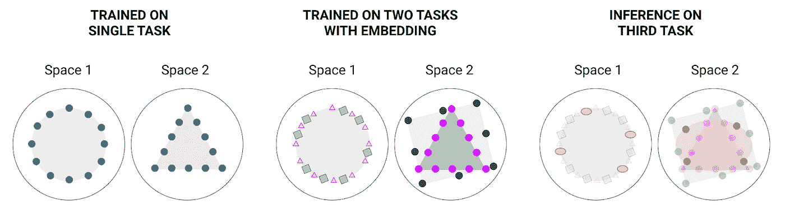
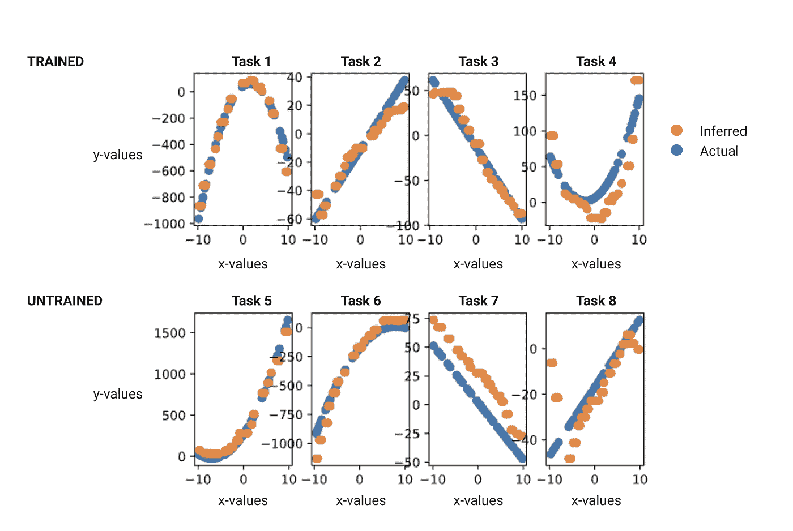
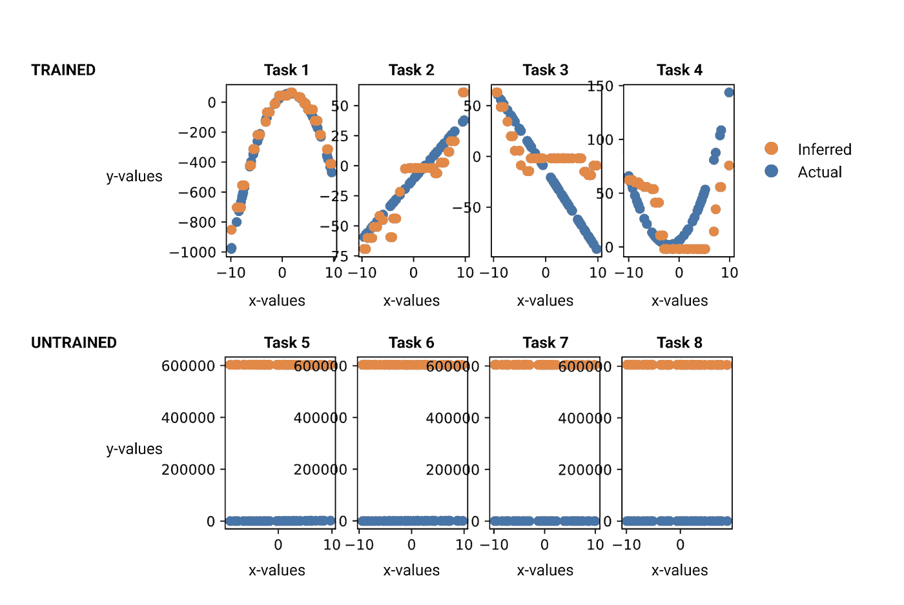
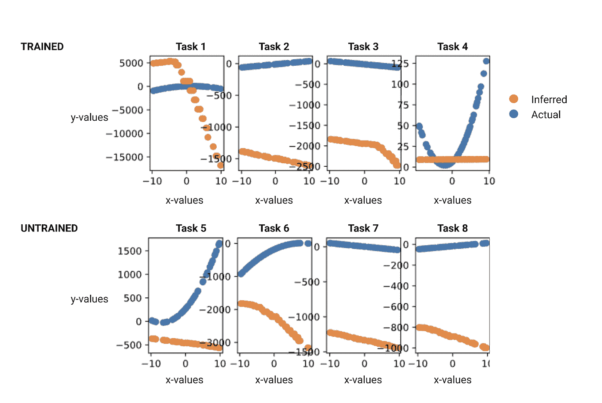
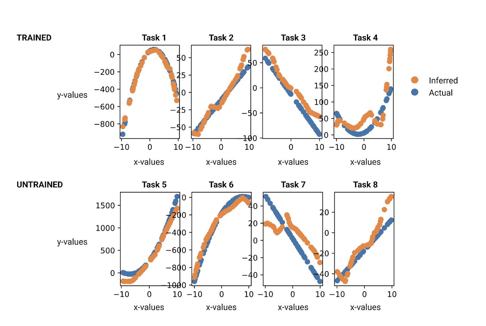
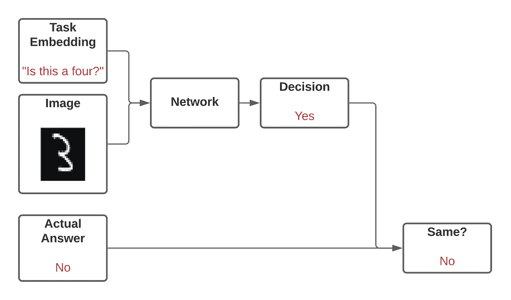
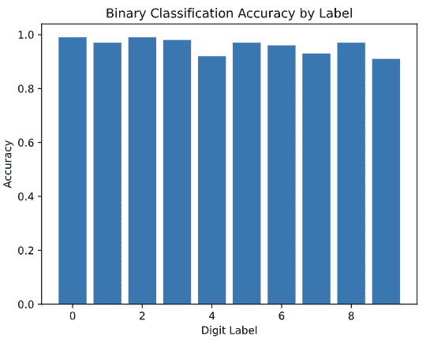

# 任务嵌入的效用

> 原文：<https://towardsdatascience.com/the-utility-of-task-embeddings-e00a18133f77?source=collection_archive---------24----------------------->

## 训练适应性神经网络


弗朗西斯科·温加罗在 [Unsplash](https://unsplash.com/s/photos/handwritten-numbers?utm_source=unsplash&utm_medium=referral&utm_content=creditCopyText) 上拍摄的照片

# 适应性网络

任务嵌入是一种使神经网络适应新任务的技术，并有望减少其他方法存在的一些问题。对于训练网络执行的每个任务，在训练过程中向网络提供任务的丰富表示(任务嵌入向量)。当嵌入被正确执行时，对于相似的任务，任务嵌入向量将是相似的。在没有额外训练的情况下，在给定新任务嵌入的新任务上，网络可以推断出它应该做什么。

扩展训练好的网络的有用性的一种流行方法是迁移学习。基本思想是，使用非常大的训练数据集训练神经网络来完成某项任务，然后使用较小的训练数据集进一步训练神经网络来执行另一项任务。例如，如果网络在稍后被训练来分类文档之前已经被预先训练来“填补”具有缺失单词的句子的空白，则网络在用于分类文档时可以表现得更好。

这种方法有一些缺点。如果迁移学习培训过程中的第二步过于广泛，那么网络将开始“忘记”最初培训的内容。当网络被要求学习更多的任务时，它忘记先前任务的可能性增加。这被称为“灾难性遗忘”。所有网络(即使是那些使用迁移学习的网络)的当前局限性在于，它们受限于有限数量的任务，并且必须被训练(或再训练)以学习新的任务。

任务嵌入可以是一种替代或补充的方法，因为它可以减少在多项任务中表现良好所需的训练次数。任务嵌入的威力用两个简单的数据集来说明——一个单变量的例子和一个 MNIST 的例子。

# 任务嵌入概念

考虑神经网络的一种方式是将其视为一台机器，该机器被训练成将一个空间中的点映射到另一个空间中的点。如果仔细训练，机器将进行归纳，这意味着它将根据一个从未见过的点与它见过的点的相似性来绘制该点。(见图 1 左部分。)



图一。神经网络学习将一个空间中的点映射到另一个空间中的点。任务嵌入允许网络学习不同的映射。*作者图片。*

在给定任务上训练的网络在面对新任务时失败，因为它不知道它需要以任何不同的方式进行映射，并且不知道如何改变它所做的映射。在任务嵌入中，我们向网络提供关于它正在执行的任务的丰富信息，同时训练它同时执行多个任务。它为每个任务学习不同的映射。(见图 1 中间部分。)当出现一组它从未见过的点，并被要求执行一项它从未接受过训练的任务时，网络在它知道的任务之间进行插值，并为新点导出一个合适的映射(见图 1 右部分。)

# 单变量例子

在本例中，要求网络在给定 x 值的情况下预测多个线性或二次方程之一的 y 值。这些方程采用以下形式:

```
-8*(x+1)*(x-4)+9
```

使用一种算法来生成方程。假设系数的范围被限制在 0 到 9，可能的等式总数是 128，304。该算法中的 9 个步骤中的每一个都进行随机选择，并且在方程生成期间进行的选择序列是该方程的向量表示。对于上面的等式，其矢量表示为

```
[1, 8, 1, 2, 1, 1, 4, 2, 9]
```

这用作给定 x 值的情况下为该方程预测 y 值的任务的任务嵌入。

为了使用任务嵌入，嵌入被连接到 x 值，然后被馈送到网络中。上述等式的 x 数据点，例如值为-5，将通过连接等式表示和 x 值来表示。例如:

```
[1, 8, 1, 2, 1, 1, 4, 2, 9, -5]
```

训练数据集由 400 个随机方程构成，每个方程有 2000 个 x-y 对。出于评估目的，训练集被强制包含四个已知方程，并被强制排除四个已知方程。

训练集用于在 2 个时期内训练具有单个 100 节点隐藏层的网络。

训练完成后，要求网络从随机生成的一组 x 值中推断出已知在该组中的 4 个方程和已知在该组之外的 4 个方程的 y 值。换句话说，网络被要求执行 8 项不同的任务，但只在其中的 4 项上接受了训练。图的顶行是训练集中的等式。第二行是训练集之外的方程。蓝色点是实际的，橙色点是预测的。(参见图 2。)



图二。任务嵌入允许神经网络很好地执行它没有学习过的任务。

作为对照，进行了相同的实验，除了不是丰富的任务嵌入，而是将单个随机数字连接到每个等式任务的训练集中的 x 值。网络能够学习任务的正确映射，但是在丰富的任务嵌入中却不能。它完全没有预测到任何它没有看到的任务。(参见图 3。).



图 3。没有任务嵌入，网络在未训练的任务上失败，在训练的任务上挣扎。

生成任务嵌入的方法产生了一个相当紧凑的表示——只有 9 位数字。如下所示，紧凑的任务嵌入会产生更好的结果。

为每个方程生成任务嵌入的一种简单方法是为描述方程的字符串中的 16 个字符中的每一个分配一个数值——这比紧凑方法多产生 1015 个状态。它悲惨地失败了，无法通过超参数调整或更多的训练来改善。(参见图 4。)



图 4。用幼稚的方法创建任务嵌入可能导致无法训练网络。

然而，使用主成分分析(PCA)压缩方法(从 16 位下降到 11 位)压缩朴素任务嵌入显著恢复了在紧凑方法中看到的保真度。(参见图 5。)



图 5。简单任务嵌入的压缩恢复了在紧凑任务嵌入中看到的保真度。

从这个简单的例子中我们可以看出:

*   如果没有任务嵌入，网络就无法完成没有经过训练的任务
*   紧凑的任务嵌入效果更好

# MNIST 的例子

MNIST [数据集](http://yann.lecun.com/exdb/mnist/)用于训练网络执行 7 项任务。在每个任务中，网络被训练来学习图像是否是指定的数字(对于数字 0 到 6)。例如，一个任务是，“这个图像是数字 4 吗？”然后，在没有额外训练的情况下，评估网络在所有十个任务(数字 0 到 9)上的表现。网络对一项任务的准确性取决于网络正确回答问题的频率。(参见图 6。)



图 6。使用 MNIST 数据集进行推断。图片作者。

通过任务嵌入，网络能够在它被训练的数字和没有被训练的数字之间获得相似的结果。在没有任务嵌入的情况下，网络对数字 7、8 和 9 能够执行的最好结果将是 10%,因为这是那些数字在测试集中的普遍程度。(参见图 7。)



图 7。对于仅在数字 0 到 6 上训练的网络，在十个数字上的分类精度。

从这个例子中，我们了解到

*   任务嵌入可扩展到更复杂的数据类型
*   基于 PCA 的压缩产生合适的任务嵌入

# MNIST 的紧凑任务嵌入

为 MNIST 示例创建任务嵌入的一种简单方法是为每个任务选择一个随机选择的图像。对于“这个图像是数字 4 吗？”，可以从训练集中随机选择标签为 4 的图像，并将其连接到该任务的所有训练和测试图像。因为 MNIST 图像是 28×28 像素，总共 784 个元素，所以任务嵌入图像将是它的两倍，1568 个元素。

基于在单变量例子中所学到的，紧凑任务嵌入学习得更快并且产生更高精度的结果。为此，应用了压缩技术。在这个例子中，主成分分析(PCA)被管理来将随机选择的图像从 784 个元素压缩到 264 个元素(减少了 66%)。然后将压缩图像连接到任务的训练和测试图像。

实际上，PCA 识别出一种线性变换，该线性变换在给定从图像中移除固定数量的像素的目标的情况下，最大化图像中保留的信息。在这个例子中，PCA 算法被提供了来自数字 0 到 6 的训练集的 1000 个图像的随机集，以便它可以建立线性变换。数字 7 到 9 被排除在外，因为网络必须在没有任何交替任务的知识或交替任务的数据的情况下被训练。产生的变换保留了 1000 个图像中图像之间 99%的变化。然后将线性变换应用于每个任务的随机选择的图像。

其他图像压缩技术可能证明同样有效，并可能具有其他优势，如更少的处理。

# 结论

使用任务嵌入可以使神经网络具有可扩展性。通过几个简单的例子可以看出，经过一系列任务训练的网络可以用来执行额外的任务，而无需额外的训练。将任务嵌入整合到迁移学习方法中可能会缓解一些灾难性的遗忘挑战。

用于构建任务嵌入的简单方法可能严重阻碍网络的学习能力，并且可能限制网络的整体准确性。压缩任务嵌入在单变量和 MNIST 例子中是可行的。似乎有足够的空间来探索压缩替代方案。

在本文探讨的例子中，作者选择了基于对数据和任务的理解来生成任务嵌入的方法。创建一个无需专家干预就能得出自己最优任务嵌入的系统，可能是一般智能的基石。这方面的一个问题是，训练数据中是否有足够的信息供系统构建自己的嵌入方法？此外，有没有一些嵌入方法对于所有可能任务的子集都很有效，但是对于某些类别的任务仍然失败？