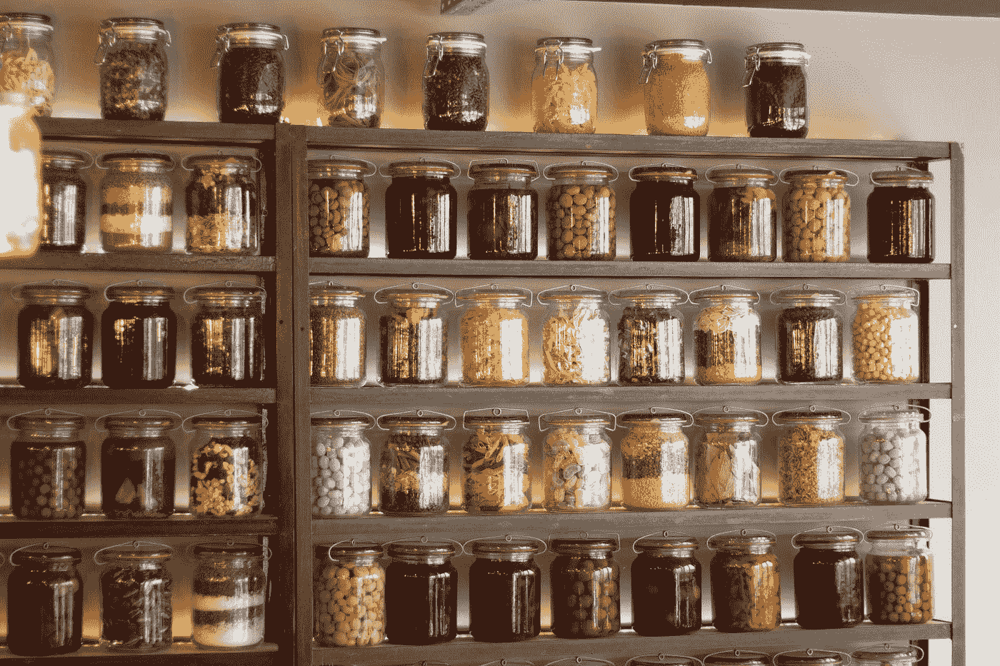

# 当数据驱动的决策产生不好的结果时

> 原文：<https://towardsdatascience.com/the-variable-db2c0896c2e0?source=collection_archive---------24----------------------->

在其核心，数据科学是一门学科，其目的是帮助人们-企业主、医生、教育工作者、公务员-做出良好的现实世界决策。这种假设是，随着我们的行动越来越多地受到数据的影响，结果会有所改善。但事实总是如此吗？数据会把我们引入歧途吗？

Khemani 在[最近发表的关于达成最佳决策的文章](/make-good-decisions-aed89eca68c8)中深入探讨了这个问题。以他女儿的新智能手机为例(以及为它购买保险是否有意义)，他解释了我们日常决策过程背后的数学原理。这是对应用统计学*和*的极好介绍，也是做出理性决策的便捷指南。

我们本周的其他重点包括决策的更多方面。它们的范围从为给定的任务选择特定的算法到评估足球运动员的表现。让我们开始吧。

*   [**看一看引擎盖下的推荐系统**](/dynamic-topic-modeling-with-bertopic-e5857e29f872) 。许多阅读《变量》的读者也会收到《媒体周刊》的推荐文章摘要。Sejal Dua 想要更深入地了解这个列表是如何组成的，以及它可能会说明她的习惯，所以她使用主题建模算法 BERTopic 对它进行了逆向工程。

马丁·洛斯塔克在 [Unsplash](https://unsplash.com?utm_source=medium&utm_medium=referral) 上拍摄的照片

*   [**了解评估技能背后的猫腻**](/data-driven-evaluation-of-football-players-skills-c1df36d61a4e) 。教练过去依靠记忆和本能来塑造他们球队的战略；随着体育分析学的出现，这已经不够了。Ofir Magdaci 最近涉足足球世界(或者英式足球，如果你坚持的话)显示了评估球员潜力和技能的过程是多么复杂。
*   [**探索大数据可视化的有力工具**](/big-data-visualization-using-datashader-in-python-c3fd00b9b6fc) 。有时，成功与失败、好与坏的结果之间的差别，取决于我们为工作选择的工具等小细节。 [Sophia Yang](https://medium.com/u/ae9cae9cbcd2?source=post_page-----db2c0896c2e0--------------------------------) 的最新贡献向我们展示了她的 Datashader 工作流，并解释了如何使用它快速创建大规模数据集的有效可视化。
*   [**选择正确的指标来评估一个模特的表现**](/two-essentials-for-ml-service-level-performance-monitoring-2637bdabc0d2) 。Aparna Dhinakaran 说:“当被视为一个整体服务时，ML 应用程序也必须通过其整体服务性能来衡量。”深入到服务延迟和推理延迟的细节中，Aparna 解释了如何优化模型——以及我们对模型的监控——以产生最好的结果。
*   [**深入了解围绕 AI 监管的利害关系**](/the-present-and-future-of-ai-regulation-afb889a562b7) 。随着近年来围绕人工智能安全和算法偏见的对话激增，那些围绕改善治理和监管需求的对话也在激增。在 TDS 播客上， [Jeremie Harris](https://medium.com/u/59564831d1eb?source=post_page-----db2c0896c2e0--------------------------------) 最近与 [Anthony Habayeb](https://medium.com/u/bd98ad519a4f?source=post_page-----db2c0896c2e0--------------------------------) 谈论了这一发展对企业、政府和从业者的影响。

一如既往地感谢阅读、分享和[支持我们作者的工作](https://medium.com/membership)。

直到下一个变量，
TDS 编辑

# 我们策划主题的最新内容:

## [入门](https://towardsdatascience.com/tagged/getting-started)

*   [Eclat 算法](/the-eclat-algorithm-8ae3276d2d17)由 [Joos Korstanje](https://medium.com/u/8fa2918bdae8?source=post_page-----db2c0896c2e0--------------------------------)
*   [创建数据科学组合](/creating-a-data-science-portfolio-bd485382f49)作者[马腾·格罗滕·多特](https://medium.com/u/22405c3b2875?source=post_page-----db2c0896c2e0--------------------------------)
*   [7 项用于研究的重要 Python 技能](https://medium.com/towards-data-science/7-essential-python-skills-for-research-496e1888e7c2)作者[托马斯·汐宫光·克拉克](https://medium.com/u/e806fec87c25?source=post_page-----db2c0896c2e0--------------------------------)
*   [这 17 个项目将比](/these-17-python-projects-will-teach-you-way-better-than-hello-world-14b28aa4c308)[祖列·雷恩](https://medium.com/u/14d5c41e0264?source=post_page-----db2c0896c2e0--------------------------------)的【你好世界】更好地教会你 Python 的方式

## [实践教程](https://towardsdatascience.com/tagged/hands-on-tutorials)

*   [Miranda Auhl](/speeding-up-data-analysis-with-timescaledb-and-postgresql-e3bdfee41108)[使用 TimescaleDB 和 PostgreSQL](https://medium.com/u/b90a033543a7?source=post_page-----db2c0896c2e0--------------------------------) 加速数据分析
*   “随机森林”里有什么预测糖尿病由 [Raveena Jayadev](https://medium.com/u/cb567727317e?source=post_page-----db2c0896c2e0--------------------------------)
*   [纳迪姆·卡瓦](/where-to-place-wards-in-dota2-84f534b9b64e)[在 DOTA2](https://medium.com/u/85e7e8816e35?source=post_page-----db2c0896c2e0--------------------------------) 中放置病房的位置
*   [K-Means 类的亲密接触](/close-encounters-of-the-k-means-kind-4aff91b3d0ab)由[威尔·克劳利](https://medium.com/u/dc95dc921204?source=post_page-----db2c0896c2e0--------------------------------)

## [深潜](https://towardsdatascience.com/tagged/deep-dives)

*   [努力消除写作中的性别偏见](/towards-removing-gender-bias-in-writing-f1307d0a2b71)作者 [Srihitha Pallapothula](https://medium.com/u/49213da67c60?source=post_page-----db2c0896c2e0--------------------------------)
*   [“经常一起买”推荐系统](/the-frequently-bought-together-recommendation-system-b4ed076b24e5)作者[本·博加特](https://medium.com/u/15826735bd93?source=post_page-----db2c0896c2e0--------------------------------)
*   [邻域补漏白有用吗？山姆·麦克拉奇](/does-neighbourhood-trapping-work-18c8d8deb92c)
*   [使用权重和偏差调整您的机器学习工作流程](/tune-your-machine-learning-workflow-with-weights-and-biases-mljar-automl-hyperopt-shapash-and-f0646500ea1f)由 [Jean-Michel D](https://medium.com/u/c607131f9cd3?source=post_page-----db2c0896c2e0--------------------------------)

## [思想和理论](https://towardsdatascience.com/tagged/thoughts-and-theory)

*   [通过记录链接和监督学习执行重复数据删除](/performing-deduplication-with-record-linkage-and-supervised-learning-b01a66cc6882)由[休·林恩](https://medium.com/u/e2a164cff0bc?source=post_page-----db2c0896c2e0--------------------------------)
*   [Word2vec with PyTorch:实现 Olga Chernytska](/word2vec-with-pytorch-implementing-original-paper-2cd7040120b0)[的原始论文](https://medium.com/u/cc932e019245?source=post_page-----db2c0896c2e0--------------------------------)
*   [更快强化学习之旅](/a-journey-towards-faster-reinforcement-learning-1c97b2cc32e1)作者[扬·贝特洛](https://medium.com/u/be4a07da40d5?source=post_page-----db2c0896c2e0--------------------------------)
*   [一个 Python 框架，用于检索和处理来自 TRIOS 传感器的超光谱实地测量数据(MDSA 格式)](/a-python-framework-to-retrieve-and-process-hyperspectral-field-measurements-from-trios-sensors-5e900158648e)作者:[毛里西奥·科代罗](https://medium.com/u/8878c77fe1a3?source=post_page-----db2c0896c2e0--------------------------------)