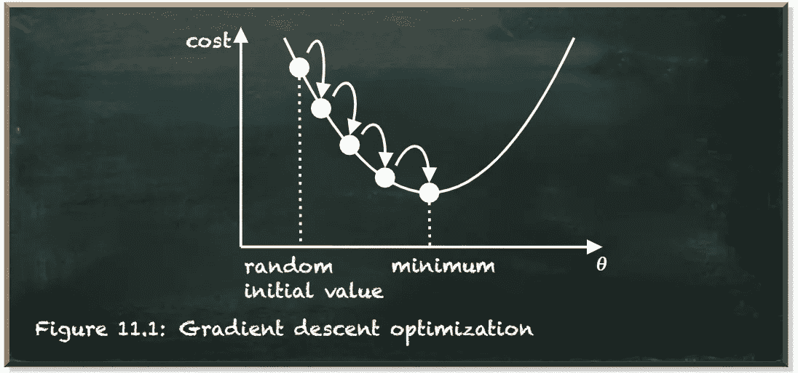
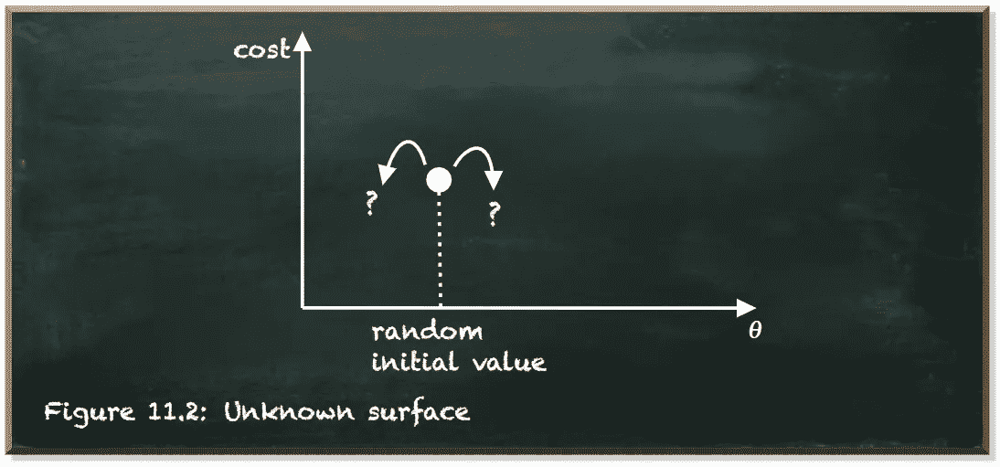
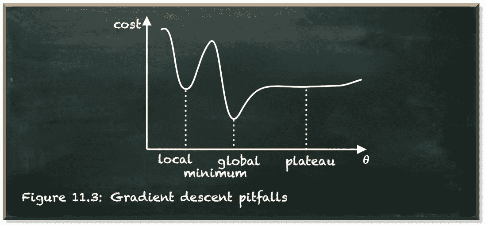
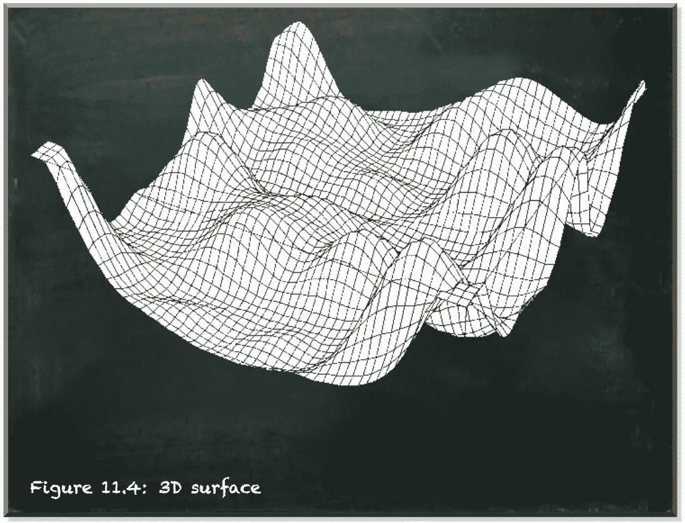
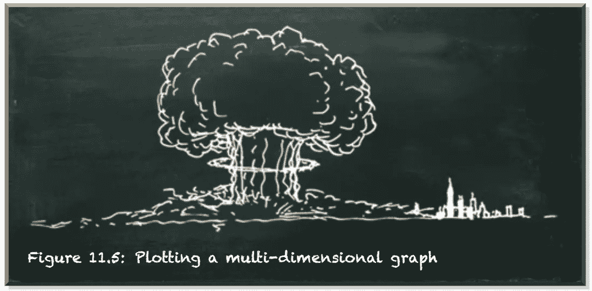
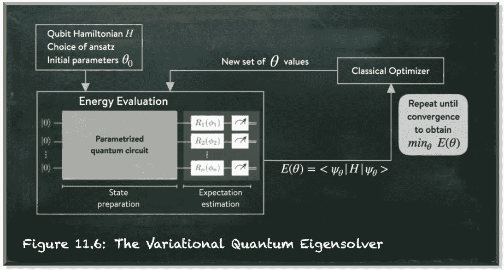

# 变分量子本征解算器——解释

> 原文：<https://towardsdatascience.com/the-variational-quantum-eigensolver-explained-adcbc9659c3a?source=collection_archive---------15----------------------->

## 一种量子机器学习算法

本帖是本书的一部分: [**用 Python 动手做量子机器学习**](https://www.pyqml.com/page?ref=medium_vqe&dest=/) **。**

变分量子本征解算器(VQE)是一种混合量子经典算法。它的目的是找到一个给定哈密顿量的最低特征值的上界。

如果你不是物理学家，你最合适的回答是:“ ***什么？！*** ”

好在[你不需要物理学家来理解量子机器学习](/you-dont-need-to-be-a-physicist-to-understand-quantum-machine-learning-e0c91db4dfc3)。所以，让我换个说法。

VQE 是一种算法，部分在经典计算机上运行，部分在量子计算机上运行。它让您找到解决给定优化问题的值的组合——大约。

解决最优化问题在机器学习中是至关重要的。机器学习算法依赖于一组参数。在训练期间，我们的目标是找到这些参数的值。由于我们不知道正确的值，我们试图从数据中学习这些值。

但这并不容易。随着参数数量的增加，值的可能组合的数量呈指数增长。让我们以国际象棋为例。

共有 64 个空格，每个空格有 16 个棋子。每个玩家移动一个棋子后，有 400 个不同的位置。每个玩家两次移动后有 72，084 个位置，三次移动后约 900 万，四次移动后约 2880 亿。有更多的 40 步游戏比已知的可观测宇宙中的原子数量。

我们如何找到最好的一个——或者至少是一个足够好的组合？这就像大海捞针一样。

这就是优化算法发挥作用的地方。

比如说，我们有一个参数，θ。然后，我们可以在二维图形中打印曲面。

作者弗兰克·齐克特的图片

X 轴显示θ的潜在值。我们将与相应θ值相关联的成本函数的输出映射到 Y 轴上。成本通常是计算错误或模型损失的结果。成本越低，解决方案越好。

优化算法的目标是找到成本最低的点。问题是，在优化过程中，你看不到这个图。只有在尝试之后，您才能看到与某个参数相关的成本。图形是不可见的。优化算法的起点是一个空的坐标系统，对图形的外观没有任何线索。

作者弗兰克·齐克特的图片

算法需要探索表面。

最著名的经典优化算法之一是梯度下降。它是一种迭代算法，在优化曲面上运行。对于它访问的每个值，它计算成本函数的梯度。这告诉算法前进的方向。

一旦梯度为零，算法达到最小值！但是这个算法有很多陷阱。它可能只达到了局部最小值或最终处于平稳状态。

作者弗兰克·齐克特的图片

为什么它不算出函数的形状？，你问？

在 2D 计划中，这种方法可能会成功。但是 2D 图代表的是由单一参数组成的模型。如果我们有两个参数，我们需要一个三维表面。

作者弗兰克·齐克特的图片

为了表示三个参数，我们可以动画 3D 表面(我们将使用时间作为表示维度)。已经很难说出成本函数的整体形状了，不是吗？

现在，假设我们有十个或二十个参数。不要在家里尝试，我相信下面的图像非常准确地描绘了绘制二十维图形的结果。

作者弗兰克·齐克特的图片

有时候，计算单个职位的成本并不容易。例如，在国际象棋中，棋子位置的值取决于整体设置。

在最简单的情况下，我们会根据每件物品的类型对其进行计数和称重。

在更高级的情况下，我们会根据一个棋子的类型和相对于其他棋子的位置来评估它的价值。没有对手的棋子比棋子值钱多了。不是吗？

这就是 VQE 发挥作用的地方。它让我们找到了一个难以计算的成本函数的组合问题的解决方案。VQE 使用参数化的量子电路来计算成本，并将其与运行在经典计算机上的优化器相结合。

下图显示了 VQE 的组件以及它们之间的交互方式。

作者弗兰克·齐克特的图片

这个过程从一个哈密顿量开始。哈密顿量是以威廉·罗恩·汉密尔顿的名字命名的。简单地说，它是我们旨在解决的问题的定义——以数字矩阵的形式。如果你想知道我们如何用矩阵来表示一个问题，考虑一下量子门(你可以在量子位上应用的操作)也是矩阵。因此，你可以用量子门来描述这个问题。

我们使用一组参数来控制量子态的制备。参数如何影响量子态由 ansatz 指定。

ansatz(德语中的 approach)是对答案可能是什么的一种数学猜测。它也是一组量子门。但它的重点是将问题转化为对特征值的估计——如果你愿意的话，是对性能的一种度量。ansatz 获取参数并创建一个量子态。一旦我们测量了这种状态，我们就可以估计这些参数的表现如何。

我们使用一个经典的优化器来计算一组新的参数，我们再次输入到量子电路中。我们迭代直到结果收敛。

# 结论

如果是这样，我们为什么要使用所有这些物理术语？

描述这种方法的原始科学论文旨在估计 H2 分子的基态能量。基态是系统能量最低的状态，即本征值。物理系统往往会损失能量。一旦它们到达基态并被单独留下，它将永远停留在那里。

VQE 只是意味着我们使用量子计算机来评估这个能量，使用经典计算机来选择如何提高参数，以便在下一次量子迭代中能量会更低。VQE 的想法是将量子计算机只用于一件事——获得给定参数集的能量值。其他一切都发生在经典计算机上。

本帖是本书的一部分: [**用 Python 动手做量子机器学习**](https://www.pyqml.com/page?ref=medium_vqe&dest=/) **。**

在这里免费获得前三章。