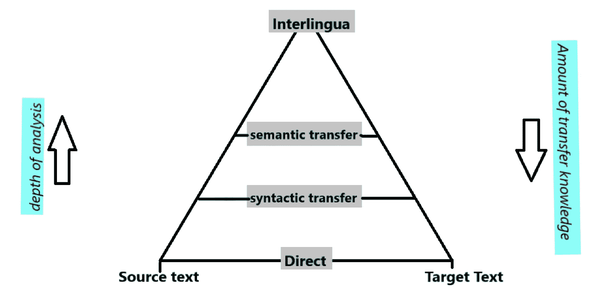

# 沃克斯三角:谜团解开了

> 原文：<https://towardsdatascience.com/the-vauquois-triangle-mystery-solved-420ca995e70b?source=collection_archive---------20----------------------->

## 经典机器翻译方法的演变

雷纳多·凯文在 [Unsplash](https://unsplash.com?utm_source=medium&utm_medium=referral) 上的照片

Vauquois 三角形是一个经典的层次模型，用于可视化各种机器翻译方法。在深入 Vauquois 三角形之前，我们先来看看什么是机器翻译。

**什么是机器翻译？**

机器翻译是使用计算机软件将一种自然语言的文本或语音翻译成另一种自然语言的过程。定义看似简单，过程却异常艰难。语言在很多方面都不同，语法上、句法上(句子结构)、语义上(意义)等等。这种差异被称为**翻译分歧**。

举个例子，想想韩剧《哦，我的维纳斯》中的一段话，

韩语:*mid eumyeon Hal su isso，hal su issdago mid nikka*

中文:*如果【你】相信【它】【你】能做到【它】，因为【你】相信【你】能*

我们可以看到，就结构而言，韩语遵循 SOV(主语-宾语-动词)协议，而英语遵循 SVO(主语-动词-宾语)。像韩语和日语这样的语言不会明确使用代词。这类省略代词的语言称为**亲降语**。这些差异使得机器翻译变得困难，因为必须正确识别和解释这些遗漏。这两种语言还有其他一些不同之处。译者必须分析句子中的所有成分，并且知道每个单词如何影响另一个单词。

## 沃克斯三角形

1968 年，Bernard Vauquois 研究了当时的机器翻译方法，并用三角形的形式来表示它。这就是著名的沃克斯三角。Vauquois 三角形可视化并描述了机器翻译的经典方法，展示了这些方法的演变。

作者图片

这些途径主要有:**直达**途径、**中转**途径、**中转**途径。当我们从直接法转向语际法时，每种方法所需的分析深度增加，而当我们从直接法转向语际法时，所需的知识转移量减少。

## 直接翻译

直接翻译方法使用双语词典来逐字翻译句子，其中每个源单词被映射到某个目标单词。翻译过程不使用任何中间结构，除了一些词法分析(分析单词的结构和部分的任务)或词汇化(将单词转换为其基本词典形式的任务，例如，*将*翻译为*翻译*)。

在分析句子的结构和部分之后，使用双语词典通过将每个单词映射到其目标语言单词来逐字翻译源语言。然后，对得到的目标语言句子进行一些简单的重新排序处理，以使其结构正确。

## 基于迁移的翻译

基于转移的翻译方法首先**解析**源语言句子以确定其结构，**基于语言之间的差异知识应用规则将**所得结构转移到目标语言解析结构，然后**从该转换后的结构生成**目标语言句子。

根据源语言和转移语言的不同，转移方法可能会有所不同。对于类似的语言，如法语和意大利语(几乎 90%的词汇相似)，只需要**语法转移**，其中解析的源结构根据语法重新排序转移到目标解析结构。

对于韩国语到英语这样复杂的翻译过程，除了句法转换，我们还需要做一个**语义转换，**其中源结构需要根据它们在目标句子中的意义和语义角色进行转换。

## **语际翻译**

语际法首先分析源语言句子，将其表示为**语际、**和，然后从该语际生成目标语言句子。国际语是一种独立于语言的表示，可以基于任何表示方案。

大量数据的可用性和更快的处理系统改变了机器翻译的世界，从经典的方法和 Vauquois 时代到更快和更有效的结果。

感谢您阅读文章。希望你学到了新的东西！

## 参考

[1]马德森，马蒂亚斯·温瑟(2009)。机器翻译的极限，哥本哈根大学硕士论文。

[2]丹尼尔·茹拉夫斯基、詹姆斯·马丁(2009 年)。语音和语言处理。