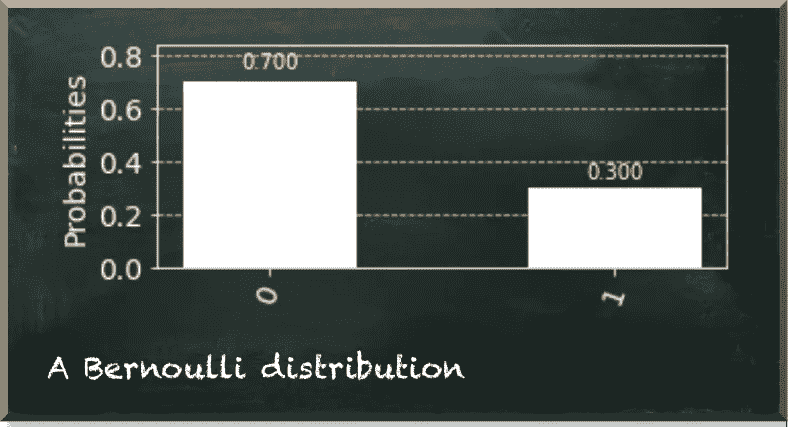

# 量子机器学习的第一步

> 原文：<https://towardsdatascience.com/the-very-first-step-into-quantum-machine-learning-95efdf0d980c?source=collection_archive---------37----------------------->

## 在深入研究量子机器学习算法之前，你需要掌握基础知识

上周，我开始了下一周的努力。我请你解决一个小的量子机器学习挑战。这篇帖子总结了[挑战](https://pyqml.substack.com/p/put-your-hands-on-quantum-machine)及其[解决方案](https://pyqml.substack.com/p/what-are-the-chances-youll-solve)。

你可以在这里加入每周挑战[。](https://pyqml.substack.com/)

作者图片

机器学习的目标是训练机器预测未知变量的值。但是在我们预测一个变量的值之前，我们通常旨在找到它的概率分布。概率分布是一个描述变量可能具有的所有可能值和可能性的函数。

例如，假设我们知道变量只能有两个值中的一个。它可以是 0 或 1。每个值都以一定的概率出现。

*p* 表示概率为 0。因为只有两个可能的值，我们知道只要值不是 0，它就一定是 1。而且由于所有概率的总和必须是 *1 (=100%)* ，所以我们知道 1 的概率是 *1-p* 。

挑战在于创建一个量子系统，以给定的 *p* 再现伯努利分布。 *p* 可以是 0 到 1 之间(含)的任意实数值。

例如，如果 p=0.3，量子系统应该产生以下分布。

作者图片

挑战中棘手的部分是如何让量子位元代表特定的分布。

做这件事有不同的方法。首先，你可以在初始化期间指定量子位的状态振幅。但是，您需要记住，您指定的是振幅，而不是概率。如果你从概率开始，你需要计算它们的平方根来得到振幅。通常，对于一个量子比特𝜓=𝛼|0⟩+𝛽|1⟩，我们必须保证
|𝛼| +|𝛽| =1。

下面的代码片段描述了该解决方案。

第二种方法使用基态|0⟩和你的量子位状态向量|𝜓⟩.之间的角度𝜃它控制着最终的振幅，因此也控制着概率。下面的代码片段计算了给定概率下的𝜃，给定你想要应用的量子位处于|0⟩.状态你可以使用𝑅𝑌门来相应地旋转量子位状态向量。这是各自的代码。

# 结论

量子机器学习似乎是最具挑战性的学习主题之一。如果你一开始就使用一个复杂的算法，并假设有很多先验知识，那么事情会变得更加复杂。

但是，如果你从简单开始，事情会变得更容易理解。

量子机器学习要不要入门？看看 [**动手量子机器学习用 Python**](https://www.pyqml.com/page?ref=medium_entangled&dest=/) **。**

在这里免费获得前三章。