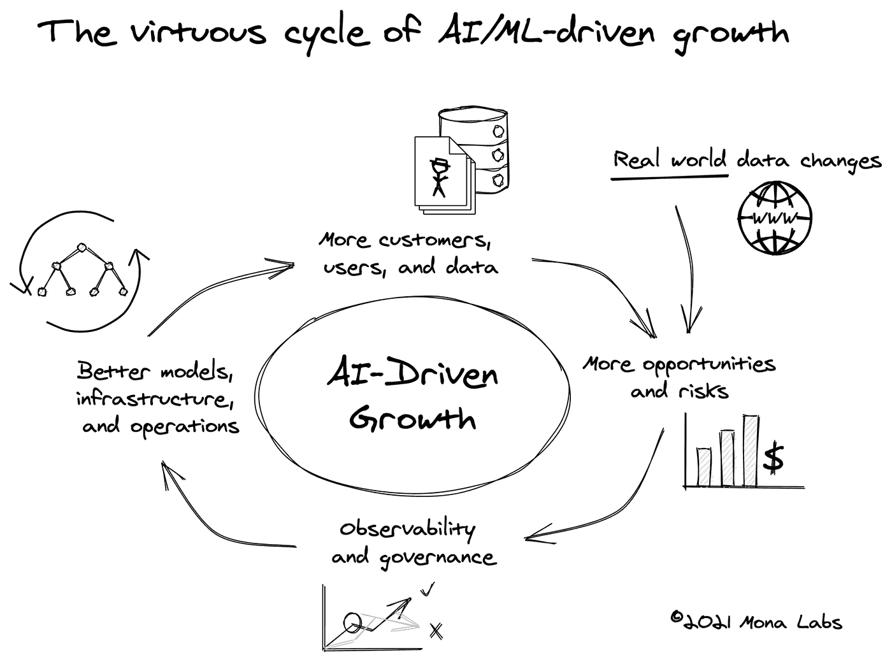

# 关于人工智能驱动的增长，领导者需要知道什么

> 原文：<https://towardsdatascience.com/the-virtuous-cycle-of-ai-driven-growth-c3fbf35f70c?source=collection_archive---------34----------------------->

## 公司希望掌握良性循环；不断发展他们的人工智能/人工智能环境，以保持影响力和增长

# 让人工智能具有影响力和可扩展性很难

几乎在每个行业，公司都在人工智能上投入巨资。我们都对“为什么”有一个直观的理解:在短短几年内，构建具有真实商业价值的预测模型变得容易得多，可以节省时间和金钱，减少人工劳动，并全面改善结果。最终，我们希望人工智能能够实现业务优化和增长。

我们仍然难以理解的是如何将人工智能投资转化为有影响力和可扩展的商业运营。随着这些人工智能项目的扩展，它们必须不断发展以跟上它们所驱动的增长，目标是实现更多的增长。这是我们喜欢称之为“人工智能驱动增长的良性循环”的反馈回路的基础。我们遇到的每一位人工智能领导者都试图加深他们对这一周期的理解，其相互关联的部分包括基础设施、团队、具有模型和数据的人工智能工作流、商业应用程序，当然还有客户/用户。

我们发现，这个框架可以帮助经理、高管和其他决策者思考公司必须协同工作才能维持人工智能驱动的增长的各个部分，因此值得花时间探索它，并根据您的需求应用它。

来源:作者图片

# 理解人工智能/人工智能驱动增长的良性循环

首先，让我们确定成功部署的人工智能是增长的引擎。你从一个商业问题开始，收集初始数据，形成假设，训练预测模型，为它们服务，然后*瞧——*你就有了一个人工智能驱动的产品。一个有价值的产品自然会带来更多的客户，或者为现有客户增加价值，业务也会增长。

考虑一个电子商务网站，利用人工智能向访问该网站的消费者推荐产品。相关的推荐转化为购买，网站创造的额外收入可以投入到营销中，为网站带来更多的消费者。优质的人工智能可以迅速带来业务增长。

> “成功地在增长引擎中部署了人工智能。”

现在，快速增长带来了新的机遇和风险。你有很多新客户，他们带来了新数据。新数据提供了了解更多信息、提高预测准确性和覆盖范围的机会，但也带来了新的边缘案例和例外情况的风险，或许还有暴露于新法规的风险。

例如，部署人工智能驱动的推荐以增加购买转化率的电子商务网站，在快速增长模式下，可能会进入新的国家市场。新的市场呈现出更多样化的数据集、新的语言、不同的消费者偏好和行为，或许还有不同的柠檬法则。AI 驱动的推荐系统能跟上吗？

与此同时，世界在继续前进，这也带来了新的机遇和风险。直观地说，在我们的电子商务例子中，随着一些消费品牌和产品的受欢迎程度迅速上升或下降，去年有效的推荐模式今天可能不再有效。消费者偏好不断变化，本地或全球事件(如疫情)也有重大影响。

需要持续的发展来降低风险和抓住机遇。如果你适应了，你将继续创造价值，反过来，更多的增长。作为一名人工智能所有者，你可能需要投资于额外的团队专业知识(例如，“有人能学习计算机视觉吗？我们开始收集图像数据！”)、新的基础设施(例如，“如果我们每分钟必须做出 100 倍以上的预测，我们能否保持较低的处理时间？”)和新模型以及对现有模型的改进(例如，“我们曾经根据法国消费者数据训练过我们的模型吗？”).

那么，如何找出必要的改进呢？AI 的提高来自于勤奋的观察和学习**。**如果您仔细并持续跟踪您的人工智能环境的业务绩效，您可以确定您的专业知识、基础架构和模型的优势和劣势。理想情况下，你有一个持续的学习流反馈到你的持续改进计划中。因此，整合可观察性和治理将点与点连接起来，并完成您的 AI/ML 成长周期。

在我们的工作中，我们已经与数百个人工智能团队进行了交谈，并与其中几十个团队建立了合作伙伴关系。很明显，将前瞻性思维团队与其他团队区分开来的是对他们的整个技术堆栈以及产品的整个生命周期有更深入的了解。这些团队通常希望实施同类最佳的 APM(告诉他们何时需要进行基础架构调整)、BI(识别新的业务机会)以及集成的数据和模型监控(验证数据完整性、检测概念漂移、模型偏差和其他弱点、A/B 测试模型版本以简化更新等)。

> “F 超前思维团队对他们的整个技术堆栈以及产品的整个生命周期都有可见性”。

# 要点和后续步骤

对于许多公司来说，人工智能已经从支持业务转向推动业务，但没有留出太多时间来围绕这种人工智能驱动的增长巩固实践和架构。市场和生态系统的成熟还需要一段时间，集体专业知识的跟上可能需要更长的时间。与此同时，我们认为良性循环框架是另一个有用的工具，可以放在你的工具带上，这样你就可以更好地理解领先人工智能的更大图景。

> “……人工智能已经从支持业务发展到推动业务发展……”

如果你是那些试图不断调整你的人工智能环境来为你的公司解锁(而不是阻碍)增长的团队中的一员，你并不孤单。如果你是那些基于在现实世界中有条不紊地观察你的人工智能而主动进化的团队之一(而不是基于本能或对投诉的反应)，那么你正在掌握人工智能驱动的增长的良性循环。[给我们写封短信](https://www.monalabs.io/request-demo)，我们希望听到您的旅程，并与您分享更多我们的最佳实践。

*感谢*[*Itai Bar Sinai*](https://medium.com/u/dae6c2441260?source=post_page-----c3fbf35f70c--------------------------------)*和*[*Jonathan Bennun*](https://medium.com/u/6c0032fbea39?source=post_page-----c3fbf35f70c--------------------------------)*在这篇文章上的合作。*

*原载于 2021 年 2 月 23 日*[*https://www . monalabs . io*](https://www.monalabs.io/mona-blog/the-virtuous-cycle-of-ai-driven-growth)*。*