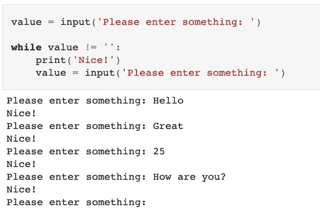
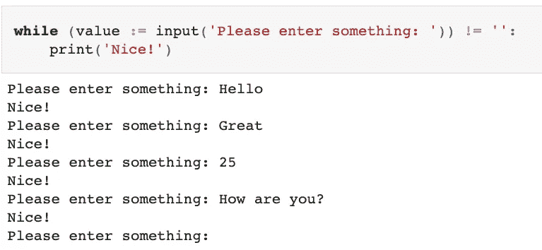
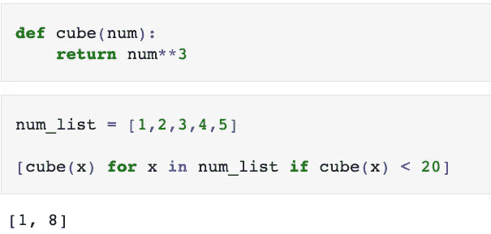
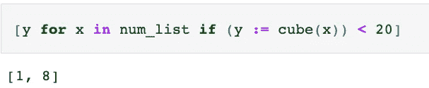

# Python 中的海象算子

> 原文：<https://towardsdatascience.com/the-walrus-operator-in-python-a315e4f84583?source=collection_archive---------1----------------------->

## 了解什么是 walrus 操作符以及如何在 Python 中使用它


杰伊·鲁泽斯基在 [Unsplash](https://unsplash.com?utm_source=medium&utm_medium=referral) 上的照片

Python 3.8 中引入的 walrus 操作符提供了一种同时完成两项任务的方法:给变量赋值，**和**返回该值，这有时可以提供一种编写更短、可读性更好的代码的方法，甚至可能计算效率更高。

让我们回顾一下什么是 walrus 操作符，以及它何时有用的一些例子。

## 简单赋值运算符

我们都熟悉如何给变量赋值。我们使用简单的赋值操作符:

```
num = 15
```

如果我们想使用 ***print*** 函数打印这个变量的值，我们可以如下传入变量*:*

```
*print(num)
# 15*
```

## *输入 walrus 运算符*

*python 3.8 中引入的 walrus 操作符( **:=** )，正式名称为**赋值表达式操作符**，提供了一种在表达式中给变量赋值的方法，包括尚不存在的变量。如上所述，使用简单的赋值操作符( **=** )，我们在独立语句的上下文中赋值 ***num = 15*** 。*

> *表达式的计算结果为一个值。一个语句做一些事情。*

*换句话说，walrus 操作符允许我们在同一个表达式中既给变量赋值，**又返回该值。这个名字是因为它与海象的眼睛和侧面的长牙相似。***

> *名称:=表达式*

****expr*** 求值后赋给变量 ***name*** 。该值也将被返回。*

*让我们看一些使用中的 walrus 操作符的例子。*

## *简单的例子*

*理解 walrus 操作符的最好方法是用一个简单的例子。就像上面一样，我们要给 ***num*** 赋值 15，然后打印 ***num*** 的值。我们可以使用 walrus 操作符在一行代码中完成这两项任务，如下所示:*

```
*print(num := 15)
# 15*
```

> *将值 15 赋给 ***号*号**。然后返回相同的值，该值将成为 **print** 函数的参数。因此，打印的是 15。*

*如果我们尝试使用简单的赋值操作符，我们将得到一个 ***类型错误*** ，因为 ***num = 15*** 不返回任何内容。*

```
*print(num = 15)
# TypeError*
```

*[](/three-concepts-to-become-a-better-python-programmer-b5808b7abedc) [## 成为更好的 Python 程序员的三个概念

### 了解 Python 中的*和**运算符，*args 和**kwargs 以及更多内容

towardsdatascience.com](/three-concepts-to-become-a-better-python-programmer-b5808b7abedc)* 

## *另一个例子*

*比方说，我们想不断要求用户输入一些信息。如果用户没有输入任何东西，那么我们希望停止要求更多的输入。我们可以使用 while 循环来实现这一点，如下所示:*

**

> *我们要求用户输入一些东西，并将该输入赋值给**值**。然后，我们创建一个 while 循环，如果输入的值不是空字符串，则运行该循环。我们打印出“很好！”如果用户成功地输入了一些东西。然后，我们要求用户输入另一个值，并将其设置为等于**值**，然后重新开始该过程。*

*现在让我们使用 walrus 操作符来尝试一下:*

**

> *我们要求用户输入，并使用 walrus 操作符将该输入设置为等于**值**。这个值也被返回，并与一个空字符串进行比较。如果比较结果为 **True** (不等于空字符串)，那么 while 循环中的代码运行，然后“好极了！”已打印。如果评估结果为**假**，则代码不会运行。*

## *列表理解示例*

*walrus 运算符可以提高代码可读性和计算效率的一个例子是在旨在过滤值的列表理解中。*

*[](/list-comprehensions-in-python-28d54c9286ca) [## Python 中的列表理解

### 用 python 创建列表的更优雅、更简洁的方式

towardsdatascience.com](/list-comprehensions-in-python-28d54c9286ca)* 

*例如，假设我们有一个数字列表 ***num_list*** ，并且我们希望仅在立方值小于 20 的情况下将这些数字的立方相加。我们可以这样做:*

**

> *注意我们如何调用函数 ***cube* 两次**。*

*walrus 操作符将允许我们在列表理解中只调用函数 ***cube*** 一次，如下所示:*

**

> *将 ***立方(x)*** 的值赋给 ***y*** ，然后返回并与 20 进行比较。 ***y*** 的值只有小于 20 才会添加到列表中。注意 **cube()** 函数只被调用了一次，这导致了更高效的代码。函数越复杂，计算要求越高，效率的提高就越显著。*

*如果你喜欢阅读这样的故事，并想支持我成为一名作家，考虑注册成为一名媒体会员。每月 5 美元，你可以无限制地阅读媒体上的故事。如果你用我的 [*链接*](https://lmatalka90.medium.com/membership) *注册，我会赚一小笔佣金。**

*[](https://lmatalka90.medium.com/membership) [## 通过我的推荐链接加入媒体——卢艾·马塔尔卡

### 阅读卢艾·马塔尔卡的每一个故事(以及媒体上成千上万的其他作家)。您的会员费直接支持…

lmatalka90.medium.com](https://lmatalka90.medium.com/membership)* 

**我希望这篇关于如何在 Python 中使用 walrus 操作符的教程能有所帮助。感谢您的阅读！**