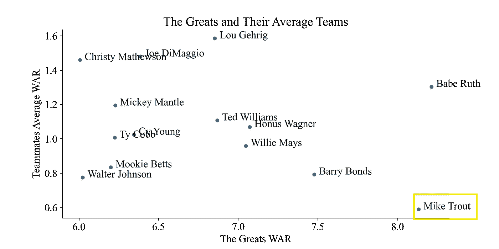

# 一代棒球天才的浪费

> 原文：<https://towardsdatascience.com/the-waste-of-a-generational-baseball-talent-835d474d85?source=collection_archive---------42----------------------->

## 使用 Python 可视化来探索围绕空前伟大的天才


洛杉矶天使队的迈克·特劳特。图片来源于维基媒体。

棒球有着丰富的传统，培养出超越时代甚至超越比赛本身的超级明星人才，从而在文化知识中确立自己的地位。贝比·鲁斯、威利·梅斯、巴里·邦兹和泰德·威廉姆斯这些家喻户晓的名字，因为他们在职业生涯中的个人记录以及团队的整体成功而被人们铭记。洛杉矶天使队的中外场手迈克·特劳特是一名目前缺乏团队成功的名人堂球员(12 个 ABs 中只有 1 个季后赛安打，一个本垒打)。自 2012 年爆发以来，迈克·特劳特已经成为 MLB 的代言人。2014 年我在库尔斯球场亲眼看到鳟鱼抢了一个本垒打，打了一个定胜负，差一点就错过了第二次全垒打抢劫。他是一个令人难以置信的球员。棒球统计学家会同意我的假设。棒球统计学家得出了一个衡量球员对球队价值的方法。这一措施被称为战争，代表胜于替代。Fansgraph 的[计算是为了提供一个球员价值的单一指标，以防他们受伤，需要用一个普通的自由球员或新秀来代替。Fansgraph 使用*的独立投手(FIP)* 来评估投手的潜在年龄，消除每个球队防守强度的影响。对于投手和击球手有许多不同类型的战争措施，然而本文中使用的计算方法将在下面详细介绍。](https://library.fangraphs.com/misc/war/)

**位置玩家之战**

*战=(击球跑分+跑垒跑分+守备跑分+位置调整+联盟调整+替补跑分)/(每胜跑分)*

**投手战(投出的外野局)**

*FIP =((13 *小时)+(3*(BB+HBP))-(2*K))/IP +常数*

Fansgraph 将玩家的战争定义为玩家对团队的价值。下表显示了预期的战争等级和一个玩家对一个团队的价值。战争甚至可以是负面的。


根据 Fansgraph 的战争等级表

我们收集了从 1900 年到 2019 年的 Fansgraph 战争数据。数据和脚本可以在**[**GitHub**](https://github.com/glickmac/Wasted_MLB_Talent)上找到。由于疫情和目前正在进行的 2021 赛季，我们忽略了 2020 年的战争统计。我们在数据中保留了 1981 年和 1994 年的停摆季节。**

## ****精英中的精英****

****

**贝比·鲁斯。图片来自维基媒体。**

**贝比·鲁斯被许多人认为是有史以来最好的棒球运动员，他的战争平均水平以及他的一些单赛季战争价值观也是如此。贝比鲁斯有史以来最高的单赛季战争与 15(！！！)1923 年。那一年他的球队第二好的战争是 4.5。斑比诺的平均战争时间是令人难以置信的 8.21 秒。下图是 1900 年以来各季的顶级战例。该图是使用 [seaborn](https://seaborn.pydata.org/) 生成的。**

****

**历年最高战争值。图片作者。**

**除了 20 世纪 20 年代早期(Babe Ruth)，一个赛季的最高战争值徘徊在 8 和 11 之间。每个球队的最高战争值和该球队的平均战争值如下图所示。通常每支球队都会有一个超级巨星，平均战力会徘徊在 1 以下。下图是用以下代码生成的。**

```
## Sort by top WAR values
df_war = df_war.sort_values(by="Total WAR", ascending=False)## Get the top WAR values by each team each year
df_war_top_team = df_war.drop_duplicates(subset=["Team", "Year"], keep="first")## Plot Top WAR by Year (Blue Line)
sns.lineplot(x="Year", y="Total WAR", label="Top Players WAR", data=df_war_top_team).set(title='Average War of Top Player and Average Team WAR by Year')## Plot Average WAR by Year (Green Line)
sns.lineplot(x="Year", y="Total WAR", label="Average Team WAR",data=df_war, color="green")
```

****

**各队顶尖球员的平均战力和全队平均水平。图片作者。**

## ****一代人才的定义****

****

**2K games 为 Wii 开发的 MLB 超级明星。图片来自维基媒体。**

**在我们的模型中，一般天赋的定义是在他们的职业生涯中超过 MVP 的平均水平。为了过滤世代天赋，我们使用下面的代码保留平均总战超过 6 的玩家。**

```
top_talent = df_war.groupby("Name").mean()
top_talent = top_talent[top_talent["Total WAR"]>6]
top_talent = top_talent[['Total WAR']].sort_values("Total WAR", ascending=False)
```

**我们的结果显示，有 14 名球员在他们的职业生涯中平均表现出 MVP 水平。**

1.  **贝比鲁斯| 8.21 战争**
2.  **迈克·特劳特| 8.13 战争**
3.  **巴里·邦兹| 7.48 战争**
4.  **霍纳斯·瓦格纳| 7.07 战争**
5.  **威利·梅斯| 7.05 战争**
6.  **泰德·威廉姆斯| 6.87 战争**
7.  **卢·格里克| 6.85 战争**
8.  **乔·迪马吉奥| 6.38 战争**
9.  **赛扬| 6.35 战争**
10.  **米奇·曼托| 6.23 战争**
11.  **泰·科布| 6.23 战争**
12.  **Mookie Betts | 6.20 战争**
13.  **华特·强森| 6.02 战争**
14.  **克里斯蒂·马修森| 6.01 战争**

**Mookie Betts 和 Mike Trout 是这一代人才名单上唯一活跃的球员。名单上的所有其他球员(*除了巴里·邦兹)都被载入了 MLB 名人堂。**

## ****浪费一代人才****

****

**照片由 [Lisa Wall](https://unsplash.com/@lisawall72?utm_source=medium&utm_medium=referral) 在 [Unsplash](https://unsplash.com?utm_source=medium&utm_medium=referral) 上拍摄**

**一代人的天赋可以支撑一个球队在季后赛或世界大赛中的表现。棒球是一项团队运动，尽管有单个球员的贡献，但整个赛季和季后赛的持续成功主要是整个团队贡献的产物。迈克·特劳特是一代天才，他的平均战数超过 6 场。他甚至可能被认为是有史以来最伟大的棒球运动员之一，然而，相对于其他一代人才，他的团队缺乏支持，如下所示。**

```
sns.scatterplot(x="Total WAR", y="Teammate WAR Average", data=top_talent)
sns.despine(fig=None, ax=None, top=True, right=True, left=False, bottom=False, offset=None, trim=False)plt.title('The Greats and Their Average Teams')
# Set x-axis label
plt.xlabel('The Greats WAR')
# Set y-axis label
plt.ylabel('Teammates Average WAR')def label_point(x, y, val, ax):
    a = pd.concat({'x': x, 'y': y, 'val': val}, axis=1)
    for i, point in a.iterrows():
        ax.text(point['x']+.03, point['y'], str(point['val']))label_point(top['Total WAR'], top['Teammate WAR Average'], top['Name'], plt.gca())
```

****

**这个图表在 X 轴上显示了一代人才的平均战争，在 Y 轴上显示了他们职业生涯中队友的平均战争。**

**迈克·特劳特是当代天才中唯一一个平均队友战争低于 0.6 的人。从长远来看，迈克·特劳特是 MLB 历史上唯一一个 WAR delta(他职业生涯平均 WAR 和队友平均 WAR 之差)超过 7 (7.54)的球员。下一个最接近的队友德尔塔差异是贝比鲁斯在 6.91。迈克·特劳特拥有第三低的队友平均战数，职业生涯平均战数超过 4。排在他后面的两个人是诺兰·阿雷纳多和安德鲁·麦卡琴，前者在过去的一个赛季里一直在糟糕透顶的落基山脉工作，后者多年来一直在一个徒劳无功的海盗队工作。阿雷纳多和麦卡琴的平均全战值都在 5 以下(分别为 4.49 和 4.72)。**

## ****缺少第二个超级巨星(甚至全明星)****

****

**洛杉矶天使队的大谷修平。图片来自维基媒体。**

**在双重威胁现象出现之前，大谷和天使们一起到达了。天使管理层试图通过抢购另一名伟大的球员阿尔伯特·普约斯来建立自由代理，以 10 年 2.4 亿美元的合同从 2012 年到 2021 年。这次签约对应的是 2012 年迈克特劳特的出现。艾伯特·普约尔在天使队的任期没有他在 2001 年至 2011 年在红衣主教队的时间那么壮观。普霍斯缺乏持续的全明星级别的制作，这使得特劳特没有第二名球员来称赞他的历史性赛季。事实上，迈克·特劳特(Mike Trout)与厄尼·班克斯(Ernie Banks)和罗杰斯·霍恩斯比(Rogers Hornsby)并列为赛季战超过 6 场(MVP 级别)的球员，而球队中没有其他球员突破 4 场(全明星级别)。这三个人都不得不忍受四个赛季 MVP 的高质量表现，并且很少得到其他队员的帮助。**

## ****地平线上的希望****

****

**在 [Unsplash](https://unsplash.com?utm_source=medium&utm_medium=referral) 上 [Pablo Heimplatz](https://unsplash.com/@pabloheimplatz?utm_source=medium&utm_medium=referral) 拍摄的照片**

**迈克·特劳特遭受了历史性规模的队友生产不足。大谷等人的到来和崭露头角，或许会让特劳特在季后赛上再一次出手。迈克·特劳特签署了一份为期 12 年、价值 4.26 亿美元的合同，从 2020 年开始。他的合同将持续到 38 岁。这里希望他能继续他历史性的战斗步伐，并在季后赛中与更有能力的队友一起发光发亮。**

**我叫科迪·格利克曼，可以在 LinkedIn 上找到我。代码和数据可以在 [GitHub](https://github.com/glickmac/Wasted_MLB_Talent) 上找到。看看下面我写的一些与运动相关的文章。我想将这一分析扩展到 NBA 和 NHL 的球员，看看所有体育运动中最大的被浪费的人才，尽管我怀疑迈克·特劳特可能拥有这个头衔。**

**<https://medium.com/swlh/exploring-college-football-salaries-dc472448684d>  </a-fantasy-draft-order-lottery-using-r-shiny-6668a5b275d2>  </college-football-travel-during-covid-1ced0164840e> **