# AWS 上的深度学习之路

> 原文：<https://towardsdatascience.com/the-way-to-deep-learning-on-aws-851fad7e5725?source=collection_archive---------4----------------------->

## **在云中使用 GPUs】**


照片由[莫里茨·金德勒](https://unsplash.com/@moritz_photography?utm_source=medium&utm_medium=referral)在 [Unsplash](https://unsplash.com?utm_source=medium&utm_medium=referral) 上拍摄

深度学习仍然是机器学习从业者的热门话题。与早期相比，那时你花更多的时间配置你的堆栈和你的深度学习库，而不是实际训练你的模型，我们已经取得了很大的进步。观点可能会有所不同，但 Keras 和 Tensorflow 的结合已经成为一种准标准，对于刚刚开始进入该主题的每个人来说，这绝对是最佳选择。设计深度神经网络至少仍然是一门科学，也是一门艺术。使用 Keras 和 Tensorflow 的另一个优势是，几乎每种类型的神经网络都有大量免费的深度学习 Python 笔记本。

您可以在本地系统上安装所有的库。您将需要一个 Python 安装，目前最好是 Python 3.x。然后您将需要 Jupyter 笔记本或 JupyterLab。以及机器学习的标准库，如 scikit.learn 或 Pandas。而你显然需要 Keras 和 Tensorflow。安装这一切都是很容易做到的 pip 或 conda，它会在您的 CPU 没有问题。

所以一切都很好，你只需要开始？深度学习的问题是，按照今天的标准，即使是中等规模的网络也需要通过反向传播来适应数百万个权重。这需要大量的计算能力，通常在单精度浮点或 FP32 中。不幸的是，即使是游戏电脑中常见的高端 CPU 也只能提供几百 GFLOPs(每秒浮点运算)。另一方面，AWS EC2 实例中最慢的 GPU 可以提供大约 4,8 TFLOPs。因此，我们谈论的是在 GPU 上训练你的网络会更快的 20 倍。将笔记本电脑的 CPU 与当前的 GPU 相比，它将更像是两个数量级。

为什么这很重要？当你尝试训练和优化你的网络时，你需要合理的周转时间。如果你晚上在 GPU 上训练 8 个小时，你将在 CPU 上训练一周。所以除了玩具示例，你肯定需要使用 GPU 来在相当长的时间内得到结果。

# 为什么要上云？

一种解决方案是在本地系统上使用 GPU。这有几个缺点。一个是，由于全球芯片危机，到 2021 年年中，几乎不可能以合理的价格购买当前的 GPU。除非你真的想投入大量资金，否则唯一有效的替代方案是购买旧的 GPU，如特斯拉 K10。特别是没有 HDMI 连接器的旧服务器 GPU，有时可以以合理的价格买到二手。

甚至不要考虑 AMD GPU，除非你想深入了解如何安装不同版本的 Linux，调试和修补有缺陷的 AMD 库以及重新编译 Tensorflow。我尝试了这一点，最后一步是 AMD 正式从他们的库中放弃了对我的 GPU 的支持。他们只是完全错过了深度学习的列车。AWS 不提供 AMD GPUs 上的深度学习。

如果你有一个合适的 NVIDIA 图形处理器，你需要 Linux。理论上它应该可以在 WIndows 上运行，但是除非你投入大量时间，否则通常不会。安装所有需要的库并不简单，需要反复试验才能让 GPU 支持正常工作。你也不应该忘记你的 GPU 满负荷运行时 200 瓦的功耗。以德国每千瓦时约 0.3€的电价为例，我们谈论的大约是每小时培训用电 0.07 美元。在支付 AWS 实例价格时，这显然不是必需的。

另一个问题是你的卡上的内存，这可能是关键，取决于网络结构和大小。通常，面向游戏的 GPU 卡比服务器卡具有更少的板载内存。也不时有媒体文章猜测 NVIDIA 可能会取消对游戏 GPU 通用计算的支持。所以上云的说法也不少。

# 我能从 AWS 得到什么？

作为最大的云计算供应商，AWS 很早就意识到向客户提供 GPU 计算能力可能是一笔好生意。所有更高级服务背后的服务总是亚马逊弹性计算云，更好地称为 AWS EC2。在 EC2 上可以找到大量不同的实例类型。

当寻找用于深度学习的 GPU 时，当前相关的实例类型是 g3、g4、p2、p3 和 p4。命名方案是第一个字母描述一般实例类型，数字是实例类型的代。对于 GPU 来说，这意味着更新的芯片设计。额外的字母给出了额外的功能，例如本地实例内存，即与 EBS(弹性块存储)相对的 SSD 内存。然后，在一个点之后，您就可以根据 vCPUs 的数量、GPU 的数量和主内存的数量来确定实例的大小。

作为参考，我从 AWS 网站收集了截至 2021 年 7 月的信息。由于我们对 FP32 TFLOPs 感兴趣，我查找了用于该实例的 NVIDIA 芯片，并参考了 NVIDIA 发布的 FP32 TFLOPs 信息。总 TFLOPs 乐观地假设在多个 GPU 配置中线性扩展。这给了我们 18 种可能的实例类型，用于在 GPU 上进行深度学习！

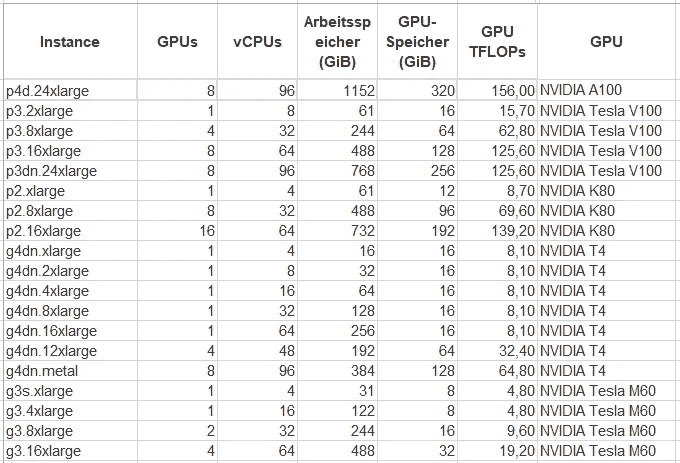

我没有给出实例价格，因为它们会随着你所在的地区而变化。目前，最便宜的实例(g4dn.xlarge)每小时的成本约为 0.60 美元，而最大的实例(p4d.24xlarge)每小时的成本约为 35 美元。此外，如果您计算每个 TFLOP 的价格，会发现定价存在巨大差异，因为其他因素也被考虑在内。但即使是 FP32 中最便宜的 8，1 TFLOPs 的 GPU 实例，也能给你比任何 CPU 都大得多的计算能力。因此，AWS 可以为深度学习助手提供很多东西。

# 如何使用所有的 TFLOPs？

大多数人都会同意亚马逊是一家非常以客户为导向的公司。这也适用于销售深度学习的 GPU。利用 power on 的一种方法是用标准的 Linux AMI(或 Amazon 机器映像)启动 EC2 实例。然后，您可以 ssh 到新租用的计算资源，开始安装您需要的所有库，就像在本地系统上一样。但幸运的是，亚马逊的聪明人想为他们的客户节省所有的时间和麻烦。请注意，互联网上的一些教程仍然描述这种做事情的方式，到目前为止，这是完全不必要的，而且容易出错。

更好的方法是只使用亚马逊提供的深度学习 ami 之一。亚马逊提供基于 Ubuntu 和亚马逊 Linux 的深度学习 AMIs。你可以使用你喜欢的任何东西，但是注意，用来登录的用户是不同的；ec2-亚马逊 Linux 的用户和 ubuntu 的 Ubuntu。我更喜欢亚马逊 Linux，所以相应地适应。

使用深度学习 AMIs 的优势在于，亚马逊已经为 AWS 基础设施安装并优化了相关的库。ami 预装了 MXNet、PyTorch、Keras、Tensorflow 和 Tensorflow 2。对于 GPU 的使用，所有这些库都使用 NVIDIA CUDA，这也是包含和预配置的，截至目前，最常用的组合是基于 Tensorflow 的 Keras(而不是基于 CUDA 的 Tensorflow 2)。没有必要自己安装这个堆栈，除非你真的想详细了解它的内部工作原理，或者想使用绝对最新的版本。

基于深度学习 AMI，这里解释了如何连接到 EC2 实例并执行下面的示例笔记本。创建 AWS 帐户后，您可以转到 AWS web 控制台并搜索 ec2。一旦你在那里，你会发现右上角的“启动实例”按钮。

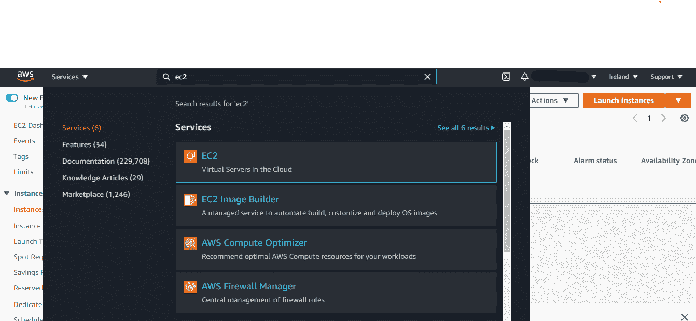

启动 EC2 实例的第一步是选择 AMI 或 Amazon 机器映像。这有点像本地磁盘上的引导分区，或者更准确地说，是它的第一个版本。如果您稍后修改该实例，它将不会反映在 AMI 中，而只会反映在该实例的附加存储上。您可以创建自己的 ami 或 ami 版本，但这超出了本文的范围。

有各种各样的深度学习人工智能可用。我会选择基于亚马逊 Linux 2 的，因为它似乎是最新的，我更喜欢亚马逊 Linux。您还可以看到预安装的库及其版本。真正好的是，它们针对大多数 EC2 实例类型进行了预配置，包括 GPU 和优化的 CPU 使用。

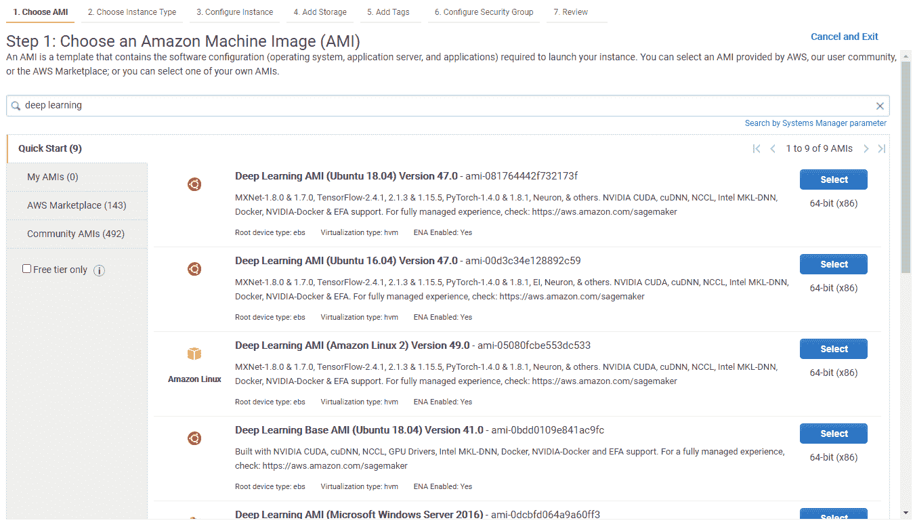

下一步是选择实例类型。您将只能选择与 AMI 兼容的实例类型。您可以按实例族(如 g4dn)进行过滤，以查找支持 GPU 的实例类型。您还会看到一些关于实例类型的相关信息。您不会看到 GPU 的数量和类型，因此您必须记住这一点，或者使用本文中上面的便利表格。

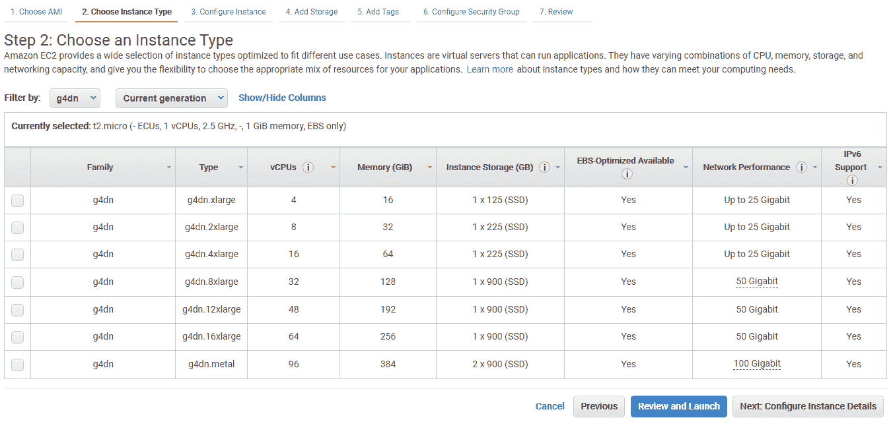

启动实例时，可能会出现一些警告。一个问题是，GPU 实例不是免费层的一部分，所以即使在使用 AWS 的前 12 个月，你也必须付费。第二件事是安全组默认对世界开放。它仍然受到 SSH 和密钥对的保护，但是对于 Python 笔记本场景，最好只限制对您的 IP 的访问。第三件事是，大多数 AWS 帐户都有配额，其中不包括 GPU 实例，以防止欺诈和计费冲击。你可以通过开一张票来改变这个报价，它通常会通过。然而这需要几个小时。请注意，配额在 vCPUs 上！例如，在 g4dn 实例类型中，您需要至少 4 (v)个 CPU 的配额才能启动最小的实例类型。由于 AWS 以客户为导向，您将在 AWS web 控制台的警告或错误消息中找到解决所有这些问题的便捷链接。

你需要的最后一件事是一个密钥对，以便能够从互联网访问你的机器。请注意，您必须将它存储在本地，因为您将无法再次从 AWS 中检索它！

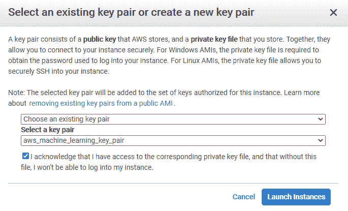

在您按下“启动实例”之后，如果使用 AWS，您将会遇到一个不利的情况:您必须等待几分钟实例才能启动。考虑到他们必须分配虚拟资源、配置网络和路由器、连接存储和启动 Linux，几分钟似乎是合理的。然而，这比从 SSD 启动本地系统花费的时间要长得多。

恭喜你，几分钟后，你将有一个虚拟系统在云端运行，等待你使用。现在，你能用它做什么？其实不多。基本上，您现在唯一能做的就是使用您已经安全存储的密钥对对它进行 ssh。

为此，您需要新启动的实例的公共 IP 地址。您可以通过单击实例详细信息来查找它。如果你选择了 Amazon Linux，你可以在 Ubuntu 上以 ec2-user 的身份登录。从 Linux 或 MacOS 在系统上使用 ssh 非常简单:

```
ssh -i my-key-pair.pem ec2-user@ip.region.compute.amazonaws.com
```

在 Windows AWS 上，建议使用您必须预先安装的 PuTTY。在 PuTTY 中，您需要相同的信息。您在 SSH → Auth → private key file 中输入用户和公共 IP als 主机名以及密钥文件。注意，密钥文件有两种不同的格式，您可以使用 PuTTYgen 来回转换文件。PuTTYgen 与 PuTTY 一起安装，对于 Linux 和 MacOS，您将需要一个 pem 文件，而对于 PuTTY，您将需要一个 ppk 文件。

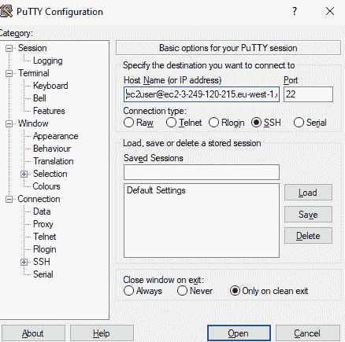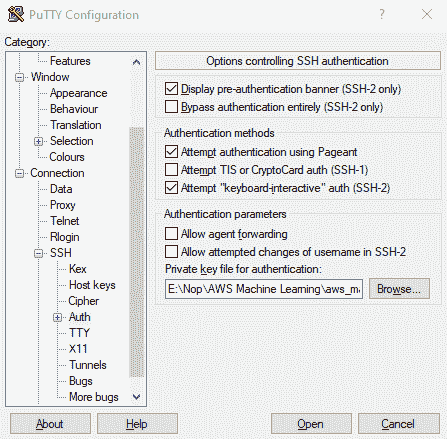

完成所有这些步骤后，您将最终在云中看到您新租用的系统的控制台。AWS 将向您展示，您已经安装了相当多的 Python 和深度学习框架的不同组合的环境。要开始使用 Keras，我推荐 TensorFlow(+Keras2)和 Python3 (CUDA +和英特尔 MKL-DNN)。正如您所看到的，这些配置包含了相当多的库，希望能在所有 AWS 实例类型上为您提供最佳性能。要开始，请键入:

```
source activate tensorflow_p37
```

一旦你运行了这个 Python 环境，你就可以通过输入 jupyter notebook 来创建一个笔记本。但是，您将无法从浏览器访问它，因为您的 AWS 实例将只接受 ssh 连接，而不接受任何其他端口上的连接。对于 Jupyter 笔记本电脑，您可以调整安全组，使其也接受从您的 IP 到端口 8888 的连接。推荐且更安全的方法是建立 ssh 隧道。

在 MacOS 或 Linux 上设置隧道是通过以下命令行完成的:

```
ssh -i my-key-pair.pem -L 8888:localhost:8888 
  ec2-user@ip.region.compute.amazonaws.com
```

使用 PuTTY 是另一个菜单中的另一个选项:

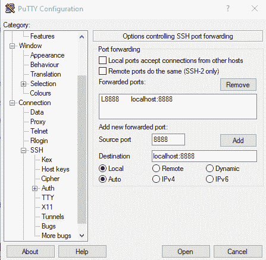

将要发生的是，ssh 或 PuTTY 将在您的本地主机上建立隧道，并启动与您的 AWS 实例的控制台会话。您必须保持 ssh 或 PuTTY 运行，以使隧道工作。一旦在实例上启动了 Jupyter 笔记本，就可以使用 localhost:8888 在浏览器上访问它。不要忘记在启动笔记本之前设置环境，因为在不同的 Python 环境中可能会有不同版本的 Jupyter。最终我们得到了我们需要的开始。在笔记本中，您将再次有各种 Python 内核和库可供选择。你应该用 conda_tensorflow_p37 内核。

# 有更简单的方法吗？

与在本地系统上运行整个堆栈相比，在 EC2 实例上使用深度学习 AMIs 已经相当容易了。你可以考虑的一个选择是使用 docker 容器，它也是 AWS 为深度学习提供的。唯一合适的情况是，您已经在 AWS 上运行了一个容器基础设施。在这样的设置中，部署训练好的模型变得更容易，但是对于开始深度学习的人来说，这是未来相当多的步骤，你直接使用 AMI 学到的一切仍然适用。

一个值得考虑的替代产品是 AWS Sagemaker。定义 Sagemaker 是相当棘手的，因为它基本上只是 AWS 的一个相当大的机器学习产品集的营销名称。除了已经在 Sagemaker 旗下提供了大量服务之外，AWS 还在不断扩展这一服务。深度学习只是其中的一小部分。

这里要考虑的服务是 Sagemaker 笔记本。或者有 Sagemaker 工作室，但这是截至 2021 年 7 月的最近产品。目前我看不出使用 Sagemaker Studio 有什么好处，但这可能会随着时间的推移而改变。

从深度学习开始使用 Sagemaker 笔记本变得更加容易，并且您还可以在单独的实例上进行培训。这意味着您的笔记本电脑实际上不需要 GPU 实例，而只是为了训练您的网络。以下是对这种情况的逐步解释。

与使用普通 EC2 不同，您可以在 AWS 控制台上搜索 Sagemaker:

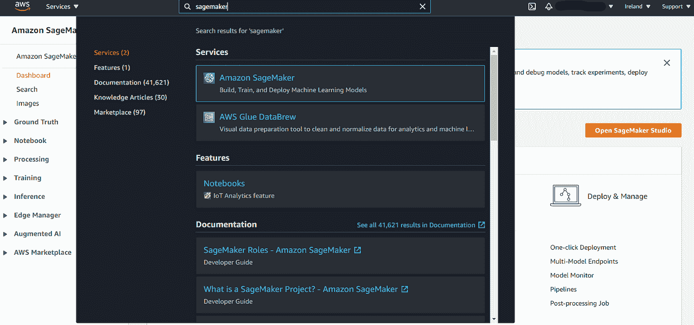

在这里，我们要创建一个笔记本，所以只需查找笔记本→笔记本实例，然后选择创建。现在，您可以选择所需的实例类型。用于 Sagemaker 的所有实例类型都有一个“ml”在他们的名字前面加上前缀。您还需要一个 IAM 角色，但是您可以让 Sagemaker 为您创建一个默认角色并使用它。

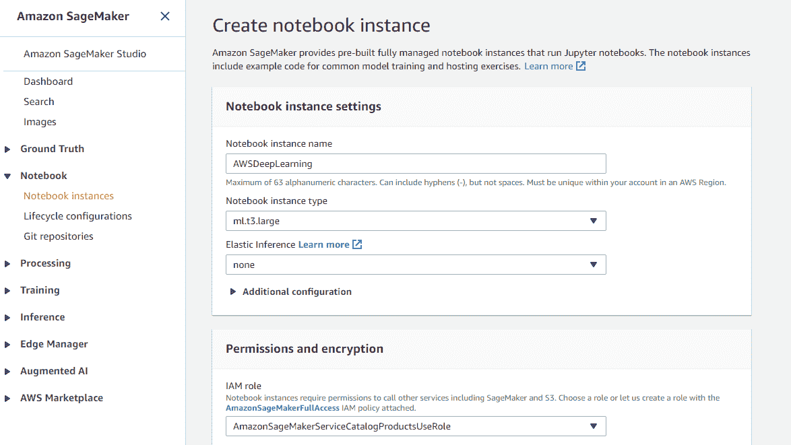

按下“创建笔记本实例”并再次等待几分钟。一旦 AWS 为您设置好一切，您就可以看到您的笔记本实例。使用 Jupyter notebook 或 JupyterLab 就像点击提供给您的链接一样简单。

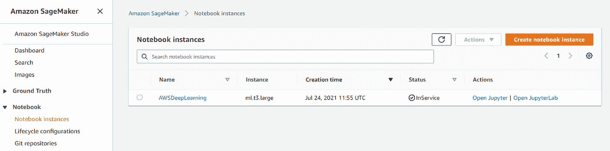

这很容易。缺点是什么？正如您在分步示例中看到的，您将使用 ml。EC2 实例类型的变体。由于生活中没有免费的东西，AWS 目前将对使用 Sagemaker 的每一小时收取 30%的费用！公平地说，Sagemaker 还有额外的好处。然而，如果你刚刚开始探索深度学习，这些额外的服务并不真正相关。

如果易用性值得，额外费用由您决定。不利的一面是，Sagemaker 使用的图像似乎比深度学习 AMIs 的最新版本要老一些。随着机器学习和深度学习的流行包的新版本以相当高的频率发布，这对你来说可能是个问题。

# 摘要

虽然长期以来，先进的深度学习实验一直是拥有必要硬件的 IT 专家的专属，但现在每个人都可以在云中进行，Sagemaker 等 AWS 服务使几乎每个人都有可能拥有 Python 的基本技能和机器学习的一般知识。您将能够使用高端硬件进行培训，使您能够从最近的研究成果中获得深度网络方面的经验。这将花费你，但是为你的本地系统购买一个 700 美元以上的现代 GPU 将会为你购买相当多的云培训时间。

有了 AWS 服务，如果你愿意支付账单，你基本上没有任何限制。其他云供应商也有替代方案，有些甚至是免费的，免费的解决方案通常有一些限制，这取决于您想要处理的网络和数据可能是至关重要的。总之，当前的 AWS 产品非常有吸引力，为以合理的成本进行深度学习实验提供了一个良好的起点。