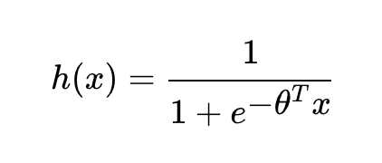
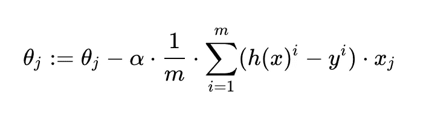
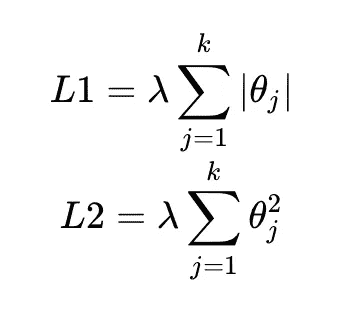
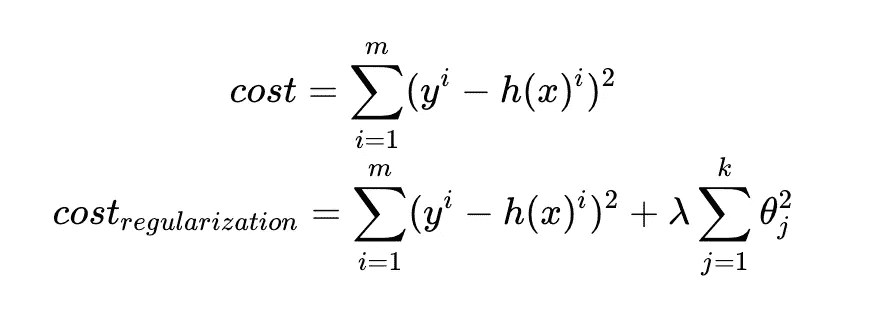
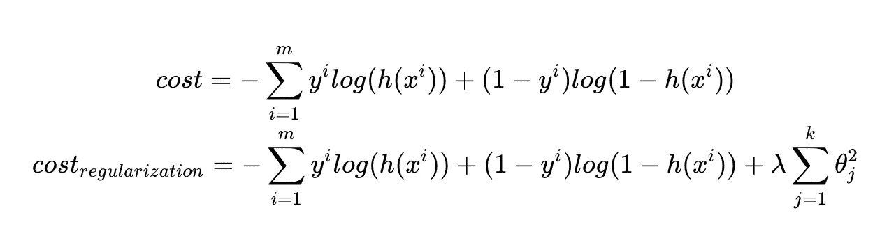
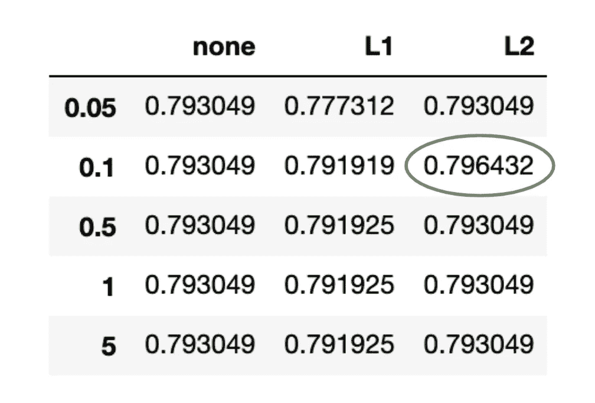
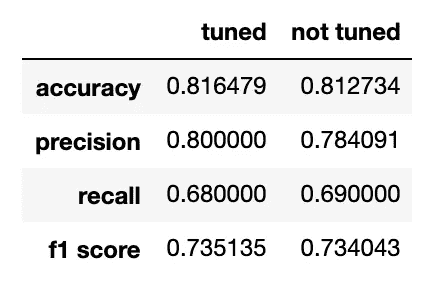
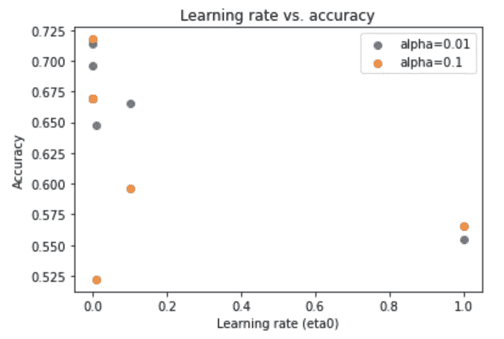
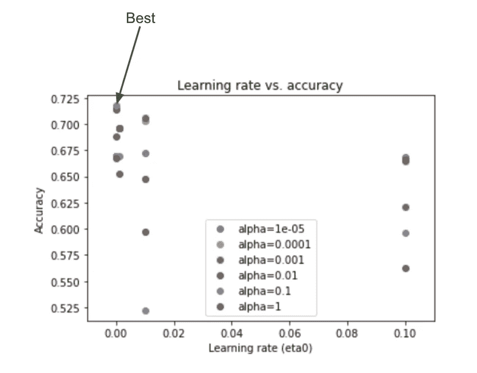

# 理解和执行机器学习模型超参数调整的初学者指南

> 原文：<https://towardsdatascience.com/the-what-why-and-how-of-hyperparameter-tuning-for-machine-learning-models-1a2634e9ca9e?source=collection_archive---------8----------------------->

## [动手教程](https://towardsdatascience.com/tagged/hands-on-tutorials)、[入门](https://towardsdatascience.com/tagged/getting-started)

## 超参数调整的内容、原因和方式


[图片来源](https://www.pexels.com/photo/gold-saxophone-45243/)

超参数调整是开发机器学习模型的重要部分。

在本文中，我通过比较具有不同超参数值的**逻辑回归**模型的预测能力来说明超参数调整的重要性。

最重要的是。

# 什么是超参数？—什么

## **参数与超参数**

*   参数是从数据集估计的。它们是模型方程的一部分。下面的等式是一个逻辑回归模型。θ是包含模型参数的向量。



θ是参数

*   手动设置超参数以帮助估计模型参数。它们不是最终模型方程的一部分。

## 逻辑回归中超参数的例子

1.  **学习率(α)。**训练逻辑回归模型的一种方式是梯度下降。学习率(α)是梯度下降算法的重要组成部分。它决定了每次迭代中参数θ的变化量。



特征 j 的参数(θ)的梯度下降

需要复习梯度下降吗？阅读这篇绝对介绍线性回归和梯度下降的文章。

[](/linear-regression-and-gradient-descent-for-absolute-beginners-eef9574eadb0) [## 绝对初学者的线性回归和梯度下降

### 梯度下降的简单解释和实现

towardsdatascience.com](/linear-regression-and-gradient-descent-for-absolute-beginners-eef9574eadb0) 

**2。正则化参数(λ)。**正则化参数(λ)是添加到成本函数的“惩罚”项中的常数。将这种惩罚加到成本函数中称为正则化。有两种类型的正规化——L1 和 L2。他们在惩罚等式上有所不同。



在线性回归中，成本函数就是误差平方和。加入一个 L2 正则项，它就变成了:



线性回归的成本 fxns

在逻辑回归中，成本函数是二元交叉熵或对数损失函数。加入一个 L2 正则项，它就变成了:



正规化是做什么的？

在训练模型时，模型应该为每个特征找到一个权重。每个权重是向量θ中的一个值。因为现在对某个要素的权重进行了惩罚，所以它会激励模型将某些要素的权重向 0 靠拢。因此，正则化使模型的复杂性最小化，以避免过度拟合。

# 您如何着手优化超参数？—方法

现在我们知道了要调优什么，让我们来谈谈调优它们的过程。

有几种优化超参数的策略。其中两种是网格搜索和随机搜索。

## 网格搜索

在网格搜索中，我们为每个超参数预设了一个值列表。然后，我们评估该列表中每个值组合的模型。

伪代码应该是这样的:

```
penalty = ['none, 'l1', 'l2']
lambda = [0.001, 0.1, 1, 5, 10]
alpha = [0.001, 0.01, 0.1]hyperparameters = [penalty, lambda, alpha]# grid_values is a list of all possible combinations of penalty, lambda, and alpha
grid_values = list(itertools.product(*hyperparameters))scores = []for combination in grid_values:
   # create a logistic regression classifier
   classifier = MyLogisticRegression(penalty=combination[0], ...) # train the model with training data
   classifier.fit(X_train, y_train) # score the model with test data
   score = classifier.score(X_test, y_test)
   scores.append([ combination, score])# Use scores to determine which combination had the best score
print(scores)
```

(实际上，我们会评估几种类型的“分数”，如准确性、F1 分数等。我将在后面的章节中讨论这些。)

## 随机搜索

在随机搜索中，我们不提供预设的超参数列表。相反，我们给搜索者一个每个超参数的分布。搜索算法尝试随机组合值以找到最佳值。对于大型超参数集，随机搜索要高效得多。

让我们做一些机器学习！

我用的数据集是来自 [Kaggle](https://www.kaggle.com/c/titanic/data) 的泰坦尼克号数据集。在之前的[文章](/would-jack-realistically-have-died-aboard-the-titanic-a6ac8308ed49)中，我用这个数据集预测如果我们敬爱的杰克是一名真正的乘客，他是否真的会死于海难。

我们将在这篇文章中继续这一趋势，根据乘客的特征来预测生存的可能性。

[](/would-jack-realistically-have-died-aboard-the-titanic-a6ac8308ed49) [## 杰克真的会死在泰坦尼克号上吗？

### 机器学习如何回答这个问题

towardsdatascience.com](/would-jack-realistically-have-died-aboard-the-titanic-a6ac8308ed49) 

在训练模型之前，我们需要进行一些数据处理。本质上，我不得不:

1.  删除可能无用的列，例如“Name”
2.  删除缺少“Embark”值的行(总共 2 行)
3.  用猜测值填写缺失的年龄值(总共 177)。在这种情况下，猜测是基于“Parch”——船上父母和孩子的数量。
4.  用一键编码转换分类变量。

你也可以在我的 [Jupyter 笔记本](https://github.com/lilychencodes/Titanic-survival-prediction/blob/master/titanic_hyperparameters_tuning.ipynb)上找到这些数据处理步骤的代码以及更详细的解释。

在所有的数据处理之后，这是我的最终数据框架。


作者图片

接下来，将数据分为训练集和测试集，用于模型训练和评估。

让我们看看正则化和学习率α如何影响模型性能。

# 为什么调整超参数很重要？—为什么

很快您就会看到，超参数的调整会影响模型的准确性和 F1 值。不确定这些指标意味着什么？在我之前的[泰坦尼克号文章](/would-jack-realistically-have-died-aboard-the-titanic-a6ac8308ed49)里看到了它们的定义。

## 正规化的影响

我使用 SciKit-Learn 的[逻辑回归](https://scikit-learn.org/stable/modules/generated/sklearn.linear_model.LogisticRegression.html)分类器来拟合和测试我的数据。有许多求解器可供选择，每个求解器都有自己的收敛算法。为了便于说明，我选择了*【传奇】*解算器。它是唯一支持 L1、L2 和无正则化的求解器。

注意:对于 Scikit-Learn 的 LogisticRegression，分类器采用的不是λ正则化参数，而是正则化强度的倒数“C”。就当是 1/λ吧。

我使用 SciKit-Learn 的 [GridSearchCV](https://scikit-learn.org/stable/modules/generated/sklearn.model_selection.GridSearchCV.html) 来获得模型对于`penalty = ["none", "l1", "l2"]`和`C = [0.05, 0.1, 0.5, 1, 5]`的每种组合的得分。

```
from sklearn.model_selection import GridSearchCVclf = LogisticRegression(solver='saga', max_iter=5000, random_state=0)param_grid = { 'penalty': ['none', 'l1', 'l2'], 'C': [0.05, 0.1, 0.5, 1, 5] }grid_search = GridSearchCV(clf, param_grid=param_grid)grid_search.fit(X, y)result = grid_search.cv_results_
```

GridSearchCV 进行内部 5 重交叉验证。每个组合的平均模型分数为:



作者图片

C 为 0.1 的 L2 正则化表现最好！

**边注#1:** 我还用 SciKit-Learn 的 [RandomizedSearchCV](https://scikit-learn.org/stable/modules/generated/sklearn.model_selection.RandomizedSearchCV.html) 实现了一个随机搜索算法。如果你好奇，你可以在我的 [Jupyter 笔记本](https://github.com/lilychencodes/Titanic-survival-prediction/blob/master/titanic_hyperparameters_tuning.ipynb)里找到例子。

**旁注#2:** 我敢肯定你注意到了，没有正则化比 L1 表现得更好，而且在很多情况下，没有正则化和 L2 没有区别。我有最好的解释是，SciKit Learn 的逻辑回归可能在没有正规化的情况下已经运行良好。然而，正规化确实带来了一些改善。

我们将在后面看到正则化在 SGDClassifier 中确实起了很大的作用。

然后，我对没有正则化和有 L2 正则化的几个性能指标进行了并排比较。

```
tuned = LogisticRegression(solver='saga', penalty='l2', C=0.1, max_iter=5000, random_state=2)not_tuned = LogisticRegression(solver='saga', penalty='none', max_iter=5000, random_state=2)tuned.fit(X_train, y_train)
not_tuned.fit(X_train, y_train)y_pred_tuned = tuned.predict(X_test)
y_pred_not_tuned = not_tuned.predict(X_test)data = {
    'accuracy': [accuracy_score(y_test, y_pred_tuned), accuracy_score(y_test, y_pred_not_tuned)],
    'precision': [precision_score(y_test, y_pred_tuned), precision_score(y_test, y_pred_not_tuned)],
    'recall': [recall_score(y_test, y_pred_tuned), recall_score(y_test, y_pred_not_tuned)],
    'f1 score': [f1_score(y_test, y_pred_tuned), f1_score(y_test, y_pred_not_tuned)]
}pd.DataFrame.from_dict(data, orient='index', columns=['tuned', 'not tuned'])
```



作者图片

除了召回率之外，在所有指标上，调优的都比未调优的好。同样，如果您需要重温这些指标的含义，请阅读这篇[博客文章](http://Titanic article)。

## 学习率的影响(和正规化)

为了了解不同的学习速率如何影响模型性能，我使用了 SciKit Learn 的 [SGDClassifier](https://scikit-learn.org/stable/modules/generated/sklearn.linear_model.SGDClassifier.html) (随机梯度下降分类器)。它允许我调整学习率，而[逻辑回归](https://scikit-learn.org/stable/modules/generated/sklearn.linear_model.LogisticRegression.html)分类器却不能。

我们可以调整 SGDClassifier 的三个参数:`alpha`、`learning_rate`和`eta0`。术语有点混乱，请多包涵。

`learning_rate`是学习率的类型(“最佳”与“恒定”)。

当`learning_rate`为“常数”时，`eta0`是算法的学习速率。正常情况下，我称`eta0`为 alpha。

`alpha`是乘以正则项的常数。它还用于计算`learning_rate`为“最优”时的学习率。`alpha`服务于通常所说的 lambda 的目的。

因此，有几种方法可以在 SGDClassifier 中设置学习率。如果您想要一个恒定的学习率，设置`learning_rate='constant'`和`eta0=the_learning_rate_you_want`。如果你想要一个动态的学习率(这取决于你所处的步骤)，设置`learning_rate='optimal'`。在“最优”的情况下，不使用`eta0`，并且`alpha`在计算每一步的动态学习率时起到正则化强度和常数的双重作用。

下面是查找最佳超参数的网格搜索算法(针对恒定学习速率)。我使用“恒定”的学习速率，并将最大迭代次数设置为 50，000 次。

```
from sklearn.linear_model import SGDClassifier
import matplotlib.pyplot as pltsgd = SGDClassifier(loss="log", penalty="l2", max_iter=50000, random_state=100)param_grid = {
  'eta0': [0.00001, 0.0001, 0.001, 0.01, 0.1, 1],
  'learning_rate': ['constant'],
  'alpha': [0.00001, 0.0001, 0.001, 0.01, 0.1, 1]
}grid_search = GridSearchCV(sgd, param_grid=param_grid)grid_search.fit(X, y)result = grid_search.cv_results_
```

搜索者给出了 0.1 的`alpha`(这里指正则化强度)和 0.0001 的`eta0`(学习率)作为最佳参数，得分为 0.7176。

对于正则化强度(`alpha`)的几个不同值，我绘制了准确度与学习速率(`eta0`)的关系图。您可以看到，学习率和正则化强度对模型的性能都有显著影响。



作者图片

对于 0.00001 的学习率来说，精度相当低。这可能是由于算法在梯度下降过程中收敛太慢；经过 50000 次迭代后，我们离最小值还远着呢。对于高学习率(0.1 & 1)，准确度也较低。这可能是由于超调。下面是一个更大规模的所有阿尔法图。



作者图片

正则化强度(alpha)在准确性方面也发挥了作用。对于任何给定的学习率(eta0)，基于 alpha 值有很大的准确度分布。

学习率和正则化只是机器学习模型中的两个超参数。每个机器学习算法都有自己的超参数集。有问题吗？评论？下面回复。