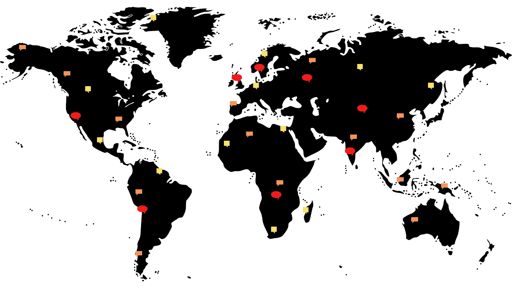
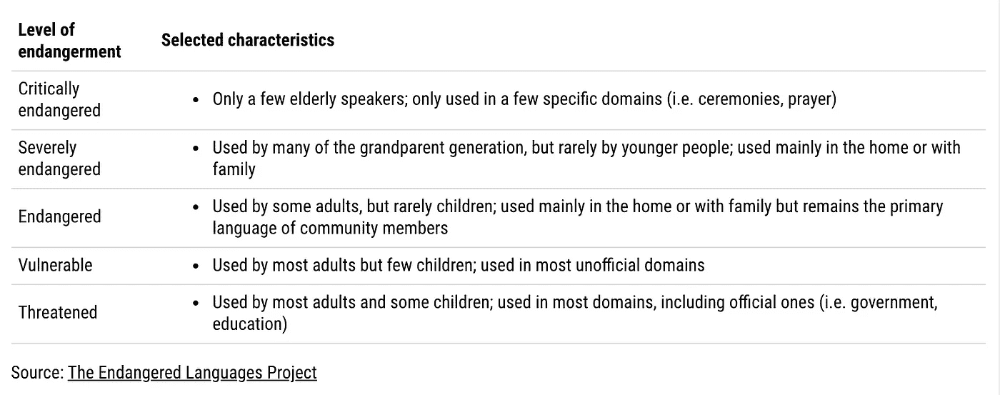

# 语言学的白犀牛

> 原文：<https://towardsdatascience.com/the-white-rhinos-of-linguistics-c8072b390212?source=collection_archive---------43----------------------->

## [变更数据](https://towardsdatascience.com/tagged/data-for-change)

## 利用数据促进语言保存

*这个作品最好在台式机或者平板电脑上体验。*

图片作者。

在我就读的高中，所有高年级学生都必须就他们选择的一个社会科学主题撰写一篇期末研究论文才能毕业。我写了一篇关于双语教学好处的文章，这篇文章的灵感来自于我在接受正规教育的过程中无法流利地使用一种以上的语言，这让我对世界语言的多样性产生了持久的欣赏。

本周，一个随机的网络兔子洞把我带回了这个话题。我发现，在现存的大约 7000 种语言中，[超过 40%](http://www.endangeredlanguages.com/about/) 属于“濒危”类别。这意味着他们有从我们的集体知识中消失的危险。

这些语言被世界各地的土著社区所拥有，体现了他们的历史、传统、文学和知识。它们是这些社区了解传统草药、其口头讲故事实践、其他宝贵的文化和科学现象以及在更常见的语言中很少见到的独特语言结构(如主语、宾语和动词在短语中的位置)的载体。语言保护领域的专家将失去一个语系比作失去动物界的一个分支——想象一个所有鸟类或鲸鱼都灭绝的世界。当语言被归类为濒危语言时，交流方式并不是唯一受到威胁的东西——语言的丧失很少是自愿的，它可能源于权力失衡，剥夺了说话者的权利和身份。

要阅读更多关于保护语言多样性的内容，请查看来自濒危语言项目(ELP)的资源和关于语言生存的具体干预措施的论文[。](https://link.springer.com/content/pdf/10.1007/s10993-006-9034-3.pdf)

## 那么数据呢？

ELP 的[目录](http://www.endangeredlanguages.com/lang/region)包含了 3000 多种濒危语言，每一种语言都有不同程度的信息。这个数据集的大小在足够小以讲述每个单独点的故事和足够大以得出关于整体的试验性结论之间取得了幸运的平衡。

在我展示我的视觉化之前，这里有一个总结 ELP 濒危语言分类的表格。在今天仍然存在的语言中，被标为“极度濒危”的语言面临灭绝的最大风险。ELP 用来对语言进行分类的其他未列出的因素包括其使用人数和使用人数趋势。

作者图片(用 Datawrapper 制作)。来自濒危语言项目的信息。

我选择展示 ELP 大多数编目语言的蜂群图(关于我排除了哪些语言的更多信息在本文的附录中)，每个点代表一种濒危语言。你可以和下面的最后一块互动。

**确定性水平**表示 ELP 拥有关于上面列出的每个因素的多少信息(例如，如果只知道使用一种语言的人数，其确定性水平将是 20%)。

> 要了解每种语言的更多信息，**将光标悬停在每个彩色圆点上。要更详细地了解每种濒危等级的语言，请使用图左上方的**下拉功能**。**

每个濒危等级中的点的聚类表明绝对的说话者数量高度影响语言的分类。然而，一些有很多人使用的语言被指定为极度濒危，而一些人较少的语言只是易受影响——这可能是因为一些社区人口较少，但保留了他们传统语言的丰富知识和传播。

## 可视化实验

在设计了这个直观的量化方法来可视化 ELP 的目录后，我问自己，我还能如何展示语言保护事业的紧迫性和希望。

虽然不是所有的语言(尤其是面临风险的语言)都有书写文字，但我认为许多语言都是依靠书写来传承知识和传统的。然后我制作了一系列幻灯片，提供了关于七种极度濒危语言的基本信息，用单词本身来表达我们离失去这些传统有多近。

资料来源:ELP 目录

在揭示每个描述的全文时，你可能会注意到一些最受威胁的语言的复兴项目已经就绪。尽管语言消失的速度比以往任何时候都快，但社区正在认识到语言遗产的重要性，并为后代投资研究和教育。你可以通过解决方案新闻网络的故事跟踪者在这里阅读大量关于这项工作的例子。

濒危语言的问题是一个跨学科的问题，也是一个交叉的问题。虽然我在这里只给出了该领域的概述，但我希望您现在有兴趣了解更多。

感谢您的阅读！

我非常感谢濒危语言项目在我起草这部作品的过程中给予我的帮助和支持。

**数据来源:**

*濒危语言目录*。2021.夏威夷大学马诺阿分校。[http://www.endangeredlanguages.com](http://www.endangeredlanguages.com)。

# 附录:注释、警告和过去的迭代

*   对于我的第一次可视化，我试图坚持统计学家爱德华·塔夫特的优化“数据-墨水”比率的原则。这指的是与呈现的数据不直接相关的设计元素应该被移除的想法(即轴线、网格线和注释)。关于他的其他原则的更多信息，请参见[这里](https://thedoublethink.com/tuftes-principles-for-visualizing-quantitative-information/)。
*   当数据库中给出了一系列绝对说话人数量时，我取它们的平均值来生成一个值。这就是为什么有些语言显示有十进制数的发言者。
*   我删除了被列为“休眠”、“觉醒”或“处于危险中”的语言。“休眠”语言通常没有使用者，而数据集中只有一种“觉醒”语言。“濒危”语言与上述濒危等级分开分类(它们的脆弱性介于非濒危语言和“脆弱”语言之间)。

## 以下是第一次观想的先前迭代:

这里的每一行都代表一种语言，从左到右按字母顺序排列。然而，对于观看者来说，有太多的混乱以至于不能有意义地参与到图形中。

*   从我的第一次迭代开始，由于观察到的数值范围很大，我对“说话者数量”轴使用了对数标度。

*   然后我将语言从最常用到最少使用排序，这导致了一个更整洁的情节。然而，这很难吸引眼球。

*   接下来，我对每种语言的循环表示进行了实验，这导致了这种类似蜈蚣的混乱。
*   左下角的两个点是数据清理错误。

*   在本文介绍的可视化的最后一次迭代中，我使用了一个气泡图，在 y 轴上是分类值，在 x 轴上是连续值，这样的图看起来更有条理。然而，这篇文章的数据-墨水比例不平衡——我使用了三种不同的视觉元素(点位置、点大小和点颜色)来表示同一个变量(扬声器的数量)！区分语言也很困难。

我怎样才能改善这两种观想？我对濒危语言的第二种更抽象的表述对你有意义吗？请回复这篇文章让我知道！

