# 深度度量学习的原因和方法。

> 原文：<https://towardsdatascience.com/the-why-and-the-how-of-deep-metric-learning-e70e16e199c0?source=collection_archive---------1----------------------->

## 深入研究基于度量的深度学习。

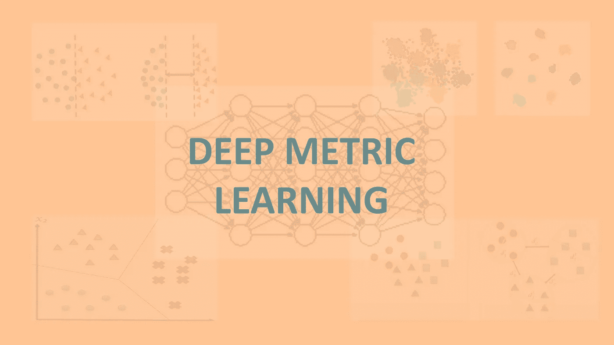

作者图片

*这篇文章深入探讨了深度度量学习方法的基础，以及它如何帮助人脸验证和人脸识别等任务实现最先进的结果。在我过去的实习期间，我一直在从事这些任务，看到深度度量学习方法对于这种任务的力量影响了我写这篇文章。除了人脸识别、验证之外，深度度量学习已经被证明是非常有效的许多其他应用；异常检测、三维(3D)建模就是其中的几个例子。*

# 目录

1.  **先决条件**
2.  **基础知识之旅** *。人脸验证，人脸识别*。人工神经网络(训练阶段和推理阶段)
3.  **用于人脸验证的图像分类？** *。一次性学习
4.  **公制**
5.  **公制学习** *。马氏距离度量
6.  **深度度量学习
    *。**对比损失——连体网*。三重态损失—三重态网络*。Softmax 损失
    *。A-Softmax 损耗
    *。大幅度余弦损失(LMCL)
    *。弧面损失
7.  **参考文献**

# 先决条件

读者需要很好的线性代数知识，并且熟悉机器学习的基本概念才能理解这篇文章。我希望你会喜欢学习深度公制学习。

**关键词:**度量学习，三重损失，softmax 损失，人脸识别，人脸验证，DCNN，Arcface，Sphereface，Cosface。

一种人脸验证系统。[来源](https://dribbble.com/shots/5612333-Verified-on-Dribbble)由 Dribble.com 的[森雅](https://dribbble.com/xenianema)提供。

# **基础知识之旅**

让我们首先了解一些基本术语，并建立一个坚实的基础来增强我们对深度度量学习的理解。

**人脸验证**是确定给定的一对图像是否属于同一个人的任务。简单地说，这是一项任务，给定一幅图像，我们试图回答这个问题。**是你吗？。**一个 **1:1** 的认证问题。

**人脸识别，**则是两个任务的结合:**人脸识别**和**人脸验证**。人脸识别是从图像数据库中识别一个人的任务。在给定一个图像数据库(比如说一个 k 人画廊)的情况下，我们尝试回答这个问题，**你是谁？。**所以，人脸识别是一个 **1:k** 认证问题。

了解一个简单的**人工神经网络**的基本训练和推理过程是相当有帮助的。{如果您熟悉该主题，请跳过这一部分}。

## 培训阶段

1.  我们**根据某种概率分布随机初始化**权重和偏差，
2.  将数据集输入**未经训练的**神经网络架构。
3.  **正向传播**:隐藏层接受输入数据，应用**激活**功能，并将激活传递给下一个连续层。我们传播结果，直到我们得到预测的结果。
4.  生成预测后，我们通过将**预测的**结果与地面真实标签进行比较来计算**损失**。
5.  **反向传播:**我们计算权重和偏差的损失 wrt 的**梯度**，并通过减去与梯度成比例的少量来调整它们。
6.  我们对整个训练集重复步骤 1 到 5——这是一个时期。重复更多的时期，直到最终我们的误差最小化或我们的预测分数最大化。

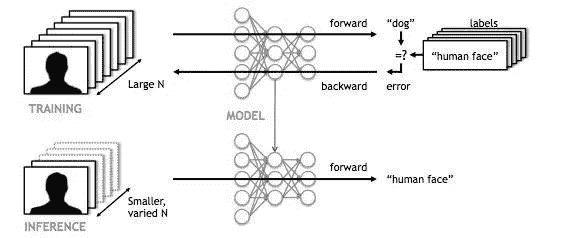

深度学习模型的一般训练和推理阶段。此处引用自[的图片。](https://developer.nvidia.com/blog/inference-next-step-gpu-accelerated-deep-learning/)

## 推理阶段

在这个阶段，不进行梯度计算或参数调整。它使用相同的权重和偏差集来评估网络以前没有见过的未知测试数据集。

**深度神经网络**是在计算机视觉任务方面实现最先进性能的首选模型。从数据中学习**不变量**和**区别特征**是实现任何计算机视觉任务的良好结果的非常基本的目标。深度学习方法已被证明对**特征学习相当有效，**原因就在于深度学习方法通过从低级特征构建高级特征来学习**分级**特征表示的能力。

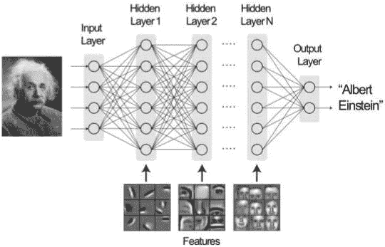

深度神经网络学习分层特征表示。[来源:深度学习，神经科学杂志](https://www.jneurosci.org/content/38/34/7365)。

# 图像分类:

能否用图像分类来解决图像验证的任务？我们可能能够学习一个非常强大的深度卷积神经网络，该网络在分类组织中的所有员工图像方面表现出色，并且还考虑了姿势、表情和照明等因素。

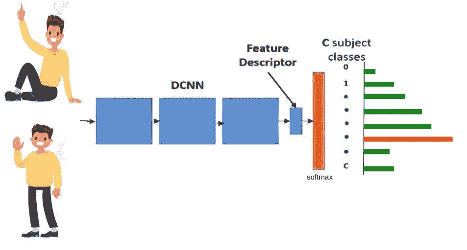

图片作者:DCNNs 用于图像分类。

但是，这通常是在我们拥有大量数据时实现的。我说的大量是指每个班级/员工的 1000 个例子。在图像分类中，如果每类的**数据点数量很少，可能会导致**过拟合**，产生非常差的结果。此外，当类别数量较少时，图像分类通常工作良好。**

然而，人/图像验证任务通常不是这种情况。其实完全相反。在这里，我们通常有大量的类，而每个类的例子数量却很少。这就是一次性学习发挥作用的地方。

**One-shot Learning:** 分类问题，旨在从一个/几个训练样本/图像中学习物体类别。【维基百科】。简单地说，给定一个人的例子/图像，你需要认出他/她。要建立一个人脸识别系统，我们需要解决这个一次性学习问题。

但是深度神经网络通常需要大量的数据来训练以擅长特定的任务，这并不总是可用的。深度学习模型在只有一个训练例子{一次性学习问题}的情况下效果不会很好。如何解决这个问题？我们学习一个**相似度函数**，它帮助我们解决一次性学习问题。

让我们通过了解基础知识来开始理解深度度量学习。

# **指标:**

度量是两点 x 和 y 之间的非负函数{比如说 **g(x，y)** }，它描述了这两点之间所谓的**‘距离’**的概念。指标必须满足几个属性:

1.  **非负** = > d(x，y) ≥ 0 且 d(x，y) = 0，**当且仅当 x = y。**
2.  **三角不等式** = > d(x，y) ≤ d(x，z) + d(z，y)。
3.  **对称性** = > g(x，y) = g(y，x)。

示例:

**A .欧氏度量:**在一个**‘d’**维向量空间中，度量是:

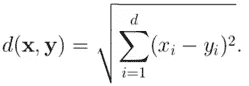

b .离散度量:该度量由下式给出:

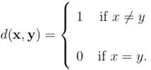

# **度量学习:**

一个基本的机器学习算法是做什么的？—给定数据和相应的输出标签，目标是提出一组**规则**或某种**复杂函数**，将这些输入映射到相应的输出标签。

捕获**距离**信息的最简单的机器学习算法之一是 **KNN** (k-最近邻)算法，其思想是为新的数据点找到 **k** 最近数据点的邻域，并将该数据点分配给大多数 **k** 数据点所属的类别。

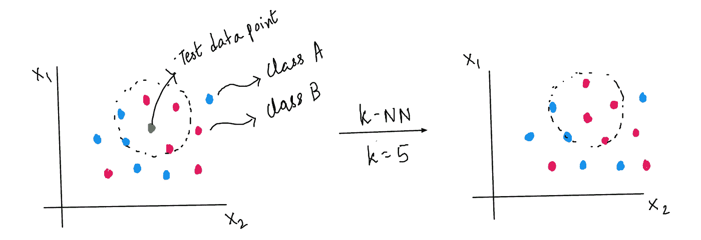

k-NN 的简单解释

类似地，度量学习的目标是从数据中学习一个**相似性函数**。度量学习旨在以减小对应于属于同一个人的面部的特征向量之间的距离并增大对应于不同面部的特征向量之间的距离的方式来学习数据嵌入/特征向量。

**欧几里德距离**在高维度中意义不大。他们无法捕捉数据中的非线性，原因有很多:

1.  它们代表一种**各向同性**(每个方向都相同)距离度量。
2.  这些距离没有抓住阶级结构。

可以使用非各向同性距离，该距离使用数据的属性来捕捉类关系的结构。**马哈拉诺比斯距离度量**就是这样一种度量。度量空间上两个样本之间的距离由下式给出:

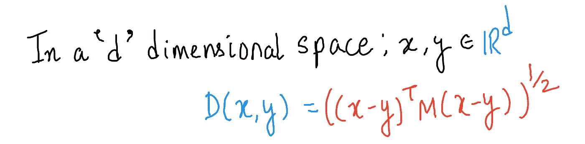

马氏距离度量

这里，M 是协方差矩阵的倒数，并作为平方欧几里德距离的权重项。Mahalanobis 距离方程表示两个随机向量 **x** 和 **y** 之间的相异度，遵循与协方差矩阵**σ相同的分布。**

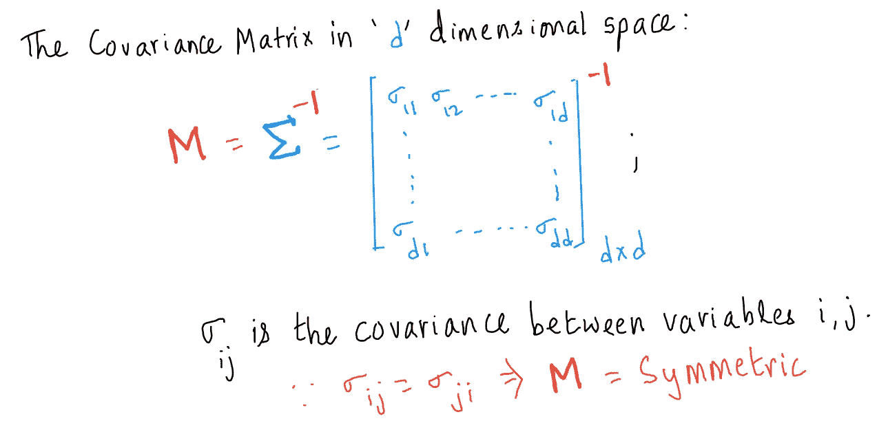

m 是协方差矩阵的逆矩阵。

如果 M = **I** (单位矩阵)我们有马氏距离的特例——欧几里德距离，它证明了欧几里德距离的一个潜在假设，即特征是彼此独立的。

马氏距离度量的线性变换性质

等式(*)可以解释为欧几里得空间中的线性投影。因此，W 具有线性变换性质，因为变换空间中的欧氏距离等于原始空间中的马氏距离。

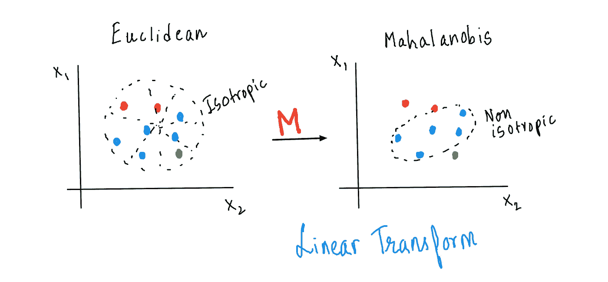

各向同性欧氏距离 V/S 非各向同性马氏距离度量

这种距离度量在变换的空间中提供了一种新的数据表示，其能够容易地区分不同类别的项目。这种线性变换显示了这种方法所具有的类间可分性能力。因此，度量学习的基本目标是学习这个变换矩阵 **W** 。

**度量学习**是一种直接基于距离度量的方法，旨在建立图像之间的相似性或不相似性。**深度度量学习**另一方面使用神经网络从图像中自动学习区别特征，然后计算度量。

**为什么需要深度度量学习？**

1.  同一个人以不同姿势、表情、光照等呈现时的面孔。或许能非常有效地骗过人脸验证/人脸识别系统。
2.  建立一个有效的、大规模的人脸验证系统的任务从根本上来说是一个设计适当的损失函数的任务，该损失函数最好地区分所研究的类别。近年来，使用深度学习的度量/远程学习已经显示出对于许多计算机视觉任务，例如人脸识别、人脸验证、图像分类、异常检测等，输出非常令人满意的结果。
3.  度量学习在捕捉数据的非线性方面能力有限。

深度度量学习通过学习特征空间的非线性变换来帮助捕捉非线性特征结构。

# 深度度量学习

我们可以通过两种方式利用深度度量学习来完成人脸验证和识别任务:

## 1.为问题设计适当的损失函数。

深度度量学习最广泛使用的损失函数是对比损失和三重损失。

## ****对比损失—连体网络:**

执行**显式度量学习**的一个非常基本的想法是暹罗网络模型。暹罗网络是一种对称的神经网络架构，由两个相同的子网组成，它们共享相同的参数集(因此计算相同的函数)，并通过计算每个子网的最高级别特征编码之间的度量来学习，每个子网具有不同的输入。

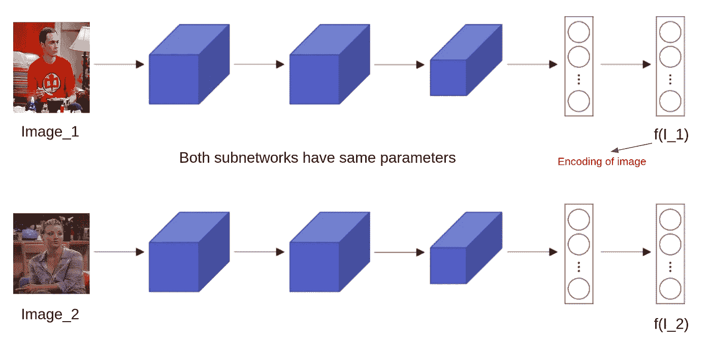

作者图片:暹罗网中的子网共享相同的参数集

数学上， **d(x，y) = ||f(x)-f(y)||** ，这里，**【x】****【y】**代表训练样本/图像。**“d(。)“**表示两幅图像之间的度量距离，“**f”**表示输入图像的编码。目标是学习参数，以便:

*   如果 **x** 和 **y** 是同一个人— d(x，y)是**小**，
*   如果 **x** 和 **y** 是不同的人——d(x，y)是**大**。

暹罗网络主要与**对比损失函数(又名成对排序损失)结合使用。**损失函数主要用于学习嵌入(特征向量),在度量空间中，来自同一类的两个实例之间的度量距离较小，而不同类之间的度量距离较大。现在，让我们来理解数学。

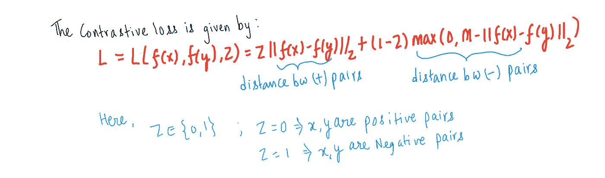

对比损失

这里，m>0 是余量，z 是布尔值，如果 x，y 是正对，则为 1，否则为 0， **||。||** 是 L2 范数，其他符号同上。

让我们来理解这个等式。如果 x 和 y 实际上是正对， **z 为 1，**因此，第二项消失( **margin m** 没有影响)。如果网络计算出 x 和 y 之间的距离很大，则损耗会很高，因为第一项对损耗有很大的贡献。

现在，如果 x 和 y 实际上是负对， **z 是 0。**这样，第一项就消失了。如果网络计算出 x 和 y 之间的距离很小(～0)，我们将会有， **L=m，**再次对损耗产生显著影响。

**边缘 m 的作用:**要注意的是，如果估计的距离 **||f(x)-f(y)|| < m** ，负对的表示将仅增加损失。这意味着一旦达到这个极限，它将不再关心负对 x 和 y 有多远。所以，它可以更专注于难以嵌入的点。

注意，连体网络主要用在每类数据点数量很少的情况下— **一次性学习**。

## *** *三重态损失—三重态网络:**

三元网络也是一种对称的神经网络结构，但是由三个相同的子网组成，它们共享相同的参数集。该学习作为一组三个图像来执行**1)****锚**图像(基线图像) **2)** 正**图像(属于与锚相同类别的特定人的真实图像) **3)** 负**图像(不属于锚类别的图像)。****

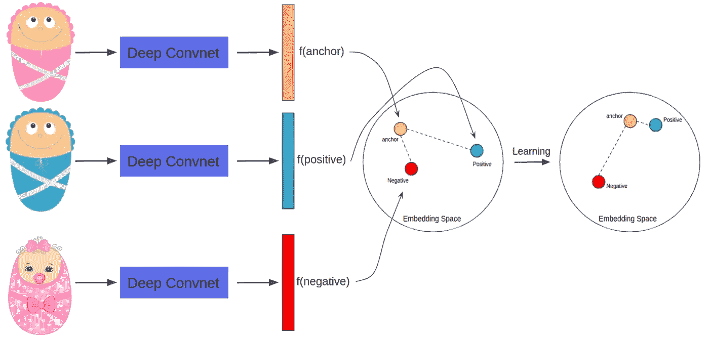

作者的图像:三重缺失背后的直觉

三元组损失的目标是确保特定人的锚点/基线图像与所有正面图像集更近**(数学上，意味着锚点和正面图像之间的欧几里德距离很小)并且远离负面示例集。**

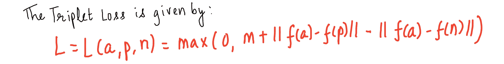

三重损失

这里，a =锚图像，p =正图像，n =负图像，m=边距。嵌入由一个**‘d’**维向量 **f(.)**{编码}。设， **d(a，p)=||f(a)-f(p)||** 。

让我们通过询问损失何时为 0 来理解这个等式。max 里面的第二项(。)应该是<0, i.e. d(a, n) > d(a，p) + m，如果出现这种情况，三元组网络将是相当幸运的，因为不会有学习。这些三胞胎被称为易三胞胎。

什么时候亏损会高？When，d(a，n) << d(a, p), which has a significant contribution to the loss. This will be a hard to train on triplet. Such triplets are known as Hard triplets. Another Case: d(a, p) < d(a, n) < d(a, p) + m, Again, the loss will be positive.

Issues with triplet loss & contrastive loss — These require a time consuming and performance-sensitive pair/triplet mining procedure to train the model.

## **2。向简单易学的分类模型添加自定义层:**

人们可以简单地通过学习通常的图像分类问题来实现远程学习。我们需要做的只是在一个简单易学的分类模型上添加一个额外的层。

## 使用 DCNN 训练和测试人脸验证系统的通用管道。

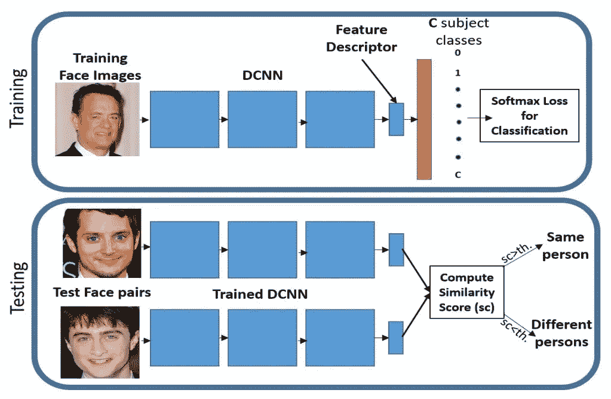

【[来源](https://arxiv.org/pdf/1703.09507.pdf)】:arXiv:1703.09507 v3【cs。简历]2017 年 6 月 7 日

1.  使用地面真实训练数据集人脸图像和相应的标签，将 DCNN 训练为图像分类任务。
2.  使用 Softmax 损失函数来优化 DCNN 模型的参数。
3.  在推理时，使用训练的 DCNN 为测试人脸对提取特征嵌入。
4.  然后，我们计算这些特征嵌入之间的余弦相似性。如果分数大于设定的阈值，我们说测试对是人，否则是不同的。

这是一个非常简单的人脸验证管道，不需要任何度量学习。

## Softmax 损失或交叉熵损失:

让我们解开 Softmax 损失的一些数学问题，以便我们理解后面的部分。我们先明确一下符号:
**C** 为总类数，
**aⱼ** 表示 softmax 激活前最后一个全连接层的 **j** ᵗʰ神经元的输出，
**pⱼ** 表示 **j** ᵗʰ神经元的 softmax 激活， **xᵢ** 表示一个规模为 **M 的训练批次中的 **iᵗʰ** 图像
**表示图像 **i** ，
**fᵢ** 是 **xᵢ** 的编码，也是最后一个全连通层的输入，
**W** 是最后一个全连通层的权重，(bias = 0 (let))，
**Lᵢ** 是图像的交叉熵损失****

**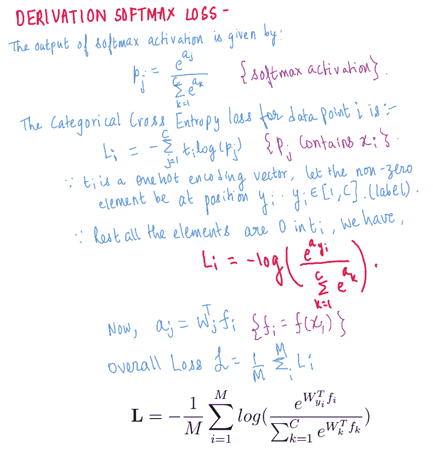**

**softmax 损失的推导**

**注意， **fᵢ** 是学习的特征向量，也是最后一个完全连接层的输入， **aⱼ** 是最后一个完全连接层的输出。由于 **W** 是最后一个完全连接的层的权重， **Wⱼ** 可以被解释为类 **j** 的线性分类器。**

## **Softmax 损失的问题:**

**虽然 Softmax 损耗可能有助于容易地收敛到最优值，但与对比损耗和三重损耗不同，softmax 损耗并不试图使正对更近，而使负对更远。Softmax loss 只学习区分度不够的可分离特征。由于这个原因，已经提出了许多在 softmax 特征之上应用度量学习的方法。**

**现在，目标是修改现有的 softmax 损失函数，使我们能够在特征空间中实现更好的区分能力。**

## **A-Softmax 损失——球面损失**

*****直觉:*** 考虑一个使用 softmax 损失函数训练的二分类问题。设 **W** ₁和 **W₂** 分别为类 **1** 和 **2** 的线性分类器。如果特征向量 **fᵢ** 如下，则数据点 **xᵢ** 被预测为类别 1:**

**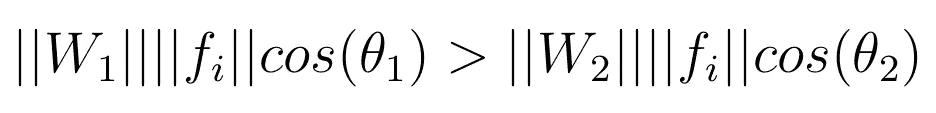**

**xᵢ属于 1 类的条件**

**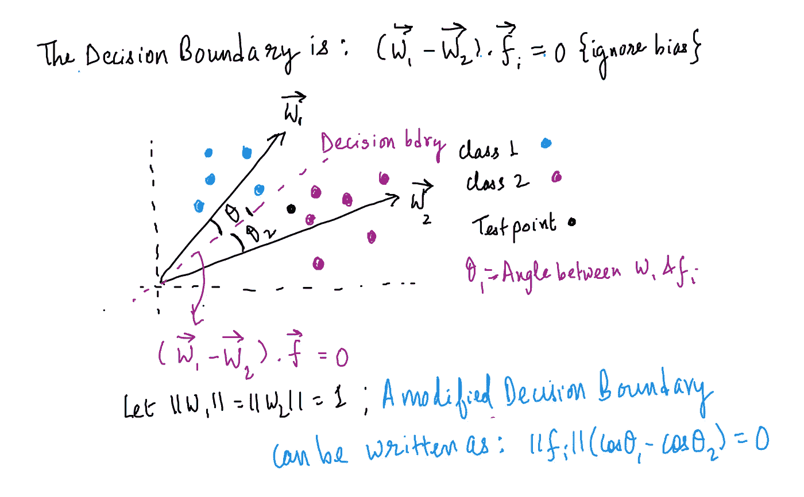**

**修正软最大损失的决策边界**

**因此，如果 **cosθ₁ > cosθ₂.，来自类别 1 的学习特征 **f** 被正确分类这就是基于角度的距离度量发挥作用的地方。****

**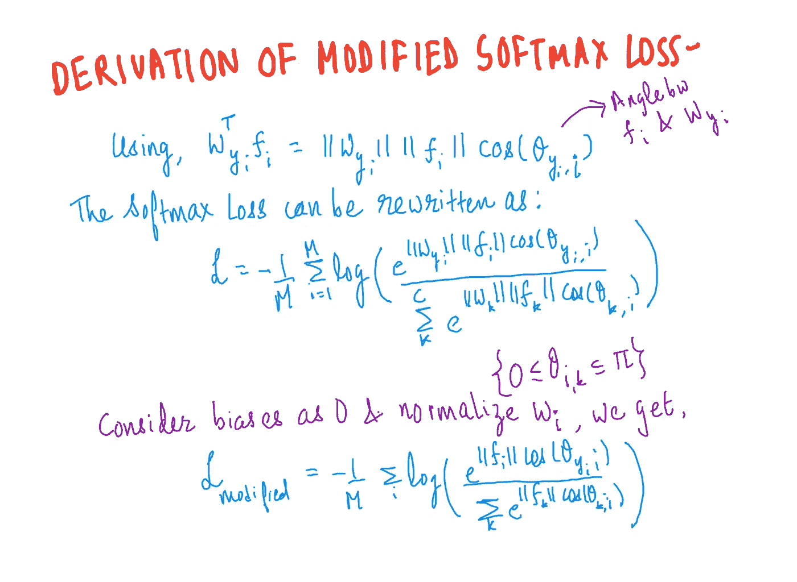**

**修正 Softmax 损失的推导**

**为了开发有效的特征学习，w 的范数必须是不变的，因此 **||Wᵢ||=1** 。与原始的 softmax 损失相比，通过修改的 softmax 损失学习的特征是成角度分布的，但是不一定更有区别。**

**论文 [*SphereFace:用于人脸识别的深度超球面嵌入*](https://arxiv.org/abs/1704.08063) 的作者介绍了一种借助**角裕度**使决策边界更严格、更有辨别力的方法。**

**考虑同样的二进制分类场景。我们看到如果**cosθ₁>cosθ₂.**1**的学习特征 **f** 被正确分类**现在，如果我们改为要求 cos( **m** θ₁) > cos(θ₂)呢？其中 m≥1 为整数。很明显，这将使决策边界更具鉴别性，因为余弦值随着角度的增加而减小，并且 **cosθ₁** 的下限大于 **cosθ₂.**现在，从角度上正确地给 f {class 1}分类，需要 **mθ₁ < θ₂** 或**θ₁<θ₂/m；**比原来的**θ₁<θ₂**更难学，但是，这将确保更多的区别特征。这里是不同决策界限之间的比较。**

**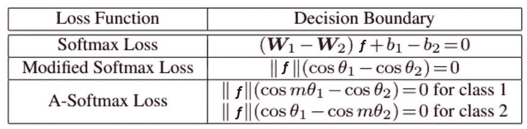**

**二元情况下决策边界的比较。【[来源](https://arxiv.org/pdf/1704.08063.pdf)】。**

**将这一思想结合到修正的 softmax 损失 we have:{θ₁∈[0,π/m]}中，**

**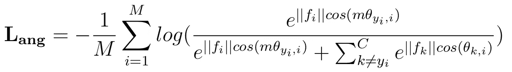**

**A-Softmax 损失函数**

****

**softmax 损耗、修正的 softmax 损耗和 A-Softmax 损耗之间的比较。我们可以看到，原始 softmax loss 学习的特征不能简单地通过角度进行分类，而修改的 softmax 和 A-softmax loss 可以。我们可以看到，在 A-Softmax 损失[ [来源](https://arxiv.org/pdf/1704.08063.pdf) ]的情况下，辨别能力更高**

**注意，A-Softmax 损失要求 **||Wᵢ||=1，bᵢ= 0；**由于，在测试阶段，通常根据两个特征向量之间的余弦相似度来计算测试人脸对的人脸识别得分。这表明特征向量 f ( **||f||** )的范数对评分函数没有贡献，因此预测仅取决于 **W** 和 **fᵢ.之间的角度****

**对于任何给定的问题，我们可以控制超参数 **m** 来增强学习参数之间的区分，因为 **m** 控制角度决策边界。**

## **与-Softmax 损失相关的问题:**

**对于 **θ** (两个类别的权重向量之间的角度)的所有值，A-Softmax 损失的裕度并不一致，对于不同的类别，裕度是不同的，因此，一些类别间特征具有较大的裕度，而一些类别间特征具有较小的裕度，这降低了损失函数的辨别能力。**

# **大幅度余弦损失—共面损失**

**在论文中提出的 LMCL—[CosFace:深度人脸识别的大余量余弦损失](https://arxiv.org/pdf/1801.09414.pdf)在余弦空间而不是角度空间中定义了决定性余量。由于余弦相似度是人脸识别中最重要的相似性度量之一，因此在不同类别之间引入余弦差值来改善余弦相关的区分信息更为合理。**

**考虑同样的二元分类问题。我们看到，如果修改后的 softmax 损失的 **cosθ₁ > cosθ₂** ，则从类 **1** 学习的特征 **f** 被正确分类。为了开发大范围分类器，LMCL 进一步要求:**

**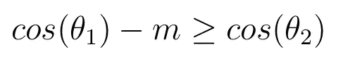**

**由于 cos(θᵢ的 m 值低于 cos(θᵢ的 m 值，因此分类的约束条件更加严格。因此，对于大幅度分类，我们最大化**cos(θ₁**并最小化 **cos(θ₁).**注意，LMCL 指导 DCNN 学习具有大余弦裕量而不是大角度裕量的特征。与 A-Softmax 不同，LMCL 具有固定大小的余弦裕量 **m** 。**

**LMCL 还要求 **||Wᵢ||=1，bᵢ = 0，**，并且由于在测试阶段，特征向量 **f** 的范数对评分函数没有贡献，所以预测仅取决于 **W** 和 **fᵢ.之间的角度**因此，在训练阶段，我们固定 **||f||= s** (称为缩放参数)**，**，这移除了径向方向上的变化，并且所得模型学习在角度空间中可分离的特征。学习的嵌入特征因此分布在半径为 s 的超球面上。修改的 softmax 损失变成:**

**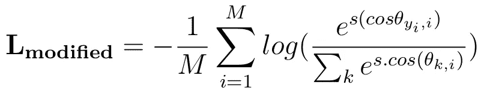**

**修正的 softmax 损失**

**最后，大容限余弦损失(LMCL)使用上面讨论的直觉定义为{符号与上面讨论的相同}:**

**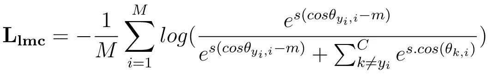**

**大幅度余弦损失**

**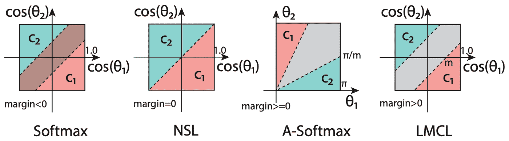**

**二元类情形下不同损失函数的余弦空间决策裕度的比较。NSL(标准化的最大软损失)是修正的最大软损失。虚线代表决策边界，灰色区域是决策余量[ [源](https://arxiv.org/pdf/1801.09414.pdf)**

# **弧面损失**

**与 Cosface 不同，我们添加了一个**加性余弦余量**惩罚，论文 [ArcFace:深度人脸识别的加性角度余量损失](https://arxiv.org/abs/1801.07698)提出了一个**加性角度余量**惩罚(Sphereface 使用**乘性角度余量**惩罚)来进一步提高模型的区分能力。**

**与 LMCL 和 A-Softmax 类似，Arcface loss 也要求权重是 l2 归一化的和零偏差的，因此 **||Wᵢ||=1，bᵢ = 0。**我们还对嵌入特征 **||fᵢ||** 进行 l2 归一化，并将其重新缩放至 **s** 。弧面损失给出如下:{符号与上面讨论的相同}:**

**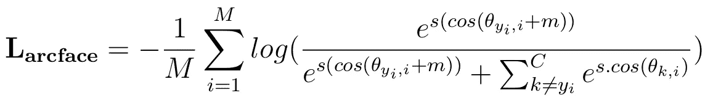**

**弧面损失函数**

**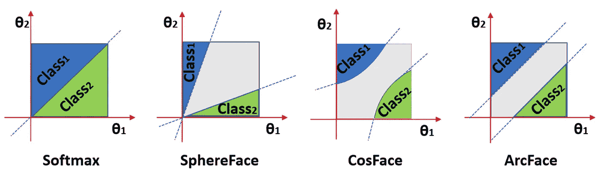**

**二元类情形下不同损失函数的角空间决策裕度的比较。虚线代表决策边界，灰色区域是决策余量[ [来源](https://arxiv.org/pdf/1801.07698.pdf)**

**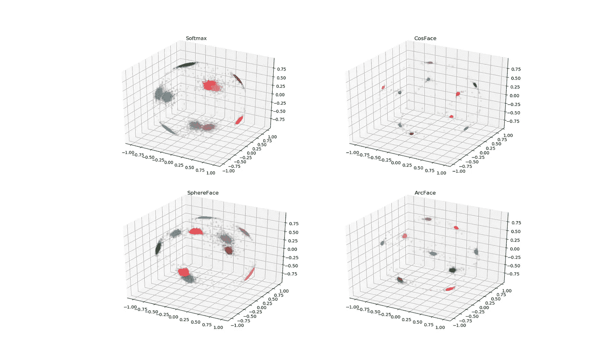**

**在 MNIST 数据集上的不同损失函数的实验**

**所有这些方法 Sphereface、Cosface、Arcface 都是通过学习通常的图像分类问题来实现远程学习的。虽然它们在边缘惩罚方面有所不同，但无论是增加角度还是余弦空间，都增强了类内的紧密性和类间的多样性。**

# **参考**

**[1].https://www . research gate . net/publication/335314481 _ Deep _ Metric _ Learning _ A _ Survey。**

**[2].刘文伟，温，于，李，拉杰，宋。 [Sphereface:深度超球面嵌入人脸识别。](https://arxiv.org/abs/1704.08063)2017 年 CVPR。**

**[3].刘文伟，温，于志军，杨。[卷积神经网络的大幅度软最大损失。](https://arxiv.org/pdf/1612.02295.pdf)2016 年 ICML。**

**[4].王海红，王燕燕，周志军，纪晓霞，李志军，龚大东，周军军，刘伟。 [Cosface:深度人脸识别大幅度余弦损失](https://arxiv.org/abs/1801.09414)。在 2018 年的 CVPR。**

**[5].邓建康，，薛念南。 [ArcFace:深度人脸识别的附加角裕度损失](https://arxiv.org/abs/1801.07698)。**

**[6].[拉吉夫·兰詹](https://arxiv.org/search/cs?searchtype=author&query=Ranjan%2C+R)，[卡洛斯·d·卡斯蒂略](https://arxiv.org/search/cs?searchtype=author&query=Castillo%2C+C+D)，[拉玛·切拉帕](https://arxiv.org/search/cs?searchtype=author&query=Chellappa%2C+R)。[用于鉴别人脸验证的 L2 约束的 Softmax 损失](https://arxiv.org/pdf/1703.09507.pdf)。**

**我希望你喜欢和我一起深入学习公制。我很想知道任何阅读这篇文章的人的反馈。我很乐意回答对上述任何概念的疑问/问题。非常欢迎反馈(鼓掌👏🏼也会得到很好的反馈😇).你可以通过 Linkedin 联系我。**

## **谢谢你！**