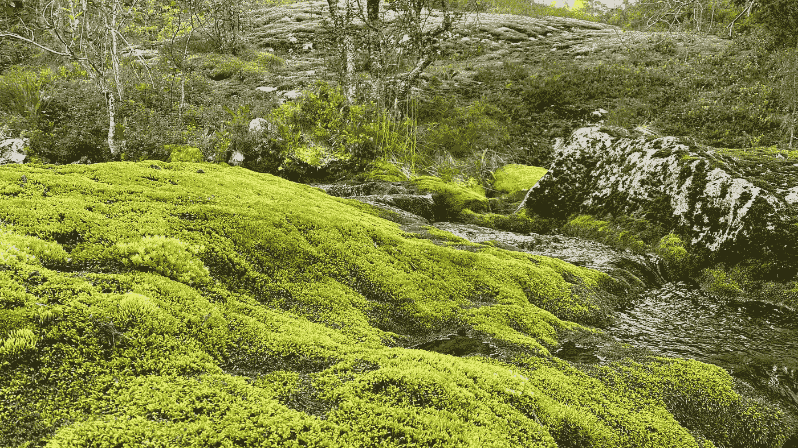

# 荒野算法

> 原文：<https://towardsdatascience.com/the-wilderness-algorithm-fc71cf9dadb?source=collection_archive---------38----------------------->

## 荒野地区越来越少，越来越分散。我们能用算法找到荒野吗？理解荒野就够了吗？

荒野地带(作者图)

试图解释什么是荒野并不容易。一些人使用宗教，另一些人使用哲学、政治、科学或计算机。在这个故事中，我将试着给出我自己的解释，如何把荒野作为一个抽象的概念，也作为一个可以用复杂算法处理的东西。

在我自己的国家挪威，多年来这种理解导致了根据到侵蚀的距离对荒野地区进行分类。公路、铁路、风车、高塔等等代表了对荒野的侵占。与他们有一定距离的东西将成为荒野。

Zoderer 等人(2020)讨论了荒野的其他空间指标。通过访谈和问卷调查，他们确定了 14 个这样的指标。缺乏耕种，没有明显的文明迹象，狼/熊或山猫的栖息地，该地区难以接近，该地区很大，以及其他 9 个指标。在他们的作品中，他们揭示了三种截然不同的公共荒野表现:

*   没有人类影响的区域
*   偏远大区域
*   大自然可以自我发展的地方

基于以上描述，可以设置程序来进行分析。事实上，我们已经做到了。甚至谷歌也有——如果你使用他们的照片服务，只要试着用搜索词“荒野”搜索就可以了。谷歌会给你一些令人惊讶的答案。

但是如果你想深入了解荒野是怎么回事呢？这可能吗？这重要吗？

【2006 年 6 月塞伦盖蒂的休闲道路/跑道(作者拍摄)

## 什么是荒野？

术语“荒野”不仅仅应该有一个简单的技术解释。我们对荒野的定义也将我们定义为人类——不管是好是坏。

多年来，尤其是在我担任挪威徒步旅行协会[董事会成员期间，我花时间思考是什么样的经历、假设和景观让荒野这个词变得有意义。对我来说，一种遥远的感觉和人类没有影响自然的想法是最重要的。](http://www.turistforeningen.no)

荒野地区为一些物种提供了人类直接影响保持在低水平的地区。因此，更大的生态系统可以维持。显然，没有人类的存在，大自然也运转得很好。

在 2018 年 10 月 31 日的《自然》杂志评论中，研究人员 James E. M. Watson、James R. Allan 及其同事敦促 2018 年 10 月召开的生物多样性全球公约会议"[..]包括荒野保护的法定目标”。他们建议目标应该是"[..]界定和保护所有剩余的完整生态系统。”(参考文献:沃森等人，2018 年)

*挪威特罗尔海门的山路，2014 年 8 月(作者拍摄)*

[世界保护区数据库](http://www.protectedplanet.net) (WDPA)是由 [IUCN](http://www.iucn.org/) 和 [UNEP](http://www.unep.org/) 联合开发的，提供所有类型保护区的最大数据库。IUCN 根据管理目标对保护区进行分类。荒野是国际自然保护联盟的类别之一，准确地说是国际自然保护联盟的 Ib 类别，其定义是:

> 保护区通常是大片未经改造或稍经改造的区域，保留了它们的自然特征和影响，没有永久或重要的人类居住地，受到保护和管理以保持其自然状态。

这一定义假定该地区实际上具有保护区的地位。这排除了大量的荒野地区。

2020 年深秋，挪威未受保护地区的小规模荒野

这些年来，我读过的一些哲学著作让我记忆犹新。我仍然认为挪威哲学家阿恩·奈斯教授的思想很有意义——尤其是他的《深层生态学纲领》中的八点，是讨论人类和荒野的良好起点。当时我是一个相当大的球迷。国家抽样调查系统指出:

> 目前人类对非人类世界的干涉是过度的，并且情况正在迅速恶化。

以上是阿恩·奈斯小心翼翼地提醒我们不要干涉世界的某些部分。

大卫·罗森伯格为阿恩·奈斯写了一本很好的传记(罗森伯格 1992)。从我在网上读到的内容来看，罗腾堡一直在思考人与自然的关系。我拿起一本他主编的关于荒野的书，读了他的序言。他的作品鼓舞人心，我认为以下内容非常突出，因为他在几句话中抓住了关于人类与自然关系的一些非常重要的东西。

> 对荒野的热爱和维护它的愿望是人类走向不那么自私状态的一部分。这是一个迹象，表明我们越来越有能力超越自我，将我们的关注扩展到自然的各个方面，这些方面之所以重要，不是因为它们对我们有用，而是因为我们对它们的尊重超越了使用的限制——对荒野的热爱是文明进程中珍贵而有价值的一部分。我们的人类文化因为看到了认识它的需要而变得更加强大。大卫·罗森伯格

森林中安静的荒野。挪威 Vevelstad 市 2020。(作者供图)

## 够了，哲学——我们能着陆了吗？

奈斯、罗森堡和其他哲学家用很长的篇幅写了我们与自然和荒野的关系，他们仍然让我们纠结于这个问题——什么是荒野？我们真正谈论的是哪些领域？因此，我们结束了由以下问题和其他问题引发的长时间讨论:

*   荒野是我们不容易到达的地方吗？
*   这是我们可以去的地方，而且很可能不会遇到其他人吗？
*   一个看不到人类主宰自然的地方？
*   一个没有任何人类活动影响的地方？
*   经济利益没有直接影响生态系统的领域？
*   那么土著人呢，他们有没有影响一个地区的荒野地位？
*   荒野的最小面积是多少？

我们必须接受荒野是无形的吗？如果不是，这需要多少哲学文章和几瓶酒？

深秋的冰晶。一个小区域，但仍然是荒野？(作者供图)

## 地理学家和算法

荒野类别(作者图)

地理学家和他们的同事有着描绘无形事物的悠久历史——无论是疾病([约翰·斯诺](http://en.wikipedia.org/wiki/John_Snow_%28physician%29))、[空间公正和不公正](http://en.wikipedia.org/wiki/Spatial_justice)、人口统计等等。据我所知，荒野或“荒野”的第一印象是我们可以在一些旧地图中找到的。" *Hic sunt dracones"* (这里是龙)是一个可以在"[亨特-鲁诺地球仪](http://en.wikipedia.org/wiki/Hunt-Lenox_Globe)"上找到的表达。其他地图上也有类似的未标明或偏远地区的标记。我们，地理学家，继续前进。

今天，我们正在使用地理信息系统。以前这些工具仅限于可视化空间模式，现在我们可以使用 QGIS、ArcGIS 和 FME 等复杂工具。如果这些工具不够用，我们就求助于编程——算法和数据库。我们中的许多人花时间设置系统来支持所谓的地理处理。

地理处理允许我们处理数据输入并显示结果-通常在地图中。荒野分析是地理处理的一种类型。

## 寻找荒野的算法

让我们假设，任何距离侵犯或基础设施一定距离的东西都是荒野。挪威采用的标准规定荒野分为三类，其中 0-1 是缓冲区，而不是荒野。

*   1–3 是荒野类别 2
*   3-5 公里为 1 类
*   完全合格的荒野是距离任何基础设施 5 公里以上的一切。

荒野程序。(作者图)

这是一个相对容易建立的算法。我们使用坦桑尼亚的 OpenStreetMap 数据做了一次测试。这是几年前在坦桑尼亚的一次会议上作为海报发表的。

多年来，我一直参与重新设计荒野算法。我的工具包括 ArcGIS、Python QGIS 和 FME。我的一些代码可以在 GitHub 上的[中找到。如果我有时间，我会开始研究使用 PostGIS 和 Pl/pgSQL 处理荒野。](https://github.com/ragnvald/sawe)

那么，当我们已经有了可以工作的东西，为什么还要研究算法呢？为什么要重新发明？为什么不停止开发新代码，取而代之的是喝杯咖啡呢？有很多很好的理由继续前进。以下是一些例子:

1.  **方便**。一个完善的地理处理系统需要我少动手。作为操作员，我可以设置数据源并启动处理。我之前将处理质量暴露给人工错误，一个计划良好的工作流意味着我与处理的下一个接触是存储和传播结果。
2.  **速度**。处理速度取决于可用的硬件、算法软件以及算法的质量和效率。
3.  **野心**。算法及其实现只会更好。如果你做得很好——做得更快、更精确、更便宜都是自然而然的下一步。
4.  **内的书呆子**。书呆子喜欢技术，喜欢学习处理数据的新方法。停止真的不是一种选择…谁不想拥有一台更大、更快、更闪亮的电脑呢？

## 结束循环

无论地理处理的计划多么周密、多么高效，都很容易忘记它的起点。在这种情况下，它始于对荒野的定性理解。再往前走一点，我们需要从定性理解转向定量实施。无论好坏，量化过程的结果更容易在地图上显示出来，也更容易被人们理解。

关于算法的思考(作者绘制)

能够设计算法是一种决定性的力量。这也适用于处理能力和输入数据。虽然我们可以通过算法找到荒野，但它不一定建立在正确的定义上。如果我们不小心对待它们，这个工具就决定了结果。

作为一名空间分析师，我发现要做好一项分析，需要的不仅仅是设计一种算法来完成这项工作。令人愉快的是，对于荒野分析，我有点忘乎所以了。

理解分析背景的复杂性有助于设计算法。在我看来，一个好的分析依赖于完整的堆栈。只有这样，你才能与你的委托人保持一种明智而清晰的对话，只有这样，你才能用一种精心设计的分析来帮助他们。

感谢阅读！

# 参考

*IUCN。2021.保护区类别。* [*网站访问 2020.01.30*](http://www.iucn.org/about/work/programmes/gpap_home/gpap_quality/gpap_pacategories/)

大卫·罗森堡。1992.思考是痛苦的吗:与阿恩·奈斯的对话？

*大卫·罗森堡。2001.世界和荒野。*

Watson，J. E. M .，Venter，o .，Lee，j .，Jones，K. R .，Robinson，J. G .，Possingham，H. P .，& Allan，J. R. (2018)。保护最后的野生动物。自然，563(7729)，27–30。[https://doi.org/10.1038/d41586-018-07183-6](https://doi.org/10.1038/d41586-018-07183-6)

佐德勒，布伦达·玛丽亚&卡弗，史蒂夫&塔佩纳，尤里克&塔塞尔，埃里希。(2020).“荒野”的排序:荒野的公共表现及其空间分布的变化。景观和城市规划。202.103875.10.1016/j . landurbplan . 2020.103875 .