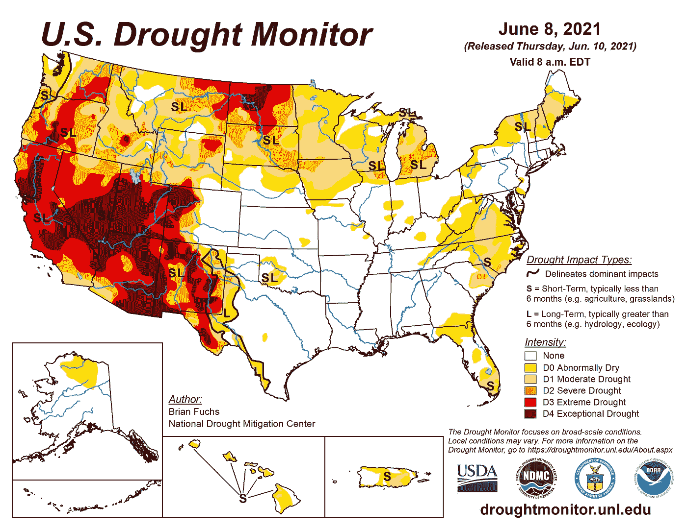
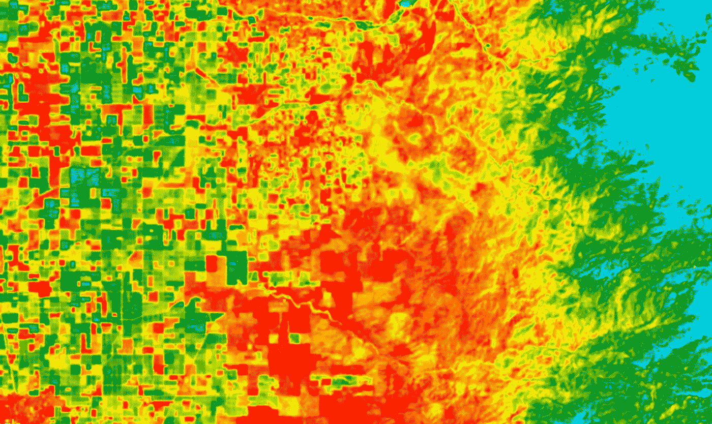
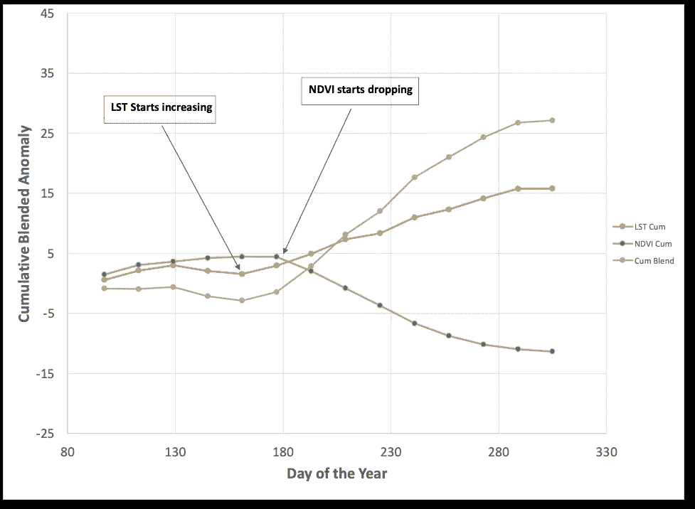
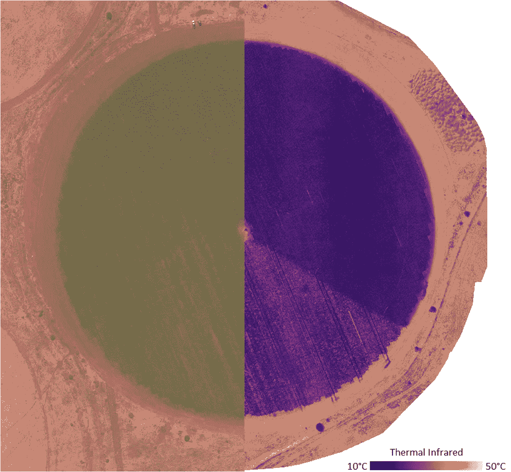
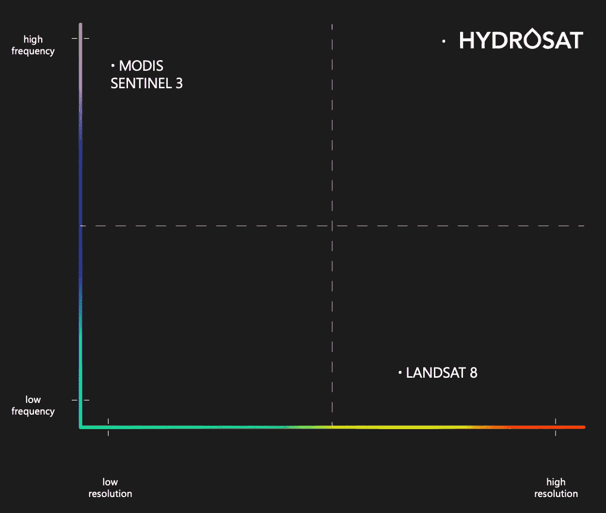

# 世界需要更多来自太空的热红外数据

> 原文：<https://towardsdatascience.com/the-world-needs-a-lot-more-thermal-infrared-data-from-space-dbbba389be8a?source=collection_archive---------23----------------------->

## 我们的星球着火了

好吧…也许这有点夸张，但是毫无疑问，在过去的 10 年里，气候变得越来越热，越来越干燥。在世界某些地区，干旱状况的频率和严重程度显著增加。当我写这篇文章的时候，美国西部的大部分地区正处于严重的干旱之中。《纽约时报》最近的一篇文章阐述了今年干旱情况是多么极端和普遍，以及整个夏天情况恶化的可能性。气候变化继续增加干旱周期的波动性和严重性。

droughtmonitor.unl.edu 干旱强度图。

虽然我们在过去的一个月里听到了很多关于美国干旱的消息，但这些情况并不是北美独有的。巴西政府机构最近拉响警报，该国面临 91 年来最严重的干旱。在印度，2016 年至 2018 年期间，由于季风降雨不足，印度出现了[150 年来最严重的干旱状况](https://india.mongabay.com/2021/05/southern-indias-2016-2018-drought-was-the-worst-in-150-years/)。2019 年[印度 42%的国土面积处于干旱状态](https://www.indiaspend.com/42-indias-land-area-under-drought-worsening-farm-distress-in-election-year/)。在欧洲，2007 年、2011 年、2012 年、2015 年和 2018 年都出现过[干旱年。](https://advances.sciencemag.org/content/7/6/eabb9668)

这些干旱事件产生了一系列负面影响，包括野火风险增加、农作物产量或质量下降，以及对日益稀缺的淡水资源的需求增加。这些现象还会产生重大的社会经济连锁效应。野火显然会摧毁房屋、企业和重要的民用基础设施，使人们失去家园、收入或电力等基本设施。农作物产量低或歉收会导致大宗商品价格波动、饥荒、移民和冲突。淡水的缺乏加剧了上述问题，并日益成为全球和地区冲突的根源。

为了应对这些挑战，我们需要良好的工具来监测和减轻缺水和干旱的影响。

# 热红外遥感

在政府机构和商业提供商提供的各种遥感数据集中，热红外遥感，特别是长波红外遥感，可能是最有潜力支持缓解干旱相关困难的战略，并有助于实现相关的联合国可持续发展目标，如“消除饥饿、实现粮食安全和改善营养以及促进可持续农业”的目标。长波红外地球观测允许我们测量地球表面在 8 到 12 微米波长之间辐射的能量，并通过应用由[普兰克](https://en.wikipedia.org/wiki/Planck%27s_law)、[斯蒂芬-玻尔兹曼](https://en.wikipedia.org/wiki/Stefan%E2%80%93Boltzmann_law)、[维恩](https://en.wikipedia.org/wiki/Wien%27s_displacement_law)和[基尔霍夫](https://en.wikipedia.org/wiki/Kirchhoff%27s_law_of_thermal_radiation)发现的几个基本物理定律来推导陆地或海洋表面的温度。如果我们可以在每天的同一时间测量植被地表的温度，我们将看到温度随时间变化的趋势，这将告诉我们植被是否保持相对凉爽，因为植物可以很好地获得土壤水分，气孔打开，植物以额定速率蒸发，或者植被是否因为植物受到压力而温度升高，气孔关闭以保存水分。

从农业区(左)和山区(右)的 Landsat 8 TIRS 得到的地表温度。蓝色区域是下 LST，红色区域是上 LST。

地表温度(LST)是一个强大的快速反应指标，显示了随着土壤水分不足和植被压力的发展，土壤和植被冠层温度的增加，在某些情况下，在短波植被指数可测量的减少之前[。热红外和地表温度导数可以比通常使用的植被指数早几周检测到应力，如归一化差异植被指数(](https://www.taylorfrancis.com/chapters/edit/10.1201/9780203502174-11/thermal-infrared-measurement-indicator-plant-ecosystem-health-susan-moran?context=ubx&refId=a8453bc6-22c2-4509-98e2-d930345fba40) [NDVI](https://en.wikipedia.org/wiki/Normalized_difference_vegetation_index) )。这是因为与气孔关闭或干旱土壤变暖趋势增加的初始压力反应相比，光合作用减少导致的叶绿素和细胞结构变化是滞后指标，会导致植被指数值降低。此外，对于某些作物类型来说，[比 NDVI](https://www.researchgate.net/publication/260144984_Assessment_of_Vegetation_Response_to_Drought_in_Nebraska_Using_Terra-MODIS_Land_Surface_Temperature_and_Normalized_Difference_Vegetation_Index) 更容易发现温度异常。结合使用可见光和近红外植被指数与 LST 可以提供一个早期和强大的植被胁迫指标。

内布拉斯加州麦迪森县农田的 LST 异常出现在 NDVI 异常之前两周。

# 全球粮食安全和灌溉管理

农业目前消耗人类使用的 80-90%的淡水，其中三分之二用于作物灌溉。即使我们对淡水的获取保持不变，随着全球人口的增长，仅仅是通过增加作物产量来维持全球粮食安全，我们就需要[减少每单位作物产量的用水量](https://royalsocietypublishing.org/doi/10.1098/rstb.2007.2175)(也就是“每滴水更多的作物”)。现实是，气候变化将导致蒸散率全面上升，我们将需要更多的淡水来支持灌溉。干旱年份频率的增加将对我们的淡水资源造成额外的压力，并要求我们非常有效地利用现有的水资源。长波红外衍生 LST 的频繁观测可以指示早期水分胁迫，并支持关于何时何地进行灌溉的决策，以便维持作物产量，并且不浪费水。

中心枢轴灌溉农田的光学 RGB(左)和 LST(右)。最近灌溉的地区 LST 值较低。

有多种方法使用 LST 数据来推断植被的水分胁迫水平。最简单的方法是观察一段时间内冠层温度和空气温度之间的累积差异( [CATD 和压力度天数](https://agupubs.onlinelibrary.wiley.com/doi/abs/10.1029/WR013i003p00651))。无应力的植物冠层将比环境空气温度低 2-5 开尔文或摄氏度。当气温和植物冠层温度之差为 0 时，假定水分胁迫。作物水分胁迫指数([【CWSI】](https://agupubs.onlinelibrary.wiley.com/doi/abs/10.1029/WR017i004p01133))与此类似，但将最大和最小蒸腾速率下的潜在叶温边界值标准化，隐含地考虑了风和蒸汽压力不足等其他影响因素。还有其他方法使用 NDVI 或其他植被指数作为像素内植被冠层和土壤的相对贡献的代理( [TVDI](https://www.researchgate.net/publication/222943931_A_Simple_Interpretation_of_the_Surface_TemperatureVegetation_Index_Space_for_Assessment_of_Surface_Moisture_Status) 、 [WDI](https://www.sciencedirect.com/science/article/abs/pii/0034425794900205?via%3Dihub) 、 [IG](https://www.sciencedirect.com/science/article/abs/pii/S0168192399000301?via%3Dihub) )，具有能够仅从卫星地球观测数据中导出的额外优势。

虽然水分胁迫指数本身很容易获得并且非常有用，但是可以使用 LST 更进一步，将[地表能量平衡](https://open.library.okstate.edu/rainorshine/part/surface-energy-balance-and-evapotranspiration/)和蒸散(ET)作为一个组成部分进行建模。这种建模方法本质上是告诉你在给定已知或估计的入射太阳辐射水平的情况下，发生了多少蒸发冷却才能达到遥感观测到的温度。它通常需要许多输入，包括天气、土地覆盖和叶面积。有几种方法可以使用 LST 作为输入来建模 ET，比如[亚历克西](https://lpdaac.usgs.gov/documents/332/ECO3ETALEXIU_ATBD_V1.pdf)和 [STIC](https://hess.copernicus.org/articles/22/2311/2018/) 。一旦得到蒸散量，它也可以输入到[蒸发压力指数(ESI)](https://www.drought.gov/data-maps-tools/evaporative-stress-index-esi) 中，该指数提供了一个指示何时估算的蒸散量低于健康植被的标称蒸散量而植被受到压力的指标。

如果我们可以测量作物在何时何地受到胁迫，那么我们也可以应用精确或变量灌溉来确保作物在需要时获得适量的水。传统上，灌溉的应用是基于土地管理者的直觉或单个气象站当前蒸散量的简单近似值以及整个田地的[调整系数(Kc)](https://www.almonds.com/sites/default/files/content/attachments/irrigation_scheduling_using_evapotranspiration.pdf) 。有了每日高分辨率的水压力指标，就像上面描述的那样，灌溉管理人员可以做出更好的关于在哪里用水的子区域决策。利用每日高分辨率的模拟蒸散量，灌溉管理人员可以在不浪费水的情况下优化产量。各种已发表的研究和文章([例如](https://blog.agroop.net/en/blog/2019/11/28/4-benefits-of-precision-irrigation/))显示，用水量(减少 20 — 40%并不少见)、水成本和产量损失都有显著降低。使用地球观测数据的额外好处是，你可以监测所有的农业地区，而不需要昂贵的实地传感器。换句话说，部署更多的长波红外地球观测系统、数据和分析技术将对水资源利用效率产生巨大的积极影响，并带来增加农业盈利的附带好处。

# 野火风险和监测

LST 和农业用水紧张之间的所有动态也与森林、灌丛或任何其他植被区域相关。随着一个区域的干涸，着火和火势蔓延的可能性增加。LST 指数和植被指数的组合可用于[估算火灾危险等级](https://www.sciencedirect.com/science/article/abs/pii/S0034425704001531?via%3Dihub)的活燃料水分含量。T2 也可以利用 LST 的数据预测潜在的燃烧面积和野火持续时间。一旦火灾发生，就有可能通过长波热红外数据来检测和跟踪火灾，即使是在大量烟雾掩盖了可见光和近红外系统的情况下。当火势得到控制时，就有可能绘制出燃烧区域的地图，甚至描述出 T4 对全球变暖的影响。

# 但是等等…还有更多！

虽然上面的植被监测应用非常有价值，但热红外遥感并不是一蹴而就的。长波红外表面温度还可以应用于许多其他领域:

*   [监测火山事件](https://agupubs.onlinelibrary.wiley.com/doi/full/10.1002/2017JB014317)
*   [地震的早期预测](https://www.mdpi.com/2072-4292/11/1/61)
*   [改进土地利用和土地覆盖分类](https://www.sciencedirect.com/science/article/pii/S1110982315000551)
*   [溢油检测和监测](https://www.sciencedirect.com/science/article/pii/S2214241X15002060)
*   [绘制疟疾、霍乱和其他潜在传染性疾病的地图](https://www.researchgate.net/publication/262788092_Air_temperature_suitability_for_Plasmodium_falciparum_malaria_transmission_in_Africa_2000-2012_A_high-resolution_spatiotemporal_prediction)
*   [船只和车辆检测](https://ieeexplore.ieee.org/document/7730710)

这只是列举了其他一些陆地应用。当我们包括基于海洋的应用时，这个列表会变得更长。

# 对数据的需求

虽然热红外遥感有如此大的潜力，但没有足够的可用数据来实现这一潜力。来自 MODIS、Landsat、Sentinel 3、ECOSTRESS 和其他政府任务的数据至关重要，能够对上述应用进行必要的研究，但它们缺乏分辨率或重访。文献中的许多文章表达了对高于 100 m 的分辨率和每日或次每日重访的需求。像 [Sentinel 8 (LSTM)](https://directory.eoportal.org/web/eoportal/satellite-missions/l/lstm) 这样的新系统，像 Landsat Next 这样的 NASA 任务，以及那些支持[表面生物学和地质学指定可观测的](https://science.nasa.gov/earth-science/decadal-sbg)的系统，将在一定程度上解决分辨率问题，但仍然缺乏高频重访，并且在许多年内都不会可用。

高重访、高分辨率的热红外数据目前还不存在，但许多新的政府和商业系统将在未来上线，包括 Hydrosat。

在不太遥远的过去，在 RapidEye 和 Planet 等公司涉足商业产品之前，可见光和 NIR 遥感领域的情况类似。新的商业供应商现在也打算通过开发地球观测卫星星座为长波热红外做同样的事情，这些卫星将每天提供高分辨率的 LST。然而，并非所有的商业热红外数据都是一样的。为了解决上述应用，需要高辐射校准精度和全球覆盖。例如 [Hydrosat](https://www.hydrosat.com/) ，旨在满足所有这些要求。

# 介入

世界不仅需要更多的热红外数据，还需要更多知道如何利用 LST 大规模解决干旱相关问题的数据科学家和软件工程师。如果你有兴趣了解更多，网上有[很棒的资源](https://earth.esa.int/documents/973910/1002056/CK3.pdf/4e5b4e5a-d898-43b8-9e5c-ba7494aa58c8)或者[优秀的教材](https://books.google.com/books/about/Thermal_Infrared_Remote_Sensing.html?id=-Vk_AAAAQBAJ&source=kp_book_description)。如果您想了解更多有关 Hydrosat 如何为世界带来日常、高质量、高分辨率 LST 的信息，或者与我们合作，[请联系](https://www.hydrosat.com/contact-us)。