# SQL 连接的世界

> 原文：<https://towardsdatascience.com/the-world-of-sql-joins-c70ca7f36f04?source=collection_archive---------33----------------------->

## 和我一起踏上旅程吧！

照片由 krakenimages vis Unsplash 拍摄

如果你正在阅读这篇文章，你可能已经看到了常见的维恩图，它解释了不同类型的 SQL 连接意味着什么。剧透:你也会在这里看到。

区别？您将看到一些带有颜色编码的数据示例，以帮助更牢固地掌握概念。此外，我们将介绍一些有用的提示，以确保您得到的结果是您需要的结果。

# 今天的教学大纲

*   著名的左翼联盟
*   左连接的瓦路易基:右连接
*   寻找内心的平静
*   完全外部连接
*   国情咨文
*   穿越(加入)宇宙
*   一对一、一对多、多对一和多对多关系
*   不要根据需要输出 900 倍的行数
*   用设计标志标记特定类型的客户交易

# 强制性文氏图

作者照片

您将看到的数据将显示正在使用的两个表，颜色与上面的文氏图相匹配。

# 左侧连接

想象一下，在你的左手，你有这个神奇的电源条形物体，它有多个超级随机的端口/插座，用于不同的充电器和几乎任何类型的电缆。坐在你右手边的是那盒电缆，你带着它搬进了 5 个不同的房子，拒绝扔掉，因为有一天你可能会需要它们。嗯，今天是幸运日！

当你试图找到放置每根电线的地方时，有些人会找到，有些人不会。你可能会得到一个完整的电源板或一些没有匹配的空白空间。不合适的线会被放回盒子里，进入第二轮永恒。这类似于左连接。

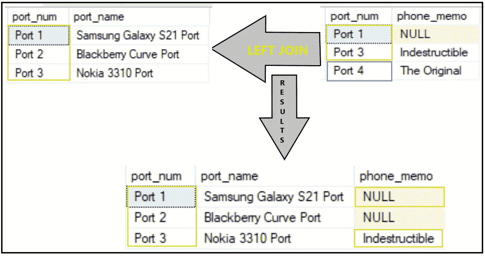

作者照片

注意，在这个例子中，所有橙色的行都出现在我们的最终结果中。左边是我们的表，它的所有数据都将输出。绿色数据包含在能够找到与左侧表格匹配的位置。在本例中，蓝色数据放回线缆盒中。

请注意，在我们的最终输出中，我们有 2 个空值。在端口 2 的情况下，当我们要加入的表没有行/值时，可能会出现 Null。“phone_memo_table”中没有端口 2 的行。此外，当右表中的值为 Null 时，可能会出现 Null。这显示在端口 1 中。这些例子是在最终输出中看到空值的两个常见原因。

# 正确的连接

老实说，我想我用过一次右连接。你所做的大部分事情都可以以某种方式与左连接一起使用。

毕竟可能有右连接的用途，但总结起来，这有点像右手拿着神奇的电源条，用左手将电线插入电源条。

让我们来看一个更线性的思维过程的例子。假设您有一个 LY 销售表和一个 TY 销售表。您只希望结果包括今年开业的商店，不包括去年关闭的商店。

如果您想将这两个表想象成从左到右(LY 和 TY)前进，右连接可能会很方便。

让我们来看看结果:

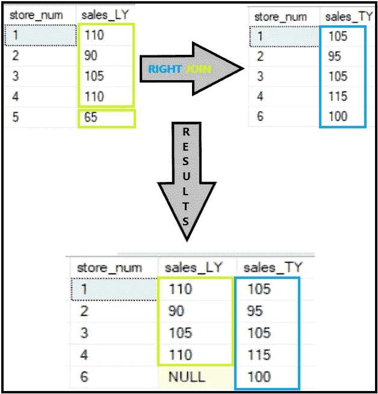

作者照片

请注意，由于商店 5 因业绩不佳而关闭，它现在不会显示在此表中，因为它在“store_sales_TY”中没有与匹配的行。

# 内部联接

现在，假设我们只想关注当前正在营业的商店和去年同期营业的商店。我们想要这种真正的“苹果对苹果”的结果比较。

在这些结果中，我们注意到只有绿色区域的数据显示在我们的最终结果中。这是文氏图中相交的部分。

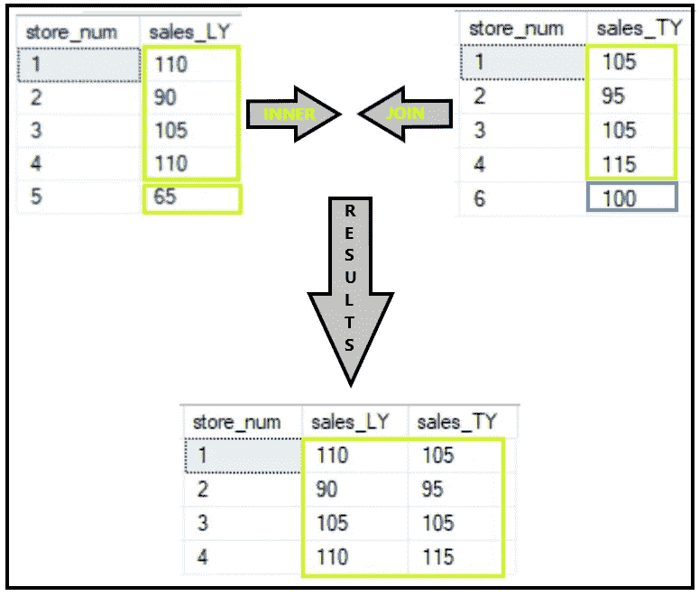

作者照片

# 让我们来看看:完整的外部连接

在这个场景中，假设我们想要将 LY 的所有销售与 TY 的所有销售结合起来。我们不关心商店是否只在一年中的某一年营业。使用完整的外部连接将使我们达到这一目的:

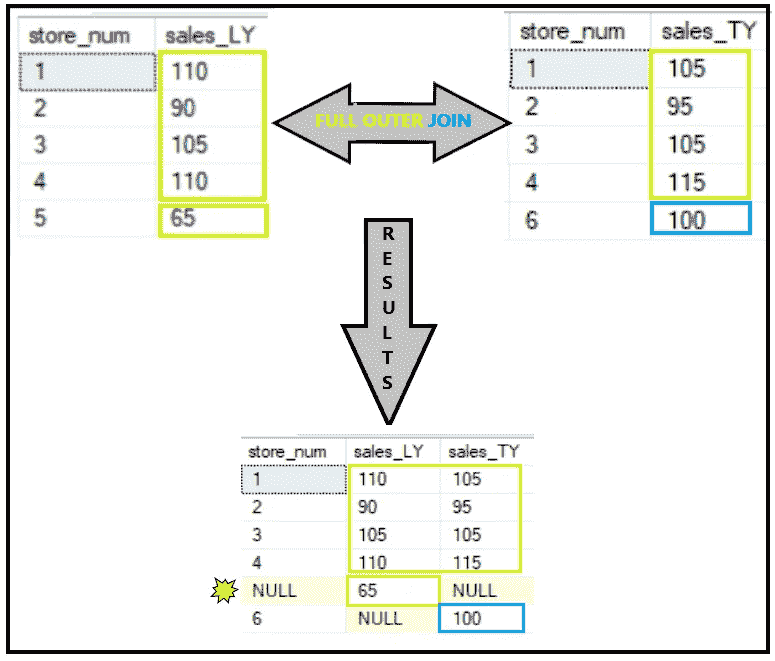

作者照片

这就是我们所说的“不可靠”！让我们看一下代码:

当使用完全外部联接时，必须确保两个表中要联接/包含为属性的列上的值都相同。如果它们不匹配，而您只使用表中的一列，那么您最终会得到如上所示的空值。这里的解决方案是使用 Coalesce 函数。

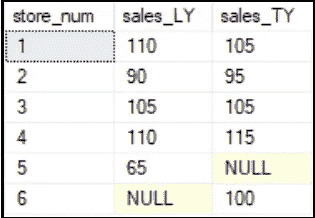

作者照片

请注意，在本例中，我们现在可以在“store_num”列中看到所有商店的值。还要注意，可以创建标志来区分商店仅包含在 ly、TY 或两者中的位置。

请记住，在这个示例中，我们看到商店没有开门的销售值为空。将这些空值更改为 0 是一个选项，但是请记住，这意味着在此期间存储性能非常差。对数字求平均值时，0 将被计入最终结果。有时候保持空值是很重要的。

# 联合

到目前为止，我们以更“并排”的方式移动行，就像插入插座一样。联合组合数据，但这更像是在千层面上加层。假设我们有一个包含实体店数据的表，另一个包含电子商务结果的表。我们希望将结果与 E-Comm 结合起来，显示为自己的商店/行。这就是我们可以利用工会的地方。

请注意，所有列的名称必须相同，并且所有列必须存在于我们正在使用的两个表中。在本例中，E-Comm 表缺少一个名为“store_num”的列。我们可以在这个值中插入一个空值、一个 0 或者一个随机数，比如 9999。

还请注意，与值匹配的联接(如“sales_year”或“store_num ”)不同，联合有自己的功能。只要列匹配，您就能够组合结果。请注意，在下文中，E-Comm 的 2019 年“销售额”也包括在最终输出中。

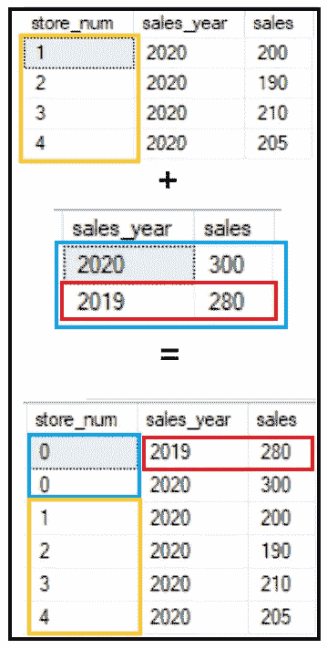

作者照片

# 交叉连接

在我们到目前为止看到的所有例子中，被连接的两个表之间有一个公共列。交叉连接非常不同。它不需要名称相似的列。

在本例中，我们在两个表中各有一列。交叉连接实质上是从“coin”表中获取“Heads”值，并将其应用于每个“roll_num”值。然后，它用“尾巴”做同样的事情。“rull_num”有 6 个值，“coin”有 2 个值。我们在最终输出中得到 12 行。

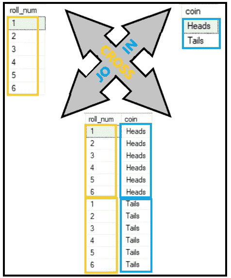

作者照片

# 关系

## 一对一

回头看我们的第一个例子，左边的 Join，我们可以看到在我们左边的表中，每个端口/电话类型都有一行。正在加入的右边的表也为每个电话/类型有一行。这是一对一的关系。

## 一对多

让我们看看另一种类型的关系。在本例中，我们可以看到左侧的表格中，我们正在查看的每种“事物”都有一行。右边的表格为每个“事物”提供了 2 行或多行。注意，当我们离开 Join ' thing _ type '表时，我们现在看到每一行都是重复的。添加 2 倍汽油现在导致 2 倍火灾。

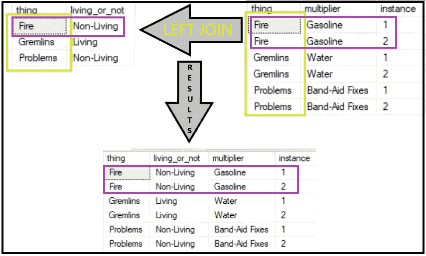

作者照片

## 多对一

顾名思义，这和上面是相反的。我们现在有一个左侧有多行销售数据的表。我们正在加入一个记录了那一周发生的事件的表。我们可以看到,“产品剩余”现在应用于“week _ num ”= 4 的所有行，等等。

作者照片

## 多对多

正如您可能已经发现的那样，这种关系就是我们左侧表中有许多行可以匹配右侧表中的许多行。让我们想象一下，商店 1 在“day_stores_sales”表中有多行，在“day_store_cust”表中有多行。

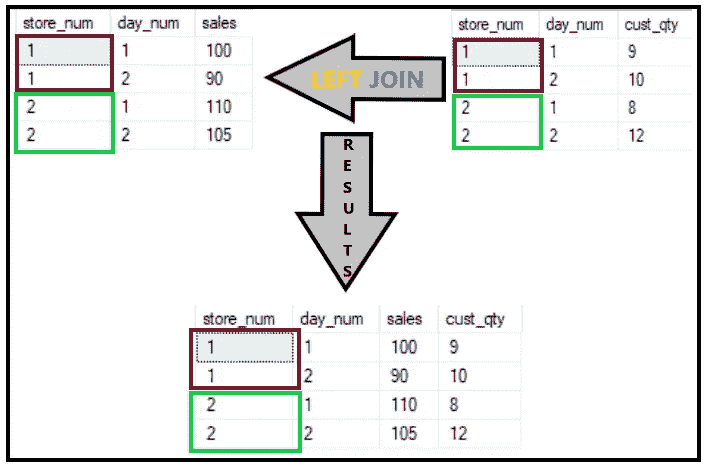

作者照片

# 特邀嘉宾:不要重复排

在这个例子中，我们使用了上面的具有多对多关系的同一个表，但是我们没有在所有需要的列上连接这些表。请注意，这段代码显示我们只加入了“store_num”。我们还应该在“day_num”加入，如上面的代码所示。

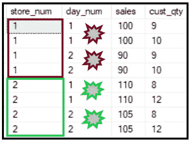

作者照片

这段代码实际上强制我们右边的表“day_store_cust”中显示为 Store 1 的每一行与“day_store_sales”中的每一行连接起来。想象一下，如果有一整年的数据，而没有加入 date 和 store。您会得到一个非常大的表和一些稍微膨胀的结果。

# 查找仅限折扣的客户

假设您的公司最近通过电子邮件发送了一张包含 2 件商品/产品的折扣券，您的任务是标记客户仅购买折扣商品的交易。如果客户购买了折扣商品，但购买了正常定价的商品，您不希望标记该交易。

让我们使用一些逻辑和一个连接来为它设计一个标志。首先，我们可以提取没有出现折扣的所有行。在子查询示例中，我们可以按“transaction_num”对这些结果进行分组，并用 0 标记这些交易，这意味着它们不是仅限于折扣的交易。

接下来，我们可以使用一个 CASE 语句，它说‘当我们看到这个刚刚创建的 0 时，使用这个 0；对于其他所有东西，用 1 表示它只是折扣。

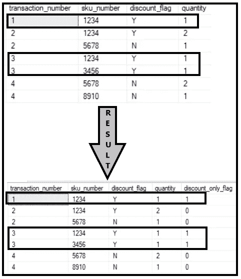

作者照片

# 最后的想法

SQL 是一个非常有用的工具。很可能，您的数据库中不会有一个表来保存所有的数据。使用 SQL 时需要联接。如果您刚刚开始使用 SQL，上面的这些例子会有所帮助。如果你已经学习了基础知识，并且想以稍微不同的方式看待事物，它们也可以帮助你记住这些概念。你可以在开始时阅读这篇文章，然后在一些练习帮助巩固你的新知识后再回来。

如果您想要更多关于 SQL 的有用信息，请随意阅读我的其他文章，并关注我的未来作品。[这个 2 分钟的](/a-case-statement-in-a-sql-join-13496723dca9?sk=ec63318908463c50ee88270ff1acda2d)阅读重点是在连接表时使用 CASE 语句。下次见，继续学习！