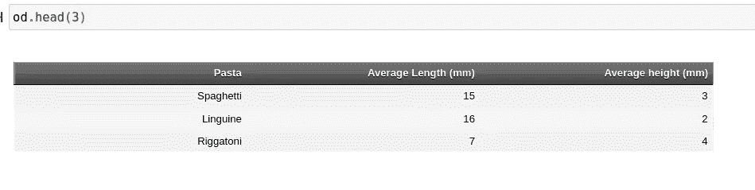
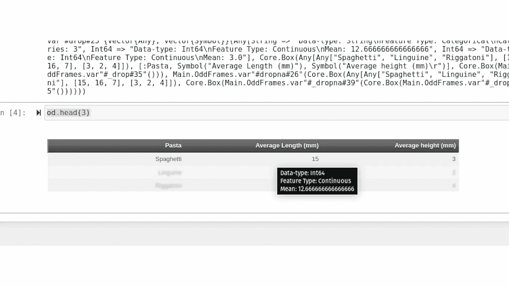

# 我在 Julia 中创建 CSV 阅读器时经历的痛苦

> 原文：<https://towardsdatascience.com/the-wretched-pain-i-experienced-creating-a-csv-reader-in-julia-e67520857b9c?source=collection_archive---------31----------------------->

## 从头做起

## 想知道 CSV 文件是如何解析的吗？这是字符串处理的好方法！


(src =[https://pixabay.com/images/id-157891/](https://pixabay.com/images/id-157891/)

# 介绍

这里有许多不同的方法，人们可以用他们喜欢的语言来建立他们的计算机编程技能。虽然许多用户可能更喜欢快速的代码练习，比如在 *LeetCode* 上解决问题，但我更喜欢做项目。这只是因为我真的很享受设计一个类型系统，一种方法论，以及用一种独特的方式解决问题的过程和创造性练习。此外，我喜欢反复重复我已经写好的代码来改进它。考虑到这一点，最近我一直在做我的新项目 OddFrames.jl。

jl 是 Julia 编程语言的内存表格数据模块。我对 DataFrames.jl 包有许多不满，我也曾尝试修改过该包，但对我来说，该包的方法和某些方面并不是我个人在 DataFrames 包中寻找的。考虑到这一点，我认为 OddFrames 将是 DataFrames.jl 包的一个非常激进的替代方案，特别是对于那些从 Python 过渡过来的人来说，因为这个包有许多类似熊猫的调用。对于那些熟悉熊猫的人来说，许多叫声都是可以猜到的，尽管一些有条不紊的功能仍然相当朱利安。在我们进入我为这个包创建的逗号分隔值(CSV)阅读器之前，还有最后一件事，如果您对此感兴趣，我建议您看一看！该软件包仍处于早期开发阶段，但不管怎样，我认为它至少值得一看！(您也可以在这个资源库中找到我将在这里讨论的所有源代码。)

[](https://github.com/ChifiSource/OddFrames.jl) [## GitHub-chifi source/odd frames . JL:面向对象的、基于 dict 的 DataFrames 包！

### jl 是 Julia 的一种新的数据管理和操作包。然而，许多类似的软件包…

github.com](https://github.com/ChifiSource/OddFrames.jl) 

# 基本解析

从最基本、最理想的形式来看，解析一堆用逗号分隔的值听起来非常容易编写算法。如果你碰巧是一个有经验的程序员，仅仅是我说的这些话就可能会在你的脑海中出现像拆分字符串这样的概念。这是我采用的方法，用逗号分隔字符串并将它们添加到数组中。然而，我想你会发现，虽然解析这些值非常容易，但实际上处理它们是非常困难的——并且需要一些相当…

> “有趣”

想法。 ***剧透预警*** ，事情即将变得非常有趣——在我们写出这个解析函数之后。我想我也应该展示一下这个方法在我的代码中的使用位置，以便更好地描述这里的目标。让我们从这个内部构造函数开始，这样我们就可以了解文件是如何被加载的，这实际上非常简单。

```
function OddFrame(file_path::String)# Labels/Columnsextensions = Dict("csv" => read_csv)extension = split(file_path, '.')[2]labels, columns = extensions[extension](file_path)
```

这一切都从内部构造函数开始。我们取一个文件路径，它是一个简单的字符串输入，然后我们调用一个文件扩展名字典，对应于用来读取特定类型文件的方法。目前来说，这当然只是 CSV 函数，read_csv。然后我们可以看到，对应于我们的扩展名的键是用文件路径调用的。这里看一下我们的外部构造函数，这样我们就可以看到我们实际上需要什么样的数据来创建这个类型。

```
mutable struct OddFrame <: AbstractOddFramelabels::Array{Symbol}columns::Array{Any}coldata::Array{Pair}head::Functiondrop::Functiondropna::Function
```

首先，我们需要一组标签。这里的数据都是基于索引的。请记住，标签索引总是需要与正确的列索引对齐，对于 coldata 数组也是如此。在我们阅读完这个 CSV 之后，我们将了解它的作用。第一步是获取我们每个列的标签。让我们来看看 read_csv()函数的顶部:

```
function read_csv(csv_path::String)readstr = open(f->read(f, String), csv_path, "r")rows = split(readstr, '\n')columns = split(rows[1], ',')
```

在 CSV 文件中，第一行总是列的标签。从那时起，它就是简单的逗号分隔值。考虑到这一点，我简单地读取文件，然后创建一个名为 rows 的新值，它实际上是一个标签列表——这有点令人困惑，因为我确实将名称向上切换了一点，但只是在这个函数中。无论如何，接下来我继续用更多的空数组填充一个空数组，只是为了初始化我们的数据框的要素的维度:

```
values = [[] for col in columns]columns = [Symbol(c) for c in Array{String}(columns)]
```

之后，我将这些列名转换成符号。我觉得使用符号作为索引是非常理想的。即使它们中间有一个空格，我们仍然可以用一个字符串来调用它们。我的包自动做到了这一点，但不管怎样，我认为这是一个非常好的数据类型。接下来，我删除了第一组行，这确保了我们的标签不会在没有任何条件的情况下出现在我们的值中。毕竟，我们已经有了存储在 columns 变量中的标签值，我完全应该称之为 labels。

```
deleteat!(rows, 1)
```

这不是最好的循环，它可以使用一些优化，但下面是我接下来写的内容:

```
for row in rowsdata = (split(row, ','))for col in 1:length(columns)push!(values[col], data[col])endend
```

基本上，我们用逗号分隔每一行，然后遍历每一列，放置每一行的值。至少，这个 for 循环可以压缩成一行。这将使这看起来更像嵌套——但是不要担心，从现在开始,**会变得更糟。最后，我以返回值和它们各自的标签来结束解析函数:**

```
return(columns, values)
```

# 数据类型

接下来发生的事情是新数据经过一些检查。这些检查是为了检查尺寸和标签，因为没有两个标签应该是相同的，并且尺寸应该是相同的:

```
length_check(columns)name_check(labels)types, columns = read_types(columns)
```

最后，用列调用 read_types()函数。这就是事情变得乏味的地方。你看，每当我们分开这些字符串，并没有神奇地把它们变成各自的类型。我们的数据框架中的这些数据类型仍然是子字符串类型。这是有问题的。很可能，如果我们想和数字打交道，我们会希望能够用它们进行数学运算。不知道我们实际使用的是什么类型的语言肯定是个问题。这就是事情变得有点疯狂的地方。

你看，真的没有什么好方法可以从字符串中获取数据类型。您可以使用几个不同的选项。在 Julia 中，如果我们试图将整数类型转换成字符串，我们会得到一个方法错误。所以这肯定不是一个选项，即使我们知道我们的字符串是整数。如果是这样的话，这可能是可行的，也许我可以检查值是否在某个列表中。我在网上找了又找，想找到解决这个问题的办法。最终，我甚至决定看看 CSV.jl 是如何处理这样的问题的。

原来 CSV.jl 使用的是 getfield()方法，基本上是将符号字段应用于该数据，以便跟踪其数据类型。对我来说，这似乎是低效的。我觉得必须有一个更好的方法，因为我不一定准备好用数百个方法编写一个完整的类型，只是为了读入这个文件——我当然不愿意添加一个依赖项，只是为了读取所有文件的 CSV。我偶然发现的一个解决方案确实激发了我的兴趣。这是评估解决方案。

如果我们计算一个字符串，比如说“555”，那么我们得到的是正确的数据类型，Int64 555。然而，尽管这听起来很疯狂(一点也不疯狂)，我还是不希望每次读取文件时都要对来自给定 CSV 文件的任何数据进行评估。虽然这看起来像是一个死胡同，但它让我思考，解析呢？我们是否有可能将每个单独的字符串解析成其各自的数据类型？

> 答案是否定的。

这仍然产生同样的问题，我们仍然在数据文件中评估基本上随机的字符串，并希望这永远不会发生——这是一个可怕的想法。然而，我决定更深入地研究解析方法，因为在 Julia 中，通过多重分派，一个方法可以有大量不同的能力。我最终遇到了一种不同的解析，它接受一个类型，后跟一个字符串。基本上，我们在说

> "将这个字符串解析成这种类型."

这是很方便的，因为我们不仅仅是评估任何得到的东西，我们是在检查我们是否能把它评估成一个类型。如果它不符合我们正在处理的简单数据类型的限制，那么它将拒绝解析。然而，即使有了这个解决方案，一个问题仍然存在，我们甚至不知道我们使用的是什么数据类型。如果我们完全不知道最终用户可能会提供什么数据类型，我们怎么能提供这种类型作为参数呢？为了做到这一点，我决定将一系列的尝试和尝试堆叠在一起。这是我能想到的唯一的解决方案，它实际上工作得很好，并且不会因为这个唯一的目的而显得可笑。这是:

```
function read_types(columns)types = []for col in columnstryparse(Bool, col[1])parse(Bool, col[2])push!(types, Bool)catchtryparse(Int64, col[1])parse(Int64, col[2])push!(types, Int64)catchtryparse(Float64, col[1])parse(Float64, col[2])push!(types, Float64)catchpush!(types, String)endendendend
```

基本上，因为一个布尔值可以是一个整数，但只有两个整数可以是一个布尔值，所以我从一个布尔值开始。由于 Float64 不能被解析成整数，但是整数可以被解析成 Float，所以我首先解析了 float。最后，我求助于将类型放入一个字符串。这当然意味着不需要解析。记住，当我们解析所有这些的时候，我们不能把字符串解析成字符串，否则我们会得到一个方法错误！这绝对是需要记住的重要事情，所以我们实际上必须编写一个解压缩的循环，并添加一个条件语句:

```
newcolumns = []for (n, col) in enumerate(columns)if types[n] != Stringpush!(newcolumns, [parse(types[n], val) for val in col])elsepush!(newcolumns, col)endend
```

这当然不是我写过的最棒的代码，但坦白地说，我被其他任何解决这个问题的更快的方法难倒了。老实说，这真的不可怕。它的表现并不太糟糕。现在让我们回到我们的构造函数！

# 完成 OddFrame

之后，我们直接返回调用下一个函数。这个函数处理我们的列的悬停数据，它将由 head()函数调用:

```
types, columns = read_types(columns)# Coldatacoldata = generate_coldata(columns, types)
```

我不打算详细介绍这个函数，因为它与我们的 CSV 文件没有太大关系。此时，我们有了正确的类型和一个完全解析的 CSV 文件。当然，我不会把你排除在所有工作之后的最终结果之外。另一件你可能已经注意到的事情是我对提取方法的使用。这个完整的内部构造函数一直在反复调用本质上服务于一个目的的其他函数。这是一个非常好的编码实践。如果您有兴趣了解更多关于提取的知识，以及我用来制作优秀代码的一些其他方法，我有一整篇文章都在谈论它，如果您愿意，您可以在这里阅读:

[](/5-fabulous-refactoring-methods-for-prettier-code-e3bc3447c0b2) [## 更漂亮的代码的 5 个惊人的重构方法

towardsdatascience.com](/5-fabulous-refactoring-methods-for-prettier-code-e3bc3447c0b2) 

最后，让我们开始创建一个奇怪的框架。但是首先，让我们快速完成这个内部构造函数:

```
# Headhead(x::Int64) = _head(labels, columns, coldata, x)head() = _head(labels, columns, coldata, 5)# Dropdrop(x) = _drop(x, columns)drop(x::Symbol) = _drop(x, labels, columns, coldata)drop(x::String) = _drop(Symbol(x), labels, columns, coldata)dropna() = _dropna(columns)# typenew(labels, columns, coldata, head, drop, dropna);end
```

基本上，构造函数的其余部分由 new()方法来实际构造这种类型，以及可以在这种类型上调用的函数。

# 尝试一下

现在，让我们用我的“noodles.csv”小文件将它拉入笔记本。首先，我们将包含()OddFrames.jl 文件:

```
include("../src/OddFrames.jl")
```

现在我们将从 main 导入它:

```
using Main.OddFrames
```

调用内部构造函数:

```
od = OddFrame("noodles.csv")
```

最后但同样重要的是，让我们调用 head 方法，看看面条. csv 文件在 OddFrame 中的转换效果如何:

```
od.head(3)
```



(图片由作者提供)

如果您还记得我没有深入研究过的 coldata()函数，它是这样做的:



(图片由作者提供)

这个包实际上跟踪 d 类型、特征类型，甚至提供一些关于特征的工具提示信息。这不是一个简单的任务，但在我看来，这相当激进！

# 结论

虽然解决方案相当…奇怪(明白吗？….**懂了吗？我认为这最终是一次非常有趣的经历。我很好奇其他人会想出什么样的朱利安解决方案来解决这样的问题。当然，学习总是要有的。除了对完成这个感到兴奋之外，我对这个包感到非常兴奋。我对 DataFrames.jl 感到失望，我不喜欢这个包中的一些东西。考虑到这一点，虽然这是一个很好的一揽子方案，但我认为这一备选方案将很好地服务于那些与这一主观意见有类似感觉的人。我计划发布一个体面的模块，然后将该类型的使用也整合到车床模块中，创建一个有趣的小生态系统。后面还有很多，我很兴奋的继续写下去！感谢您的阅读，我希望至少这是一次有趣的经历！**