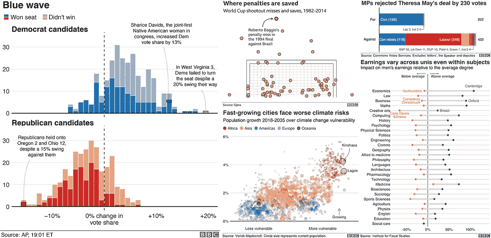
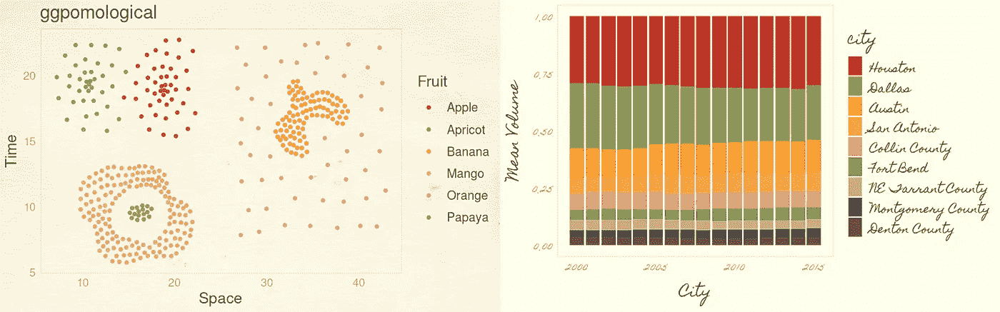
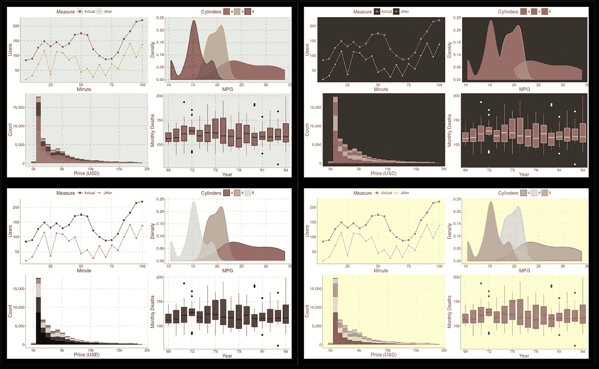
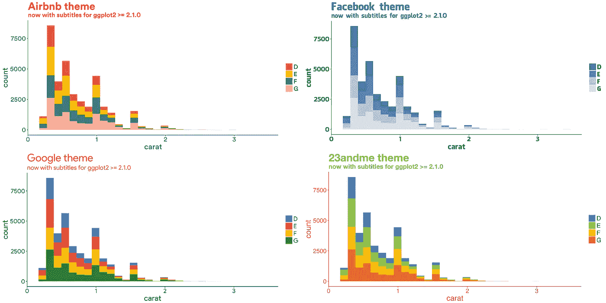
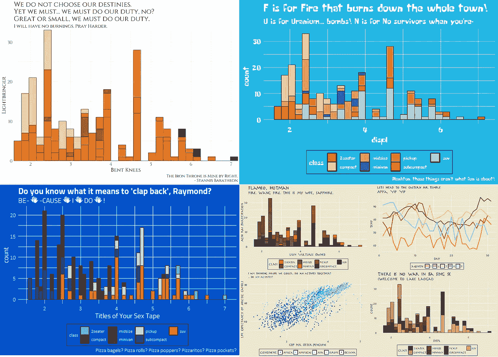
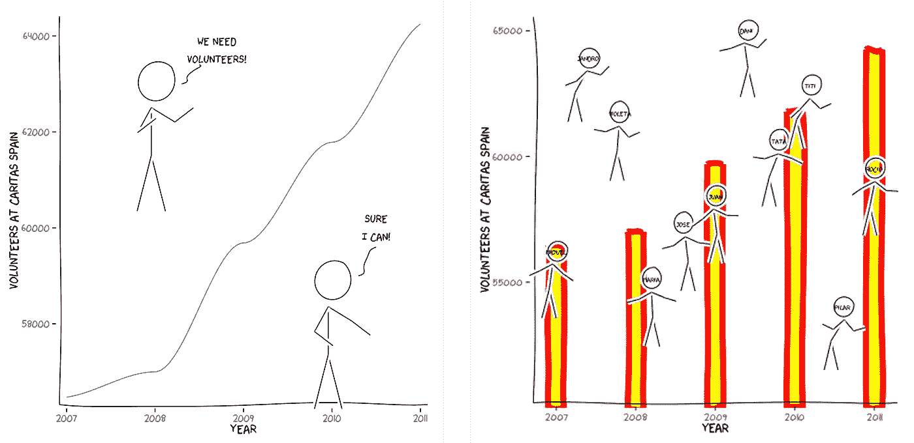

# 使用 ggplot2 增加可视化效果的主题

> 原文：<https://towardsdatascience.com/themes-to-spice-up-visualizations-with-ggplot2-3e275038dafa?source=collection_archive---------5----------------------->

## 利用 ggplot2 包的扩展来加速可视化。


照片由[桑迪·克拉克](https://unsplash.com/@honeypoppet?utm_source=medium&utm_medium=referral)在 [Unsplash](https://unsplash.com?utm_source=medium&utm_medium=referral) 拍摄

在的一瞥中，当你看一个视觉化图像时，很少有东西跳出来，这可能因人而异。那些引人注目的特征可以是图表或图像、使用的颜色、文本样式，甚至是背景。如果您对数据可视化感兴趣，并且熟悉创建良好可视化的原则。那么，你一定认为图表是由数据和骨架组成的。可视化中剩下的就是处理轴、注释和背景的框架，通常称为 ***主题*** 。

如果你是一个 R 用户，那么现在你应该知道 ggplot2 包的主题是有限的。但是 ggplot2 包提供了定制你自己的主题的选项。

有兴趣定制你的主题，然后检查这篇文章:

[](/master-data-visualization-with-ggplot2-theme-customization-8421695d24e2) [## 使用 ggplot2: theme()定制的主数据可视化

### 自定义 ggplot2 主题，为高效工作流程创建您的个性化主题模板。

towardsdatascience.com](/master-data-visualization-with-ggplot2-theme-customization-8421695d24e2) 

如果定制你的主题太费时间，那么 R 爱好者已经为 ggplot2 包创建了扩展，提供了与包兼容的主题。

这里我编译了一个包列表，它提供了与`ggplot2`包兼容的主题。这不是一个详尽的列表，但涵盖了提供 ggplot2 包扩展的大多数包。名单如下:

## [ggthemes 包](https://github.com/jrnold/ggthemes)

该软件包提供了 15 个主题；我在下面列出了一些值得注意的例子:

*   主题 _ 经济学人:根据《经济学人》杂志的剧情改编。
*   主题 _ 少数:遵循斯蒂芬·少数的“图表中使用颜色的实用规则”的教导。
*   以 fivethirtyeight.com 主题为基础创作情节。
*   theme_tufte:基于 tufte 在*中描述的设计原则，定量信息的可视化显示*。
*   《华尔街日报》:根据华尔街日报的情节改编。

除了主题，还有基于塔夫特作品和比例尺的几何图形。以下是完整的[列表](https://mran.microsoft.com/snapshot/2017-02-04/web/packages/ggthemes/vignettes/ggthemes.html)的链接。

## [*hrbr 主题包*](https://github.com/hrbrmstr/hrbrthemes)

hrbrthemes 包中提供了 9 个主题，这些主题以排版为重点，并与 ggplot2 包兼容。

*   theme_ipsum: Arial Narrow
*   高盛无凝聚
*   没有浓缩的经济
*   主题 _ipsum_rc: Roboto Condensed
*   主题 _ipsum_ps: IBM Plex Sans 字体
*   主题 _ipsum_pub:公共 San
*   主题 _ipsum_tw: Titilium Web
*   主题 _ 现代 _rc:机器人浓缩黑暗主题
*   theme_ft_rc:黑暗主题基于 ft 的黑暗主题(Roboto Condensed)

该软件包还提供了额外的标度、调色板、字体、R markdown 模板和其他实用工具。

这里有几种安装软件包的方法。

```
install.packages("hrbrthemes") # NOTE: CRAN version is 0.8.0
# or
install.packages("hrbrthemes", repos = c("https://cinc.rud.is", "https://cloud.r-project.org/"))
# or
remotes::install_git("https://git.rud.is/hrbrmstr/hrbrthemes.git")
# or
remotes::install_git("https://git.sr.ht/~hrbrmstr/hrbrthemes")
# or
remotes::install_gitlab("hrbrmstr/hrbrthemes")
# or
remotes::install_bitbucket("hrbrmstr/hrbrthemes")
# or
remotes::install_github("hrbrmstr/hrbrthemes")
```

## [城市时间套餐](https://urbaninstitute.github.io/urbnthemes/index.html)

Urban Institute 的软件包，使在那里工作的人更容易绘图。要获得使用`urbnthemes`包的完整指南，请访问 [Urban Institute R Users Group 网站](https://urbaninstitute.github.io/r-at-urban/graphics-guide.html)查看完整的示例列表。

要安装这个包，首先安装`remotes`库，然后安装`urbnthemes`包。

```
[install.packages](https://rdrr.io/r/utils/install.packages.html)("remotes")
remotes::[install_github](https://rdrr.io/pkg/remotes/man/install_github.html)("UrbanInstitute/urbnthemes", build_vignettes = TRUE)
```

## [bbplot 包](https://github.com/bbc/bbplot/)

BBC 新闻数据团队创建的软件包提供了两个功能:

*   bbc_style():不带参数的函数将绘图的基本格式设置为 bbc 的格式。该功能只需添加到`ggplot()`功能中即可。
*   finalise_plot():该函数有 6 个参数，其中 3 个是默认参数，另外 3 个需要提供。该功能保存情节，并根据 BBC 图表创建指南调整标题、副标题和其他格式。

以下是使用 bbplot 软件包创建的图形。



来源: [bbplot 包](https://github.com/bbc/bbplot/)

## [ggpomologic package](https://www.garrickadenbuie.com/project/ggpomological/)

[Garrick Aden-Buie 创作 ggPomologicalal 套装的](https://www.garrickadenbuie.com/project/ggpomological/)灵感来自于[美国农业部 pomologic 水彩作品集](https://usdawatercolors.nal.usda.gov/pom)中的图片。这个包提供了三个主题，一个基于水彩、字体和纸纹理背景的调色板。

这三个主题是:

*   theme _ pomological():基于纸张背景的水彩造型主题。
*   theme _ pomological _ plain():这个主题类似于前面的主题，但背景是白色或透明的。
*   theme _ pomological _ fancy():彩纸背景，花式手写字体。



来源: [ggpomological package](https://github.com/gadenbuie/ggpomological)

## [ggthemr 包](https://github.com/cttobin/ggthemr)

该软件包提供了 17 个独特的内置颜色主题来创建不同风格的图表。下面是 ggthemr 包中的一些主题示例。



顺时针方向:葡萄色、大地色、淡紫色和灰色(来源: [ggthemr 包](https://github.com/Mikata-Project/ggthemr))

## [ggtech 包](https://github.com/ricardo-bion/ggtech)

对使用你最喜欢的科技公司的配色方案创造视觉感兴趣，那么看看 Ricardo Bion 的 ggtech 软件包。

```
devtools::install_github("ricardo-bion/ggtech", 
                          dependencies=TRUE)
```

*   爱彼迎（美国短租平台）
*   Etsy
*   脸谱网
*   谷歌
*   推特
*   23andme



顺时针方向:Airbnb、脸书、23andme 和谷歌(来源: [ggtech package](https://github.com/ricardo-bion/ggtech) )

## [电视主题包](https://ryo-n7.github.io/2019-05-16-introducing-tvthemes-package/)

如果你不是一个技术爱好者，而是一个电视迷，那么看看中川亮的电视主题包，你可能会感兴趣。

这是您安装软件包的方式:

```
devtools**::**install_github("Ryo-N7/tvthemes")
```

主题列表包括:

*   阿凡达:最后的气宗
*   布鲁克林九比九
*   权力的游戏/冰与火之歌
*   里克和莫蒂公司
*   公园和娱乐
*   辛普森一家
*   海绵宝宝
*   希尔达（女子名）
*   进击的巨人
*   麻辣女孩
*   大英雄 6
*   重力下降

以下是使用电视主题创建的一些示例图表:



顺时针方向:权力的游戏，海绵宝宝，阿凡达:最后的气宗，布鲁克林九九(来源: [tvthemes 包](https://github.com/Ryo-N7/tvthemes))

## [艺术派对套餐](https://datarootsio.github.io/artyfarty/)

Dataroots 创建的包有 12 个内置主题和 24 个调色板可供选择。这个包区别于其他包的一个关键特性是用一行代码就可以轻松地添加水印。我们可以在如下所示的`devtools`包的帮助下安装包。

```
devtools::[install_github](http://www.rdocumentation.org/packages/devtools/topics/install_github)('datarootsio/artyfarty')
```

## [Firatheme 包](https://github.com/vankesteren/firatheme)

Erik-Jan van Kesteren 的 Firatheme 基于 Trafford 数据实验室主题和 Mozilla 的 Fira Sans 字体。这个包提供了一个单一的主题(`theme_fira()`)和由[coolers](https://coolors.co/)生成的调色板。我们可以使用`firaSave()`功能保存图形。

软件包安装可以按以下方式完成:

```
remotes::install_github("vankesteren/firatheme")
```

## [xkcd 包](http://xkcd.r-forge.r-project.org/)

这个包是 ggplot 的 webcomics XKCD 的风格化版本。



来源: [xkcd 包](http://xkcd.r-forge.r-project.org/)

## [ggdark 包](https://cran.r-project.org/web/packages/ggdark/readme/README.html)

你喜欢在黑暗模式下工作，然后检查这个包吗？ggdark 创建 ggplot2 主题的黑暗模式版本。一旦你安装了 ggdark 包，只要在主题名前添加***【dark _***就可以把任何 ggplot2 默认主题变成黑暗模式，比如 dark_theme_void()或者 dark_theme_minimal()。

我相信我已经介绍了大多数可以增加数据可视化的 ggplot2 扩展。如果我错过了你最喜欢的主题或包，让我知道，我会把它添加到列表中。在此之前，请尽情享受使用 R 和 ggplot2 软件包创建出色图表的乐趣。

如果你喜欢阅读我写的文章，那么你可以通过使用下面的推荐链接订阅媒体来支持我。

[](https://abhinav-malasi.medium.com/membership) [## 阅读阿比纳夫·马拉斯(以及媒体上成千上万的其他作家)的每一个故事

### 作为一个媒体会员，你的会员费的一部分会给你阅读的作家，你可以完全接触到每一个故事…

abhinav-malasi.medium.com](https://abhinav-malasi.medium.com/membership) 

要了解最新情况，您可以订阅我发布文章时的电子邮件通知。

[](https://abhinav-malasi.medium.com/subscribe) [## 每当阿比纳夫·马拉斯发表文章时，就收到一封电子邮件。

### 编辑描述

abhinav-malasi.medium.com](https://abhinav-malasi.medium.com/subscribe) 

*可以在*[*LinkedIn*](https://www.linkedin.com/in/abhinav-malasi/)*和*[*Twitter*](https://twitter.com/malasi_abhinav)*上与我连线，跟随我的数据科学和数据可视化之旅。或者您可以在 Medium 上关注我，了解有关 R 和 ggplot2 包的数据可视化的最新文章。*