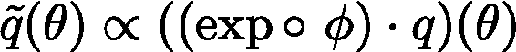

# 学习理论——概括的贝叶斯观点

> 原文：<https://towardsdatascience.com/theory-of-learning-a-bayesian-perspective-of-generalization-6e6d34cb1e61?source=collection_archive---------30----------------------->

## [思想和理论](https://towardsdatascience.com/tagged/thoughts-and-theory)

## 透过 PAC-Bayes 的镜头

由[克里斯蒂安·胡宁](https://unsplash.com/@christiaanhuynen_designbro?utm_source=medium&utm_medium=referral)在 [Unsplash](https://unsplash.com?utm_source=medium&utm_medium=referral) 上拍摄的照片

收益理论是一门研究训练误差和泛化误差之间差距(又称泛化差距)的学科，它为我们提供了一个经过训练的学习者对新数据的性能保证。多年来，人们已经做了很多工作来捕捉泛化差距，包括但不限于 VC 维、Rademacher 复杂度、算法稳定性。虽然这些工作在欠参数化区域(其中我们拥有的数据比要学习的自由参数的数量多)中给出了泛化差距的清晰界限，但当我们过渡到插值区域(其中我们拥有的自由参数比数据多，以至于我们可以完美地插值数据)时，这些界限变得空洞——随着模型(神经网络)变得越来越复杂，泛化误差不会随着界限的增加而增加，而是呈现下降趋势。虽然这种神秘的泛化行为，也称为双重下降，导致神经网络模型在许多任务上的成功，但寻找理论解释仍然是开放式的。

# 概括的贝叶斯观点——实证研究

在最近的一篇论文“Bayesian Deep Learning and a probabilical Perspective of Generalization”中，作者表明，在假设类的泛化误差相对于模型灵活性(最大容量)单调下降的意义上，甚至对于损坏的数据集，也可以完全缓解双下降现象。模糊地说，实现这一点的关键是更好地逼近数据匹配归纳偏差模型的贝叶斯边缘化(我不会详细介绍论文传达的细节，但可以参考下面的页面，了解关于论文的简明和全面的介绍:[https://joris baan . nl/2021/03/02/introduction-to-Bayesian-deep-learning . html](https://jorisbaan.nl/2021/03/02/introduction-to-bayesian-deep-learning.html))。对这些概念的实验确实产生了迷人的结果，给了我们一个支持贝叶斯方法的令人信服的证据。然而，除了实证实验之外，理论支持仍然是缺失的。在本文中，我将通过 PAC-Bayes 框架给出 Bayes 边缘化和泛化之间的理论联系。首先，让我来勾画一下总体路线图，以总结实现连接的步骤:

1.  重述证据下限(ELBO)
2.  引入度量变化不等式作为 ELBO 的推广
3.  导出 PAC-Bayes 界限
4.  建立联系

# 从 ELBO 到 PAC-Bayes 界

## 证据下限

对于熟悉贝叶斯框架的人来说，众所周知，对数证据可以有如下下界

其中 q 是考虑的概率模型，q(x|θ)是似然函数，q(θ)是θ的先验分布，q(x)=∫q(x|θ) q(θ) dθ是证据/边际似然。这个不等式对于θ上的任何分布 r 都是有效的，假定 r 没有比 q 更大的支撑。这个不等式的 RHS 是所谓的 ELBO，它是一个紧界，因为当 r(θ)等于后验 q(θ|x)时，这个不等式可以实现。事实上，测井证据和 ELBO 之间的差异是从 q(θ|x)到 r(θ)的 KL 散度，因此测井证据可以分解如下

## 度量变化不等式

由于证据满足 q(x)=∫q(x|θ) q(θ) dθ，这是 q(x|θ) w.r.t. q(θ)的期望。因此，这个不等式可以改写为

事实上，这个不等式不仅适用于对数似然函数，而且适用于任何实值函数，即，

正如副标题所暗示的，这就是度量变化的不平等。类似于 ELBO，这个下界也是紧的，我们可以通过 Gibbs 后验来达到等式

事实上，两者之间的差异就是从吉布斯后验概率到 r 的 KL 散度，就像证据分解一样:

## 包装贝叶斯界限

现在，我们可以毫不费力地推导出 PAC-Bayes 界。这里的技巧是用一个将训练误差和泛化误差联系起来的函数来设置 *ϕ* 。一个特别的选择是

其中 D 代表未知数据生成分布，S 代表来自 D 的随机样本 iid，R 是在一定损失 L w R t 上评估的风险，S 或 D 分别代表训练误差和泛化误差。至于λ，它是一个自由参数，就像温度的倒数一样，控制着适应度(R_in)和复杂度(KL 散度)之间的某种折衷。插入这个 *ϕ* 并重新排列术语，你将得到

通过对 RHS 上最后一项的对数内的部分应用马尔可夫不等式，可以用它的期望(w.r.t .随机样本 S)来代替它，从而消除 S 引起的随机性，达到一般形式的 PAC-Bayes 界:

# 概括的贝叶斯视角——理论观点

## 贝叶斯边缘化=最优 PAC-贝叶斯界限

现在让我们看看如何将贝叶斯概念和 PAC-Bayes 技术联系起来。选择负对数似然函数作为评估风险的损失，并设置λ为样本数，前两项相加正好为负 ELBO(n 上的额外分数为 1)。这意味着通过对 r(θ)=q(θ|x)进行精确边缘化，我们可以最大化这个界限，因为其他两项与 r(θ)无关。

## 泛化=支持+归纳偏差

在前面提到的“贝叶斯深度学习和泛化的概率观点”一文中，作者认为模型的泛化有两个方面:模型可以相当近似的数据分布范围的**支持度**，以及模型在不同数据分布之间的拟合程度**。通过导出的 PAC-Bayes 界的透镜，我们给这个论证一个严格的数学意义**

1.  对于超出支持范围的数据分布，例如，在图像数据集上应用线性模型，我们可能会有小的泛化差距，但我们永远无法实现令人满意的泛化，因为在整个空间中没有很好地接近真实值的权重配置，导致即使对于优化的先验 q(θ)也只有小的证据(因此泛化误差界很大)。
2.  对于不匹配的归纳偏差，不可约项(PAC-Bayes 界的 RHS 上的第三项)永远不会小(在给定固定模型和数据分布的情况下，减少不可约项的唯一方法是收集更多数据，但只要我们专注于插值范围，这不太可能发生)。

# 摘要

从 PAC-Bayes 的角度来看，就推广范围而言，更好地逼近 Bayes 边缘化确实优于任何优化方法的单一解决方案。对于更严格的界限，有大量活跃的研究领域:几何深度学习研究不同架构对不同数据的有效性；差分隐私寻求在 q(θ)等上找到“数据分布相关”但“数据独立”的先验。虽然还有很长的路要走，但我们正在逐渐揭开学习中的神秘事物，这真的令人振奋。

# 参考

[1]威尔逊，安德鲁&伊兹迈洛夫，帕维尔。(2020).贝叶斯深度学习和一般化的概率观点。

[2]热尔曼，帕斯卡尔&巴赫，弗朗西斯&拉科斯特，亚历山大&拉科斯特-朱利安，西蒙。(2016).PAC-贝叶斯理论符合贝叶斯推理。