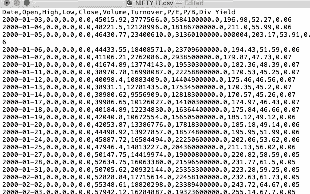
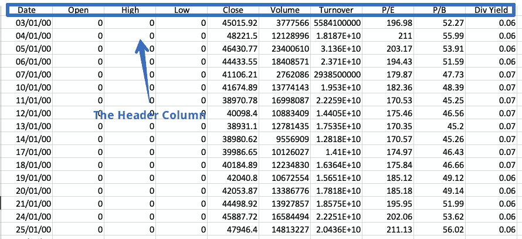
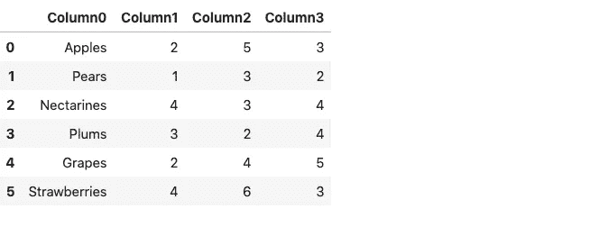
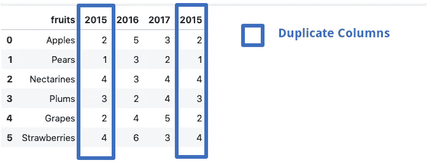
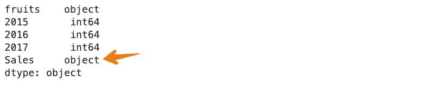
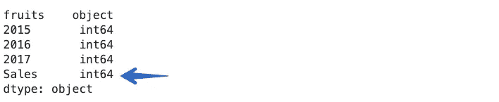

# “pandas.read_csv()”并不像看上去那样简单

> 原文：<https://towardsdatascience.com/there-is-more-to-pandas-read-csv-than-meets-the-eye-8654cb2b3a03?source=collection_archive---------12----------------------->

## [*小窍门*](https://towardsdatascience.com/tagged/tips-and-tricks)

## 深入探究熊猫的`read_csv`功能的一些参数


[故事创造的时间向量](https://www.freepik.com/vectors/time)——[www.freepik.com](http://www.freepik.com)

Pandas 是数据科学生态系统中使用最广泛的库之一。这个多功能的库为我们提供了在 Python 中读取、探索和操作数据的工具。pandas 中用于数据导入的主要工具是`[**read_csv()**](https://pandas.pydata.org/docs/reference/api/pandas.read_csv.html#pandas.read_csv)**.**`。该函数接受逗号分隔值的文件路径，即 CSV 文件作为输入，并直接返回 pandas 的数据帧。一个 [**逗号分隔值**](https://en.wikipedia.org/wiki/Comma-separated_values) ( **CSV** ) [文件](https://en.wikipedia.org/wiki/Computer_file)是一个使用[逗号](https://en.wikipedia.org/wiki/Comma)分隔值的分隔[文本文件](https://en.wikipedia.org/wiki/Text_file)。



CSV 文件示例|作者图片

`pandas.read_csv()`有大约 50 个可选的调用参数，允许非常精细的数据导入。本文将涉及一些鲜为人知的参数及其在数据分析任务中的用法。

# pandas.read_csv()参数

使用默认参数在 pandas 中导入 CSV 文件的语法如下:

```
 import pandas as pd
df = pd.read_csv(filepath)
```

## 1.冗长的

**详细**参数设置为`True`时，打印读取 CSV 文件的附加信息，如:

*   类型转换，
*   内存清理，以及
*   符号化。

```
import pandas as pd
df = pd.read_csv('fruits.csv',verbose=True)
```


## 2.前缀

标题是 CSV 文件中的一行，包含有关每列内容的信息。顾名思义，它出现在文件的顶部。



文件中标题列的示例|按作者排列的图像

有时数据集不包含标题。要读取这样的文件，我们必须显式地将`header`参数设置为 none 否则，第一行将被视为标题。

```
df = pd.read_csv('fruits.csv',header=none)
df
```


得到的数据帧由列号代替列名组成，从零开始。或者，我们可以使用`**prefix**`参数来生成要添加到列号的前缀。

```
df = pd.read_csv('fruits.csv',header=None, prefix = 'Column')
df
```



请注意，您可以指定自己选择的任何名称来代替`Column`。

## 3.mangle_dupe_cols

如果数据帧由重复的列名组成，如‘X’，‘X’等`mangle_dupe_cols`会自动将名称更改为‘X’，‘X1’并区分重复的列。



作者图片

```
df = pd.read_csv('file.csv',mangle_dupe_cols=True)
df
```


作者图片

dataframe get 中的一个`2015`列被重命名为`2015.1`。

## 4.组块大小

`pandas.read_csv()`函数带有一个 **chunksize** [**参数**](https://pandas.pydata.org/pandas-docs/stable/reference/api/pandas.read_csv.html#pandas.read_csv) ，用于控制块的大小。这有助于加载熊猫的内存数据集。要启用分块，我们需要在开头声明块的大小。这将返回一个我们可以迭代的对象。

```
chunk_size=5000
batch_no=1
for chunk in pd.read_csv('yellow_tripdata_2016-02.csv',chunksize=chunk_size):
    chunk.to_csv('chunk'+str(batch_no)+'.csv',index=False)
    batch_no+=1
```

在上面的例子中，我们选择块大小为 5000，这意味着一次只能导入 5000 行数据。我们获得了 5000 行数据的多个块，每个块可以很容易地作为 pandas 数据帧加载。

```
df1 = pd.read_csv('chunk1.csv')
df1.head()
```

你可以在下面提到的文章中读到更多关于组块的内容:

[](/loading-large-datasets-in-pandas-11bdddd36f7b) [## 在 Pandas 中加载大型数据集

### 有效地使用分块和 SQL 来读取 pandas 中的大型数据集。🐼

towardsdatascience.com](/loading-large-datasets-in-pandas-11bdddd36f7b) 

## 5.压缩

很多时候，我们会收到压缩文件。嗯，`pandas.read_csv`可以轻松处理这些压缩文件，无需解压缩。压缩参数默认设置为`infer,`，可以自动从文件扩展名推断出文件的种类，即`gzip` 、`zip`、`bz2`、`xz`。

```
df = pd.read_csv('sample.zip') or the long form:df = pd.read_csv('sample.zip', compression='zip')
```

## 6.数千

每当数据集中的一列包含一个**千位**分隔符时，`pandas.read_csv()`就将其作为一个字符串而不是一个整数来读取。例如，考虑下面的数据集，其中销售列包含一个逗号分隔符。


作者图片

现在，如果我们将上面的数据集读入一个 pandas 数据帧，那么由于逗号的存在，`Sales`列将被视为一个字符串。

```
df = pd.read_csv('sample.csv')
df.dtypes
```



为了避免这种情况，我们需要借助于`thousands`参数明确地告诉 `pandas.read_csv()`函数，逗号是一个千位指示符。

```
df = pd.read_csv('sample.csv',thousands=',')
df.dtypes
```



## 7. **skip_blank_lines**

如果数据集中存在空行，它们会被自动跳过。如果您希望空行被解释为 NaN，请将`skip_blank_lines`选项设置为 False。

## 8.读取多个 CSV 文件

这不是一个参数，只是一个有用的提示。要使用 pandas 读取多个文件，我们通常需要单独的数据帧。例如，在下面的例子中，我们调用`pd.read_csv()`函数两次，将两个独立的文件读入两个不同的数据帧。

```
df1 = pd.read_csv('dataset1.csv')
df2 = pd.read_csv('dataset2.csv')
```

一起读取这些文件的一种方法是使用循环。我们将创建一个文件路径列表，然后使用列表理解遍历列表，如下所示:

```
filenames = ['dataset1.csv', 'dataset2,csv']
dataframes = [pd.read_csv(f) for f in filenames]
```

当许多文件名具有相似的模式时，Python 标准库中的 [**glob**](https://docs.python.org/3/library/glob.html) 模块就派上了用场。我们首先需要从内置的`glob`模块中导入`glob`函数。我们使用模式`NIFTY*.csv` 来匹配任何以前缀`NIFTY`开始并以后缀`.CSV.`结束的字符串,`*’(asterisk)`是一个通配符。它代表任意数量的标准字符，包括零。

```
import glob
filenames = glob.glob('NIFTY*.csv')
filenames
--------------------------------------------------------------------
['NIFTY PHARMA.csv',
 'NIFTY IT.csv',
 'NIFTY BANK.csv',
 'NIFTY_data_2020.csv',
 'NIFTY FMCG.csv']
```

上面的代码可以选择所有以 NIFTY 开头的 CSV 文件名。现在，他们都可以使用列表理解或循环一次阅读。

```
dataframes = [pd.read_csv(f) for f in filenames]
```

# 结论

在本文中，我们研究了 pandas.read_csv()函数的几个参数。这是一个有益的功能，带有许多我们很少使用的内置参数。不这样做的主要原因之一是因为我们很少关心阅读文档。详细研究文档以发掘其中可能包含的重要信息是一个很好的主意。

*👉有兴趣自己看其他文章。这个* [*回购*](https://github.com/parulnith/Data-Science-Articles/blob/main/README.md) *包含了我分类写的所有文章。*