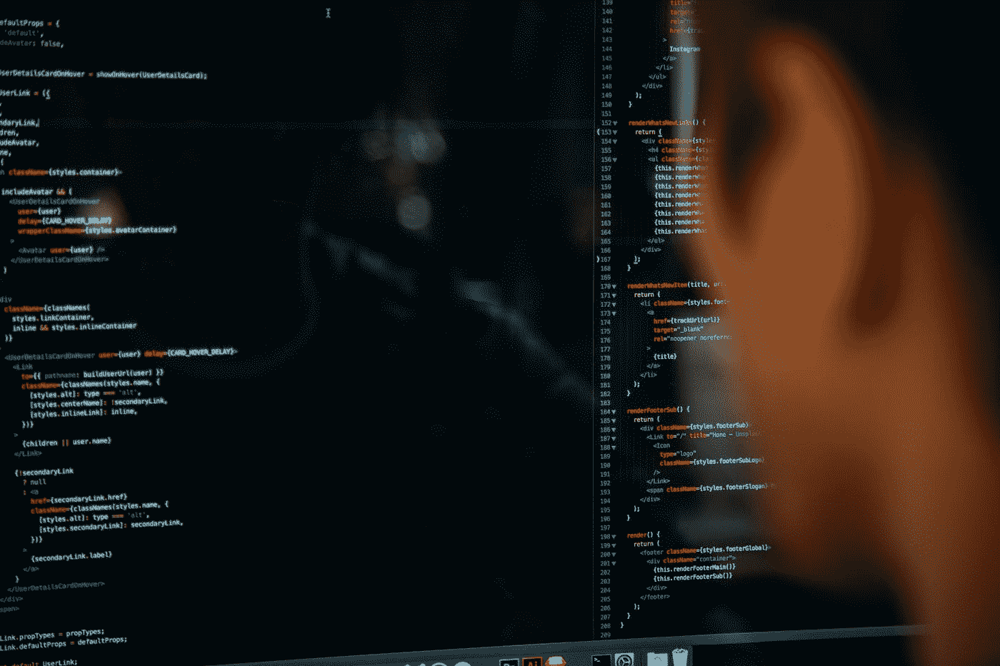

# 为了你的数据有一场战争

> 原文：<https://towardsdatascience.com/theres-a-war-for-your-data-e55f94f124e1?source=collection_archive---------22----------------------->

## 巧妙应对快速变化的数据环境

查尔斯·德鲁维奥在 [Unsplash](https://unsplash.com?utm_source=medium&utm_medium=referral) 上拍摄的照片

“数据是新的石油。”

“每个公司都是数据公司。”

*【在此插入你最喜欢的数据格言】*

你明白了。我明白了。市场明白了。如果美国国家航空航天局的无人驾驶飞机在火星上发现了生命，我敢肯定即使是火星人也会发现。

继续告诉公司他们的数据有多重要，这已经到了不仅令人厌倦，而且近乎侮辱的地步。此外，他们都知道这些数据本身是无用的。除非这些数据变成信息，否则对任何人都没有帮助。事实上，它比这更微妙。在信息在正确的时间到达组织内部正确的人手中之前，即使是信息也不是那么有用。

如果您没有听说过，同样的数据也在以惊人的速度增长，每天都有新的来源出现。这和报道发现水是湿的一样有新闻价值

用电影《萨利》中与汤姆·汉克斯同名的角色的话来说:“我们现在可以认真了吗？”

因为每个人都确切地知道数据有多重要，所以每个人都为它而来。组织内的每个分析师。每一个坏演员(包括民族国家规模的攻击)。和每个供应商。以这样或那样的方式，每个人都在追逐公司的数据。

数据团队正处在这场激烈的战斗中。他们有许多名字:数据架构师、数据工程师、数据交付等。；但他们的职责是一样的:将公司的数据交付给需要的人，在他们需要的时候，以他们需要的方式；永远不要让它落入不该拥有它的人手中。

如果你在一个数据团队，我会在这篇文章的剩余部分与你交流。

当疫情以极快的速度加速这些计划时，事情已经朝着云基础设施的方向发展了。既然云应该为每个人省钱，你可能听说过这一句话:“哦，顺便说一句，在这个过程中削减 10%左右的费用。”

如今，领导者面临着巨大的压力。他们必须同时考虑短期和长期，这意味着在架构上做出决定，这些决定将伴随他们的公司很长很长一段时间。但这些决定不仅仅会影响公司，还会影响数据团队成员个人及其职业生涯。有时，供应商没有意识到，这些决策对个人和公司来说都是声誉和游戏规则的改变。

我已经在数据和应用程序领域工作了近 30 年，当我在 90 年代初进入这个市场时，大型机还是一个东西。当时，许多人声称所有“真正的工作”都将在大型机上完成。客户机/服务器太乱了；太野太笨重。大型机安全、高效、任务关键。我们知道结果如何。接着是操作系统战争:Windows、OS/2、Unix、Linux。这是在网络战争的中期:令牌环与以太网。当然还有存储大战:San、NAS、JBODs。一路上都是语言战争:Java。NET，C++，Visual Basic。

这些是昨天的战斗。无论您在处理数据方面担任什么角色，您都不想错过当今技术趋势的重大转变。你这样做将会给你自己和你的公司带来危险。

这就把我们带到了数据之战。尤其是数据分析基础设施的开放或封闭性质。这里，您有两个主要选择:(1)坚持传统的数据仓库架构；(2)开始拥抱[开放式湖边小屋架构](https://medium.com/sapphire-ventures-perspectives/what-is-the-open-data-ecosystem-and-why-its-here-to-stay-60c06f19011b)。如果后一种趋势是真实的趋势，那么是时候认真对待它并走在前列了——否则公司将面临能力、招聘、灵活性等方面的许多障碍。当你错过一个主要的技术趋势时，你很难赶上。

就个人而言，我认为这种转变类似于应用架构从客户机/服务器框架向微服务的转移。今天，考虑使用客户机/服务器架构来构建现代 web 应用程序是不合理的。我相信数据分析架构现在正经历着与十多年前应用架构相同的发展。

就 web 应用程序而言，我们生活在一个服务世界——模块化和同类最佳。为什么数据分析应该有所不同？过去是因为技术不存在，但现在公司必须利用新的创新，并保持领先地位来竞争。随着向云基础设施的转变，湖边小屋的世界正随着创新而爆炸式增长。模块化、高效、现代、灵活、安全，具有广泛的功能、丰富的治理和安全性。感觉就像过去大趋势转变的规模。

事实是，这些架构正随着创新而爆炸式增长，当我们一起创建一个可以利用这些新技术的开放生态系统时，可能性将呈指数级增长。我们一起推动创新，比以往任何时候都更快更远，真正的问题是如何应对。我建议你从教育开始。保持对新技术的了解，这比以往任何时候都更容易，因为会议和内容可以自由和广泛地获得。关注市场趋势。尝试一些新产品。到那时，如果大趋势发生转变，你就能很好地利用它。