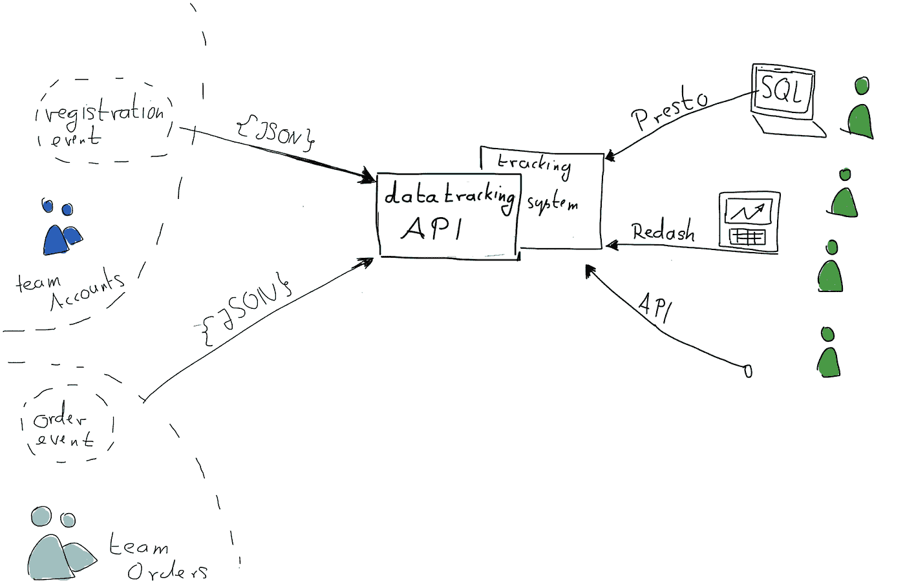

# 数据网格不止一种，有三种类型

> 原文：<https://towardsdatascience.com/theres-more-than-one-kind-of-data-mesh-three-types-of-data-meshes-7cb346dc2819?source=collection_archive---------3----------------------->

## [意见](https://towardsdatascience.com/tagged/opinion)

## 关于红移，数据目录，像 Presto 这样的查询引擎，以及机器学习工程师获取数据的麻烦。

图片由作者提供。作者对许多不同的数据网格体系结构感到困惑。

D数据网格是数据&分析部门的热门&趋势话题。在短短一年内，在像 [Zalando](https://www.thoughtworks.com/de/webinar/data-mesh) 这样的大公司实施，并从 ThoughtWorks [技术雷达](https://www.thoughtworks.com/de/radar/techniques/data-mesh)的“试用”状态转变为“评估”状态。然而，我看到的结果并不令人印象深刻。

在过去的一年中，出现了不少引起关注的文章，至少在发表了我的第一篇关于[数据网格](/data-mesh-applied-21bed87876f2)的文章后，我对这个话题产生了不少疑问和困惑。

大多数担忧和困惑似乎都有一个共同点。这种观点认为**只有一种数据网**——这与宝马集团和 Zalando 描述的数据网非常相似。

实际上有一个**连续的数据网格谱**，它们都有不同的优势，非常不同的技术架构，适合不同的最终用户，团队参与的规模也非常不同。但最重要的是，它们在能做什么和应该用来做什么方面是不同的。让我们来看看三种重要的建筑类型。

# 三种数据网格

让我们来看看一个集中式的、一个分散式的，以及我所认为的“标准”数据网格架构。

## 1.标准数据网格

想象一下由中央数据平台团队创建的一大堆*数据桶*。一个存储桶包含团队 A 的数据，另一个包含团队 B 的数据，依此类推。

此外，想象一下一些很酷的接入点，一些“查看这些桶”的方式。

最后，想象一个所有数据的目录，以及一个很酷的搜索方式，由团队维护。

图片由作者提供。通过标准化的“存储桶”实现中央数据访问。

团队 A 和团队 B 因此直接连接到他们数据的最终用户。这导致两个团队都获得了真正的“所有权”或他们的数据，因为他们现在获得了新客户**数据客户**。像机器学习工程师、数据分析师或数据工程师这样的数据客户有特殊的需求，团队现在可以像处理任何其他产品需求一样处理&实现。

这就是我想称之为“标准数据网格”的东西，尽管从我的角度来看，它实际上不是 Zhamak Dehghani 在[原始数据网格文章](https://martinfowler.com/articles/data-monolith-to-mesh.html)中讨论的东西。然而，这似乎是人们认为的标准选择。

## 2.一个高度集中的数据网

事实证明，数据网格的核心原则并不真正依赖于技术实现。我想强调一个非常重要的实现。

想象**一个大水桶**，用一种平滑的方式看着那个水桶；此外，想象 10 个小管道，让团队 A、B 等将数据倒入我们的大桶中。

想象一下，团队将数据以大约**相同的格式**倒入桶中。

图片由作者提供。通过将数据提供到中央数据桶中来进行中央数据访问。

现在，突然之间，我们的最终用户能够以极其快速和流畅的方式访问数据；数据是标准化的，所以他们可能得到许多标准视图，并且可以快速有效地从不同来源提取信息。数据平台团队可以快速启动这个东西，因为不需要连接大量不同的数据。尽管如此，数据仍然可以归团队所有。他们仍然可以负责服务他们的数据客户、转换数据等等。这里的所有权、转换和服务实际上与技术无关，而是更多地与团队是否具有这种“数据产品思维模式”有关。

## 3.一个非常分散的数据网

去另一个极端怎么样？

想象一下十个非常异构的数据桶，而不仅仅是标准大小。

想象一下十个管道，它们现在将数据虹吸到我们的大木桶中。

再次想象一些平滑的数据访问机制。然而，这一次，团队 A、B 还构建了到他们的数据池的定制访问点，以使他们更特殊的客户能够访问他们的特定数据。

图片由作者提供。通过“抽取”存储在不同技术中的团队拥有的数据，实现集中数据访问。

对于中央数据团队来说，听起来工作量很大，但是对于数据客户来说却有额外的灵活性！瞧，我们接近了光谱的另一端。

# 数据网格的定义

在我看来，所有这三种架构听起来都像数据网格，它们的核心是实现**数据去中心化**，将所有权推给团队，将数据产品思维推给团队。所以我们来试着找一个定义。

## 定义

我喜欢以下对数据网格的定义:

*数据网格是一种去中心化技术，数据网格是“所有权、转换&数据服务”的去中心化。*

根据这个定义，数据网格是一种去中心化技术，就像微服务或微前端一样(我在另一篇文章中详细阐述了这一点)。

## 数据网格的连续谱

从技术上来说，你可能会认为上面的“大部分集中的”数据网格听起来像是数据不是由团队拥有或服务的。恕我不能苟同。即使我们有 10 个团队将数据推送到 Google Analytics，你会说这些数据是由 Google Analytics 拥有和服务的吗？我希望不会。当然，它是由各个团队提供的(通过第三方工具),并且归各个团队所有，尽管

从技术上讲，选择的解决方案是一致的。即使是这种完全集中的选择，仍然具有数据网格的关键概念；只要单个团队对他们的数据负责，它仍然驱动着数据产品的思考。它的特点是分布式领域架构，只要团队能够以他们自己的方式自由地处理他们的数据(在给定的范围内);它以基础设施为平台，例如以平台的方式提供通用的交互工具，如 google tag manager 或 google data studio。

无论我们作为一个公司选择哪种数据架构(独立于数据网格),我们最终都需要某种“粘合剂”,某种将分散的部分粘合在一起的方法。

正是这种粘合剂，我把它看作是数据网格的不同程度的连续光谱。一方面是“非常强的胶水”，允许几乎没有变化，另一方面是“非常轻的胶水”，允许部件移动很多。

# 详细的示例性体系结构

让我们看看三个主要讨论的数据网格的一些可能的架构实现。我选择 AWS 作为我的基础设施参考点，因为我在那里感觉最自在。但是

你总是可以把 AWS S3 换成 GCS，把 AWS Lambdas 换成 GCF，等等。

让我们举一个简单的例子:一个电子商务公司，有一个网站，提供各种各样的文章。他们有几个团队:

1.  **“团队订单”:**拥有完整的**订单结构**从“将此添加到篮子”到“提交此订单”(以及随后发生的一切)
2.  **【团队详情】**:拥有**文章详情页面。**
3.  **【团队首页】**:拥有**首页**，包括搜索引擎&搜索引擎结果页面。
4.  **“团队账户**:拥有**注册**流程。
5.  **“X 团队”**:**数据平台团队**构建数据网格。

我们还有一些数据最终用户:

1.  **【团队推荐】**:**推荐** **引擎**团队，主要与 B 团队合作(通过一个做得很好的微前端，所以主要是解耦的。)
2.  **团队营销**:与团队 B 合作撰写文章细节文本，与团队 C 合作撰写首页内容。
3.  **团队管理**:与所有团队合作，尤其对关键指标和推进公司和产品的方式感兴趣。

好吧，让我们开始吧！

## 1.集中式数据网格

*一个专注于少数关键业务数据概念的组织单位，*可能会选择实现一个由团队提供服务的中央跟踪 API，包括基于它构建的标准报告&分析功能。

首先，让我们看看**团队 X** 为我们打造了什么:

1.  中央**数据跟踪 API** 。你唯一能用它做的事情:你可以向它发送数据。
2.  一个标准化的 **JSON 模式**,具有强制字段，如“数据所有者”和“时间戳”,以及“代理客户”、“动作”和“动作类别”。可选字段为“订单值”和“价值”。(大量借用 [GA 跟踪 API](https://developers.google.com/analytics/devguides/collection/protocol/v1) )
3.  一个**技术人员的中央访问点**，一个分布式 SQL 接口&查询引擎 [Presto](https://prestosql.io/docs/current/admin/web-interface.html) 。
4.  一个用于**报告&仪表板**的中央访问点被称为 [redash](https://redash.io/) 。
5.  在 redash 内部，团队已经建立了一堆**标准报告**，比如“顶级事件”、“最活跃的代理客户”。它们允许按日期、事件类别、值和订单值进行排序和聚合。对于所有带有“order_value”的数据，该团队构建了一个特殊的“orders”部分，其中包含一堆针对该数据过滤的额外报告。
6.  一个**中央跟踪数据检索 API** ，允许用于机器学习团队或数据工程工作流的批量&流。

我喜欢考虑流过引擎的单个数据片段来理解它:**让我们取一个单独的数据片段，即“已下订单”数据片段**。

1.  新客户点击“完成注册”。
2.  **团队账号**:决定共享注册数据。
3.  **团队 X:** 中央 API 接收标准化数据段 *{data_owner:“团队 E”；时间戳:" "… key_data: {acting_customer: 123，action: "registers "，value:" 100 " order _ value:" 0 " } }*
4.  客户点击网站上的“提交订单”按钮，一个订单事件在后端发出。
5.  **团队订单**:某个服务拾取订单事件，处理订单，并向中央 API 发送一个数据点。
6.  **团队 X** :中央 API 接收标准化的数据片 *{data_owner:“团队 A”；时间戳:" "… event_uuid: …" "，additional _ meta:" "…key _ data:{ acting _ customer:123；动作:“买东西”，order _ value:“103，4”} }*
7.  **Team X** :中央报告解决方案生成订单金额、最活跃客户、行动等报告。，标准化数据集提供的一切。

一个集中的数据网格，其中数据主要驻留在 team Xs 上下文中。

推荐引擎团队享受标准化数据；不需要侵入数据库或要求一个中央 API。如果推荐引擎团队想要扩展到第二个产品，他们已经以标准格式获得了所有需要的数据。数据被很好地记录下来，因为它被每个人使用，并且被很好地编目。

营销团队享有良好的数据覆盖，并且他们有许多报告可以立即查看数据。没有必要让一个分析部门产生大量不同的报告。管理层得到了他们需要的一切，因为一切都围绕着他们在公司使用的几个关键业务概念。如果他们需要一些特定的报告，他们可以使用数据的自定义 CSV 导出，并在其上运行一些 Excel 魔术。

数据平台团队很高兴，因为他们以极快的速度从最初的原型到对公司决策能力产生持久影响的项目。

## 2.“标准”数据网格

两家德国巨头，在线服装零售商 Zalando 和宝马集团最近分享了一些关于他们努力建立我称之为数据网的东西的见解。 [Zalando 的数据网](https://www.thoughtworks.com/de/webinar/data-mesh)和[宝马集团的](https://d1.awsstatic.com/events/reinvent/2019/Creating_a_data-driven,_cloud-native_ecosystem_at_BMW_Group_AUT306.pdf)都采用了我主要放入“标准”选项桶的架构，尽管 Zalando 比宝马更倾向于分散化。

让我们看看 X 团队如何为我们构建一个简化版本:

1.  一个**中央元数据 REST API** ，允许设置新的元数据，更新，删除&检索给定数据集的元数据。这是必要的，因为我们这里没有标准化的模式。
2.  一个**中央数据目录**，来源于元数据存储。该团队决定使用 [Linkedin 的 datahub](https://github.com/linkedin/datahub) ，在这种情况下，API 和数据目录都有一个漂亮的用户界面。
3.  一批 **AWS S3 铲斗**，每一个都归一个车队所有。团队被绑定到一个命名约定，遵循*“{团队标识符}/{数据标识符}/…”*将他们的数据放入这些桶中。
4.  又一个**技术人员的中央访问点**，一个名为 [Presto](https://prestosql.io/docs/current/admin/web-interface.html) 的分布式 SQL 接口&查询引擎，也来自元数据 API。
5.  **AWS Lambda 函数**，团队可以使用这些函数将来自 AWS S3 的数据铲入中央 *AWS 红移数据库*。
6.  再次工具 [Redash](https://github.com/getredash/redash) 在 AWS 红移数据库之上。这一次，团队 X 不能创建任何报告，相反，如果需要，他们允许团队这样做。**一个** [**分析工程**](https://blog.getdbt.com/what-is-an-analytics-engineer/) **团队**可以通过这种方式轻松地将一些数据铲入 AWS 红移数据库&从而为*管理团队*创建仪表盘。营销团队从与营销团队一起进行实验的团队 B 和 C 那里获得大部分报告。

数据流:让我们取一个单独的数据片段，即“订单”数据片段。

1.  新客户查看首页，开始注册，然后点击“完成注册”。
2.  **团队账户**:决定共享该数据。因此，他们将元数据发送到一个中央元数据 API: *{"name ":"客户选择的用户名"，" timestamp ":"注册时间"，" source ":"我们从 Google Analytics 提取的与此注册相关的源" }*
3.  **团队账户**:他们将实际数据发送到中央数据团队为所有团队设置的更大的桶湖内他们自己的 AWS S3 桶。
4.  客户点击网站上的“提交订单”按钮。
5.  **团队订单**:在后端的某个地方，来自团队 A 的服务拾取该事件，处理订单。此外，团队 A 决定共享这些数据，因此他们将元数据发送到中央元数据 API: *{"customer_id ":"我们从团队 E 获得的客户 id "，" timestamp ":"订购时间"，" items": … "gross_price "，…}*
6.  **团队命令**:他们将实际数据发送到中央数据团队为所有团队设置的更大的桶湖内他们自己的 AWS S3 桶。
7.  **Team X** :元数据 API 得到了新的元数据，所以把它放到了“数据目录”里，供大家访问。
8.  **团队 X** :在这些元数据之上，我们无法生成标准的报告。但是，我们可以创建一个新的接入点，然后通过公司中任何人都可以使用的通用标准接口来使用它。
9.  **团队机器学习:**也通过订单团队 AWS S3 桶“/Team-d/re commendation-interface/”内他们自己的小“subbucket”接收新数据，但他们得到的是他们包含整个月订单的批量数据包的更新。
10.  **Team Front Page** :将来自 front page views 的数据(属于 A/B 实验的一部分)推入 API，并在 redash 中为团队营销创建一个新报告。

图片由作者提供。使用团队拥有但标准化的工具。

推荐团队喜欢这种方法，因为他们可以要求订单团队以他们需要的速度提供他们需要的数据。有了这个，他们能够产生接近实时的推荐。营销团队可以自由地生成报告，这很容易通过通用界面完成。他们可以为所采用的每项新活动即时生成新报告。管理层很高兴，因为他们不必翻遍大量的样板文件，而是通过专门为他们创建的仪表板来获取数字。

## 3.一个非常分散的数据网

让我们朝着权力下放的方向更进一步。我们的小型电子商务公司早就意识到,“有边界”的自治是一种很好的工作方式。因此，他们开始为 Postgres、AWS S3 和 [Greg Young 事件商店](https://www.eventstore.com/)等一系列存储技术维护基础架构即服务框架。因此，所有团队都使用其中一种存储形式。该公司也有存储 resp 的最佳实践。每个技术选择中的元数据。

让我们利用这一点！X 团队建立:

1.  一个 **REST API** ，团队可以在其中注册他们的数据源。一个团队可以注册一个“Postgres”数据集，并提供一些额外的公司特定信息。
2.  一个**元数据服务**提取元数据，因此 Postgres + Postgres 列&表注释和[事件将元数据流](https://developers.eventstore.com/server/5.0.8/http-api/stream-metadata.html)再次存储到运行在**数据中心**上的中央数据目录中。
3.  一个**定制图形界面**，通过将 SQL 请求映射到所有三种技术，允许**跨源查询所有这些源**。

数据流:让我们取一个单独的数据片段，即“订单”数据片段。

1.  新客户点击“完成注册”。
2.  **团队账户**:决定分享这些数据。他们使用 AWS RDS 实例来共享数据，这只是一个托管的 Postgres 实例。所以他们使用标准的列&表注释来存储这个新数据块的元数据。并将数据存储在名为“registration_events”的表中
3.  客户在查看新版“文章详情”页面后，点击网站上的“提交订单”按钮。
4.  **团队命令**:决定共享这些数据。他们用的是格雷格·杨的活动商店。因此，他们将元数据存储在公司为这些商店构建的定制轻量级元数据 API 上。并将实际事件存储在它们的“orderDataStream”中。
5.  **团队 X** :中央数据平台团队已经为所有三种标准技术构建了连接器。一旦新的元数据进来，两个连接器获取它们，并再次将它们存储在“数据目录”中。
6.  **团队 X** :也为数据构建了连接器，就像第一个案例一样，获取数据并将其虹吸到 AWS S3 桶中。
7.  **团队 X** :在这个 AWS S3 桶的基础上，团队主要构建了“标准选项”中提到的访问技术，比如使用 Apache Superset 和 Presto 的通用查询和仪表板界面。
8.  **团队细节**:这次细节团队和营销团队一起做了一个实验。为了分享数据，他们使用谷歌分析功能“实验”，将数据推送到谷歌分析，并与营销团队分享。

图片由作者提供。一个分散的数据网，由团队选择单独的工具。

各个技术团队对这个选项非常满意，因为他们在分享新数据方面速度极快。他们使用他们已经知道的技术堆栈，并且可以以他们想要的任何方式指定数据。推荐团队同样可以为他们提供一个单独的数据集，以各自的技术提供。为了构建他们的第一个原型，他们使用更大的标准工具来获得初始数据草案，所以当他们开始与团队 A 讨论更加定制的数据集时，他们已经有了一些东西要展示。营销部门刚刚推出了一个新的营销自动化工具，并且很高兴能够在团队同意快速提供他们需要的数据后，将团队 E 注册的一些数据直接铲入该工具。

# 三个同样强的解？

看起来这三个选项都有很多优点！但我喜欢把优势简单地看作是伴随而来的劣势的镜像。因此，上面显示的每一个优点也有一个镜像弱点，这使得系统在其他环境或要求下非常困难。

最分散的数据网格对于单个团队和定制来说速度非常快。然而，在只有几个关键业务概念的数据环境中，这将证明在提高公司的决策能力方面极其缓慢。此外，如果推荐团队选择在对数据接口有不同需求的多个项目上工作，那么它可能会变慢。

一旦终端用户需要定制，集中式数据网格会给他们带来问题。例如，如果推荐引擎团队需要获得实时数据，标准界面可能不再能做到这一点。管理层和营销团队的深度报告和分析也是如此。

这种介于两者之间的选择可能看起来是一种很好的妥协，但实际上，它将两种弱点结合在一起。

# 数据网格是工具

我确实相信高度的去中心化是大多数技术事物的未来。但是如果你没有分散解决的问题，那么你就不应该尝试使用数据网格。Zalando 描述的他们的核心问题是一个问题，这个问题可能通过去中心化来解决(参见关于他们的域交叉问题的网络研讨会)；如果你认为你需要分散数据，你仍然应该选择合适的工具。

为工作选择正确的工具是一个艰难而关键的决定，但是在一个指数级数据增长的世界中([参见我对那个](/the-future-of-good-data-what-you-should-know-now-f2a312a0e469)的看法)，你必须学会做出这个决定。

希望这篇文章能为你找到合适的工具提供一些指导。

*特别感谢 Christoph Gietl 的许多有益的评论。*

# 进一步阅读

如果你想了解上面提到的一些话题，你可以看看这里:

*   2019 年，关于[数据网格的第一篇文章由思想工作者 Zhamak Dehghani](https://martinfowler.com/articles/data-monolith-to-mesh.html) 撰写。
*   2020，[Zhamak Dehghani 关于数据网格的第二篇文章](https://martinfowler.com/articles/data-mesh-principles.html)。
*   2020 年， [ThoughtWorks 关于 Zalando](https://www.thoughtworks.com/de/webinar/data-mesh) 数据网格的网络研讨会。
*   2020，[AWS reinvention 谈论 BMWs 数据“枢纽”](https://d1.awsstatic.com/events/reinvent/2019/Creating_a_data-driven,_cloud-native_ecosystem_at_BMW_Group_AUT306.pdf)在我的定义中，它是一种数据网。
*   2019，[数据网格应用](/data-mesh-applied-21bed87876f2)，我第一篇关于数据网格的文章。

*对如何建立伟大的数据公司、伟大的数据密集型产品、成为伟大的数据团队感兴趣，还是对如何利用开源构建伟大的东西感兴趣？然后考虑加入我的* [*免费简讯《三个数据点周四》*](http://thdpth.com/) *。它已经成为数据初创企业、风投和数据领导者值得信赖的资源。*