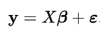
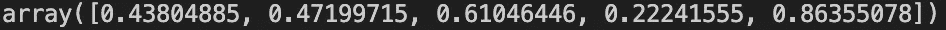
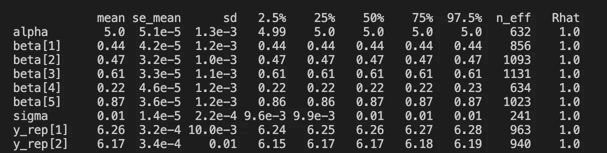

# 剥猫皮的方法不止一种:线性回归的三种方法

> 原文：<https://towardsdatascience.com/theres-more-than-one-way-to-skin-a-cat-three-ways-to-linear-regression-5d96d8e98620?source=collection_archive---------52----------------------->

## 快速概述建立多元线性回归模型的三种方法。你能用 Python 实现这三个吗？


金·戴维斯在 [Unsplash](https://unsplash.com?utm_source=medium&utm_medium=referral) 上的照片

线性回归-数据科学的基本模型。你可能对这个模型非常熟悉:给定一些数据 **X** 和一个输出**y**,**y**和 **X** 之间的关系与一些加性噪声参数 ***ε*** 成线性关系。它可以用矩阵符号表示为



很简单。现在你如何建立一个模型？注意:这个挑战不是关于分割数据或正则化。

这里有一些随机数据可以玩。

```
from typing import Tupleimport numpy as np def get_data(n=1000, m=5, seed=5) -> Tuple[np.ndarray, np.ndarray]:
     np.random.seed(seed) X = np.random.random_sample((n, m)) a = 5 b = np.random.random_sample(m) y = np.random.normal(scale=0.01, size=n) + a + np.matmul(X, b) return X, y 
```



产生的 b 值

# 备选方案 1:频率主义方法——普通最小二乘法(OLS)

您决定“最佳”线将是最小化真实值 **y** 和预测值之间的误差平方和的模型。您可以使用 scikit-learn 实现它，如下所示:

```
from sklearn.linear_model import LinearRegression X, y = get_data()reg = LinearRegression().fit(X, y)print("Coefficients:", reg.coef_, sep="\n")print("Intercept:", reg.intercept_, sep="\n")
```

当你满足保证你建立了最佳模型的标准时，OLS 是特别了不起的。关于这些要求的复习，请参见维基百科页面。它也非常快，因为它有一个使用矩阵乘法的封闭形式的解决方案。不利的一面是，它对异常值不是很健壮——您将需要一个不同的“最佳”定义来处理它，这导致我们…

# 选项 2:优化

对于优化专家来说，你可能已经读过“最小化误差平方和”,并且意识到如果你足够幸运，能够获得一个能够处理二次约束的求解器(通常这些求解器非常昂贵),你就可以用这种方式编写一个模型。要实现，您需要将误差平方和移到一个约束中。添加一个受 SSE 约束并将在目标中使用的变量。下面是一个使用 Gurobi 的例子。

```
import gurobipy as gpfrom gurobipy import GRBmodel = gp.Model('LinearRegression_SSE')n_vars = X.shape[1]beta = []for idx in range(n_vars): beta.append(model.addVar(lb=-GRB.INFINITY, ub=GRB.INFINITY,vtype=GRB.CONTINUOUS, name=f"beta_{idx}")) alpha = model.addVar(lb=-GRB.INFINITY, ub=GRB.INFINITY,vtype=GRB.CONTINUOUS, name="alpha") z = model.addVar(vtype=GRB.CONTINUOUS, name="z")sse = model.addConstr((sum((y_j - sum(alpha[i] + b_i*X[j, i] for i, b_i in enumerate(beta)))**2 for j, y_j in enumerate(y)) <= z), name='sse')model.setObjective(z)model.optimize()coefs = [b.x for b in beta]print(coefs)
```

现在，你为什么想要这样建模呢？我同意最小化误差平方和没有太大意义，因为它将比你从 OLS 得到的解花费更长的时间。但是，如果我们不想最小化误差平方和，而是想最小化最小绝对偏差呢？Scikit-learn 对此没有任何支持——但它可以用线性编程解决[。古罗比](https://en.wikipedia.org/wiki/Least_absolute_deviations)[提供了一个笔记本](https://gurobi.github.io/modeling-examples/curve_fitting/curve_fitting.html)，展示如何最小化最小绝对偏差以及如何最小化最大偏差。

如果你需要一个灵活的方法来改变你的目标，使用规划求解可能是一个途径。

# 选项 3:贝叶斯推理

贝叶斯方法就是利用你所拥有的关于你的数据的额外信息。如果我们知道(或者至少强烈怀疑)误差是正态分布的，那会怎么样呢？如果β值遵循某种分布呢？如果我们想把预测的不确定性形象化呢？所有这些都可以通过贝叶斯线性回归方法来完成。

Stan(及其 Python api Pystan)是实现贝叶斯模型的一种方式。

这是必须首先创建的指定参数和模型的 stan 文件。我把这个文件命名为“lm.stan”。

```
data { int<lower=0> N; int<lower=0> K; matrix[N, K] x; vector[N] y;}parameters { real alpha; vector[K] beta; real <lower=0> sigma;}model { y ~ normal(alpha + x * beta, sigma);  // likelihood}generated quantities { 
  // for predictions vector[N] y_rep; for (i in 1:N) { y_rep[i] = normal_rng(alpha + x[i] * beta, sigma); }}
```

这种情况下的模型拟合是通过采样方法实现的:

```
import pystanmdl = pystan.StanModel(file="models/lm.stan")samples = mdl.sampling(data={ "x": X, "y": y, "N": len(y), "K": X.shape[1] }, chains=1, seed=5)
```

采样完成后，您不仅会得到每个参数的预测，还会得到一个分布，这样您就可以可视化参数和预测的不确定性。



如果您想要为您的参数添加先验(在我上面的例子中，默认的先验是α和β的统一)，那么您只需要将它添加到模型部分。这里有一个[的例子](https://ourcodingclub.github.io/tutorials/stan-intro/)，它更加详细地描述了一个线性 stan 模型并绘制了后验概率。

# 结论

数据科学是一个广泛的领域，它与许多已建立的领域重叠，如计算机科学、统计学、数学、工程学等。因此，有时你会发现有几种方法可以解决同一个问题，每种方法都有优点和缺点。快乐造型！

# 参考

*   [古罗比建模示例](https://gurobi.github.io/modeling-examples/curve_fitting/curve_fitting.html)
*   [斯坦文档](https://mc-stan.org/users/documentation/)
*   [维基百科上的线性回归](https://en.wikipedia.org/wiki/Linear_regression)