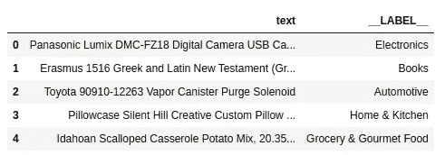
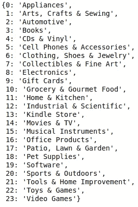
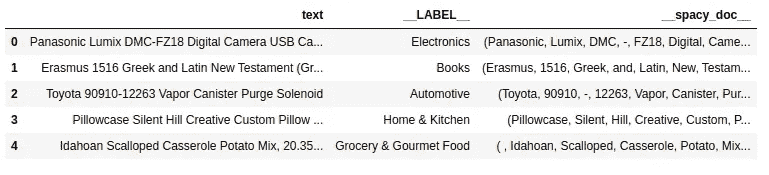
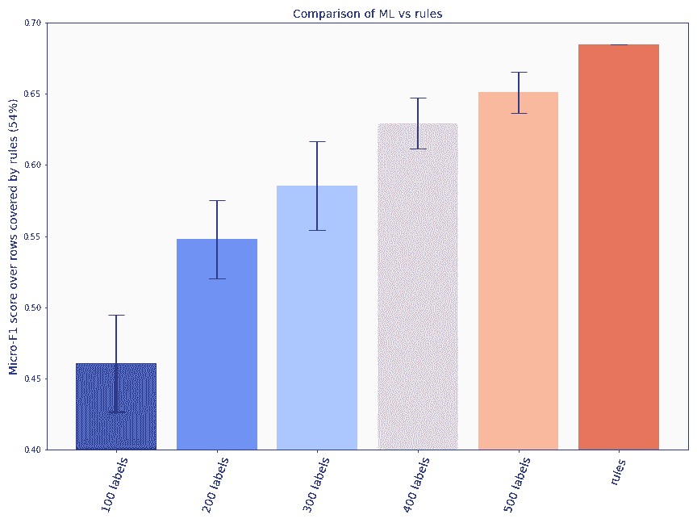

# 正则表达式中没有羞耻

> 原文：<https://towardsdatascience.com/theres-no-shame-in-regular-expressions-370f82ef3edb?source=collection_archive---------12----------------------->

## 给你的 ML 管道一个机会。

你在一家声称使用人工智能或人工智能解决难题的公司工作，而实际上它是规则和人工智能的混合物。我们都经历过，对吧？今天我想告诉你，在许多情况下，使用一些好的无意义的规则并不可耻，只要你像对待 ML 算法一样对待它们。

你工作的公司多年来已经积累了一些领域的专业知识，这些知识已经转化为一系列用于解决业务问题的规则。在你之前，没有人真正花时间来评估这些规则有多好，或者它们与任何未来的机器学习解决方案相比如何。把所有的工作都扔掉会很难过的！

我将用亚马逊的数据来说明这一点。我们试图解决的问题是根据产品的描述给产品分类。我们有一个训练数据集和一个测试数据集，两者都有属于 24 个产品类别的 3000 个产品描述，以及一个类别映射。测试数据集尚未用于创建任何规则。你可以在 [github](https://github.com/dataqa/dataqa-notebooks/blob/master/amazon-products/Demo%20amazon%20products.ipynb) 中找到有完整代码的笔记本。

测试数据集的前几行

和类别映射…

所有 24 个产品类别的类别映射

为了这个例子，假设给你的规则是由正则表达式组成的。一些规则是基于单个正则表达式的简单匹配，而其他规则是特定单词的匹配，即 NLP 术语中的标记。

你被赋予了这 32 条规则。好了，现在我们该怎么办？

在上表中，第一个规则查找与“table”完全匹配的单词(或标记):例如，这个规则不会匹配包含单词“comfort”或“tablet”的文档。如果匹配，它会将其分配到产品类别“家庭和厨房”。第二个规则是一个正则表达式，如果文档包含以下任何一个表达式，它将匹配该文档:“toyota”、“chevy”、“hyundai”、“honda”、“jeep”、“general motors”或“harley davidson”。如果是，它将其分配到“汽车”类别。

既然您已经得到了这个美化的正则表达式列表，那么您可以使用开源包 [dataqa](https://github.com/dataqa/dataqa) 将它们转换成一些 python 代码。使用这个包，可以为文本编写超出简单正则表达式的规则。例如，您可以编写以下规则:

*   如果特定单词以“caus”开头，则匹配文档:这将匹配单词“causes”和“causes”，但不匹配“causes”。
*   如果一个句子包含表达式“花园”后跟“工具”，则匹配一个文档。因此，这将匹配“园艺工具”或“园艺手工具”。
*   如果一个文档包含对人的提及，
*   等等。

你可以在这里找到更多关于当前被包[支持的所有规则类型的信息。](https://dataqa.ai/docs/rule_guide/classification_guide/)

在下面的代码中，我们展示了如何为上表中的第一个规则创建一个 rule 对象:

命名元组`table_rule`有几个参数:

*   一个规则 id，
*   规则的类型:它是否关心匹配的顺序(即“有序”或“无序”)，
*   一些参数:“contains”是`True`如果类标签是在有匹配时分配的(相对于没有匹配)，“rules”是正则表达式(“word”)的列表，匹配的类型是(“token”或“exact”和“区分大小写”或“不区分大小写”)，“sentence”是`True`如果匹配是在句子级别或在全文上，
*   class_id:类标签的 id。

一旦所有的规则都被转化为规则对象，我们就可以在新的未知测试数据集上测试它们的准确性和覆盖率，就像我们在典型的机器学习实验中所做的那样。文档首先需要用 [spacy](https://github.com/explosion/spaCy) 包进行处理，以便获得令牌、实体、名词短语等。空间文件保存在训练和测试数据框的`__spacy__doc`栏中。

包含 __spacy_doc__ 列的测试数据框架

现在，我们可以应用前面定义的规则。

`test_rule_labels`变量是一个 numpy 数组，其中行代表文档，列代表不同的规则。数组的值要么是-1，要么是 0 到 23 之间的类标签。我们使用多数投票来决定分配给文档的最终标签，以防有多个规则应用于它。

`test_rule_labels`现在是通过规则找到的标签列表(如“电器”、“电子产品”等)。每当一个文档没有被任何规则覆盖时，它就被赋予“丢失”的标签。在我们的场景中，规则覆盖了 3000 行中的 1615 行，这意味着我们可以获得测试数据集中所有行的 54%的标签。

这才是有趣的地方。因此，我们在测试数据集上应用了我们的规则，我们希望将其与机器学习基线进行比较。我们将看到，当这些规则与一个文档匹配时，它们与机器学习算法相比有多好。在我们的例子中，我们计算规则覆盖的文档的微观平均 F1 分数，因此 54%的行。

规则做得非常好，返回 68%的 a `rule_f1_score`。简单的机器学习流水线能做得更好吗？

为了回答这个问题，我们进行了一些实验，保持 ML 模型简单。如果我们有一个包含 100 个标记示例的训练数据集，基线 ML 模型会比规则做得更好吗？如果我们有 500 个被标记的例子呢？在下面的代码中，我们使用一个简单的现成线性模型和一个`TfidfVectorizer`来提取文档的 tf-idf 权重。然后，对于每个数量的训练标签(在 100 和 500 之间)，我们运行 10 个实验，其中我们从训练数据中采样一些行来训练 ML 模型，并在测试数据集上测试，在规则也分配了标签的相同索引上。

运行上面的代码后，我们得到了以下总结结果:

这些规则已经取得了 F1 分数，超过了使用 500 个训练标签的简单现成 ML 管道。无论是特征处理还是模型都没有针对这个问题进行优化，因此在这种情况下，我们只能将它视为我们的正则表达式和工作最少的基线机器学习之间的比较。然而，这个练习非常有帮助，因为它为 ML 应该达到的目标设置了一个标准。因此，当你在未来几周花时间优化你的 ML 渠道时，你有一个值得击败的竞争对手。

## **结论**

基于规则的方法很可能无法解决所有的问题，因为规则很少能提供 100%的覆盖率。然而，您可能会发现，这些编码您公司领域专业知识的规则中的一些(或全部)可以设置一个高标准，这将使您的 ML 为之工作。所以下次你公司有人向你展示一套规则或正则表达式时，不要嘲笑他们！

最后一点，如果你想制定自己的规则呢？DataQA 提供了一个基于界面的标签工具，你可以创建规则来标记文本并计算它们的性能。