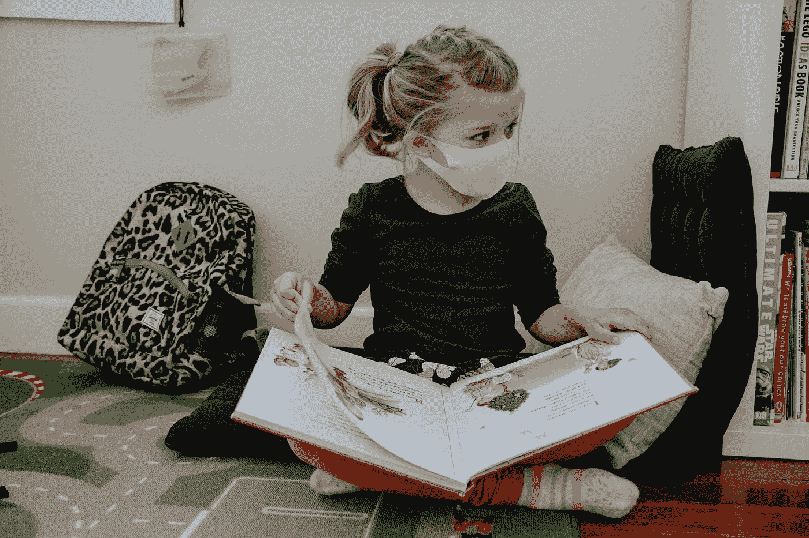

# 从帮助英国政府处理新冠肺炎事件中获得的 9 条真知灼见将改变你对数据科学的看法

> 原文：<https://towardsdatascience.com/these-9-insights-from-helping-uk-government-handle-covid-19-will-change-your-mind-about-data-668965a7a360?source=collection_archive---------13----------------------->

## [意见](https://towardsdatascience.com/tagged/opinion)

## 大多数数据科学家甚至没有被教授过，仍然不熟悉新冠肺炎疫情期间应用的最有用的监督学习技术。

由[凯利·西克玛](https://unsplash.com/@kellysikkema?utm_source=medium&utm_medium=referral)在 [Unsplash](https://unsplash.com?utm_source=medium&utm_medium=referral) 上拍摄的照片

# 统计学和第二次世界大战

在第二次世界大战期间，为了最大限度地减少轰炸机在敌人炮火中的损失，美国军方希望在最需要的地方(即飞机返回时受损最严重的地方)为飞机提供装甲。

面临的挑战是找出合适的盔甲数量。太多会使飞机变重，导致更多的燃料消耗和操纵困难。太少可能不足以保护飞机。

为了帮助解决这个问题，军方找到了亚伯拉罕·瓦尔德(匈牙利犹太数学家，后来成为统计序列分析的先驱)。沃尔德给出了一个出人意料的答案。*他说重点应该放在最少被击中的地方，而不是飞机被击中最多的地方*

现在有意义了。他的计算考虑了“*幸存偏差*”，指出返回的受损飞机并不能很好地代表那些被敌人炮火摧毁的飞机。

沃尔德是统计研究小组(SRG)的 18 名成员之一，这是一个位于纽约州曼哈顿的机密小组。SRG 可能是最有影响力的团体之一，包括 Herbert Solomon(斯坦福大学统计系的共同创始人)、Frederick Mosteller(哈佛大学统计系的创始主席)、未来的诺贝尔奖获得者(George Stigler 和 Milton Friedman)以及其他几位后来都有杰出的职业生涯的人。

当然，当时整个盟国都在处理许多与战争有关的问题。也许，最著名的例子是艾伦·图灵在英国布莱奇利公园进行的破译德国密码的工作。

# 统计学和第三次世界大战

80 多年后，第三次世界大战爆发了。然而与以前不同的是，敌人是隐形的。迄今为止，新冠肺炎疫情已经夺去了 400 多万人的生命，并在某种程度上影响了这个星球上的每个人。

虽然这不是世界上第一个疫情，但这是数据科学和人工智能时代的第一个，在这个时代，每天都会产生前所未有的大量数据，全球各地的人们都在努力工作，抗击这个看不见的敌人。

## 我到底要跟谁说这些？

英国一直是世界上领先的玩家之一，更好地装备我们打这场战争。来自全国各地的数百名科学家正在从事各种项目，以帮助通知英国紧急情况科学咨询小组(SAGE)，然后反馈给英国政府内阁，以帮助决策。

我就是这样一位来自英国的科学家，参与领导并支持了许多新冠肺炎项目，例如评估新冠肺炎对其他疾病的影响(发表在[胸腔](https://thorax.bmj.com/content/76/9/860.abstract))，评估疫苗的有效性(发表在[柳叶刀](https://www.sciencedirect.com/science/article/pii/S0140673621006772))，它们的安全性(发表在[自然医学](https://www.nature.com/articles/s41591-021-01408-4))，以及做出预测(发表在[柳叶刀数字健康](https://www.thelancet.com/journals/landig/article/PIIS2589-7500(21)00175-8/fulltext))。

作为一名数据科学家，我在这类项目上工作了一年多，包括指导和招聘，有几个经验教训值得与数据科学界分享。

***这场战争将会结束。*** 然而，我即将分享的见解广泛适用于数据科学行业。他们中的一些人大开眼界，而一些人加强了我早些时候对该行业的看法。让我们开始吧。

# 1:简单的方法无疑是赢家

你会认为惊人的人工智能工具和技术的军械库将处于塑造政府政策以击退疫情的最前沿。在新冠肺炎疫苗和治疗方法的发现中，人工智能确实发挥了核心作用。

然而，考虑到我自己的背景，我不想这么说:

***最先进的 AI 工具在大部分击退疫情的后续工作中并没有起到主导作用。***

相反，处于前沿的是更为传统、成熟的技术。

我不是数据科学界中唯一得出这一结论的人。数据伦理与创新中心( [CDEI](https://www.gov.uk/government/organisations/centre-for-data-ethics-and-innovation) )拥有一个公共的、最新的数据和人工智能新用例库，以帮助抗击疫情。按照他们的说法:*“常规数据分析一直是新冠肺炎应对的核心，* ***而不是艾****。*

***为什么会这样？***

*为了解释其中的原因，我将给出一个与风险预测建模相关的例子。在疫情期间，进行了大量的研究。今年早些时候发表在《BMJ》杂志上的一篇被高度引用的论文评估了所有用于新冠肺炎诊断和预后的预测模型。*

*在开发的多达 232 个模型中，几乎没有一个被认为足够好用于临床。尽管一些算法报告 AUC(曲线下面积)为 0.99，但这仍是结论！*

*作为一个社区，我们享受 ***在数据上尝试*** 新的算法。尝试不足以解决现实世界的问题！*

# *2:数据科学教育有点乱*

*如果有一类方法真正脱颖而出，那就是生存分析(SA)。这种方法被用来告诉我们疫苗在现实世界中是否真的有效。这种方法也被用来告诉我们谁是最有可能因新冠肺炎而住院或死亡的 T21。这些是急需回答的关键问题，有助于政府和世界卫生组织(世卫组织)了解情况。*

*SA 是一种监督学习技术，最常见的应用方式是通过 Cox 模型。考克斯模型是在近 50 年前发明的。然而，大多数传统的机器学习(ML)课程甚至没有教授任何关于生存分析的内容。*

*让我们以 Andrew Ngs 的 ML 课程为例，它可以说是[有史以来](https://www.onlinecoursereport.com/the-50-most-popular-moocs-of-all-time/)最受欢迎的在线课程(我见过的大多数 ML 课程都是效仿他的)。这个领域通常被分为三种类型的学习:有监督的、无监督的和强化的。在监督学习中，我们进一步将其分为分类和回归。大多数初学者必须解决的困难是如何理解 SA。*

*SA 是一种受监督的学习技术，但它不适合对分类或回归的初级描述。它是回归(输出是连续的，即“存活”的时间)和分类(表明事件是否发生的二元指标)的混合。Cox 模型是一种成熟的、概念上简单的技术，它巧妙地将两种信息结合在一起。*

****为什么我们不在入门课里教？难倒我了。****

*SA 的使用不仅限于医疗保健。除了医疗保健，还有很多应用[。然而，由于数据科学家没有受过这方面的正式教育，他们倾向于将监督学习问题公式化为分类(并丢弃时间信息)或回归(并丢弃事件没有发生的情况)。SA 使您能够避免这种妥协。毫无疑问，这是疫情期间广泛使用的方法之一。](https://arxiv.org/abs/1708.04649)*

**免责声明:医药专业的*[*AI*](https://www.deeplearning.ai/program/ai-for-medicine-specialization/)*教授 SA，但这个话题在入门课程中也值得关注；SA 可以被视为一种受约束的回归，但是对于初学者和应用课程来说，这是一种不必要的复杂化。**

# *3:工具和方法完全是次要的*

*在现代，这个疫情前所未有地挑战着世界。产生了大量的数据。这是数据科学大放异彩的最大舞台。在它闪耀的地方，它是关于解决一个问题。被认真对待、考虑并采取行动的工作是为了他们解决的问题，而 ***不是*** 他们使用的工具或技术。*

*这个[我之前说过](/data-science-is-not-becoming-extinct-in-10-years-your-skills-might-aed618dd0c91)。数据科学的本质不在于使用复杂的工具或技术。这是在用数据**解决问题**。*

*工具和模型是次要的。他们只是推动者。说到底，这个项目是个人的，是组织的，是国家的，还是世界的，都无关紧要。有一个问题需要解决。你用数据来解决这个问题，从工具库中选择一个合适的工具。光明正大。*

# *4:数据胜过模型*

*在疫情期间，有几个问题我们希望立即得到答案，但我们受到数据而不是模型的限制。当然，分析快速生成数据的方法需要复杂的数据辩论技术，现成的方法是不够的。*

*然而，最大的限制是以数据为中心的问题。英国图灵研究所举办了 8 场主题研讨会，汇集了各种专业知识，以更好地了解人工智能和数据科学在回应新冠肺炎疫情中的作用。在确定妨碍帮助应对疫情疫情的能力的主要挑战时，突出的因素与数据获取和标准化有关。要么数据根本无法访问。或者即使可以访问，也没有适当的格式或充分的文档记录。*

*因此，[吴恩达](https://www.forbes.com/sites/gilpress/2021/06/16/andrew-ng-launches-a-campaign-for-data-centric-ai/?sh=43b71bbe74f5)带头鼓励数据科学界关注以数据为中心的人工智能就不足为奇了。到目前为止，我们都集中在以模型为中心的方法上。*

*我建议你花些无罪恶感的时间来探索你的数据。熟悉并探索您的数据。在将数据输入建模管道之前，更好地理解数据。永远不要忘记计算机科学的概念，现在已经是老生常谈了:垃圾进，垃圾出 [(GIGO)](https://en.wikipedia.org/wiki/Garbage_in,_garbage_out) 。*

# *5:数据科学完全是一项团队运动*

*过去的一年让我进一步相信，在从事一个有意义、有影响力的项目时，数据科学是一项团队工作。*

*在疫情期间，最有意义的项目是跨学科的。项目所需专业知识的广度让我大吃一惊。我所参与的项目中所需技能的精选列表如下:*

*   *临床专家收集数据，*
*   *计算机科学技能，以确保足够的技术基础设施到位，*
*   *管理以确保正确的数据治理问题得到适当的处理，*
*   *数据科学家帮助分析数据，*
*   *临床和非临床科学家确保提出正确的问题，*
*   *公共传播专业知识，以确保关键信息得到适当传达。*
*   *项目管理专业知识，以确保交付此类复杂的跨学科项目，*
*   *集体集思广益，确保研究结果得到正确解释。*

*当然也有例外。一个著名的例子是内特·西尔弗，他单枪匹马，击败了当时最先进的选举预测。在 2008 年美国总统选举中，他利用广泛可用的公共数据进行建模，正确识别了 50 个州中的 49 个州。*

*然而，总的来说，DS 是一项团队运动，由拥有不同技能的人组成，他们有着共同的目标。*

# *6:你需要三顶帽子:数据、模型和领域*

*2020 年，英国因哮喘发作而联系医生的患者数量[出现了惊人的减少](https://www.eurekalert.org/news-releases/844016)。所使用的数据是医生常规收集的实际数据。数据是可靠的。 ***这种还原发生了。****

*但是为什么会这样呢？如果有什么不同的话，新冠肺炎可能会导致更多的哮喘发作。也许病人害怕去诊所。也许病人更加小心并定期服药。也许在疫情期间医生记录的东西不一样。可能有多种解释。*

*媒体报道了这项研究，我也采访了几位记者。每个人都想知道原因。*

*我几次被置于尴尬的境地。BBC 苏格兰电台在清晨 6:30 打电话给我。接下来我知道的是，我正在直播，不得不在现场回答新的问题。*

*那么你唯一的朋友就是清晰。只有当你清楚你所采用的建模方法、数据的局限性以及对你试图解决的问题的洞察力时，你才能获得清晰的思维。*

*作为一名数据科学家，您应该掌握身兼三职，并在需要时快速转换。数据帽子(使您能够理解您的数据、限制以及它是如何收集的)、建模帽子(使您能够理解您的方法背后的假设)，以及领域帽子(使您能够正确地解释您的建模结果)。如果你想成为一名出色的数据科学家，我建议你同等重视这三顶帽子。没有一个是可选的。*

# *7:沟通是每个数据科学家必须掌握的最重要的技能*

*有些人对 DS 工作的模式化看法是:坐在电脑前，日复一日地处理数字，生成漂亮的图表。*

*当然，你需要会编程。当然，您需要能够加载数据、清理数据、应用模型和评估性能。这些是标准的 DS 任务。然而，对于 DS 来说，最被低估的技能之一就是你自己的沟通能力。*

*如果一个 DS 项目拥有最令人惊奇的高性能模型，但是开发它的人却不能向关键的利益相关者充分地解释它，那么这个项目有什么好处呢？*

*一个有效的 DS 项目不仅需要开发模型，还需要能够毫不费力地与各种利益相关者进行沟通。**你就是这样动针的，把模式创造转化为价值创造。***

# *8:现实世界的项目无可替代*

*在线课程是学习基础知识的绝佳资源，包括完成动手项目的编程作业。Kaggle 也是动手项目的绝佳资源。*

*然而，要理解这些和真实项目之间的关键区别。首先，许多现实世界的项目都设计得很糟糕。*

*从一个模糊定义的项目到一个清晰表述的数据科学问题所需的步骤在很大程度上依赖于上下文。因此，学习它们最有用的方法是 ***亲身体验*** 不同的项目。我认为没有别的办法。*

*不要指望别人会给你一个清晰的问题，一个你需要改进的明确的性能指标。全面负责整个数据科学管道。现实世界的项目是由要解决的问题驱动的，而不是您应该最大化的预定义的性能指标。*

# *9:机器学习 vs 统计学的争论已经尘埃落定*

*是统计学还是 ML？等等，ML 不就是高级统计吗？在我 14 年的数据工作生涯中，我遇到过这些问题的不同版本。知名专家、文章，甚至知名期刊上的同行评议文章都在讨论这个话题。太疯狂了。*

*老实说，这是一场无用的，(看似)没有结果的辩论。根据定义，ML 与从数据中学习有关。从数据中学习的一个关键部分通常需要将原始数据转换成汇总变量。大量的统计数据都是关于汇总数据的。我们现在有越来越多的数据，需要巧妙的算法。其中很多都是由计算机科学系的社区开发的。然而，试图理解模型参数的几种方法来自于坐在统计部门的人。*

## *具体例子*

*让我给你举一个具体的例子。[套索](https://en.wikipedia.org/wiki/Lasso_(statistics))是一项出色的技术，可在使用 L1 范数进行正则化的过程中用作逻辑回归的一部分，以避免过度拟合和选择特征。大多数 ML 从业者普遍使用它。这是由在斯坦福大学统计系担任教授的罗伯特·蒂布拉尼推广开来的。*

*然而，使用 L1 和 L2 规范的正则化概念是标准的 ML 主题，由(过去)在斯坦福大学计算机科学系任职的[吴恩达](https://en.wikipedia.org/wiki/Andrew_Ng)教授。*

*我在这里得到什么？统计部门和 cs 部门的人员开发的工具和技术是紧密交织在一起的。不管怎样，本质是一样的:从数据中学习。*

*我自己的本科，硕士，博士都是工科。然而，多年来，我不得不拿起标准的统计学书籍，阅读许多统计学期刊论文。因为那是我当时需要的。现在，我坐在一所医学院里，与统计学家和医学博士一起工作。如果我要招聘一个 DS 职位的人，我不在乎他的教育背景是统计学还是 cs。相反，我会寻找具有合适资质的候选人，并期望他/她在从事 DS 项目时不时地挑选 CS 或统计学书籍/课程/论文。*

## *我对 ML vs 统计学辩论的看法*

*在这次疫情中，即使是发达国家也被发现有所欠缺。然而，基础设施发展迅速(例如[安全开放](https://www.opensafely.org/about/))。*

*数据库设计、确保适当的安全性和访问权限都是 CS 的工作。同时，我们需要大量的传统统计知识来回答紧迫的政策问题，同时利用这些新的数据基础设施。*

*说到底，如果没有这两种专业知识中的任何一种，就不可能取得进展。在所有这些计划中，自称为统计学家的人与自称为数据科学家和 ML 实践者的人密切合作。*

*没有明确的分界线。任务是以问题为中心的，而不是以方法为中心的。因此，经历过这次经历后，我认为这次辩论毫无意义，而且非常主观。**不要在两者之间寻找明确的界限，因为没有任何界限。这并不重要...***

# *最后的想法*

*对于数据科学家来说，这是激动人心的时刻。我们真的淹没在数据中。然而，真正的价值创造不在于数据，而在于你用这些数据做了什么。 ***利用数据解决紧迫挑战是数据科学。*** 缺一不可！*

> *我们淹没在信息中，同时渴望智慧。从今以后，世界将由合成器来管理，人们能够在正确的时间把正确的信息放在一起，进行批判性的思考，并明智地做出重要的选择(E.O .威尔逊)*

* [## 通过我的推荐链接加入 Medium-Ahmar Shah 博士(牛津)

### 作为一个媒体会员，你的会员费的一部分会给你阅读的作家，你可以完全接触到每一个故事…

ahmarshah.medium.com](https://ahmarshah.medium.com/membership)*