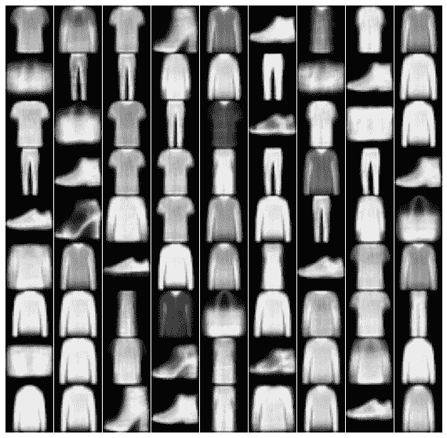
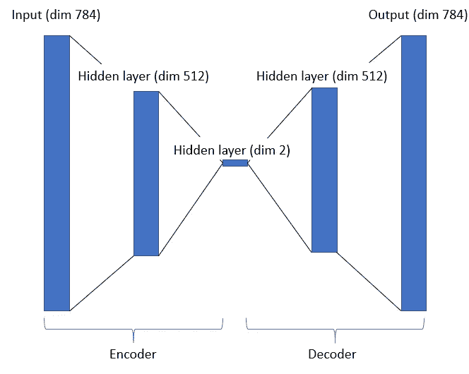
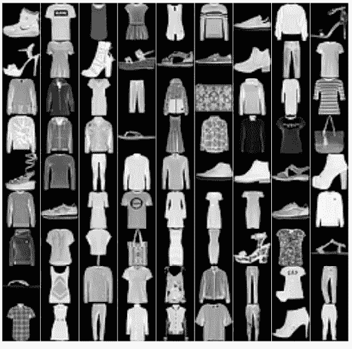
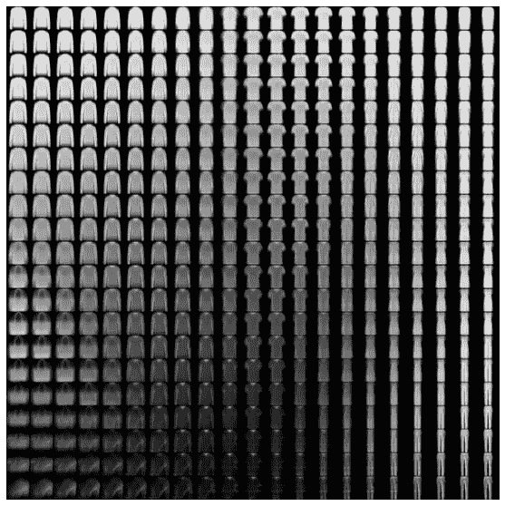
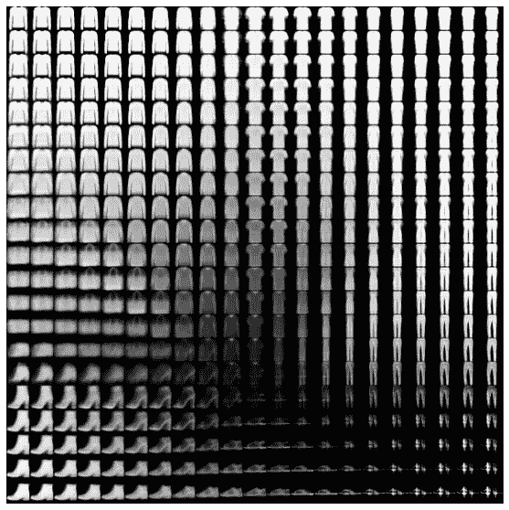

# VAEs:从潜像分布中间接取样

> 原文：<https://towardsdatascience.com/these-are-not-real-clothes-af58154a98c2?source=collection_archive---------28----------------------->

## 机器学习应用程序

## 用可变自动编码器生成图像数据

作者图片

# 介绍

可变自动编码器(VAEs)是一种令人惊叹的机器学习架构。它们允许我们近似高维潜在空间，可以对其进行采样以生成新数据。AEs 是机器学习中一个非常新颖的模型分支。这些有时候一开始很难理解。通常，神经网络的输出是我们感兴趣的，然而，在 AEs 中，输出是重新创建输入的尝试。

在本文中，我将对 AEs 和 VAEs 进行概述，然后展示一个使用 python 的应用程序。

# 自动编码器

VAEs 是自动编码器模型的特例。自动编码器由网络组成，其中有两个神经网络，即编码器阶段和解码器阶段。编码器缩小输入的维度，试图保留尽可能多的信息。编码器可以被认为是高维非线性 PCA。解码器的工作是试图从编码器的输出中重建原始图像。

作者图片

这是一个 AE 架构示例。模型的输入是展平的 28x28 图像，该图像被压缩成 512 维向量，然后由编码器再次压缩成二维向量。解码器获取编码器的输出，并尝试重建原始的 28x28 图像。

像这样减少输入的维数非常有用。示例应用是异常值检测和去噪。如果试图发现异常值，可以对编码信号使用距离测量。另一个应用是当对信号去噪时，如果输入图像有噪声，通过编码然后解码，模型可以被训练以减少噪声并仅保留最重要的信息。

# **变型自动编码器**

VAEs 将普通 AE 向前推进了一步。VAEs 尝试在编码器阶段结束时创建一个分布，编码器可以使用该分布来生成新图像。在上图中，编码器将每个图像编码成两个变量。这些可用于参数化正态分布，例如，将一个参数作为平均值，将另一个参数作为标准偏差。

从该分布中采样，并将输入通过解码器有效地为我们提供了一种在图像空间中采样潜在分布的方法。

为了训练 VAEs，编码器的输出用于参数化高斯分布。然后对该分布进行随机采样，然后将随机样本用作解码器的输入。这个看到例子后会更清楚。

# **VAEs 中的损失函数**

VAEs 试图最小化两件事:

*   编码器的输入和解码器的输出之间的差异
*   编码器分布和数据概率分布之间的差异

为了量化输入和输出之间的差异，如果图像是黑白的，可以利用二进制交叉熵。

在 VAEs 中，目标是获得 P(z)的近似值，其中 P 是我们数据的概率分布，z 是我们的潜在变量。我们尝试从 P(z|X)开始，其中 X 是我们的数据。我们没有 P(z|X)的分布，但是，我们可以使用我们的低维编码器分布 Q(z|X)来估计它。为了找到最佳 Q，我们最小化编码器分布和数据概率分布之间的 Kullback-Leibler 散度。

# VAE 应用

在这个例子中，我正在使用 PyTorch，并且我正在一个免费的 google colab 机器上工作。我使用的训练数据是开源的时尚 MNIST 数据集。

首先，我们构建上图所示的架构:

编码器有两个隐藏层。第二个隐藏层分为两部分。第一个将输出编码器分布的平均值，第二个将输出标准偏差。解码器从编码器获取输入，并在返回模型的输出之前将它们通过两层。

下面是训练网络的代码:

对于编码器的每个输出，形成正态分布并进行采样。这个新样本被用作解码器的输入。为了优化权重，反向传播的使用方式与传统的神经网络相同，我使用的优化器是 Adam。

# 结果

现在，让我们看看这个 VAE 能生产什么。一、训练数据:

作者图片

这些是一些随机的训练数据，你可以看到这些图像有很多细节。

现在我将展示由解码器重建的图像。记住，这些图像是由二维向量重建的！

作者图片

对于这样一个简单的架构来说不算太坏。自动编码器能够从编码器的输出中重建图像。然而，你会注意到这些图像是模糊的。这与编码器阶段涉及的信息丢失有关，并且是 VAEs 的主要缺点。

这些重建是近似图像潜在空间(P)中的随机样本。通过获取每个图像的编码器输出，并围绕这些输出参数化的分布进行采样，我们可以将这些反馈到解码器，以采样我们的近似图像概率函数(Q)。

让我们看看当我们在上面看到的第一个图像(左上角的 t 恤图像)周围采样时会发生什么。

第一次采样接近平均值，第二次稍远一点:

作者图片

作者图片

在这个潜在空间的中心，我们有 t 恤。你可以看到，通过在潜在空间中移动，t 恤会变形为手袋、不同种类的鞋子、套头衫、裤子等。在第一次采样中，衣服没有太多的变化，因为采样是在平均值附近进行的。大多数图像是衬衫或类似的。第二次采样，各种衣服都有。

# **结论**

在这篇文章中，我描述了自动编码器、可变自动编码器、它们的功能以及它们的一些应用。VAEs 在数据生成中是有用的，因为它们允许我们近似一个潜在的空间，然后可以从中取样。通过从该空间采样，可以生成新数据并用于其他模型的训练，从而提高它们的性能。

VAEs 有一些缺点，特别是在输出中产生的模糊。解决这个问题的一个方法是使用生成转折网络。请继续关注未来关于这些的文章！

## 支持我

如果你喜欢它，你可以跟我来 [**！**](https://medium.com/@diegounzuetaruedas)

你也可以通过我的推荐链接成为**中级会员**，访问我所有的文章等等:[https://diegounzuetaruedas.medium.com/membership](https://diegounzuetaruedas.medium.com/membership)

## 你可能喜欢的其他文章

[卡尔曼滤波:简单介绍](/kalman-filtering-a-simple-introduction-df9a84307add)

[MCMC:可视化介绍](/mcmc-a-visual-introduction-38e1d6131e86)