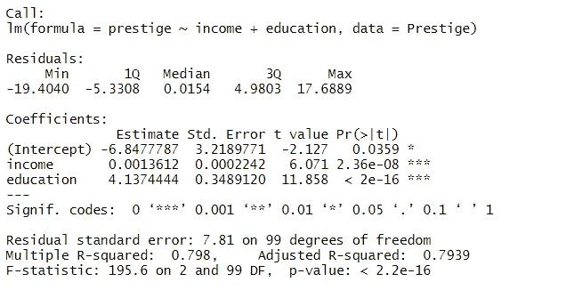
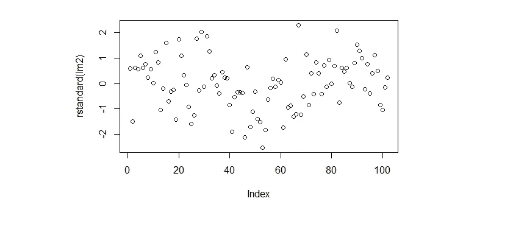
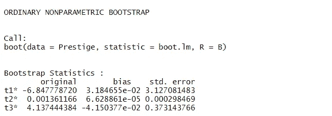
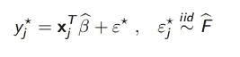
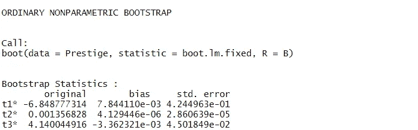

# 这些靴带是为行走而设计的，这正是它们要做的(用 R)

> 原文：<https://towardsdatascience.com/these-bootstrap-are-made-for-walkin-and-that-s-just-what-they-ll-do-with-r-f9bbdccc8d02?source=collection_archive---------39----------------------->

## 用 R 软件解释和应用 Bootstrap 回归技术。

艾玛·瓦莱里奥在 [Unsplash](https://unsplash.com/s/photos/boot?utm_source=unsplash&utm_medium=referral&utm_content=creditCopyText) 上的照片

Bootstrap 重采样技术是研究估计量的性质，特别是它的分布和可变性的不可缺少的工具。

使用最多的一种情况是线性回归，其中感兴趣的估计量是回归线的角度系数，估计其分布以验证其显著性，特别是当存在异方差问题或 p 值非常接近时。

我将向您展示两种不同的自举重采样技术，通过软件 r 来应用它们。

# 统计单位的自举

统计单元的引导包括对数据集的行进行重采样，就好像它们是有限总体的等概率单元一样。

以这种方式，产生新的 B 样本，在其上估计我们的线性回归模型并评估感兴趣的参数的属性。

让我们立即看看如何在 R 上使用这种技术，在 Car package 的[声望](https://www.rdocumentation.org/packages/car/versions/2.1-6/topics/Prestige)数据集上估计我们的模型，并应用适当的 bootstrap 算法。

作者图片

这是我们的模型摘要的输出。

立即注意到，在残差中，左侧可能存在不对称，收入和教育系数明显不同于 0，而截距将在稍后用 bootstrap 生成的分布进行验证。

作者图片

从残差图来看，很明显存在模型规格问题，很可能两个变量之间没有线性关系。

这个问题必须通过转换协变量或目标变量或使用多项式模型来解决。

现在让我们运行 bootstrap 算法，评估标准误差和分布。

作者图片

标准误差与初始模型非常相似，因此我们可以得出结论，显著性也保持不变。

但是让我们来看看自助估计量的分布。

作者图片

截距和第二系数的分布几乎与高斯分布一致，这使我们确信渐近性质的有效有效性，从而确定两个参数的估计及其意义。

关于第一个角度系数，注意到强烈的左不对称，因此由 bootstrap 估计的参数比由初始模型估计的参数更可靠和更可取，尽管它被证实与置信 BCA 区间的零显著不同，我将在另一篇文章中深化这一点。

# 残差自助法

另一种 bootstrap 回归技术的特点是对残差进行重采样。

在某些研究或实验中，当建议保持协变量固定时，使用它。

初步估计模型 y * = f (x)后，协变量和系数保持固定，残差随机重新采样，如以下公式所示。

如果模型没有被正确地指定，使用残差会冒得不到正确估计的风险。事实上，我们现在会看到，由于存在线性问题，它对于我们的初始模型来说是不可靠的。

作者图片

在这种情况下，残差的自举始终低估了标准误差，从而高估了显著性和置信区间。

# 最后

bootstrap 是一个非常强大的工具，任何统计学家和数据科学家都应该拥有它。

只要想想它在构建稳健模型中的用途，或者更好的是，在构建非参数且不受初始假设约束的假设检验中的用途。

非常感谢你的阅读。