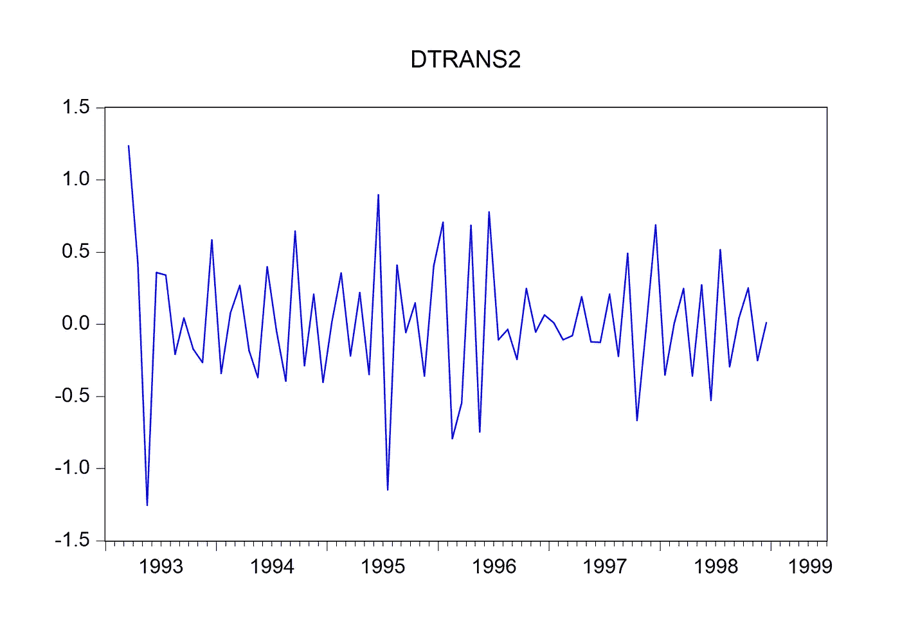
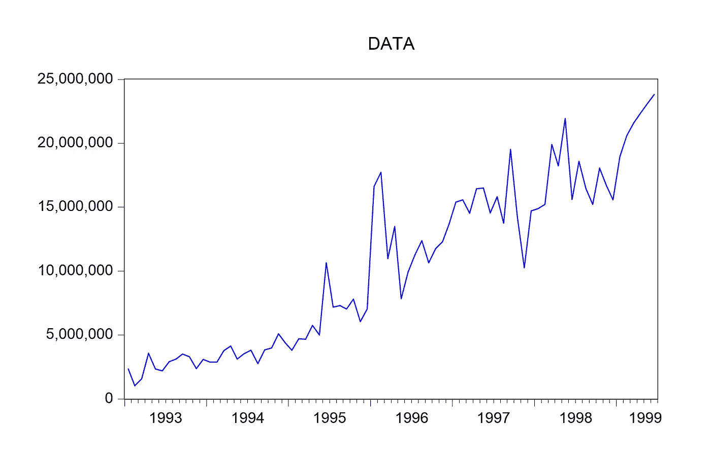
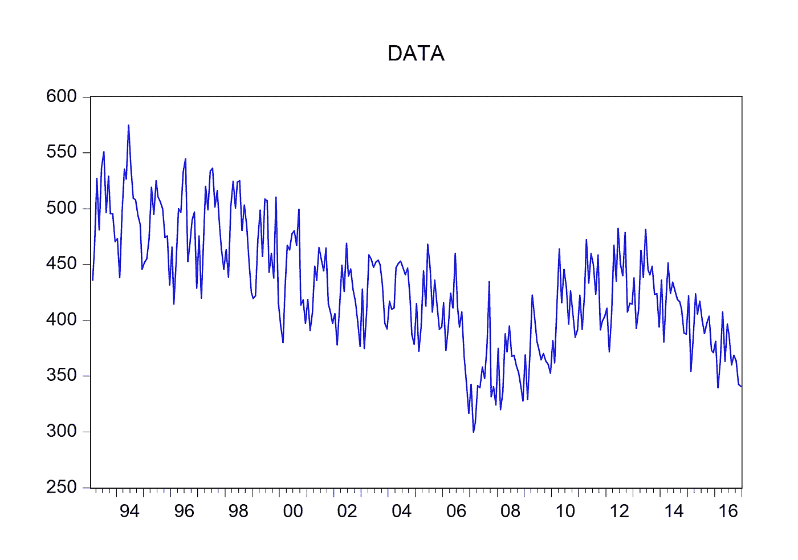
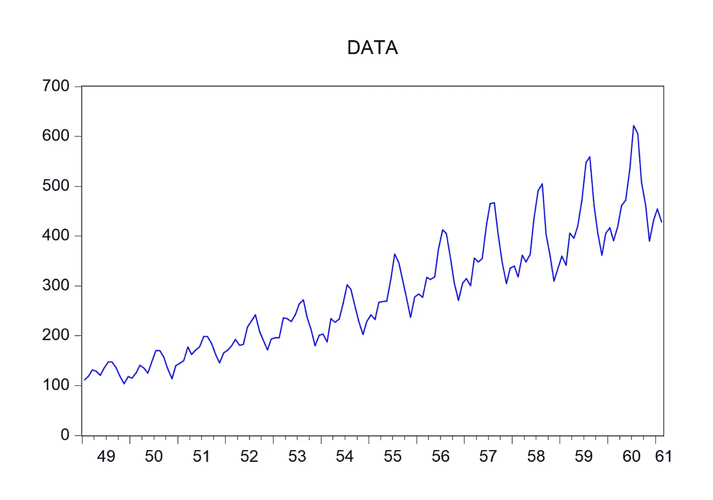
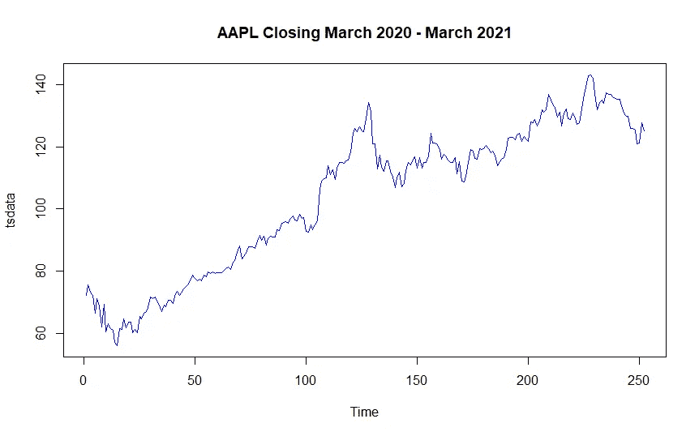
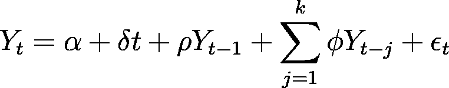
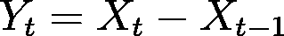
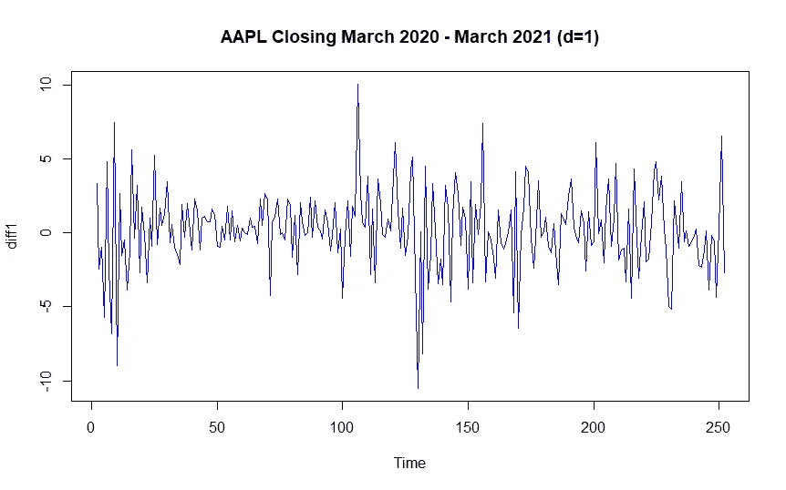

# 创建单变量时间序列模型之前应该检查的事项

> 原文：<https://towardsdatascience.com/things-that-you-should-check-before-creating-univariate-time-series-model-ba5fe381f68e?source=collection_archive---------14----------------------->


马库斯·温克勒在 [Unsplash](https://unsplash.com?utm_source=medium&utm_medium=referral) 上的照片

## 检查这些东西，使你的单变量时间序列模型表现更好

**动机**

时间序列分析变得越来越重要，特别是当涉及到数据的不确定性时，例如股票价格和加密货币价格。这就是为什么需要适当的时间序列分析来从数据中获得良好的模型性能，从而做出良好的决策。在这里，我将向您展示在创建一个**单变量时间序列模型**之前您应该检查的一些事情，以使您的模型表现得更好。

> 在我们进一步跳转之前，我想告诉大家，这里的**单变量时间序列模型**是指时间序列模型上只有一个因变量，而这里的**多变量时间序列模型**是指时间序列模型上有多个因变量。

粗略的说，有三个步骤是你必须检查的，然后你才能前进到时间序列建模，我将在每个步骤中解释。

**步骤 1:您的数据是固定的吗？**

你要做的第一步是检查你的数据是否**稳定**。这里的平稳性是指时间序列数据的性质，如均值、方差、自相关等。都是不变的。这一点很重要，因为时间序列分析中的大多数预测方法都是基于这样一种假设，即通过使用数学变换可以使时间序列近似平稳。

有两种方法来检查您的数据平稳性，第一种是**探索方法**、，我们根据数据模式来检查数据平稳性。时间序列分析中有四种类型的数据模式，列表如下。

类型 1:固定模式

如果数据模式在均值和/或方差上是稳定的，则称该数据具有稳定的模式。下图显示了静态数据模式的示例。



一个固定的数据模式，作者的图像。

类型 2:趋势效应模式

如果创建的数据模式具有连续增加或减少的模式，则称该数据具有趋势效应模式。趋势效果数据模式的示例可以在下图中看到。



趋势效应数据模式，图片由作者提供。

类型 3:季节效应模式

如果所创建的数据模式具有某个周期的重复模式，例如每年、每月、每周或每天，则称该数据具有季节效应模式。有两种类型的季节效应模式，第一种是加法季节效应，第二种是乘法季节效应。看看下面的这些图片，看看有什么不同。



一个附加的季节效应数据模式，图片由作者提供。



一个倍增的季节效应数据模式，图片由作者提供。

类型 4:不规则模式

如果创建的数据模式不符合前三种类型，则称数据具有不规则模式。下图显示了不规则数据模式的示例。



一个不规则的数据模式，由作者图像。

根据探索性分析，如果您的数据模式遵循第二、第三或第四种类型，那么您的数据就不是静态的。为了证实这一点，我们需要进行扩展的 Dickey-Fuller 检验(ADF 检验)。这个测试是通过如下测试假设来完成的。

*   零假设:数据中存在根单位(即数据不是平稳的)
*   替代假设:数据中不存在根单元(即数据是固定的)

如果 ADF 检验统计值低于临界误差值(即 P 值低于显著性水平)，则拒绝零假设，其中假设在回归方程上检验如下。



在 R 中，我们可以通过编写这些代码来进行测试。这里我用的是雅虎 AAPL 股票数据(2020 年 3 月-2021 年 3 月)的收盘价以财务为例。

```
library(tseries)
library(lmtest)
library(car)
library(MASS)
library(tidyverse)#AAPL Stocks, you can download the .csv data from Yahoo! Finance
data=read.delim('clipboard') #copy the data from .csv, then run this
tsdata=ts(data$Close)
ts.plot(tsdata,col="blue",main="AAPL Closing March 2020 - March 2021")
adf.test(tsdata)
```

我们可以看到如下结果。

```
> adf.test(tsdata)Augmented Dickey-Fuller Testdata:  tsdata
Dickey-Fuller = -1.6893, Lag order = 6, p-value = 0.7066
alternative hypothesis: stationary
```

基于 ADF 检验，我们可以看到 P 值大于显著性得分(0.05)，因此我们可以得出结论，数据不是平稳的。为了处理这一点，我们需要对我们的数据进行差分，它可以写成等式



其中 X_t 表示原始数据的第 t 个周期，而 Y_t 表示差异数据的第 t 个周期。**注意，如果我们想做更高阶的差分，只要把 X_t 换成一阶差分数据，Y_t 换成二阶差分数据，以此类推。**我们可以在 R 中通过运行这些代码行来做到这一点。

```
diff1=diff(tsdata,differences=1)
ts.plot(diff1,col="blue",main="AAPL Closing March 2020 - March 2021")
adf.test(diff1)
```

我们可以看到如下结果。



一阶差分 AAPL 数据，图片由作者提供。

```
> adf.test(diff1)Augmented Dickey-Fuller Testdata:  diff1
Dickey-Fuller = -6.5979, Lag order = 6, p-value = 0.01
alternative hypothesis: stationary
```

现在好多了！我们可以看到，P 值小于显著性水平(0.05)，因此我们可以得出结论，一阶差分数据是平稳的。

对于想了解更多 ADF 测试的人，可以从[2]中了解更多。

**第二步:有什么外生变量吗？**

如果您的时间序列数据包含外生变量，那么我建议您在您的模型中包含一些(如果不是全部)外生变量，以便从您的模型中获得更好的信息。包含外生变量的模型的例子有 ARIMAX(含外生变量的 ARIMA)、ADL 等。

**第三步:你的数据有多少？**

如果你的数据很小(比如，你的数据中有数百个观察周期)，那么传统的统计模型——比如 ARIMA、萨里玛、ARCH-GARCH 等。它们的修改将足以获得良好的模型性能，因为从该数据(以及用于训练模型的数据)生成的模型方程不会太复杂。

相反，如果你的数据非常大，那么我会建议你使用数据驱动的模型——像机器学习模型、神经网络模型等。—帮助您获得更好的模型性能。您仍然可以使用传统的统计方法，但是如果我们将其与数据驱动的方法进行比较，性能(在大多数情况下使用该数据)就不够好。

**结论**

就是这样！通过检查时间序列数据中的这些内容，您已经准备好对时间序列数据进行建模，并且您可以在单变量时间序列建模过程中获得更好的性能！如果您有任何问题，请随时问我和/或通过[我的 LinkedIn](https://www.linkedin.com/in/raden-aurelius-andhika-viadinugroho-b84b19163/) 讨论。

我的下一篇文章再见！

**参考**

[1] William W. S. Wei，[时间序列分析:单变量和多变量方法](https://www.pearson.com/store/p/time-series-analysis-univariate-and-multivariate-methods-classic-version-/P100001149457/9780134995366) (2006)，培生教育

[2]韦恩·a·富勒，[统计时间序列导论，第二版](https://www.wiley.com/en-us/Introduction+to+Statistical+Time+Series%2C+2nd+Edition-p-9780471552390) (1995)，皮尔逊教育