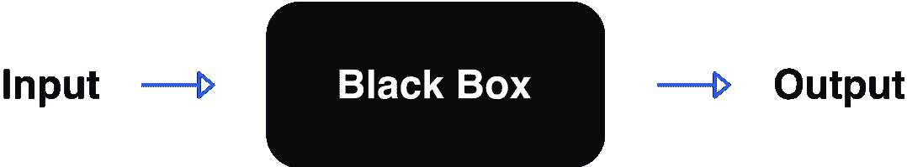
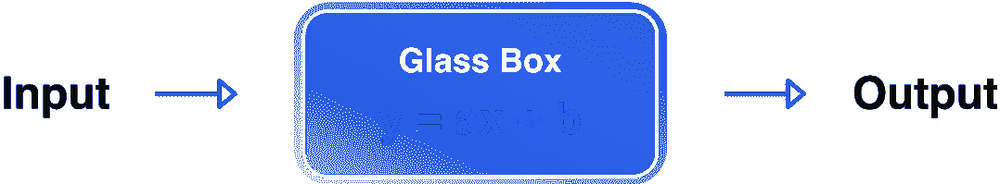
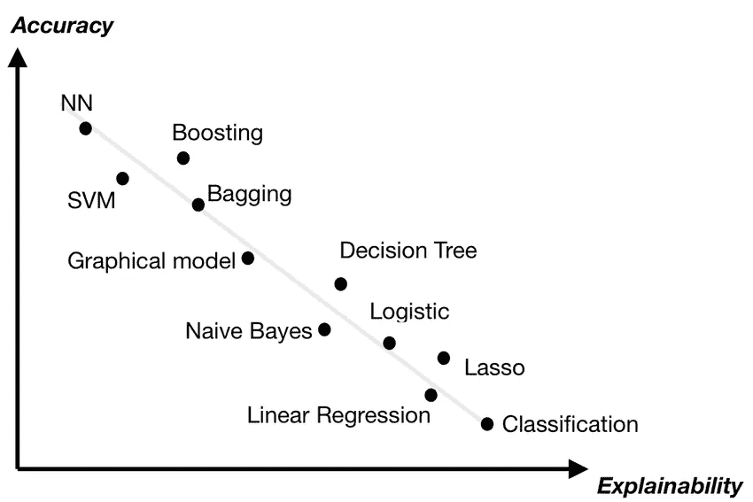

# 跳出“黑”盒子思考

> 原文：<https://towardsdatascience.com/think-outside-the-black-box-7e6c95bd2234?source=collection_archive---------21----------------------->

## 玻璃盒模型如何提供 X-AI 而不影响结果

凯文·Ku 在 [Unsplash](https://unsplash.com) 上的照片

# **简介**

人工智能在我们的日常生活中起着很大的作用。人工智能正在无处不在，从我们在谷歌上的搜索查询到特斯拉(Tesla)等自动驾驶汽车。随着深度学习的使用，这些应用中使用的模型变得更加复杂。事实上，它们非常复杂，在许多情况下，我们不知道这些人工智能模型是如何做出决定的。

这些模型通常被称为“黑盒”模型。我们有一组输入特征，然后我们将这些特征提供给我们的模型，然后模型进行复杂的计算，并做出决定。然而，我们并不确切知道模型是如何做出决定的，它认为哪些特性是重要的，甚至不知道它看的是什么。在某些情况下，对于人类来说，完全理解模型如何工作或如何做出决策并不是非常重要。但是在有这种需要的地方，我们看几种技术来帮助人类更好地理解模型如何得到它的预测。

图 1:黑盒表示[更苗条的人工智能]

可以帮助人类理解 AI 的一个东西是可解释的 AI (X-AI)。可解释的人工智能允许人类理解并更好地信任人工智能模型做出的预测。拥有可解释的人工智能的一个缺点是，通常在可解释性和准确性之间有一个权衡。一般来说，简单的模型比复杂的模型更容易解释。与黑盒模型相比，玻璃盒模型提供了更高的可解释性。在玻璃盒模型中，所有参数对我们来说都是已知的，我们确切地知道模型是如何得出结论的，这给了我们完全的透明度。

图 2:(简单)玻璃盒子模型表示[更苗条的 AI]

# **黑盒 vs 玻璃盒**

这就陷入了一个两难的境地:我们更喜欢准确性还是可解释性？选择适当的技术在很大程度上取决于您想要解决的问题类型。有些问题比其他问题更需要解释。例如，当您有一个接受大量个人信息的模型时，了解该模型使用哪种个人信息以及该模型如何使用这些特征来得出结论是很有好处的。这里我们应该优先考虑可解释性而不是准确性。

图 3:准确性与可解释性[5]

即使黑盒模型可能非常复杂，一些研究人员也试图解释这些模型的输出。有几种方法可以使用，最值得注意的是:

*   LIME(**L**local**I**interpretable**M**model-agnostic**E**x 解释)[1]以及
*   SHAP**嘘**阿普雷**答**加法 ex **P** 拉奈斯)【2】

LIME 围绕黑盒模型预测训练一个可解释的模型。另一方面，SHAP 采取了一种博弈论的方法，给每个特征分配一个特定预测的重要性值。

虽然解释黑盒模型需要外部工具，但玻璃盒模型本身是可以解释的。即使玻璃盒子模型有内置的可解释性，它们以前也没有这么强大。在理想情况下，我们希望有一个具有黑盒模型精度的玻璃盒模型。

但幸运的是有:微软开发的 interpretml[4]包中包含的可解释的 Boosting Machine(简称 EBM)。它建立在广义加性模型[3]的旧技术基础上，增加了新的机器学习技术，如装袋和梯度推进。在训练期间，EBM 以循环方式一次只查看一个特征，同时使用非常低的学习速率。这样，功能的顺序就无关紧要了。这个过程重复多次，在训练结束时，所有的特征树被加在一起。因为 EBM 是一个附加模型，每个特征分别对最终预测有贡献，它允许我们看到哪些特征是重要的，哪些是不太重要的[4]。

# **对比黑盒解释器与玻璃盒模型**

在 Slimmer AI，可解释性和对我们模型的信任是我们的首要任务之一。好奇我们如何在更苗条的人工智能中使用可解释的人工智能？阅读同事 Ayla Kangur 关于[实践中的可解释人工智能](/explainable-ai-in-practice-6d82b77bf1a7)的这篇精彩博文。可解释人工智能的一个用例是在我们的科学部门，在那里我们分析来自世界上最大的出版商之一的手稿。这里我们使用可解释的人工智能来预测一篇新的研究论文是否是原创的**。**

我们可以选择使用黑盒模型和解释器/解释技术，或者使用玻璃盒模型。在训练我们的模型后，LightGBM[6]模型，这是一个梯度推进模型，和 EBM，结果它们表现相似。我们的问题变成了，哪个模型给出了更好的解释。对于更好的解释，我们的意思是，哪个模型会像人类一样使用输入特征来解释预测。

结果相当惊人。循证医学会不断给出更好的解释。它将查看在预测场景中使用更有意义的特征，而 LightGBM 模型将使用更多(看似)随机特征的组合来获得其解释。一个很好的例子是当我们观察从现有研究中复制的句子长度时。LightGBM 模型着眼于短句的组合，而 EBM 着眼于长句。当然，当人们检查一篇研究论文是否原创时，他们也会寻找长时间的重叠。

我相信这标志着可解释人工智能领域向前迈出了一大步，拥有了一个既能产生出色结果又能通过设计解释的模型。看到未来还能实现什么将是令人兴奋的。

# **参考文献**

1.  马尔科·图利奥·里贝罗，萨米尔·辛格，卡洛斯·盖斯特林，[“我为什么要相信你？”:解释任何分类器的预测](https://dl.acm.org/doi/10.1145/2939672.2939778) (2016)，ACM
2.  Scott Lundberg，Su-In Lee，[解释模型预测的统一方法](https://papers.nips.cc/paper/2017/hash/8a20a8621978632d76c43dfd28b67767-Abstract.html) (2017)，NeurIPS 会议录
3.  特雷弗·哈斯蒂和罗伯特·蒂伯拉尼，[广义加法模型:一些应用](https://www.tandfonline.com/doi/abs/10.1080/01621459.1987.10478440) (1987)，美国统计协会杂志
4.  Harsha Nori，Samuel Jenkins，Paul Koch，Rich Caruana， [InterpretML:机器学习可解释性的统一框架](https://arxiv.org/abs/1909.09223) (2019)，arXiv.org
5.  亚历山大·杜瓦尔，[可解释的人工智能(XAI)](https://www.researchgate.net/publication/332209054_Explainable_Artificial_Intelligence_XAI) (2019)
6.  柯，，托马斯·芬利，王泰峰，，，叶启伟， [LightGBM:一种高效的梯度推进决策树](https://papers.nips.cc/paper/2017/hash/6449f44a102fde848669bdd9eb6b76fa-Abstract.html) (2017)，NeurIPS 论文集