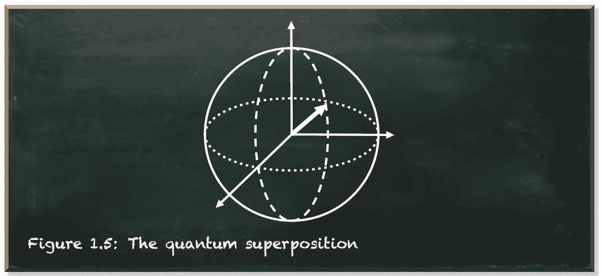
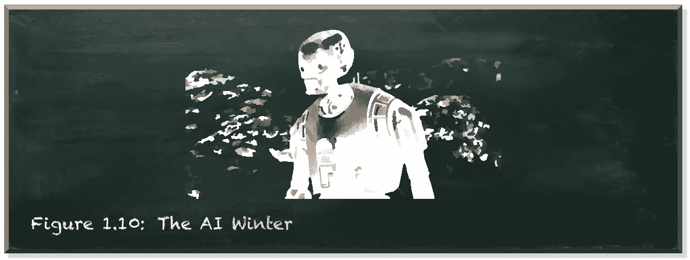
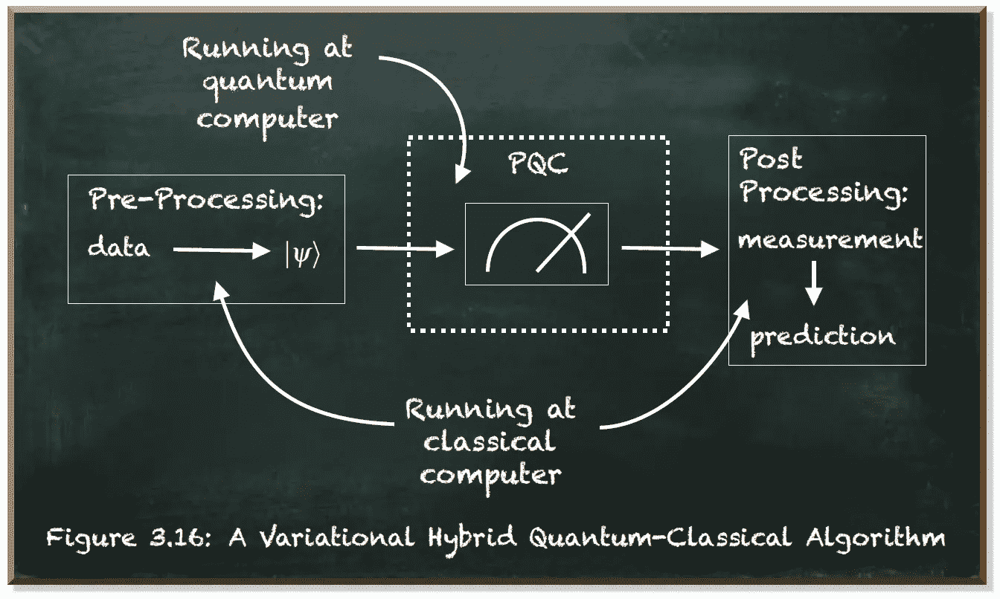
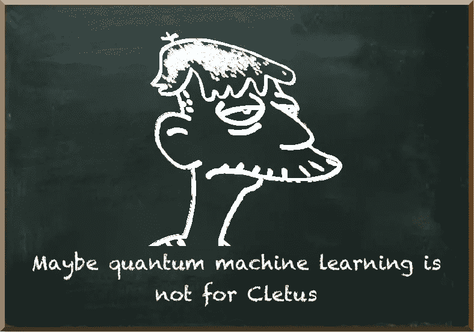
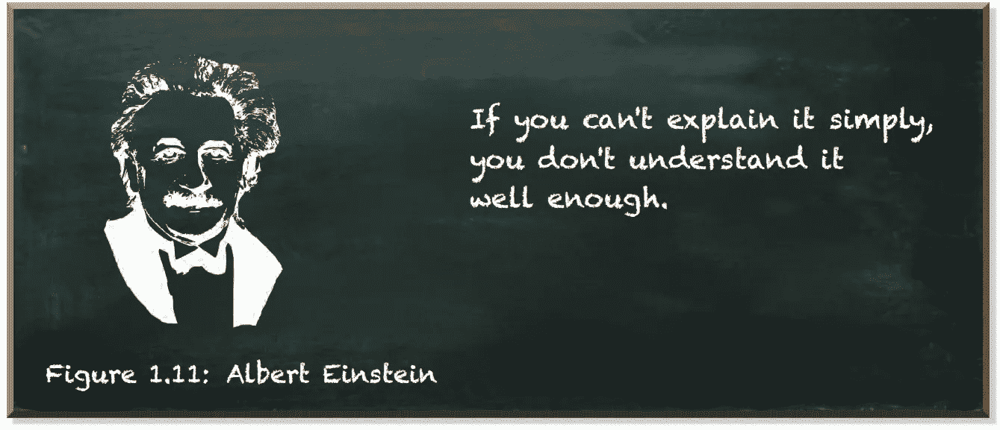
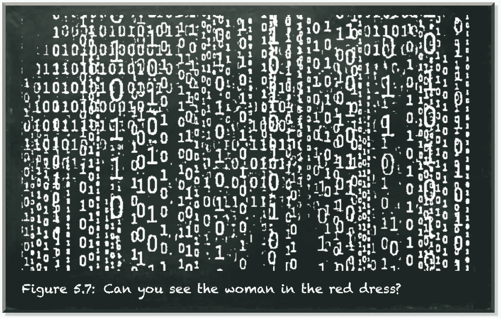

# 考虑从事量子机器学习工程师的职业？

> 原文：<https://towardsdatascience.com/thinking-about-a-career-as-a-quantum-machine-learning-engineer-9b89bdf3d1e1?source=collection_archive---------12----------------------->

## 一种新的职业即将兴起

量子机器学习要不要入门？看看 [**动手量子机器学习用 Python**](https://www.pyqml.com/page?ref=medium_career&dest=/) **。**

作者图片

量子计算有可能成为 21 世纪最具颠覆性的技术。这是一种基于量子力学的不同形式的计算，它有望解决我们无法用经典计算机解决的问题，例如大数的因式分解。

> 量子计算正从技术实验室走向主流商业用途

量子计算已经发展了多年。这项激动人心的技术提供的职业机会也是如此。长期以来，量子计算一直是只属于理论物理学家和数学家的领域。但是随着真正的量子计算机的出现和量子模拟器的出现，量子计算正在从技术实验室走向主流商业用途。

这种戏剧性的转变将影响公司未来雇佣哪些角色。公司将雇佣他们研究实验室之外的量子计算专家。他们需要知道如何将量子算法的计算优势转化为实际商业优势的专家。

一项有助于将量子优势转化为商业优势的技术是机器学习。机器学习已经在各个领域蓬勃发展，从工业到金融，从自动驾驶汽车到自然语言处理。然而，最先进的机器学习模型变得极其复杂，因此难以训练。虽然无法提供这样的模型可能会导致下一个人工智能冬天，但量子计算可能会决定性地阻止我们出现这样的场景。

> *我们的目标是阻止来自下一个 AI 的冬天*

作者图片

但是使用量子计算来解决机器学习任务需要一种新的职业，我将命名为**“量子机器学习工程师”**或**“量子机器学习科学家”。**当然，工程师和科学家之间有着显著的区别。然而，关于量子机器学习，界限很模糊。要想成功，你需要两者兼备。

“工程师”这个词告诉我们，任务是建立某种东西——机器学习模型。我们不仅仅是在开发模型的概念，我们实际上是在将它实现到工作代码中。因此，这项任务需要亲自动手，包括编写代码。

相比之下，“科学家”这个词告诉我们，任务是研究新的东西——机器学习模型。今天，没有现成的模型或算法。而且没有现成的方法可以挖掘量子优势。

无论哪种方式，开发模型及其底层算法都是量子机器学习的核心。量子机器学习工程师的工作是建立一个工具。这项工作位于研究和工程的交汇处。

作者图片

量子机器学习工程与数据科学、数据工程或数据分析形成对比。这些领域专注于从数据中提取意义。他们使用现有的工具。他们使用任何合适的工具来理解数据。相比之下，量子机器学习工程就是开发一种合适的工具来解决某种问题。

量子机器学习工程与量子科学、量子硬件工程或量子软件工程形成对比。这些工作的重点是开发我们首先需要创建和运行量子算法的硬件、固件和库。相比之下，量子机器学习工程是关于应用量子计算来解决问题。

作为量子机器学习工程师，你用量子计算解决机器学习问题。你优化量子算法在真实机器学习问题中的应用。从量子计算的角度来看，你处于光谱的应用端。从机器学习的角度来看，你在光谱的研究和工具开发方面。你主要关心的是算法，而不是数据。你用数据去理解问题的结构，而不是直接解决问题。

> 你需要超越日常能力的能力

量子机器学习工程师还不是一个很成熟的职称。因此，不同职位的要求可能会有很大差异。当然，然而，你需要超出日常能力的能力。

作者图片

要成为一名量子机器学习工程师，你需要了解很多关于算法的知识。但是仅仅知道如何实施是不够的。你需要知道如何定制它们来解决你手头的问题。此外，您需要知道在简单示例之外扩展算法时所面临的问题。你需要有一个装满量子计算专业知识的工具箱来解决这些问题。

你应该有在工业界或学术界应用机器学习模型的经验。而且你要精通软件语言，比如 Python 和 C/C++。此外，你应该熟悉量子软件，如 Cirq、Qiskit 或 Q#。您应该熟悉机器学习库，如 Scikit-Learn、TensorFlow 或 PyTorch。

你将与行业客户密切合作，了解他们的用例，你需要详细阐述他们的量子机器学习需求。你甚至需要成为领域专家。您将实现、测试和部署量子机器学习模型，以解决商业利益的大规模问题。

在开发模型时，您将进行数值模拟来测试算法性能并分析输出数据。

作者图片

最后，一定不要低估人际交往的要求。作为一名量子机器学习工程师，你将专注于前沿新兴技术。你工作的一个重要部分将是与客户互动，让他们为量子技术将带来的颠覆性变化做好准备。这需要向他们咨询，建立关系，以及向他们销售解决方案。你需要能够用简单的术语解释复杂的事情。

所有这些要求似乎势不可挡。了解所有这些事情就像阅读矩阵一样困难。

作者图片

当然，机器学习和量子算法的知识对于成为量子机器学习工程师至关重要。然而，你可能也需要正规教育。

> 你需要一个物理学、数学或计算机科学的博士学位

你肯定需要物理学、数学或计算机科学的高级学位，重点是机器学习或人工智能。我恐怕要说，大多数公司的高级意思是至少有一个博士学位。有些公司甚至要求你有很好的研究记录，以证明你有能力理解量子算法的基本原理，并提出新的想法。这样的研究应该发表在具有高影响因子的同行评审出版物期刊上。

最后，一些雇主甚至可能只从声誉好的大学招聘，这些大学在过去为他们提供了良好的就业机会。

然而，先进的量子专业知识是罕见的。对于许多雇主来说，量子机器学习算法的适用知识可能是不可追踪的。随着未来对熟练员工的需求越来越多，如果你能证明自己的能力，你找到量子机器学习工程师的机会可能不会太差。

这篇文章基于对 https://quantiki.org/jobs、[https://quantuminstitute.yale.edu/jobs](https://quantuminstitute.yale.edu/jobs)、[https://quantumcomputingreport.com/jobs/](https://quantumcomputingreport.com/jobs/)发布的招聘信息的分析。

量子机器学习要不要入门？看看 [**动手用 Python**](https://www.pyqml.com/page?ref=medium_career&dest=/) **学习量子机器。**

在这里免费获得前三章。