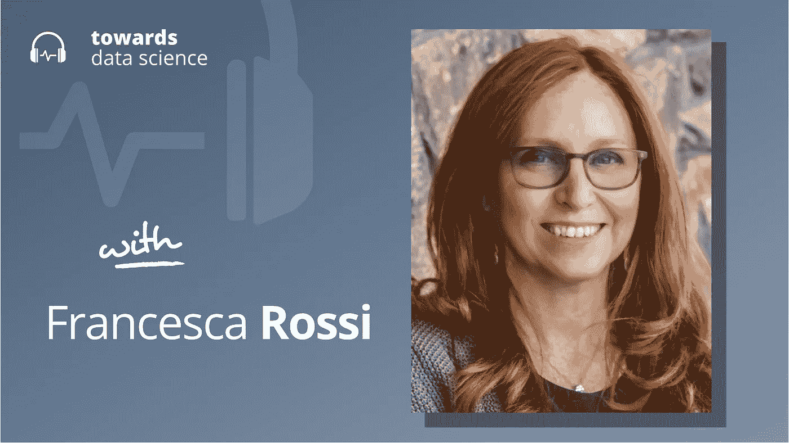

# 思考，快与慢:AI 版

> 原文：<https://towardsdatascience.com/thinking-fast-and-slow-ai-edition-ccb44cfff16e?source=collection_archive---------30----------------------->

## [播客](https://towardsdatascience.com/tagged/tds-podcast)

## 弗朗西丝卡·罗西论一般智力范式

[苹果](https://podcasts.apple.com/ca/podcast/towards-data-science/id1470952338?mt=2) | [谷歌](https://www.google.com/podcasts?feed=aHR0cHM6Ly9hbmNob3IuZm0vcy8zNmI0ODQ0L3BvZGNhc3QvcnNz) | [SPOTIFY](https://open.spotify.com/show/63diy2DtpHzQfeNVxAPZgU) | [其他](https://anchor.fm/towardsdatascience)

*编者按:TDS 播客由 Jeremie Harris 主持，他是数据科学导师初创公司 SharpestMinds 的联合创始人。每周，Jeremie 都会与该领域前沿的研究人员和商业领袖聊天，以解开围绕数据科学、机器学习和人工智能的最紧迫问题。*

最近大型变压器模型在人工智能方面的成功提出了关于当前策略局限性的新问题:我们能指望深度学习、强化学习和其他平淡无奇的人工智能技术让我们一直达到具有一般推理能力的类人系统吗？

有人这样认为，也有人不同意。一个不同的声音属于弗朗西斯卡·罗西，她是前计算机科学教授，现在是 IBM 人工智能伦理全球负责人。Francesca 的大部分研究专注于从人类认知中获得洞察力，这可能有助于人工智能系统更好地概括。弗朗西丝卡和我一起参加了这一集的播客，来讨论她的研究，她的思考，以及她对思考的思考。

以下是我在对话中最喜欢的一些观点:

*   弗朗西丝卡从丹尼尔·卡内曼将人类认知分为两个不同的系统中获得灵感，他将其命名为“系统 1”和“系统 2”。系统 1 是一种快速的认知，通常是情绪化的，基于本能。它依靠简化的世界模型对刺激做出快速反应。退缩、识别远处的物体、阅读和理解来自朋友的简单信息都被路由到系统 1。然而，系统 2 更谨慎:在卡内玛的模型中，它负责复杂的推理。一旦一类问题通过重复变得根深蒂固，在转移到系统 1 之前，它可能首先由系统 2 解决。
*   Francesca 想知道系统 1 和系统 2 之间的这种划分是否可以引入到人工智能中，以增加人工智能系统的灵活性。她认为系统 1 更简单、更快速的响应类似于神经网络的作用，神经网络可以识别对象或捕捉直截了当的文本的含义，而无需有意的处理，关键是，以一种可并行化的方式(例如，我可以同时识别一个场景中的许多对象)。相比之下，更谨慎的系统 2 可能涉及符号人工智能和神经网络的某种混合，以确保它捕捉到因果等原则，弗朗西斯卡认为这是“常识”推理的关键。她还设想，这种安排可能会受益于第三个“元认知”模块，该模块将决定是让系统 2 参与给定的问题解决任务，还是将其留给系统 1。该模块可能以类似于新的开关变压器架构中的开关的方式操作，例如，基于对问题的复杂性或价值的评估将数据路由到一个系统或另一个系统。
*   弗朗西丝卡也看到了将不同的认知功能分离成分解良好的智能体的可能性，这些智能体将合作产生一个普遍智能的超结构。她基于对人类大脑结构的观察，人类大脑由具有不同解决问题能力(语言、运动、感觉等)的独立区域组成。她认为，也许 AGI 可以被框定为一个多主体互动的问题，而不是训练一个捕捉所有重要知识的单一巨大神经网络的问题。
*   我们讨论了人类对人工智能系统所犯错误的宽容程度似乎不如对其他人所犯错误的宽容程度。不清楚这是不是一件好事:如果自动驾驶汽车人工智能杀死了人类司机杀死的 10%的人，但它在这些情况下犯的错误看起来很愚蠢，或者看起来人类司机不会犯这些错误，那么应该部署该系统吗？这种怀疑是弗朗西丝卡在可解释的人工智能研究中看到希望的很大一部分原因:她希望，或许能够用人类可以理解的术语解释错误可能会让人工智能对我们来说更值得信任，并减弱我们对否则可能看起来像“愚蠢错误”的下意识反应。

你可以[在 Twitter 上关注弗朗西丝卡](https://twitter.com/frossi_t)，或者[我在这里](https://twitter.com/jeremiecharris)。

## 章节:

*   0:00 介绍
*   1:20 弗朗西丝卡目前的研究
*   人工智能中的 7:50 架构选择
*   16:30 慢速思维与快速思维以及各种可能性
*   人类的主观经验
*   27:00 常识作为一类特殊的认知
*   32:50 对人进行因果推理测试
*   37:45 自动驾驶汽车的问题
*   42:00 人对机器错误
*   45:50 总结