# 线性代数中对量子系统的思考

> 原文：<https://towardsdatascience.com/thinking-of-quantum-systems-in-linear-algebra-5436dc9c44eb?source=collection_archive---------30----------------------->

## 如果你陷入困境，转换视角会有所帮助。

量子机器学习要不要入门？看看 [**动手用 Python 学习量子机器**](https://www.pyqml.com/page?ref=medium_linear&dest=/) **。**

在[之前的文章](https://medium.com/a-bit-of-qubit/how-to-think-of-quantum-computing-as-a-beginner-da3f20769a3)中，我们介绍了量子系统作为概率系统的概念。如果你是初学者，这是一个方便的方法。然而，它还远远不够全面。

我们开始了解 RY 门，以增加测量一个量子位为 1 的概率。例如，哈达玛门让我们以 50%的概率测量量子位为 1。一旦我们增加一个 RY gate，我们就把它增加到 85%。

这段代码实现了这个电路。

它会产生以下结果。

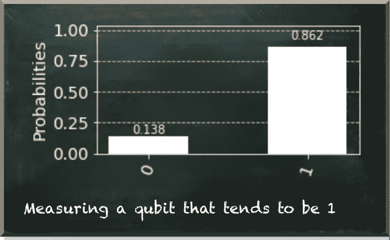

作者图片

为什么我们不进一步提高量子位测量为 1 的概率呢？

这里有一个更新的电路。

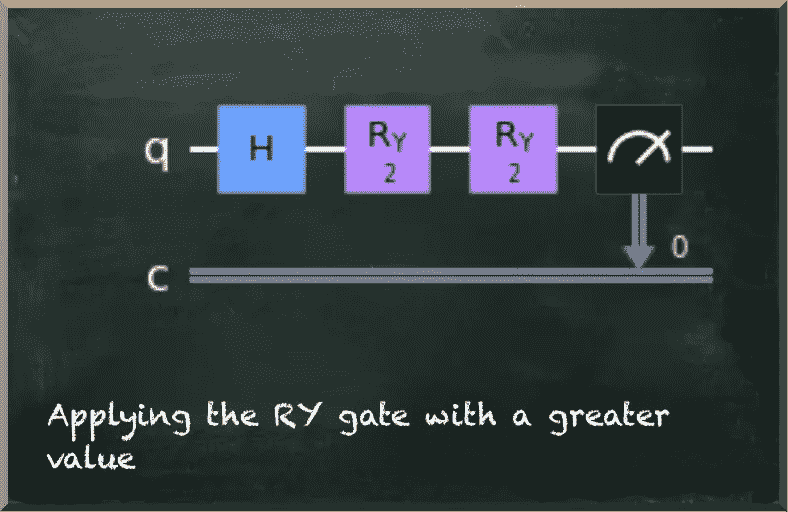

作者图片

下图显示了该电路的结果。

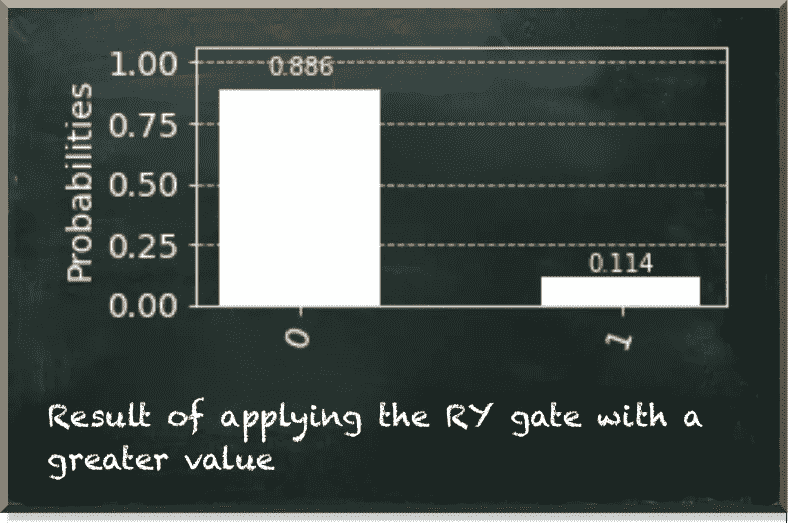

作者图片

**哎呀。量子位测量为 1 的概率下降了！**

我很好奇欧比旺现在会说什么。


作者图片

S **叠加是** 1 **和** 0 的复杂线性组合。

让我们看看两个状态的线性组合是什么样的。

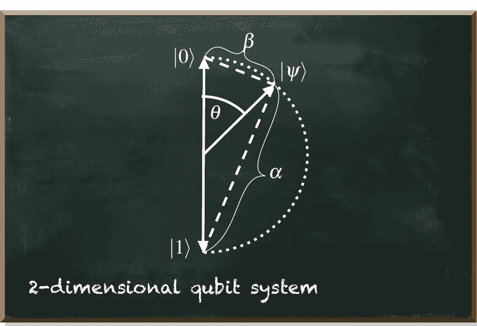

作者图片

看看这个图中的任意量子位状态向量|𝜓⟩。它起源于中心，大小(长度)为 1/2。由于这个相等的量级，所有的状态向量都在尖圆处结束。|𝜓⟩.也是

状态向量|0⟩和|𝜓⟩之间的角度，称为𝜃(“θ”)，控制向量头到系统顶部和底部的接近度(虚线)。

这些接近度代表了

*   测量|𝜓⟩的𝛼为`0`
*   以及测量它的𝛽为`1`。

```
The proximities 𝛼 and 𝛽 are at the opposite sides
of the state's probability (|𝜓⟩) they describe. 𝛼 is the proximity (or distance) to |1⟩ because with increasing distance to
|0⟩ the probability of measuring 0 increases.
```

因此，通过控制接近度，角度𝜃也控制了测量处于状态`0`或`1`的量子位的概率。

现在，让我们看看如果𝜃大于𝜋会发生什么(𝜋大约是 3.14)。

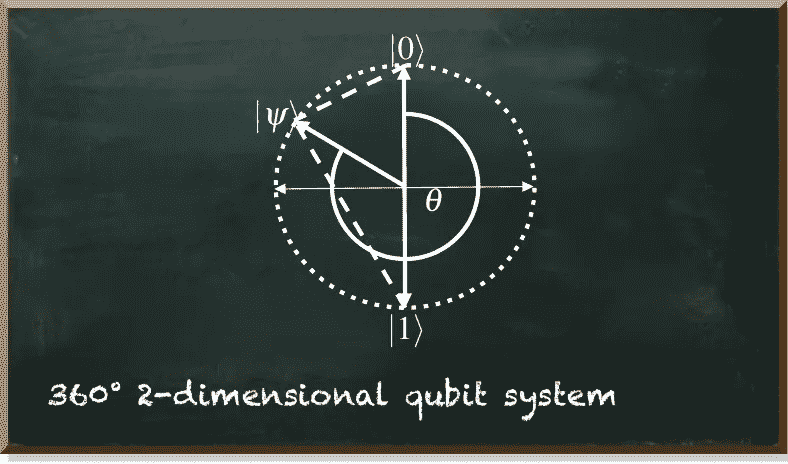

作者图片

如果𝜃变得比𝜋大，它与|1⟩的接近度又会降低，因此不太可能观察到量子位元为 1。

在 Qiskit 中，我们可以很容易地查看状态向量。当我们用`statevector_simulator`运行我们的电路时，我们可以使用`qiskit.visualization`中的函数`plot_bloch_multivector`来显示量子位的布洛赫球。

下图描述了我们之前创建的两种状态。这种表示法被称为布洛赫球。

不用管 Y 轴。今天，我们只关心上面有|0⟩和|1⟩的垂直 z 轴和 x 轴。这两个向量都位于围绕 X 轴和 Z 轴的圆上。

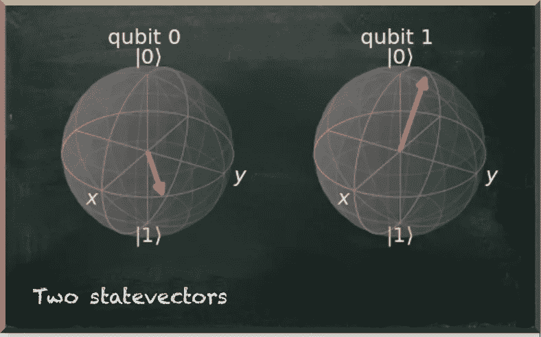

作者图片

在左手边，我们看到量子位具有较低的𝜃和较高的概率为 1。在右手边，我们看到另一个量子位具有更大的𝜃值和更低的概率 1。

到目前为止，我们的量子位元是彼此独立的。但只有纠缠量子位元的能力，才能让我们创造出一个超越简单随机数产生器的系统。

纠缠是量子位之间的一种极强的相关性。即使相隔很远，纠缠的量子位仍然保持完美的关联。

通常，我们用受控非门(也称为 CNOT 或 CX)来演示纠缠。所以让我们从经典地看这个门开始。

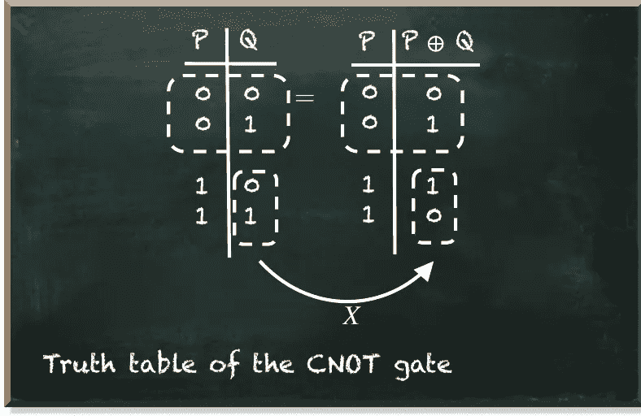

作者图片

真值表显示，只有当控制量子位处于|1⟩.状态时，这个门才对目标量子位应用 x 门否则，它什么也不做。

当我们只看基态时，这里仍然没有什么特别的东西。结果与经典电路的结果相同。

让我们在电路中使用这个门。

下图描述了电路图。

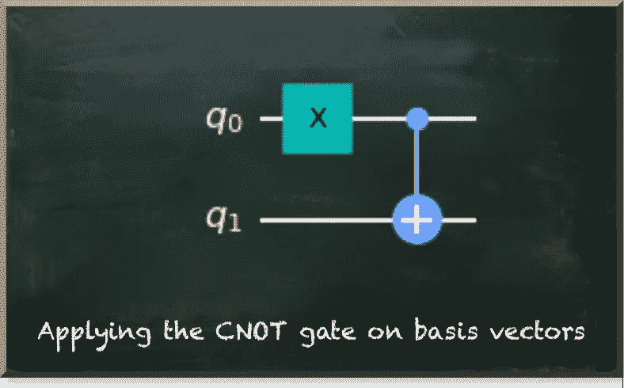

作者图片

这是这个电路的结果。

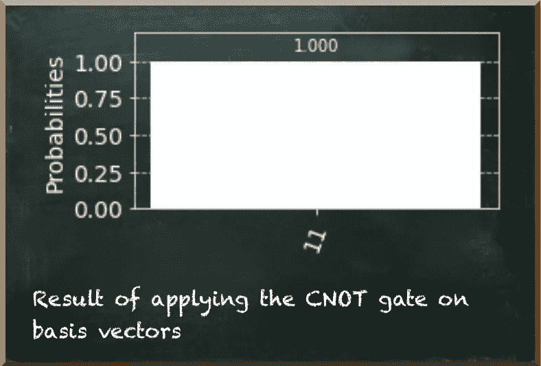

作者图片

不出所料，由此产生的状态向量也很无聊。我们首先把最高的量子位放入|1⟩.状态然后，CNOT 门也将底部量子位放入|1⟩状态。

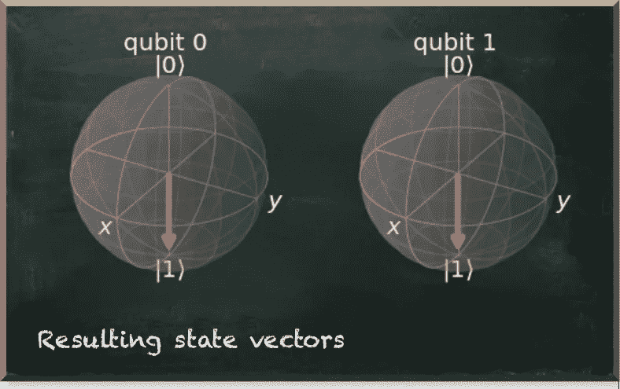

作者图片

我们看到两个国家都指向|1⟩.

但是当控制量子位处于叠加态时就变得有趣了。在我们应用 CNOT 门之前，哈达玛门将量子比特𝑄Q 放入|+⟩.状态“非”门将目标量子位置于|1⟩.状态

测量时，这种状态下的一个量子位不是 0 就是 1，各有 50%的概率。下图描绘了量子电路图。

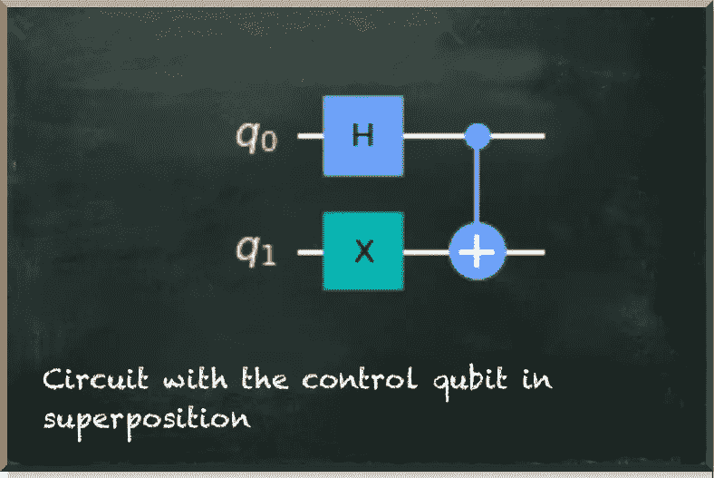

作者图片

我们测量控制量子位𝑃为 0 或 1，各有 50%的概率。这正是我们对|+⟩.态量子比特的预期我们测量的目标量子位𝑄正好相反。

***“当然有！*** “你可能认为。如果控制量子位𝑃是`0`，我们让目标量子位𝑄保持其状态|1⟩.不变我们测量为`1`。但是如果控制量子位是`1`，我们在量子位𝑄.上应用 x 门我们把它从|1⟩变成|0⟩，测量为`0`。

让我们看一看。

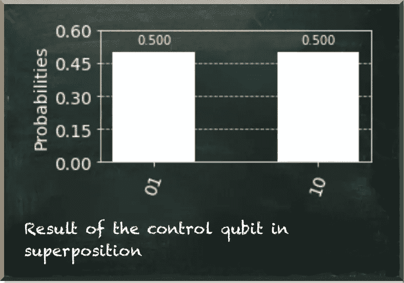

作者图片

那么，让我们看看线性代数告诉了我们关于两个量子位的什么。如果我们打印状态向量，就会发生这种情况。

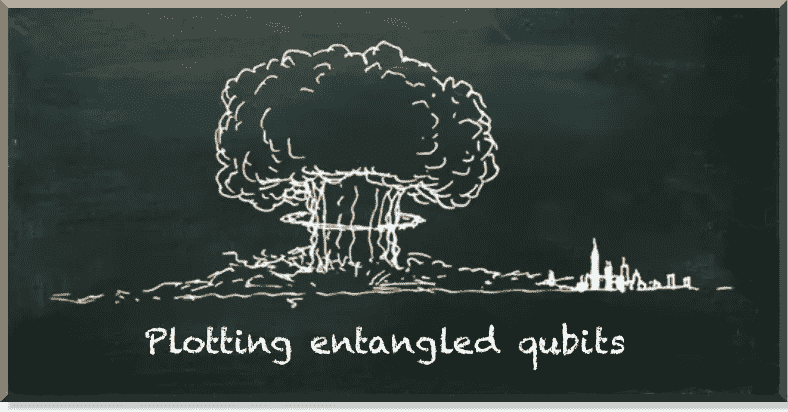

作者图片

…开个玩笑…

这是真实的输出。


作者图片

好消息是，它没有爆炸。但对我们也没多大帮助。

# 结论

线性代数及其可视化是推理量子位状态的有力工具。它解释了为什么我们用某些值来测量量子位。

但是这种观点也有缺点。布洛赫球——这是最突出的可视化——只适用于单个量子位。在纠缠量子位上效果不好。不幸的是，当我们处理纠缠量子位时，量子计算变得有趣了。

而且，理解纠缠量子比特是量子计算中最具挑战性的部分。糟糕的是，这种表示并没有帮助我们。

这是我们最后的希望。


作者图片

量子机器学习要不要入门？看看 [**动手量子机器学习用 Python**](https://www.pyqml.com/page?ref=medium_linear&dest=/) **。**


在这里免费获得前三章。