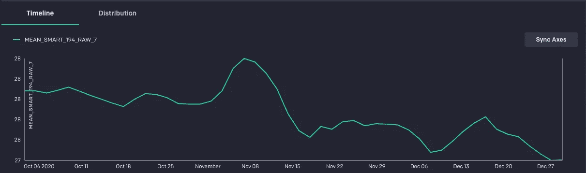
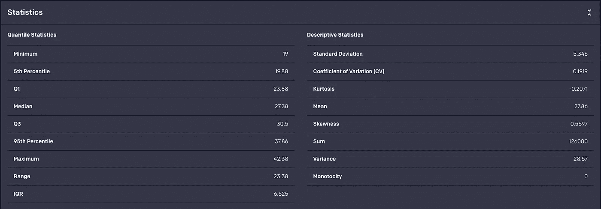
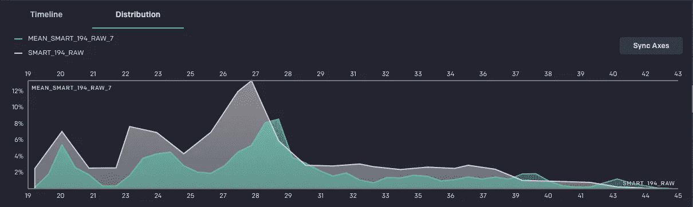

# 第三次魅力？

> 原文：<https://towardsdatascience.com/third-times-the-charm-91835dc0facb?source=collection_archive---------26----------------------->

## 时间序列特征工程，三种方法


本杰明·雷曼在 Unsplash[拍摄的照片](http://unsplash.com)

生存分析是许多不同行业的共同问题。其中包括医学试验中的患者存活率、客户流失和硬件故障等。使用机器学习的生存分析是一个复杂的过程，超出了单个博客的范围。然而，生存分析模型中常见的计算对其他时间序列应用也是有用的。不幸的是，时间序列数据，尤其是硬件故障和在线客户流失的时间序列数据会变得非常大，这使得在 pandas 的单台机器上处理这些数据变得非常困难。在这篇博客中，我们将考虑这些计算(移动平均)之一，并讨论熊猫的替代方案来创建这些功能。

该博客将使用来自 [Backblaze](http://www.backblaze.com) 的数据，其中包含数据中心所有硬盘的[每日智能统计数据](https://www.backblaze.com/b2/hard-drive-test-data.html)。在 2021 年的 [Q2，Backblaze](https://www.backblaze.com/blog/backblaze-drive-stats-for-q2-2021/) 的数据中心有将近 180，000 个驱动器。我们将考虑一项分析来预测硬盘驱动器的预期寿命，给出其迄今为止的统计数据。在最近的数据中，有 124 列数据。其中，Backblaze [积极监控](https://www.backblaze.com/blog/what-smart-stats-indicate-hard-drive-failures/)少数可能的故障指标。这些是:

*   SMART 5:重新分配的扇区计数
*   SMART 187:报告了不可纠正的错误
*   SMART 188:命令超时
*   SMART 197:当前待定扇区计数
*   SMART 198:不可纠正的扇区计数

在此分析中，我们将假设所有每日数据都存储在云数据仓库中，我们将展示为所有 5 个指标创建移动平均值的三种方法。此外，对于此分析，我们感兴趣的是驱动器温度对故障的影响，因此我们还将考虑 SMART 194。

许多数据科学家最喜欢在一台机器上研究熊猫。要使用 pandas 构建移动平均线，必须首先从数据仓库中提取数据。

```
sqltext = """SELECT date, serial_number, model, failure, 
smart_5_raw, smart_187_raw, smart_188_raw, 
smart_194_raw, smart_197_raw, smart_198_raw 
FROM daily 
WHERE model = 'ST12000NM0008' 
AND date between '2020-10-01' and '2020-12-31' ORDER BY serial_number, date
"""df = pd.read_sql(sqltext, engine, parse_dates=['date'])
```

每个区域的 7 天移动平均值(本例中为温度)可由下式得出

```
df['mean_temp_7'] = df.groupby('serial_number')['smart_194_raw'] \    
                      .rolling(7,
                       min_periods=1).mean().reset_index(drop=True)
```

这可以对每个其他特征重复进行。或者，可以创建滚动分组

```
rolling_group = df.groupby('serial_number').rolling(7, 
                                              min_periods=1)
```

可以应用下一个`agg`

```
tdf = rolling_group.agg({'smart_5_raw': 'mean',
                         'smart_187_raw': 'mean',
                         'smart_188_raw': 'mean',
                         'smart_194_raw': 'mean',
                         'smart_197_raw': 'mean',
                         'smart_198_raw': 'mean'})
```

在这个新的数据框中，要素名称现在包含了 7 天的滚动平均值，因此请重命名这些要素以明确它们所包含的内容。

```
moving_avg_df = tdf.rename(columns=
                    {'smart_5_raw': 'mean_smart_5_raw',
                     'smart_187_raw': 'mean_smart_187_raw',
                     'smart_188_raw': 'mean_smart_188_raw',
                     'smart_194_raw': 'mean_smart_194_raw',
                     'smart_197_raw': 'mean_smart_197_raw',
                     'smart_198_raw': 'mean_smart_198_raw'})
```

最后，将这些移动平均线合并回原始数据框架。

```
final_df = df.merge(moving_avg_df.reset_index(level='serial_number',
                                              drop=True),
                    left_index=True, right_index=True)
```

对于多年的数据，这在单台机器上非常耗时。但是，可以利用这个数据存储在云数据仓库中的事实。我们可以用 SQL 计算字段的 7 天移动平均值，如下所示

```
avg(<field>) OVER(PARTITION BY serial_number ORDER BY date ROWS BETWEEN 6 PRECEDING AND CURRENT ROW) AS mean_<field>
```

这意味着我们可以通过修改发送到`pd.read_sql`的 sql 将最终数据直接拉入 pandas 数据帧。

```
sqltext = """
SELECT date
, serial_number
, model
, failure
, smart_5_raw, smart_187_raw
, smart_188_raw, smart_194_raw
, smart_197_raw, smart_198_raw 
, AVG(smart_5_raw) OVER(PARTITION BY serial_number ORDER BY date ROWS BETWEEN 6 PRECEDING AND CURRENT ROW) AS mean_smart_5_raw
, AVG(smart_187_raw) OVER(PARTITION BY serial_number ORDER BY date ROWS BETWEEN 6 PRECEDING AND CURRENT ROW) AS mean_smart_187_raw
, AVG(smart_188_raw) OVER(PARTITION BY serial_number ORDER BY date ROWS BETWEEN 6 PRECEDING AND CURRENT ROW) AS mean_smart_188_raw
, AVG(smart_194_raw) OVER(PARTITION BY serial_number ORDER BY date ROWS BETWEEN 6 PRECEDING AND CURRENT ROW) AS mean_smart_194_raw
, AVG(smart_197_raw) OVER(PARTITION BY serial_number ORDER BY date ROWS BETWEEN 6 PRECEDING AND CURRENT ROW) AS mean_smart_197_raw
, AVG(smart_198_raw) OVER(PARTITION BY serial_number ORDER BY date ROWS BETWEEN 6 PRECEDING AND CURRENT ROW) AS mean_smart_198_raw
FROM daily 
WHERE model = 'ST12000NM0008' 
AND date between '2020-10-01' and '2020-12-31'
ORDER by serial_number, date
"""
final_df = pd.read_sql(sqltext, engine, parse_dates=['date'])
```

这给了我们和熊猫一样的数据。

最后，因为这些数据位于云数据仓库中，如果 [Rasgo](http://rasgoml.com) 连接到该仓库，您可以使用 Rasgo 为这些转换创建代码，并在仓库上从 Python 执行它们，并将数据保存回仓库。

首先，连接到 Rasgo

```
import pyrasgo
rasgo = pyrasgo.connect('<Your API Key>')
```

连接到数据源(包含硬盘驱动器统计信息的表)，

```
datasource = rasgo.get.data_source(id=<Data Source ID)
```

创建转换以创建移动平均值(在这种情况下，我们将为任意大小的窗口创建它。转换文本将是包含在 [Jinja 模板](https://jinja.palletsprojects.com/)中的 SQL select 语句。

```
sqltext = """SELECT *

    
        , avg({{column}}) OVER(PARTITION BY {{serial_dim}} ORDER BY {{date_dim}} ROWS BETWEEN {{window - 1}} PRECEDING AND CURRENT ROW) AS mean_{{column}}_{{window}}
    

FROM {{source_table}}"""new_transform = rasgo.create.transform(name="moving_average",
                                       source_code=sqltext)
```

接下来，可以通过调用以下命令将此模板应用于单个字段的数据

```
newsource = datasource.transform(transform_name='moving_average',
                            fields_to_average = ['SMART_194_RAW'],
                            serial_dim = "SERIAL_NUMBER",
                            date_dim = "DATE",
                            window_sizes = [7]})
```

可以在数据仓库上创建数据，并通过调用

```
transformed_source = newsource.to_source(new_table_name=
                                             "<New Table Name>")
```

可以将这些变换链接在一起，为所有六个特征创建移动平均值。此外，可以组合以类似方式构建的其他转换来创建附加功能。但是，由于转换是为了获取要素列表和窗口大小而构建的，因此可以同时创建所有六个要素的 7 天和 14 天移动平均值。

```
newsource = datasource.transform(
                    transform_name='moving_average',
                    fields_to_average = ['SMART_5_RAW',
                                         'SMART_187_RAW',
                                         'SMART_188_RAW', 
                                         'SMART_194_RAW',
                                         'SMART_197_RAW',
                                         'SMART_198_RAW'],
                    serial_dim = "SERIAL_NUMBER",
                    date_dim = "DATE",
                    window_sizes = [7, 14])
```

这可以发表为

```
newsource = newsource.to_source(new_table_name="<New Table Name>")
```

这种方法有几个优点。首先，如前所述，这些特性是在云数据仓库上创建的，并立即保存到该仓库的一个表中。除了利用仓库运行计算的能力之外，它还节省了将数据移入和移出运行 Python 的计算机的 I/O 时间。当它被保存到数据库中时，所有有权访问仓库的用户都可以立即使用它，而不仅仅是同一台计算机上的用户。最后，因为它是在 Rasgo 中发布的，所以可以从该源创建要素

```
newsource = rasgo.publish.features_from_source(data_source_id=newsource.id,
                                   dimensions=['DATE',
                                               'SERIAL_NUMBER',
                                               'MODEL'],
                                   granularity=['day',
                                                'serial_number',
                                                'model'],
                                   features=['MEAN_SMART_5_RAW_7',
                                            'MEAN_SMART_187_RAW_7',
                                            'MEAN_SMART_188_RAW_7',
                                            'MEAN_SMART_194_RAW_7',
                                            'MEAN_SMART_197_RAW_7',
                                            'MEAN_SMART_198_RAW_7'],
                                   tags=['drive_failure'],
                                   sandbox=False)
```

这使得这些功能可以在 Rasgo 平台上被发现，并且可以与 Rasgo 中的其他功能结合使用。此外，Rasgo 将生成一个功能配置文件，允许快速查看生成的功能。

该特征配置文件包括显示值分布的直方图


作者图片

一段时间内的平均值



作者图片

此功能的常见统计信息



作者图片

随着时间的推移，此功能与其他功能之间的比较


作者图片

以及这个特征和另一个特征的分布的比较



作者图片

虽然数据科学家在 pandas 中工作很舒服，但在生成要素时利用云数据仓库的能力有相当大的优势。在这篇博客中，我们看到了一个数据科学家如何从在 pandas 本地工作，到为团队的其他成员创建甚至探索在 Rasgo 中使用的功能。