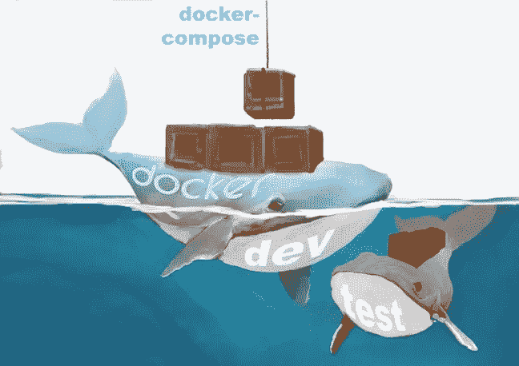
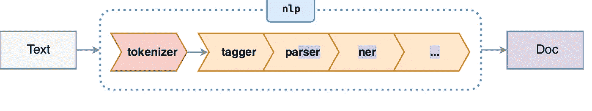

# 32 个 Python 工具和包库来提高您的机器学习效率

> 原文：<https://towardsdatascience.com/thirty-two-python-tools-and-package-libraries-to-increase-your-machine-learning-productivity-fc7bf785c5c2?source=collection_archive---------32----------------------->

## 这些是我和我的同事用来提高机器学习管道开发和生产部署生产率的工具、包和库。以下是截至 2020 年 12 月 24 日我们最喜爱的快照。

用于机器学习的 Python 工具、库和包。来源: [Unsplash](https://unsplash.com/photos/faEfWCdOKIg)

# 计算机编程语言

在过去的七年里，我们主要(95%)使用 **Python** ，因为:

1.  几乎所有新的机器学习模型、云、GPU 和许多其他模型都可以作为 **Python** **API 获得；**
2.  自由代码和包的种类和数量是我们见过的最大的；
3.  原生的 **Python** 比 **C** 慢 20 多倍，但是几乎所有的 **Python** 包都接近 **C** 的速度，因为它们是比 **CPython** 更瘦的 API 或者使用一些其他加速技术。

当 [**Numba**](https://numba.pydata.org/) 无法使用时，我们使用 **C** 来加速 **Python** 。我们试了试围棋，但没有成功。

</my-journey-to-speed-up-python-setting-up-a-golang-development-environment-and-benchmarking-f03c5252ef8f>  

4.随着从 **Python 3.5** 开始引入类型提示，云、 **Spark、**包实现(即 **XGBoost** )和强类型越来越多地绕过 Python GIL(多核机器上缺乏并发性)。

<https://medium.com/swlh/future-proof-your-python-code-20ef2b75e9f5>  

**Python 的**运行速度似乎聚集了大多数批评。如果找到编译 Python 的方法，很多批评可能会消失。同时， **Python** 是机器学习的主要选择。

# Python IDEs

我们用了 15 年的 EMACS。我们是*那些*学计算机科学的人，在用 **LISP** 编码的过程中偶然吸收了一些软件工程。

我们停止了将 **EMACS** 或使用别人的**端口移植到新的硬件和操作系统平台。当我们使用 **Java** 、 **Scala** 、 **R** 、 **Matlab** 、 **Go** 和 **Python** 时，我们开始使用其他**ide、**。**

我们只讨论与 Python 相关的工具，如 ide 和 T21。我们认为 Python 作为机器学习的首选最终会下降，只是不是在未来几年。

我觉得**Python**IDE 有三个不错的选择。

## Jupyter 笔记本或 JupyterLab

Jupyter Notebook 使您能够嵌入文本、嵌入代码和交互式运行代码。它基于实验笔记本。

> Jupyter 项目旨在开发跨越数十种编程语言的开源软件、开放标准和交互式计算服务。Jupyter 项目

</adding-jupyter-notebook-extensions-to-a-docker-image-851bc2601ca3>  

## [**nbdev**](https://www.fast.ai/2019/12/02/nbdev/)

**fast.ai** 编码了一套完整的 Jupyter 笔记本工具。请过目一下。

> 这是一个名为 [nbdev](https://nbdev.fast.ai/) 的 python 编程环境，它允许你创建完整的 Python 包，包括测试和丰富的文档系统，所有这些都在 [Jupyter 笔记本](https://jupyter.org/)中。— [杰瑞米·霍华德](https://www.fast.ai/2019/12/02/nbdev/)

## [nbdev](https://www.fast.ai/2019/12/02/nbdev/)

**fast.ai** 编码一整套 **Jupyter** 笔记本工具。请过目一下。

这是一个名为 [nbdev](https://nbdev.fast.ai/) 的 python 编程环境，它允许你创建完整的 Python 包，包括测试和丰富的文档系统，所有这些都在 [Jupyter 笔记本](https://jupyter.org/)中。— [杰瑞米·霍华德](https://www.fast.ai/2019/12/02/nbdev/)

## PyCharm 或 VSCode

**PyCharm** 和 **VSCode** 是 **Python** 最流行的 ide(交互式开发环境)。

我们使用 **PyCharm** (或 **VSCode** )进行开发、文档、测试和调试。两者都集成了内联文档格式、版本控制(git 或 GitHub)、测试包、覆盖率、linters、类型提示检查器和代码格式。

> 面向专业开发人员的 Python IDE—JetBrains

<https://dr-bruce-cottman.medium.com/pycharm-an-animated-guide-to-creating-projects-and-setting-their-behavior-696d69dbbb6>  

# Python 开发工具

## [黑色](https://pypi.org/project/black/)

**黑色**将你的代码格式化成 PEP-8 标准的超集。我们用它来格式化由 **PyCharm** 、 **VSCode** 或**GitHub**actions 触发的项目中的所有代码文件。

## 编码能力

**Codacy** 是目前我们最喜欢的“痛苦的* * *”(PITA)开发工具。它比 **pylint、**一些我们忽略的风格警告**捕捉更多的错误和可疑代码。**我们认为今天的是一个自动化的代码审查工具**。**正如 **codacy** 在他们的标语 **:** 中所说的，对你的提交和拉取请求进行自动化的代码审查。

## [覆盖范围](https://coverage.readthedocs.io/en/coverage-5.3.1/)

Coverage.py 是我们用来测量我们的 **Pytest** 框架覆盖的代码量的工具。

## [git](https://git-scm.com/doc) 和 [GitHub](https://docs.github.com/en/free-pro-team@latest/github)

我们使用 **git** 进行本地文件版本控制。一旦单元测试在一台本地机器上通过，我们就将代码推送到 [**GitHub**](https://docs.github.com/en/free-pro-team@latest/github) 云上的 repo 中。

## [mypy](https://mypy.readthedocs.io/en/stable/)

**Mypy** type 检查具有符合 [PEP 484](https://www.python.org/dev/peps/pep-0484/) 的类型注释的程序。 **mypy** 经常在持续集成中使用，以防止类型错误。 **Mypy** 加入了我们的其他开发工具，如 **pytest、black、pylint 和 Codacy。**

<https://medium.com/swlh/future-proof-your-python-code-20ef2b75e9f5>  

## [皮林特](http://pylint.pycqa.org/en/latest/)

我们使用 **pylint** 在本地编码节点上查找错误和可疑代码。我们今天用<https://www.codacy.com/>**来表示“林挺”的完整项目代码，以便推送给 **Github** 回购。**

## **[Pytest](https://docs.pytest.org/en/stable/contents.html)**

**在我们的职业生涯中，我们使用过许多不同的框架。我们决定用 **Pytest** 进行单元测试，主要是因为需要最少的样板文件。**

## **[不规则三角形](https://pypi.org/project/scalene/0.9.16/)**

**我们用 [**不规则三角形**](https://pypi.org/project/scalene/0.9.16/) 代替内置的 Python profiler。**

****Scalene** 是一个用于 Python 的高性能 CPU *和*内存分析器，它可以做一些其他 Python 分析器无法做的事情。它的运行速度比其他分析器快几个数量级，同时提供更详细的信息。**

# **云服务**

## **[Kubernetes](https://kubernetes.io/)**

**我们在云上使用 [**Kubernetes**](https://kubernetes.io/) 来管理一组 **Docker** 容器。 [**Kubernetes**](https://kubernetes.io/) 由 **Google 开源。****

**此外，也可以使用[**Kubernetes**](https://kubernetes.io/)**n 一个本地的联网机器集群。[**Kubernetes**](https://kubernetes.io/)**大概在本地工作，但是我们从来没有这样用过。******

> ****[**Kubernetes**](https://kubernetes.io/docs/concepts/overview/what-is-kubernetes/) ，也称为 K8s，是一个用于自动化部署、扩展和管理容器化应用程序的开源系统。— [Kubernetes](https://kubernetes.io/) 文档。****

## ****库伯弗洛****

****我们使用 **kuberflow** 来构建[Kubernetes](https://kubernetes.io/)*pod 的机器学习流水线。*我们在*风镜云平台(GCP)上只使用 **kuberflow** 的。*由 **Google** 开源，应该可以在其他云平台上工作。然而，GCP 将 kuberflow 打包为云 PaaS(平台即服务)。作为 GCP PaaS， **kuberflow** 拥有便捷的 GUI 模板和机器学习流水线的 DAG(有向无环图)显示。****

# ****DevOps (CD/CI/CD)和机器学习操作(MLOps)工具****

****[*持续开发*是传统*持续集成*过程](https://devops.com/)的第一部分。持续部署遵循持续集成(CD/CI/CD)。****

****有关 DevOps 的介绍和概述，请访问:****

****<https://medium.com/hackernoon/the-2018-devops-roadmap-31588d8670cb>  

DevOps(开发操作)是为计算机语言代码生命周期而创建的。MLOps(机器学习操作)扩展了机器学习管道生命周期的 DevOps。

有关 MLOps 的介绍和概述，请访问:

<https://medium.com/slalom-data-analytics/the-modern-mlops-blueprint-c8322af69d21>  

## [MLFlow](https://www.mlflow.org/docs/latest/index.html)

我们发现 [**MLFlow**](https://www.mlflow.org/docs/latest/index.html) 对于指定具有五个或更少步骤的机器项目是有效的，其中一些其他框架执行任何数据预处理。我们将 [**MLFlow**](https://www.mlflow.org/docs/latest/index.html) 用于机器学习流水线，该流水线遵循基于 **Spark** 的分布式数据预处理前端。

也许我们用错了 MLFlow，但是输入和输出似乎是基于文件的。然而，我们迷恋于 **MLFlow** **跟踪**组件。 **MLflow** **跟踪**组件使我们能够记录模型参数、代码版本、度量和输出文件，以便在用 **Streamlit** (稍后讨论)构建的仪表板中显示。

> **注意**:我们现在很少用 **MLFlow** 。我们使用 **Photon.ai** 进行快速实验，使用 **kuberflow** 在云上生产机器学习管道。

## [Photon.ai](https://www.photon-ai.com/)

**Photon.ai** 将 **Scikit-Learn、pycluster、**和其他机器学习(ML)或深度学习(DL)框架整合到一个统一的范例中。 **Photon.ai** 采用 **Scikit-Learn 的**估算器和 Transformer 类方法架构。

**Photon.ai** 添加代码****通过将前学习器和后学习器算法转换为带有参数签名的元素，减少了人工编码和错误。元素的例子有几个数据清理器、定标器、估算器、类平衡器、交叉验证器、超参数调谐器和集成器。****

******Photon.ai** 将元素链成机器学习流水线。两条或多条管道由合取(**和)**或析取(**或)**运算符组成，以创建 DAG(有向无环图)。点击所需链接，即可找到[原](https://github.com/wwu-mmll/photonai)**photon . ai**[**源代码**](https://github.com/wwu-mmll/photonai)**，[扩展](https://github.com/bcottman/photon)**photon . ai**[**源代码**](https://github.com/bcottman/photon)**，[实例](https://github.com/wwu-mmll/photonai/tree/master/examples)， [arXiv 论文](https://arxiv.org/abs/2002.05426)，[文档](https://www.photon-ai.com/documentation/)。********

******你可以在下面的博客中看看 **photon.ai** 是如何将 **scikit-learn** 扩展成 MLOps 工具的:******

****</is-photonai-a-better-choice-than-scikit-learn-f33849423709>  

## GitHub 操作

我们的经验使我们预测 **GitHub** **动作**将是持续开发、持续集成和持续部署(CD/CI/CD) on 和 off **GitHub** 的重要选择。

*持续开发*是当任何来自本地*回购*的推送到项目版本控制*开发回购时。*在 **GitHub** *repo，CD/CI* 脚本运行 PEP-8 格式符合性、单元测试、文档测试和代码质量审查。

它是我们在中展示的 **GitHub** 动作脚本的核心基础:

<https://medium.com/swlh/will-github-actions-kill-off-jenkins-f85e614bb8d3>  

## 码头工人

**Docker** 创建一个应用程序及其依赖项的映像，作为一个完整的独立组件，可以迁移到大多数云供应商产品、 **Linux** 、 **Windows OS** (操作系统)和 **MacOS** 。

**Docker-Compose** 用于为同一个应用程序同时管理几个容器。这个工具提供了与 **Docker** 相同的功能，但是允许你拥有更复杂的应用程序。

一个 **Docker** 图像类似于一个 **Photon.a** i 元素；最大的区别在于，Kubernetes 通过映像复制来平衡负载，并管理 DAG。

雷切尔·科特曼插图

以下博客详细介绍了 Docker 图像的构建:

</natural-language-processing-in-production-creating-docker-images-84bd86e161b4>  <https://dr-bruce-cottman.medium.com/a-docker-solution-for-the-test-groups-use-cases-8e8ed6c28e11>  

# Python 库包

## [图表](https://github.com/mingrammer/diagrams)

[**图**](https://github.com/mingrammer/diagrams) 使你能够创建高质量的架构 DAG(有向无环图)。 [**图**](https://github.com/mingrammer/diagrams) 有一个概念称为*节点*。节点是 **Diagrams** 包将图标组织成不同组的方式，其中每个节点都在公共域或云服务中。

下面的博客展示了 Azure、AWS 和 GCP 的高质量架构图的渲染:

<https://medium.com/better-programming/a-fantastic-way-to-programmatically-create-diagrams-for-different-cloud-architectures-33b32a3d6cdc>  

## [Hiplot](https://facebookresearch.github.io/hiplot/index.html)

[**HiPlot**](https://email.mg1.substack.com/c/eJwlkMuugyAQhp-mLA0gii5YnE1fg3AZlVTBwpDGtz_YJpOZzD3f7wzCmvKlzlSQ3E7jdYKK8Ck7IEImtUDWwSsp5TAwQbyikjtpSSh6yQCHCbsiZ7V7cAZDivfwIHo6k01ZMTLDYDGL7d04UDo6bxe7jAPns5uX30tTfYDoQKW4X_o0wZNdbYhnefR_D_5stgbcqu1cOlqyGAc2pVeGAia7rZW2cO4JSVCccso4F4xTOYiOdZP7vHt5ZBbMQ9BjZV2ptqBxr_saycrnzubqoKWIh4ltar2hvu3GpVs8agx4aYjG7uAV5goEf6J9BdArRMhNTK8NKjbSaWJslILP_Q-xacInJtnUM9L--9S2osKtEbzrzf4PbxaG_Q) 是一个交互式可视化工具，使我们能够发现高维数据中的相关性和模式。 **HiPlot** 使用一种被称为[平行图](https://email.mg1.substack.com/c/eJwlUMuOwyAM_JpyjICQkhw47GXP-wfIASdFJZCCoyp_v6SVLFvjh8YzDgjXXE6z50rsSpbOHU3Cd41IhIUdFYsN3mith0Eo5g3X0umZhWqXgrhBiIbtxxyDAwo5XcuD6vnEHmaZ5Sz4KJTzOMGwjE67yem7XACVA_-lhMMHTA5NTvG0OwTPonkQ7fXW_9zkbwtM3Ts8w44-QJfL2loXbuUPCsSI0bqciw-pKaosGMklF1IqIbkeVCe60b1fvd6KCHBTfFtFV4-5Erhn5_LGivGlm8vhsEGiDVLbWi9xn3HT1wi27UiBTosJ5ojeUDmQ0de8jxF2xYSlveAtkBF3Po5C3LWSU_-V2ryRo9Bi7AVr_D63q2TogRVfx-XBPyJYijc)的技术，我们用它来可视化和过滤高维数据。

为什么不用 **Tableau** ？如果客户有许可证，我们会这样做。 **HiPlot** 是由**脸书**开源的，因此是免许可的。我们可以在任何地方使用 HiPlot。我们认为它比 **Tableau** 更擅长显示高维数据。

**HiPlot** 用我们最喜欢的 **Streamlit** 来代替 **Flask** 、 **Django** 等用于机器学习显示的 GUI 前端。可以在教程中更深入的潜水: [**HiPlot** 组件对于 **Streamlit**](https://facebookresearch.github.io/hiplot/tuto_streamlit.html#tutostreamlit) 。

在相关的 URL 链接中可以找到 **HiPlo** **t** 的源代码[和 **Hiplot**](https://github.com/facebookresearch/hiplot) 的[文档。](https://facebookresearch.github.io/hiplot/index.html)

## [洛古鲁](https://loguru.readthedocs.io/en/stable/)

Python 有可靠的日志记录器包。这篇[文章](https://realpython.com/python-logging-source-code)中有一篇关于**记录器**包的好文章。

然而，我选择使用最近发布的 **loguru** 包，因为它比 **logger** 更容易使用，并且 **loguru** 是进程和线程安全的，而 logger 不是开箱即用的进程安全的。Ref: [洛古鲁项目](https://github.com/Delgan/loguru.)。

你可以在以下网址了解我如何使用 **loguru** :

</pasos-offering-of-logging-and-parameter-services-for-your-python-project-c3ae2fd6869a>  

## [Pyclustering](https://pyclustering.github.io)

我们使用 [**Pyclustering**](https://pyclustering.github.io/) 比[**sk**-**learn**](https://scikit-learn.org/stable/modules/clustering.html)更广泛、有时更快地选择无监督机器学习集群算法。

> pyclustering 是 BSD-3 条款许可下的开源 Python、C++数据挖掘库。该库提供了用于聚类分析、数据可视化的工具，并包含振荡网络模型。—[**py clustering**](https://pyclustering.github.io/)文档。

你可以在下面的博客中看到对 pycluster 的详细研究:

</45-observations-of-an-extensive-study-of-kmeans-and-kmedoids-unsupervised-learning-clustering-41da9b254712>  

## [pysim](https://pythonhosted.org/pysim/)

我们使用 [**pysim**](https://pythonhosted.org/pysim/) 进行基于 python 的模拟，模拟为耦合微分方程。我们中的一些人是前物理学家。我们所欣赏的是，你可以将一个模拟系统连接到其他模拟系统。简单的系统变成了复杂的系统，因为它们结合在一起形成了复杂的模拟。

## [击杀](https://arxiv.org/pdf/1106.1813.pdf)

Smote 可能是最广为人知的软件包，用于增加代表性不足的数据类计数，使它们等于最高的数据类计数。换句话说，[平衡不平衡的结构化](https://github.com/scikit-learn-contrib/imbalanced-learn)数据类，以更好地预测低计数类。

经常做不到的是，你可以继续讨论所有类的数据。

您可以通过以下方式了解我们如何使用 **smote** 来论证所有结构化数据类:

</part-1-balancing-and-augmenting-structured-data-4ade0df38662>  

## [火花流](https://github.com/dmmiller612/sparktorch/blob/master/sparktorch/distributed.py)和[火花炬](https://github.com/dmmiller612/sparktorch)

如果你使用 **Spark** 和 **Keras** 或 **Tensorflow** ，使用**Spark flow**通过 N 个分区加速你的 **pytorch** 训练，其中 N 应该是你的批量大小或 GPU 数量，以较小者为准。你用[火花炬](https://github.com/dmmiller612/sparktorch)代替 **pytorch** 。

## [Pytorch 闪电](https://github.com/PyTorchLightning/PyTorch-lightning)

**闪电**对 **pytorch** 类似于 **Keras** 对**张量流**。我们使用闪电和 Keras 将我们提升到比 **pytorch** 或 **Tensorflow 更复杂的水平。**

## [流线型](https://www.streamlit.io/)

[**Streamlit**](https://www.streamlit.io/) 是一个开源的 **Python** 框架，我们用它来快速开发和部署机器学习应用的基于 web 的 GUI。

在早期的博客文章中，我们用两个不同的例子比较了 **Flask** 和 **Streamlit** 。我们发现 **Flask** 需要大约一百行代码，而 **Streamlit** 需要十行代码来完成同样的任务。

</streamlit-can-not-yet-replace-flask-the-streamlit-2020-roadmap-64840564acde>  </part-2-will-streamlit-cause-the-extinction-of-flask-395d282296ed>  

## [空间](http://spacy.io)

**spaCy** 是我们所知的最快的自然语言处理( **NLP)** 操作包。 **spaCy** 是一个在 **Python** 和 **Cython** 中都实现的 **NLP 库**。因为有了 **Cython， **spaCy** 的**部分比用 **Python 实现要快。Spacy** 可用于操作系统 **MS Windows、**MAC OS、 **Ubuntu** 并在**Nvidia**GPU 上原生运行。

**空间**是一个 ***好的*** 选择，如果你想用你的 **NLP** 应用**投入生产。**如果您使用从 **spaCy** 、[、**抱脸**、**、**、](https://huggingface.co/)[、 **fast.ai** 、](https://www.fast.ai/)、 **GPT-3** 中选择的一个，您执行**、SOTA** (最先进) ***研究*** 不同的 **NLP** 型号(我们的意见在

spacy 管道来源:[https://github . com/explosion/spaCy/blob/master/website/docs/images/pipeline . SVG](https://github.com/explosion/spaCy/blob/master/website/docs/images/pipeline.svg)

<https://medium.com/swlh/natural-language-processing-in-production-27-fast-text-pre-processing-methods-f5e8bceececf>  

## [mFST](https://arxiv.org/pdf/2012.03437v1.pd)

我们使用 **mFST** 来构建和部署用于自然语言解析的有限状态机。这里我们不讨论有限状态机。

> mFST 是用于基于 OpenFST 处理有限状态机的 Python 库。mFST 是 OpenFST 的一个瘦包装器，它公开了 OpenFST 操作 FST 的所有方法。— [mFST](https://arxiv.org/pdf/2012.03437v1.pd) 纸张。

如果你曾经尝试过复杂的神经网络(CNN)之外的东西，你可能会尝试 FSM，但前提是你对 FSM 理论有很好的基础。我们建议您从简单的 CNN 开始。

# 摘要

我列出并总结了截至 2020 年 12 月 24 日对我们最有用的博客、网站和时事通讯。鉴于机器学习领域的快速发展，我相信我已经错过了一些你最喜欢的东西。你可以放心，到 2021 年底，我们会有更多喜欢的包，可能会有一种新语言或两个新博客。

我希望这些工具和包中的一些对您来说是新的，并且希望它们对您有用。

新年快乐********