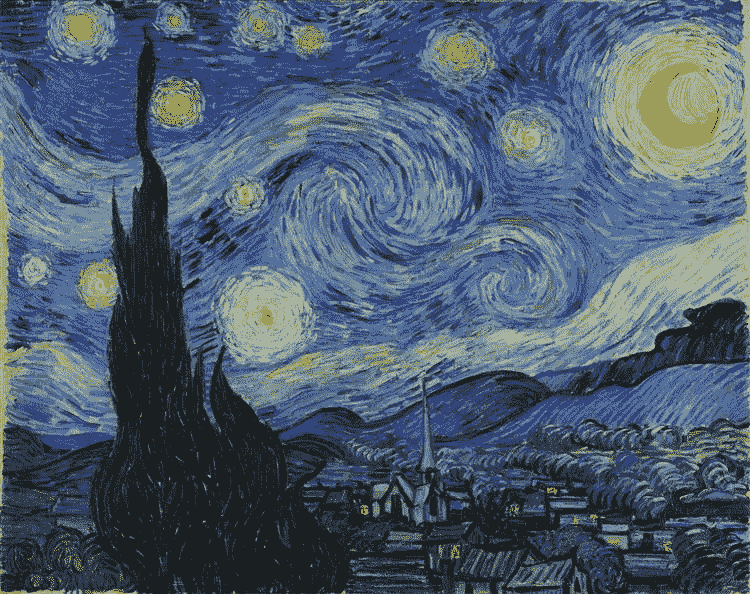
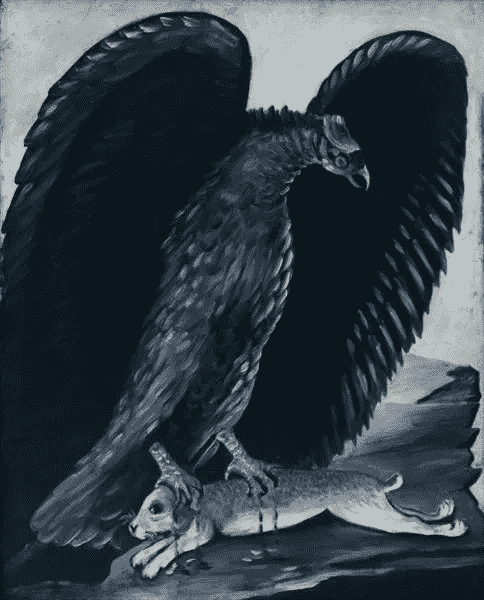
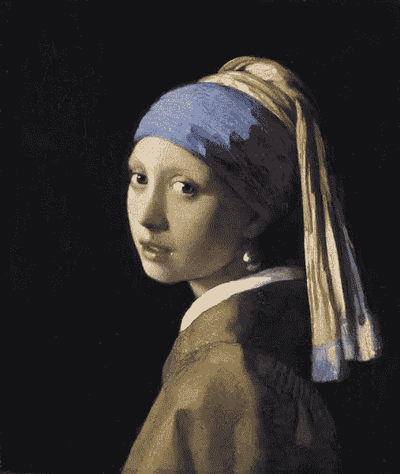
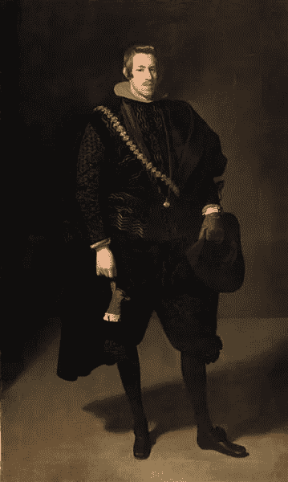
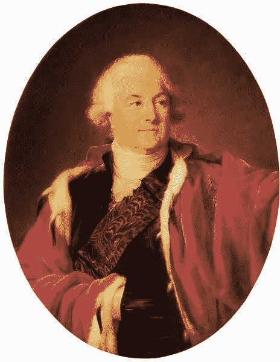
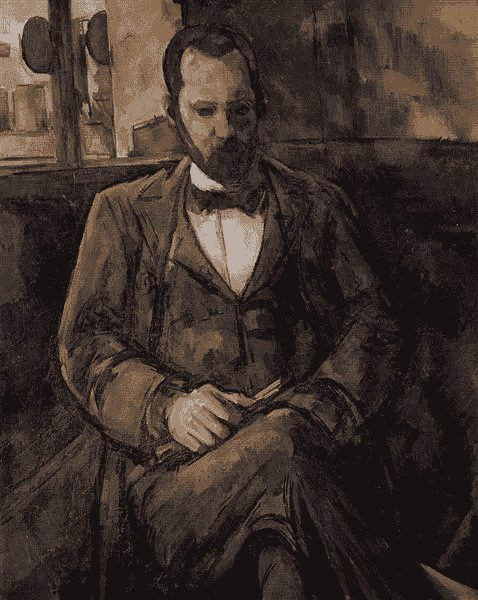

# 这个人工智能“知道”绘画的感觉——见见阿尔特弥斯的神经扬声器

> 原文：<https://towardsdatascience.com/this-ai-knows-what-a-painting-feels-like-meet-artemis-neural-speakers-b166ff699c21?source=collection_archive---------14----------------------->

## 人工智能

## 研究人员创造了一种人工智能，可以破译视觉艺术的情感意图。

人工智能解释了为什么梵高的《星夜》可能会引起敬畏:“这幅画的蓝色和白色让我感觉像在做梦。”—维基百科(公共领域)

近年来，人工智能取得了令人难以置信的成就。从在[围棋](https://deepmind.com/blog/article/alphazero-shedding-new-light-grand-games-chess-shogi-and-go)和 [Dota](https://openai.com/projects/five/) 中击败世界级冠军，到[自主驾驶汽车](https://www.wired.co.uk/article/alex-kendall-machine-learning)，寻找[新的系外行星](https://academic.oup.com/mnras/advance-article/doi/10.1093/mnras/staa2498/5894933?login=true)。对 AI 来说，一切似乎都触手可及，甚至是那些更好地表达对人类意味着什么的领域，比如艺术和创造力。近年来，我们已经看到了在*计算创造力领域的重大成功。深沉的莎士比亚创作莎士比亚的作品，而罗巴奇则创作类似巴赫风格的音乐作品。“今天，计算机不再仅仅是创作的辅助工具；西班牙国家研究委员会(CSIC)的研究教授拉蒙·洛佩斯·德·曼塔拉斯说。*

2021 年 1 月，由 [Panos Achlioptas](http://ai.stanford.edu/~optas/) 领导的来自斯坦福大学、Ecole Polytechnique 和阿卜杜拉国王科技大学的研究人员在同一方向上又迈出了一步。正如他们在 arXiv 上发表的论文中解释的那样，他们创造了一个人工智能系统，可以识别并解释一幅画唤起的情感。他们的工作旨在理清“视觉内容、其情感效果以及对后者的语言解释之间的相互作用。”

绘画是传达情感的有力媒介。艺术家用形式和颜色来表达文字无法表达的东西，只是为了让观察者被信息所唤起。正如伟大的列夫·托尔斯泰所说，“唤起一个人曾经经历过的感情，并在自己身上唤起了这种感情，然后通过动作、线条、颜色、声音或用语言表达的形式来传递这种感情，以便其他人可以体验同样的感情——这就是艺术的活动。”一个能够提取和解释艺术情感的人工机器是向揭示人类内在奥秘迈出的一大步。

# 遇见阿尔特弥斯:视觉艺术的情感语言

为了教会人工智能生成“基于视觉刺激的情感解释”，作者必须建立 [ArtEmis 数据集](https://github.com/optas/artemis)。这个独特的数据集由 80K 多件各种流派和风格的艺术品组成(建立在 WikiArt 数据集之上)。

为了定义标签，注释者(每件作品五个人)根据[保罗·艾克曼](https://www.tandfonline.com/doi/abs/10.1080/02699939208411068)的作品，从八个选项中选择哪种情绪是艺术品中的主导情绪——娱乐、敬畏、满足、兴奋、愤怒、恐惧、厌恶和悲伤。他们还用自然语言解释了他们反应背后的原因。

尽管解释的内在主观性使阿尔特弥斯成为一个独特的复杂数据集，但作者说，“关于他们的*主导的*情感反应，注释者之间仍然有很大的一致”。本文中的一些例子如下所示。

**左:悲伤**“这个地位更高的女人看起来很悲伤，像一只住在金笼子里的小鸟。”**中:** **敬畏**“俯瞰其他景观，城堡看起来很雄伟。”**右:怒**“大黑鸟偷走了无助兔子的生命。”— <https://github.com/optas/artemis>维基百科(公共领域)

# 神经扬声器

有了这样一个数据集，作者创造了一个人工智能——神经扬声器——能够以人类的方式从艺术品中产生解释:主观，感性，充满明喻和隐喻。为了设计神经扬声器，他们使用了自然语言处理领域的[流行主干架构](https://arxiv.org/abs/1502.03044)。

然而，他们必须解决两个重要的任务来帮助算法，为此他们创建了两个额外的人工智能分类器。其中一个人认识到了隐藏在艺术品中的情感。这使得研究人员能够比较两个神经说话者的能力——一个会先验地知道隐藏的情绪，而另一个不会。另一个分类器预测隐藏在文本解释中的情感。这使得作者可以直接比较神经说话者和真人。

除了[典型的](https://www.aclweb.org/anthology/P02-1040.pdf)评估方法，考虑到 ArtEmis 的独特性，作者使用了两个特殊的度量标准:首先，他们测量了神经说话者给出的解释唤起人类注释者选择的相同情感的程度，其次，他们测量了神经说话者给出的隐喻解释的百分比。

最后，因为情感解释非常主观，很难用分数来比较，所以作者决定在图灵测试中挑战最好的神经说话者。为此，向研究之外的用户展示了一个来自神经扬声器的解释和一个来自随机注释器的解释，以及艺术作品。他们必须回答一个选择题:其中一个解释更有可能是人类做出的，还是两个(或者都不是)都是人类做出的。

# 一种情感人工智能

虽然作者坚持用 ArtEmis 训练的难度，但最好的模型表现出了惊人的 52.2%的情绪一致度。它创造了如此精确的解释，以至于一半时间从它的文字中提取的特定情感与人类看这幅画时的感觉是一样的。以下是神经说话者解释的一些例子:

**左:知足**“这个女人的眼神很传神，穿得也很好看。”**中:敬畏**“这幅画的蓝色和白色让我觉得自己在看一场梦。”**对:娱乐**“那个人的服装很滑稽，他的表情也很滑稽。”—维基百科(公共领域)

该模型还显示了最接近人类注释者的隐喻解释数量。这个人工智能不仅可以说“思考”或“看起来像”这样的话，而且它使用这些表达的程度令人惊讶地像人一样。

在图灵测试中，这个模型获得了令人难以置信的 50.3%的分数。一半的时间里，用户认为神经说话者的解释与真实人类的解释一样或更“人类”。

但是用首席研究员 Panos Achlioptas 的话说，最令人印象深刻的结果是，考虑到*不同的*情感，神经说话者能够为一件艺术品提出完全合理的解释。以下是 Achlioptas 亲自发给我的一些例子，作为现有研究优化的预览:

**左:知足**“男人的脸很平静，颜色很中性。”这个男人的奇装异服让他看起来很有气势。中:知足常乐“画中的人看起来像是在悠闲地散步。”“建筑中的细节令人惊叹。”**右:悲伤**“那个人看起来快要哭了。”知足常乐“这个人看起来好像在考虑什么重要的事情。”—维基百科(公共领域)

即使控制了某件艺术品唤起的假设情绪，神经说话者仍然成功地创造了类似人类的解释。它既看到了波兰国王(左)脸上的平静，也看到了他的衣服所展示的崇高地位。在保罗·塞尚对安布罗伊斯·沃拉德(右)的描绘中，也看到了一个哭泣的人的前奏和一个陷入沉思的人的冷酷表情。

这项研究产生了前所未有的结果。人工智能首次能够解释视觉艺术中的情感意图，并使用自然语言传达人类层面的解释。然而，重要的是要认识到这种人工智能的局限性。“就多样性、准确性和创造性而言，即使是最好的神经扬声器的质量也与人类的基本事实相差甚远，”作者说。

然而，不可否认的是，人工智能开始挖掘人类的内心角落。“通过计算处理图像情感属性的能力为人机交流和互动开辟了一个令人兴奋的新方向，”论文总结道。一幅画是艺术家灵魂的入口。目前，人工智能可以看着那个灵魂，告诉我们它是哭还是笑。我们将会看到在我们看到人工智能的灵魂之前需要多少时间。