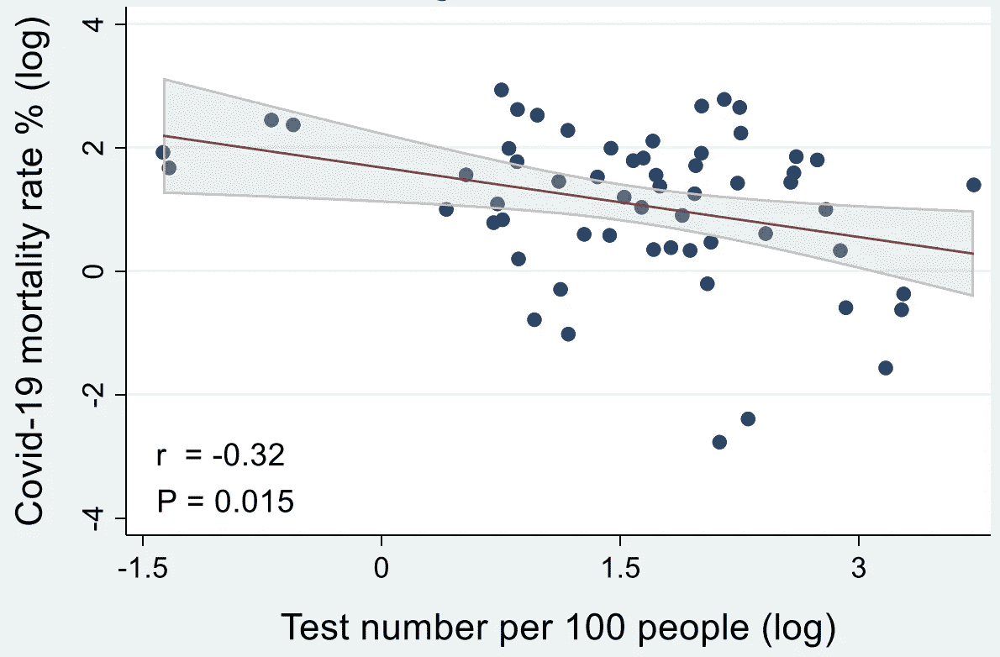
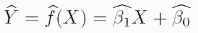
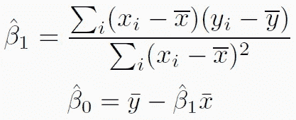
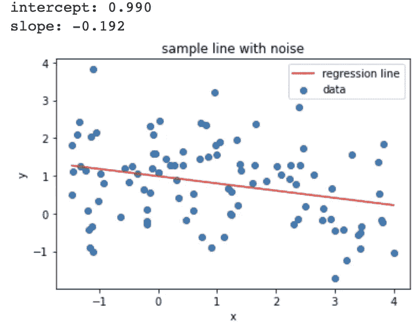
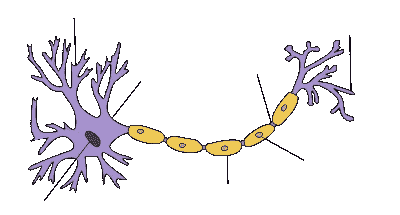
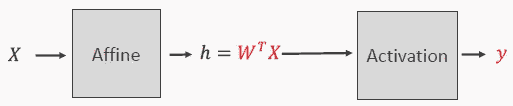
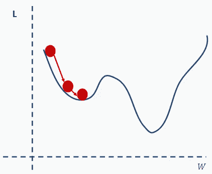
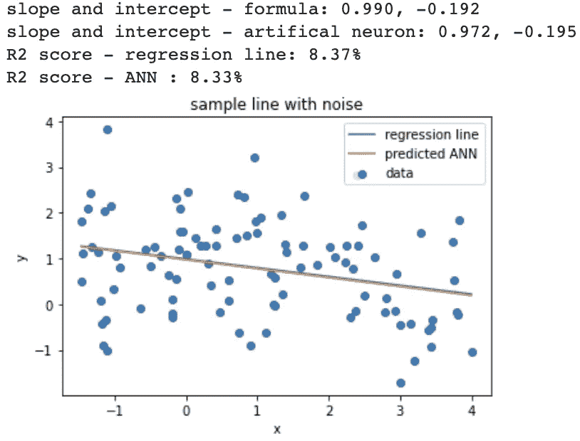

# 这个原子对深度学习至关重要

> 原文：<https://towardsdatascience.com/this-atom-is-so-critical-to-deep-learning-cfefaf38e32b?source=collection_archive---------30----------------------->

## 升级你对人工智能的理解。

深度学习为什么有效？最初，是神经元。

照片由[阿德里安·匡威](https://unsplash.com/@adrienconverse)在 Unsplash 上拍摄

已经有很多关于深度学习如何工作的文章。很少有人提到为什么它实际上是有效的。我建议采用原子方法来掌握深度学习模型背后的直觉。

> 了解深度学习中的原子:人工神经元。

深度学习模型被谷歌、脸书、亚马逊、微软和苹果用来解决难题，比如预测新冠肺炎疫情的末日。

这是一种人工智能方法，不仅用于预测未来，还用于理解现在，进行推理，并对各种事物进行分类。

与其直接解释深度学习算法如何渐进地学习复杂输入的表示——例如自动驾驶汽车中的视频或在线翻译器中的文本或数字营销中的人们行为——不如让我们从小处着手，从单个神经元和一个小问题开始。

我们将研究一个简单的问题，该问题使用检测次数作为新冠肺炎死亡率的预测指标。

# 单个神经元能预测新冠肺炎死亡率吗？

在[最近的一篇自然文章](https://www.nature.com/articles/s41598-020-68862-x.pdf?origin=ppub)中，研究人员能够通过绘制最佳匹配线来预测新冠肺炎的死亡率，该线遵循测试数字的死亡率趋势。

covid-19 死亡率与测试次数呈负相关——来源:自然杂志[的文章](https://www.nature.com/articles/s41598-020-68862-x.pdf?origin=ppub)

从数学上来说，他们找到了一条在测试数字 *X* 上的直线*ŷ*，其截距为 *β0* ，斜率为 *β1* 。

给定真实世界的测量值 *Y* 和相应的预测值 *X* ，研究人员计算趋势线的斜率和截距如下。

为了更好地理解上面的公式，我们将沿着一条直线创建我们自己的随机测量数据集。

我们将这些点沿直线均匀分布在-1.5 到 4 的区间内。然后，我们将标准偏差为 1 且平均值为 0 的随机正态分布值添加到每个 *Y* 值中。

最后，我们应用上面的公式来计算趋势线的截距和斜率。

正如我们在图中看到的，我们成功地预测了 *X* 的任意值的 *Y* ，因为我们能够计算决定 *Y* 行为的回归线的截距和斜率。

为什么人工神经元可以在没有任何人工干预的情况下，仅使用手头的数据来学习回归线——它的公式？

我们可以从定义什么是真正的人工神经元开始。

# 生物神经元是如何工作的？

人工神经元的想法似乎来自我们大脑中的神经元。我们的大脑由 1000 亿个神经元组成。当电信号通过树突流入神经元的细胞核时，电荷就积累起来了。

图片来自[维基百科](https://cs.wikipedia.org/wiki/Neuron)

当细胞达到一定的电荷水平，即阈值时，它就会激活，通过轴突发出电信号。神经元在决定何时触发时，对不同的输入信号有不同的权重。

> 什么先出现的？神经科学还是人工神经网络？

许多人认为，深度学习中的人工神经网络模拟了为不同的树突(输入)分配不同权重的过程。

# 为什么人工神经元就是聪明呢？

单个人工神经元接受输入 *X* ，使用**权重** *W* 应用(线性)**仿射变换**以产生临时值 *h* 。

然后，它通过**激活功能**传递该值，以产生输出。

在我们的新冠肺炎死亡率示例中， *X* 可以是一个数字，比如 2。仿射变换会使用向量 *W* 中存储的截距和斜率对输入进行变换，为了返回，姑且说 *h* =5。后一个值将经过激活，在我们的例子中是线性函数，输出，比如说 *Y* = *h* =5。

# 为什么人工神经元能够学习？

我们之前看到，回归线的截距和斜率可以使用解析公式直接计算。

像我们刚刚描述的那样，一个人工神经元可以不使用任何公式找到那些值吗？

神经元可以使用以下策略:

*   选取截距和斜率的随机值，假设 *W* =(-1，3)。
*   使用仿射变换和激活函数计算相应的回归线。
*   计算神经元的输出与真实的 *Y* 之间的差值，即损耗。均方误差是一个好的**损失函数**，我们称之为 *L* 。
*   重复挑选随机 *W* 值的过程，直到损失足够小，或者直到我们厌倦尝试。

我们刚刚描述了一个**学习过程**，其中单个神经元将学习回归线未知参数的正确值:截距和斜率。

上面的策略对于一个运气好的神经元来说可能很有效。然而，通常我们会遇到需要数十亿神经元的复杂问题。参数的可能值的空间将如此之大，以至于学习过程将在超级计算机上花费几十年的时间。

幸运的是，有一种更好的学习策略叫做**梯度下降**。

梯度下降是一种工具，通过查看损失函数 *L* 相对于 *W* 的导数，找到使损失函数【】L 最小的 *W* 的值。

它的工作原理就像在自由式滑雪中从山顶通过最短的路径下降到山谷。

假设我们已经选择了 *W* =(-1，3)，并且我们已经计算了这些值的损耗，现在我们必须决定尝试 *W* 的哪个下一个值，以便具有递减的损耗。

我们的想法是计算损失的导数，比如说截距，并检查其符号。

如果导数为正，说明损失在增加，需要尝试更小的截距。

如果导数是负的，损失在减少，所以我们可以继续尝试更大的斜率值。

如果导数为零，我们就达到了损失的最小值。我们可以停下来考虑将 *W* 作为使损失最小化的最佳重量。

梯度下降需要数值计算导数，这是通过使用**反向传播**完成的。

# 如何实现最简单的深度学习模型？

让我们实际看看我们的神经元将如何执行线性回归任务。我们使用 [Keras](https://keras.io/) ，这是一个 Python 库，也是深度学习实验的好伙伴。

使用单个神经元、标量输入、标量输出、具有权重和偏差的仿射变换以及线性输出来定义模型。

神经元使用随机梯度下降优化器在数据点上学习。损失函数是均方误差。我们将优化器设置为执行 5 次迭代(历元)。

在学习过程的最后，单个神经元能够预测几乎相同的回归线(绿色)，这是我们之前通过分析计算的(橙色)。

如上图所示，斜率和截距的预测值非常接近。在这两种情况下，衡量健康的 R2 分数看起来非常相似。

我们的简单例子说明了单个神经元如何通过查看数据来学习描述线性趋势的函数。

在原子层面上，这是为什么深度学习如此有效的最基本的直觉。

# 结论

我们刚刚经历了深度学习下面的基本概念。流行的模型将数十亿人工神经元组织成一层层的堆栈，以打造超大质量的网络，如 GoogLeNet、ResNet、DenseNet、MobileNet、Xception 和 ResNeXt。

这样一个模型很可能在你的阅读列表中推荐了这篇文章，并把你带到了这里。

> 深度学习网络的核心都有相同的原子:**一个人工神经元**。

在我下面的扩展文章中了解更多。

</why-deep-learning-works-289f17cab01a> 