# “我是不是太老了，学不了编码了，”数据驱动的答案

> 原文：<https://towardsdatascience.com/this-data-answers-the-am-i-too-old-to-learn-coding-timeless-question-70deba5d294f?source=collection_archive---------24----------------------->

## 用数据来检验你是否太老而不能学习编程

照片由 [**olia danilevich**](https://www.pexels.com/@olia-danilevich?utm_content=attributionCopyText&utm_medium=referral&utm_source=pexels) 发自 [**Pexels**](https://www.pexels.com/photo/man-sitting-in-front-of-three-computers-4974915/?utm_content=attributionCopyText&utm_medium=referral&utm_source=pexels)

> “……等我毕业时，我已经五十岁了？他笑了。“不管怎样，你都要 50 岁了”
> 
> ―伊迪丝·伊娃·埃格尔[选择:拥抱可能](https://www.goodreads.com/book/show/30753738-the-choice)

“我是不是年纪大了，学不了编码了？”作为一名 30 多岁的女性，目前正在向数据科学过渡，这个问题尤为重要。

从应对冒名顶替综合症，在一个男性主导的行业中导航，以及从数百万可用的在线课程和资源中选择哪一个，这是一个疯狂的世界。但感谢互联网、追寻梦想的意愿和伟大的导师，这段旅程是可以忍受的，也是值得的。

在本文中，我将使用数据驱动的方法来回答三个与年龄相关的问题。

**数据**

[栈溢出](https://insights.stackoverflow.com/survey/2020) [调查](https://insights.stackoverflow.com/survey/2020)是一年一度的事件，目标是全世界的开发者、程序员和编码人员。本文使用了 2020 年来自 65000 名参与者的调查数据。

从数据中，我将试图回答这三个问题；

*   你年纪大了，学不了编码了吗？
*   哪些因素对晚开始编码贡献最大？
*   编码生活方式的后采纳者有什么微妙或明显的后果？

## **1。你年纪大了，学不了编码了吗？**

被调查者从几岁开始积极编码，无论是在学习时还是在工作时？

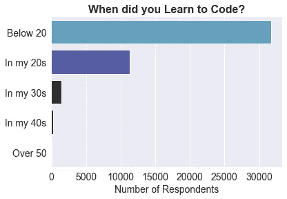

按年龄组和作者统计受访者开始积极编码的时间

如果你属于上图中的任何一个年龄段，并且正在考虑开始编码，你并不孤单。

70%的受访者从十几岁开始编程，而 25%的人从 20 多岁开始。30 岁以后开始的人是少数。

那么，是什么将那些起步较晚的人与其他人区分开来呢？这是我第二个问题的重点。

## 2.哪些因素导致了晚开始编码？

> “在大多数事情上，成功取决于知道需要多久才能成功。”
> 
> **-** [**孟德斯鸠**](https://en.wikipedia.org/wiki/Montesquieu)

在这个问题中，我在代码的后期采用者中寻找可能导致这种情况的共同因素。我把数据一分为二。30 岁以下开始编码的和 30 岁以上的。

四个特征显示了两组之间的显著差异。

*   **地理区域**

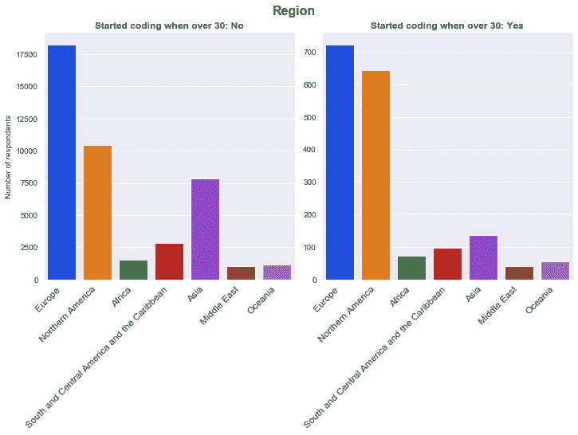

每组受访者的地理区域条形图

根据上面的图表，大多数开发者来自欧洲，其次是北美，亚洲排在第三位。

从上面的两个图表来看，更大比例的美国人在 30 岁以后开始编程。这可能是因为需要提高编码工作的技能，或者把它作为一种爱好。

另一个有趣的现象是，亚洲在左边的图表中排在第三位(30 岁以下)。看到本次调查中超过 90%的受访者目前不到 30 岁，我们可以推断，许多亚洲人，尤其是印度人，在年轻时就开始编程。

事实上，根据[进步政策研究所](https://www.progressivepolicy.org/wp-content/uploads/2019/09/PPI_IndianAppEconomy_V3-1.pdf)，埃文斯数据[报告](https://evansdata.com/reports/viewRelease.php?reportID=9)印度将在 2024 年取代美国成为世界上最大的开发者人口中心。

*   **性别**

从我的分析中，我观察到女性比男性晚写第一个代码。平均而言，女性在 17 岁写下第一个代码，而男性平均在 15 岁。

下图显示了性别在我们两个兴趣组中的分布情况。

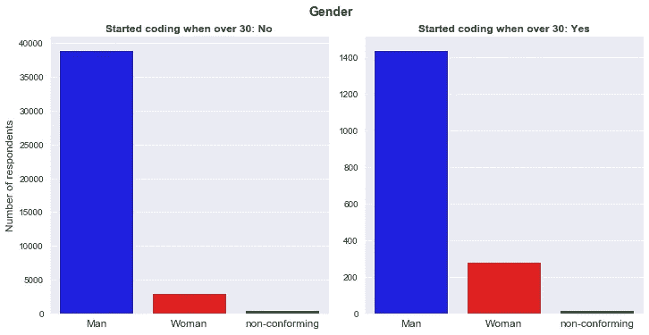

按作者分列的两个群体的性别分布

我们看到，对于那些晚学编码的人来说，女性的比例更高。这可能意味着最终成为开发人员的女性比男性晚。

*   **教育水平**

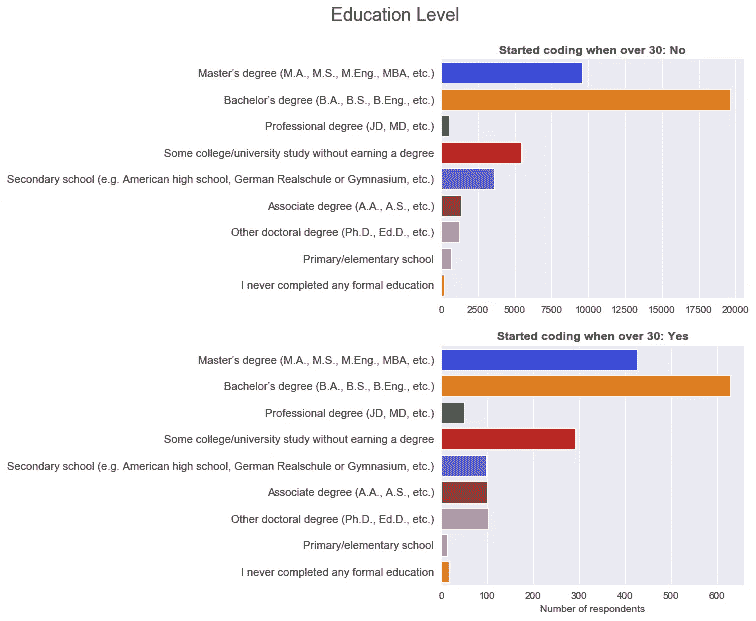

教育水平

从上面的图表中，我们看到学士学位是参与者中最高的教育水平。

我们还注意到，已故的程序员有更多的高级证书，如硕士、助理和博士学位。花在攻读这些高级学位上的时间可能会导致受访者很晚才开始编写代码。

*   **本科专业**

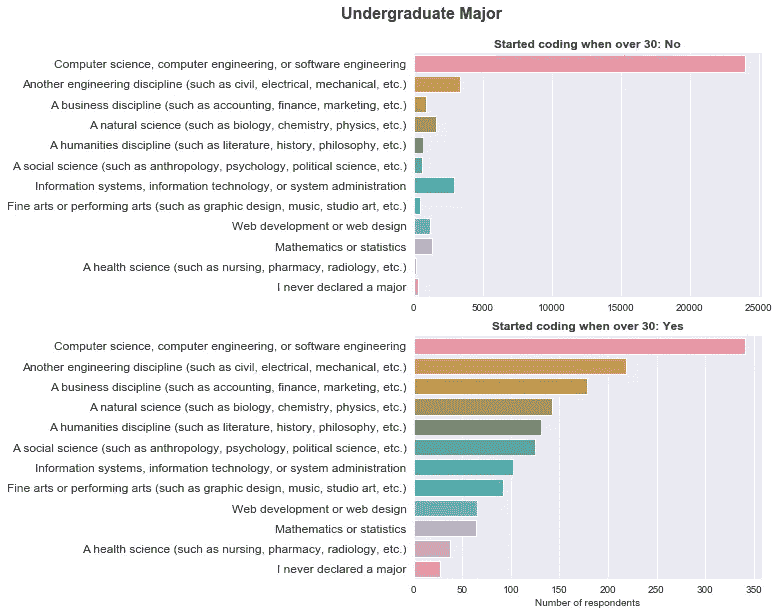

作者图片

这张图显示了两组之间最显著的差异。我们看到计算机科学和软件学位如何以 63%的比例主导早期程序员的大学专业，而只有 22%的后期程序员选择了这个专业。

我们还注意到，对于代码的后采用者来说，业务相关学科排在第三位。这进一步证明了选择与编码无关的专业是如何拖延进入主动编码的时间的。

## 3.编码生活方式的后采用者通常会有什么微妙或明显的后果？

我的第三个问题是，与早期程序员相比，晚期程序员的开发生活是怎样的。我考虑了一些变量，如获得的技能的数量和类型、工资分布以及专业开发人员的工作满意度。

*   **获得的总技能**

该调查问题要求受访者选择他们的[开发人员类型或技能](https://www.coderhood.com/19-types-of-developers-explained/)，例如全栈开发人员、web、移动、数据库、数据工程师等等。参与者可以从提供的 23 个选项中选择多种类型。

平均来说，大多数开发人员从列表中选择了两个工作。

下面的方框图显示了两个组获得的技能数量。

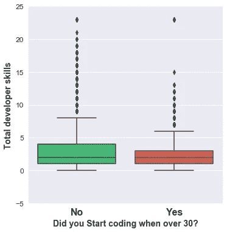

对于“否”组(早期程序员)，75%的受访者平均拥有 4 项工作技能，相比之下，晚期程序员拥有 3 项技能。

*   **获得的技能类型**

进一步查看数据，我注意到早期编码人员和晚期编码人员的开发人员类型略有不同。

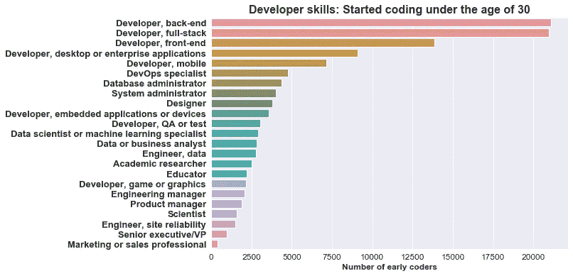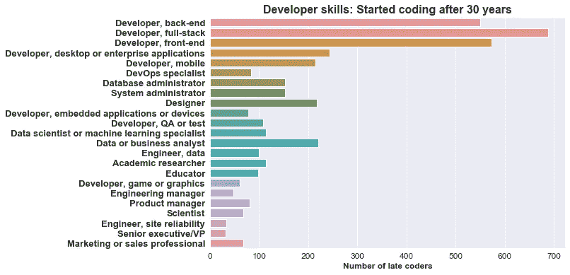

我们看到**后端**和**全栈**开发者主导早期编码者群体，而**前端**和**全栈**开发者主导后期编码者群体。

下面是“参与者开始积极编码的年龄”和所获得的技能类型的[关系(相关性](https://www.investopedia.com/terms/c/correlation.asp))图。*线长度*显示了这种关系的强度，或者是正的(绿色)——在旧的适配器中更常见，或者是负的(红色)——在早期的编码器中更常见。

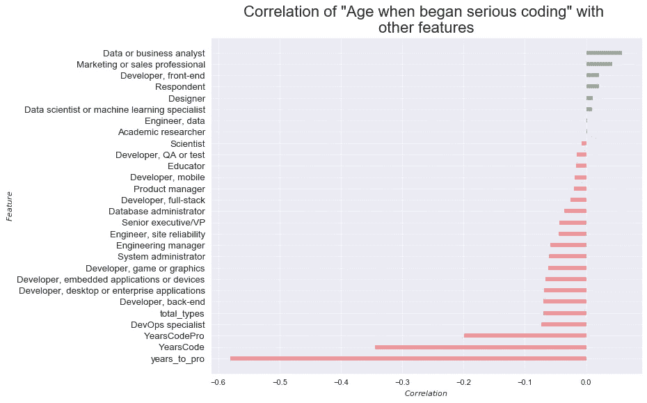

我们看到**数据分析师、营销人员、**和**前端开发人员**更有可能是**后来者。**

另一方面， **DevOps** 专员**，后端**开发者**，**和**桌面或企业**开发者**对他们来说不太可能**。这可能意味着一些工作技能需要多年的经验，因此那些早开始的人有优势。

晚开始编程的人可能会从[‘技术要求较低’](https://www.freecodecamp.org/news/alternative-career-paths/)的技能开始，以获得程序员的工作职位，随后，随着经验的积累，他们会钻研其他领域。

*   **年至专业开发商**

这指的是学习编码和获得一份程序员工作所需的时间。下面是早期和晚期编码者分布的箱线图总结。

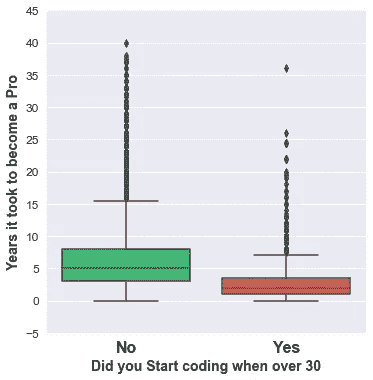

作者成为职业选手的年数方框图

上面的图显示了**后期程序员**用了*明显更短的时间*开始专业的程序员工作。后期编码者平均时间 2 年左右，早期编码者 5 年。

同样，工作的人可能会将编码作为工作的一部分，并且在获得新技能后很容易改变角色。他们也可能使用非传统的在线学习或新兵训练营，这比年轻时追求的大学学位需要更短的时间。

*   **工作满意度**

这篇专题文章询问了受访者对目前工作的满意程度。

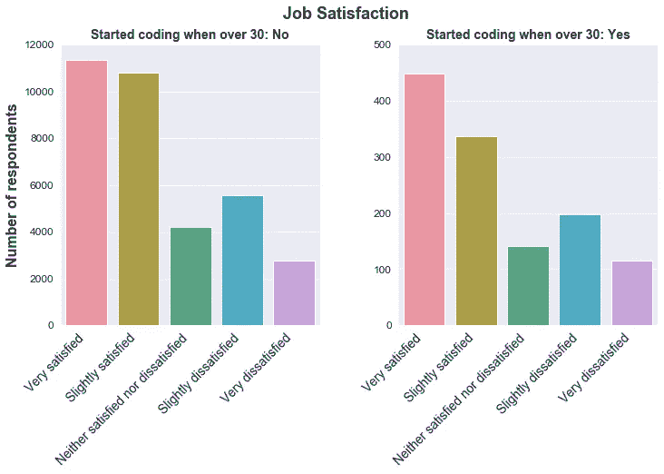

总的来说，我们看到许多人普遍对自己的工作感到满意，两组之间没有太大的差异。

*   **工资分配**

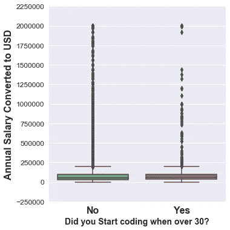

按作者列出的薪金分布

这两个群体的薪酬似乎是相等的。“否”组的平均年薪为 102，000 美元，“是”组的平均年薪为 121，000 美元。

*   **当前职业**

该调查问题要求受访者选择他们今天的**开发者情况**。

结果显示，75%是专业开发人员，10%是学习编码的学生，2%是退休人员。下面是 30 年前和 30 年后开始编程的人的分布图。

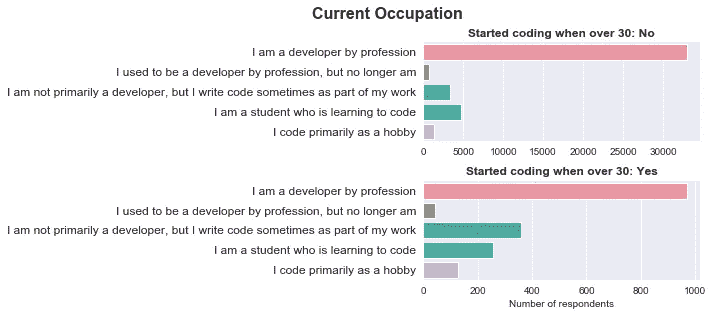

作者为早期和晚期编码者绘制的当前职业图

对于后期的编码人员，我们看到更多的非专业开发人员由于工作需求而从事代码工作。

我们也看到很多业余爱好者不是专业的程序员。这些可能是早期学编码，后来改行做非编码的人。

## 结论

在本文中，我们回顾了一项针对程序员和程序员的年度调查[,以了解那些在 30 岁后学习编码的人。](https://insights.stackoverflow.com/survey)

我们了解到，大多数专业开发人员在十几岁时就开始编程，但也有一些人在晚年才开始编程。一些起作用的因素是本科*专业*和*性别*，一些影响是*更短* *达到专业水平的时间*和*获得的技能*更少。

我希望文章中展示的见解能够鼓励任何年龄阶段希望成为开发人员社区一员的人，并让他们明白应该期待什么。

使用的代码可从 GitHub 的[这里](https://github.com/suemnjeri/stackoverflow2020/blob/master/Full%20CRISP-DM%20stackoverflow%202020.ipynb)获得。感谢您的阅读！